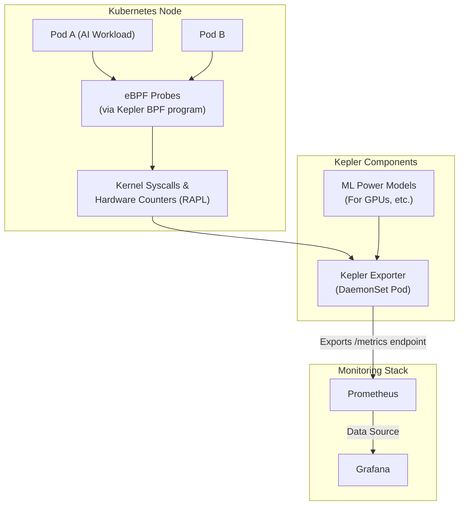

# Green Cloud: Measuring AI Carbon

The era of Agentic AI is upon us. Autonomous systems that can reason, plan, and execute complex tasks are no longer science fiction. But this incredible leap in capability comes with a steep, often invisible, price: a massive energy footprint. As we deploy more sophisticated models on distributed infrastructure like Kubernetes, understanding and managing their environmental impact is no longer a "nice-to-have"—it's an engineering and ethical imperative. Measurement is the first, most critical step.

### What You'll Get

This article provides a practitioner's guide to measuring the carbon footprint of AI workloads. You will learn:

*   Why the energy consumption of modern AI is a significant concern.
*   The core challenges in accurately measuring power draw in a cloud-native environment.
*   How to use the open-source tool **Kepler** to monitor energy usage at the pod level in Kubernetes.
*   A high-level architecture of how these measurement tools work.
*   How to translate raw energy data (joules) into a meaningful carbon footprint (CO2e).
*   Actionable strategies to build more sustainable AI systems.

## The Unseen Cost of Intelligence

Training a single large language model can emit as much carbon as hundreds of transatlantic flights. A 2021 study from researchers at the University of Massachusetts, Amherst, highlighted that training a common large AI model can emit more than 626,000 pounds of carbon dioxide equivalent. While training is notoriously intensive, the cumulative energy cost of *inference*—the day-to-day operation of these models—often dwarfs the initial training cost over the model's lifecycle.

Agentic AI systems, which may run continuously and spawn multiple inference tasks, amplify this problem. Without clear visibility into their energy consumption, we are flying blind, unable to optimize for efficiency or make responsible infrastructure choices.

> **The First Step to Management is Measurement.** You cannot optimize what you cannot measure. Gaining granular, real-time insight into the energy consumption of your AI workloads is the foundation of any Green AI strategy.

## Why Measurement is Harder Than It Looks

Accurately attributing energy consumption in a shared, virtualized environment like Kubernetes is complex. The challenges are multi-layered:

*   **Abstraction:** How do you measure the power draw of a single container when multiple containers are running on a single physical host?
*   **Hardware Diversity:** Different CPUs and GPUs have unique power profiles. A measurement tool needs to account for this heterogeneity.
*   **The Full Picture:** Power draw at the server level is only part of the story. To calculate a true carbon footprint, you need to factor in:
    *   **Power Usage Effectiveness (PUE):** The overhead energy used by the data center for cooling and other infrastructure.
    *   **Carbon Intensity:** The mix of energy sources (renewables, fossil fuels) powering the grid in that specific geographic region at a specific time.

## Kepler: Your Kubernetes Energy Watchdog

Fortunately, the cloud-native ecosystem has produced a powerful tool to tackle this challenge: **Kepler (Kubernetes-based Efficient Power Level Exporter)**. Kepler is a [CNCF Sandbox project](https://www.cncf.io/projects/kepler/) that provides granular, real-time energy consumption metrics for pods and containers.

### What is Kepler?

Kepler leverages modern kernel technologies to achieve remarkable accuracy without significant overhead.

*   **eBPF for Granularity:** It uses Extended Berkeley Packet Filter (eBPF) to safely and efficiently trace kernel-level activity, collecting detailed performance counters and system stats for each process.
*   **Hardware-Level Metrics:** On supported hardware (primarily Intel CPUs), Kepler can directly access Running Average Power Limit (RAPL) interfaces, which provide highly accurate energy consumption data from the chip itself.
*   **ML for Inference:** For components without direct measurement capabilities (like many GPUs or non-RAPL CPUs), Kepler uses pre-trained machine learning models to estimate power consumption based on utilization metrics.

### How Kepler Works

Kepler is deployed as a DaemonSet, meaning an instance runs on every node in your Kubernetes cluster. It collects data, processes it, and exposes it as Prometheus-compatible metrics.

Here is a high-level view of its architecture:



1.  **Data Collection:** eBPF probes safely monitor system calls and hardware performance counters for all running pods.
2.  **Estimation & Export:** The Kepler exporter on each node correlates this raw data with specific pods. It uses RAPL data where available and its ML models otherwise to calculate energy consumption in joules.
3.  **Monitoring:** The data is exposed via a `/metrics` endpoint, which is scraped by Prometheus for storage and analysis.
4.  **Visualization:** Grafana dashboards can then be used to visualize energy consumption over time, sliced by namespace, pod, or container.

### Getting Started with Kepler

Deploying Kepler is straightforward using its official Helm chart.

```bash
# Add the Kepler Helm repository
helm repo add kepler https://sustainable-computing-io.github.io/kepler-helm-chart
helm repo update

# Install Kepler into its own namespace
helm install kepler kepler/kepler --namespace kepler --create-namespace
```
Once deployed, you can configure your Prometheus instance to scrape the `kepler-exporter` service. Within minutes, you'll see new metrics like `kepler_container_joules_total` appearing.

## From Joules to CO2: The Final Calculation

Kepler gives you the crucial "energy consumed" part of the equation. To translate this into a carbon footprint, you need carbon intensity data. This data tells you how "clean" the electricity grid is at a given time and location.

The formula is simple:
`Energy Consumed (kWh) * Carbon Intensity (gCO2e/kWh) = Carbon Footprint (gCO2e)`

You can get carbon intensity data from APIs like [Electricity Maps](https://www.electricitymaps.com/) or [WattTime](https://www.watttime.org/). By enriching your Prometheus data with this external information, you can build powerful dashboards that report not just in watts, but in grams of CO2 equivalent (CO2e).

With Kepler's data in Prometheus, you can run powerful queries. For example, to see the total energy (in joules per second, i.e., watts) consumed by pods in the `ai-agents` namespace:

```promql
# Sum of energy consumed by pods in the 'ai-agents' namespace
sum(rate(kepler_container_joules_total{namespace="ai-agents"}[5m])) by (pod_name)
```

## A Broader Toolkit for Green AI

Kepler is a foundational piece of the puzzle, but other tools offer different levels of abstraction.

| Tool Type | Example(s) | Granularity | Pros | Cons |
| :--- | :--- | :--- | :--- | :--- |
| **Infrastructure-Level** | Kepler | Pod/Container | Real-time, highly accurate, open-source | Requires cluster access, setup |
| **Cloud Provider Tools** | AWS Cost/Carbon Tool | Account/Service | Easy to access, no setup | Retrospective, low granularity, averaged data |
| **Code-Level Libraries** | CodeCarbon, ML CO2 Impact | Python Process | Tracks individual experiments, easy for developers | Less accurate for shared resources, language-specific |

## Strategy, Not Just Tools: Towards Sustainable AI

Measurement enables strategy. Once you have visibility, you can take concrete steps to reduce your AI's environmental impact.

*   **Optimize Models:** Techniques like quantization (using lower-precision data types), pruning (removing redundant model parameters), and knowledge distillation can drastically reduce the computational cost of inference.
*   **Carbon-Aware Scheduling:** Use carbon intensity data to schedule large, non-urgent workloads (like model training or batch processing) to run at times or in geographic regions where the grid is powered by renewables.
*   **Right-size Infrastructure:** Use your measurement data to eliminate waste. Avoid over-provisioning GPUs and CPUs. Ensure your autoscaling is tuned for energy efficiency, not just performance.

## Conclusion

The rise of powerful AI brings a responsibility to build and operate it sustainably. Hope is not a strategy. The path to "Green AI" begins with rigorous, accurate, and real-time measurement. Tools like Kepler, integrated into a modern cloud-native stack, finally give us the visibility we need. By understanding the true energy cost of our AI workloads, we can start a new chapter of optimization—one that benefits both our applications and our planet.


## Further Reading

- [https://www.megaport.com/blog/your-2026-predictions-from-aws-re-invent-2025/](https://www.megaport.com/blog/your-2026-predictions-from-aws-re-invent-2025/)
