# Chaos Engineering for AI Agents

AI agents are moving from research curiosities to production-critical components of our software systems. These agents, powered by Large Language Models (LLMs), operate with a degreee of autonomy and non-determinism that defies traditional testing. When an agent can decide its own plan to achieve a goal, how do you build confidence that it won't fail catastrophically under real-world pressure? The answer lies in adapting a battle-tested discipline: Chaos Engineering.

This isn't about simply killing pods that host the agent's code. It's about systematically injecting failure into the agent's *cognitive loop*—its access to tools, its memory, and its understanding of the world—to uncover weaknesses before they impact users. We'll explore how to stress-test both individual "Frontier Agents" and the complex workflows of an "Agent HQ."

### What You'll Get

*   **A new mental model:** Why chaos engineering for AI agents focuses on behavioral resilience, not just infrastructure uptime.
*   **A practical framework:** How to define steady-state behavior and inject agent-specific failures.
*   **Concrete strategies:** Techniques for testing single "Frontier Agents" and multi-agent "Agent HQ" systems.
*   **Code and diagrams:** Clear examples and architectural flows to illustrate key concepts.

---

## The New Failure Domain: Why AI Agents Break Differently

Traditional systems are largely deterministic. Given the same input, you expect the same output. Chaos engineering in this domain focuses on infrastructure resilience: what happens if a database is slow, a network link is severed, or a server crashes?

AI agents introduce a new layer of probabilistic failure. The LLM at the agent's core is non-deterministic, and its interactions with external tools and data create a vast, unpredictable state space.

| Traditional System Failures | AI Agent System Failures |
| :--- | :--- |
| Network partition | **Degraded LLM Performance:** The provider's API returns gibberish or high-latency responses. |
| CPU starvation | **Tool Hallucination:** The agent tries to use a tool that doesn't exist or uses a real tool with invented parameters. |
| Disk failure | **State Corruption:** The agent's conversational memory or scratchpad is garbled, leading to loops or flawed reasoning. |
| Cascading service timeouts | **Adversarial Prompt Injection:** Malformed or malicious input sends the agent down a destructive or costly path. |
| Configuration errors | **Escalation Failure:** The agent gets stuck and fails to ask for human help, burning through API tokens and time. |

> **Key Idea:** We shift from testing for a *specific correct output* to validating *acceptable behavioral boundaries*. The goal is not to ensure the agent follows one perfect path, but to ensure it never deviates into a catastrophic one.

## A Framework for Agent Chaos Engineering

We can adapt the core principles of chaos engineering for this new domain. The fundamental loop remains the same, but the specifics change.


### 1. Define Steady-State Behavior

First, define what "good" looks like. This isn't about the final answer; it's about the behavior.
*   **Task Completion:** The agent successfully completes its goal.
*   **Bounded Cost:** API usage (e.g., token count) stays below a defined threshold.
*   **Bounded Time:** The task is completed within a time limit.
*   **Graceful Degradation:** If unable to complete the task, the agent exits cleanly and escalates.
*   **Tool Adherence:** The agent only uses available tools with valid schemas.

### 2. Formulate a Hypothesis

State a clear, falsifiable hypothesis.
*   *Hypothesis:* "If the primary weather API becomes latent by 500ms, the travel-planning agent will switch to its secondary API and still complete the booking within 30 seconds."

### 3. Inject Agent-Specific Faults

This is the core of the practice. Instead of just infrastructure failures, we target the agent's "brain" and "senses."
*   **API/Tool Faults:** Inject latency, return HTTP 500 errors, or send back malformed JSON from tools the agent relies on.
*   **LLM Degradation:** Use a proxy to intercept LLM API calls and return garbled responses, enforce strict rate limits, or return empty choices.
*   **State Corruption:** Before the agent executes its next step, modify its memory or scratchpad with confusing or contradictory information.
*   **Prompt Poisoning:** Append ambiguous or misleading instructions to the user's prompt to test the agent's resilience to prompt injection.

For more on the principles of chaos engineering, the [Principles of Chaos](https://principlesofchaos.org/) website is the foundational resource.

## Stress Testing the "Frontier Agent"

A "Frontier Agent" is a single, autonomous agent designed to perform a specific, complex task by interacting with a set of tools (e.g., a coding assistant, a research agent).

### Simulating Tool Failures

The most common failure point is an agent's interaction with the outside world. You can build simple wrappers around your tool functions to simulate chaos.

```python
import random
import time

def get_stock_price_tool(symbol: str):
    """A stable tool to get a stock price."""
    # ... production logic here ...
    return {"symbol": symbol, "price": 150.0}

def get_stock_price_tool_with_chaos(symbol: str):
    """
    A wrapper that injects latency or errors into the tool
    based on chaos experiment parameters.
    """
    if random.random() < 0.2: # 20% chance of failure
        raise ConnectionError("API is unavailable")
    
    if random.random() < 0.3: # 30% chance of latency
        time.sleep(1.5) # 1.5 second delay

    return get_stock_price_tool(symbol)

# In your agent's tool registry, you would dynamically
# swap the stable tool with the chaos-enabled one during an experiment.
```
Your agent's resilience is measured by its ability to catch the `ConnectionError` and retry, or to handle the timeout gracefully.

### Testing for Hallucinated Tool Use

A common LLM failure is hallucinating a function call that doesn't exist. Your agent framework must be robust against this.

*   **Hypothesis:** If the agent hallucinates a tool name like `get_stock_price_fast()`, the orchestrator will catch the error and prompt the agent to re-evaluate its plan, rather than crashing.
*   **Experiment:** Manually review agent execution logs or build automated checks to detect when the agent attempts to call an unregistered tool. A robust system should log the failure and force the agent into a corrective reasoning step.

## Chaos in the "Agent HQ": Testing Multi-Agent Systems

An "Agent HQ" orchestrates multiple specialized agents to solve a problem collaboratively (e.g., a "researcher" agent hands off findings to a "writer" agent). This introduces systemic, distributed risks.

```mermaid
graph TD
    subgraph "Agent HQ Workflow"
        U["User Request"] --> O["Orchestrator"]
        O -- "Task: Research X" --> A1["Researcher Agent"]
        A1 -- "Docs" --> S[(Shared State<br/>Database)]
        O -- "Task: Write Summary" --> A2["Writer Agent"]
        A2 -- "Reads Docs" --> S
        A2 -- "Summary" --> O
        O --> F["Final Output"]
    end

    subgraph "Chaos Injections"
        C1["💥 Latency"] --> A1
        C2["💥 Corrupt Data"] --> S
        C3["💥 Drop Message"] --> O
    end
```



### The "Noisy Neighbor" Problem

One slow agent can bring down an entire workflow.
*   **Hypothesis:** If the "Researcher Agent" is latent by 3 seconds per step, the "Orchestrator" will timeout the sub-task and escalate, preventing the entire request from hanging.
*   **Experiment:** Use the tool wrapper technique from the previous section to slow down one agent in the chain. Observe the orchestrator's behavior. Does it have appropriate timeouts and escalation logic?

### Message Bus and State Failures

Agents in a distributed system often communicate via a shared state store or message bus. This is a prime target for chaos.
*   **Hypothesis:** If a message from the "Orchestrator" to the "Writer Agent" is dropped, the system will detect the stalled task and retry the message delivery.
*   **Experiment:** In your testing environment, programmatically connect to your Redis/RabbitMQ/database and delete a key or message that an agent is expecting. Does the system self-heal, or does the workflow stall indefinitely?

## Key Takeaways and The Path Forward

Applying chaos engineering to AI agents is a necessary step toward building reliable, production-ready AI systems. It moves us beyond simple accuracy metrics and forces us to build for resilience in an unpredictable world.

*   **Embrace Behavioral Testing:** Stop looking for exact outputs. Instead, define and validate behavioral guardrails—cost, latency, and adherence to rules.
*   **Start with Tools:** The easiest and most impactful place to start is by injecting failures into the tools and APIs your agent depends on.
*   **Isolate the Blast Radius:** Always run chaos experiments in a controlled staging environment that mirrors production as closely as possible.
*   **Automate and Integrate:** The goal is to build these experiments into your CI/CD pipeline, creating a system that continuously validates its own resilience as you add new features and capabilities.

Building robust AI agents requires a shift in mindset from deterministic quality assurance to probabilistic resilience engineering. By deliberately breaking things in a controlled way, we can build the truly dependable AI systems of the future.


## Further Reading

- [https://slavikdev.com/platform-engineering-trends-2026/](https://slavikdev.com/platform-engineering-trends-2026/)
