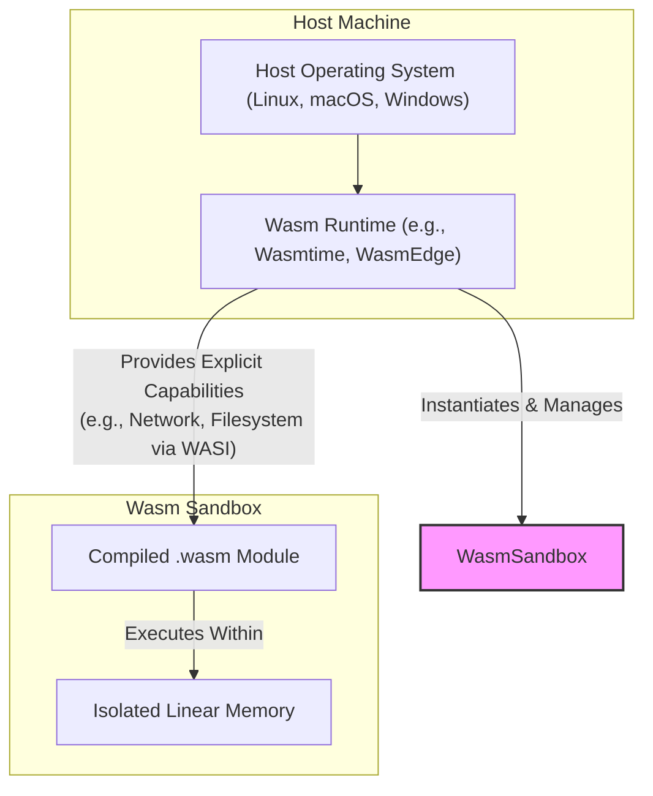
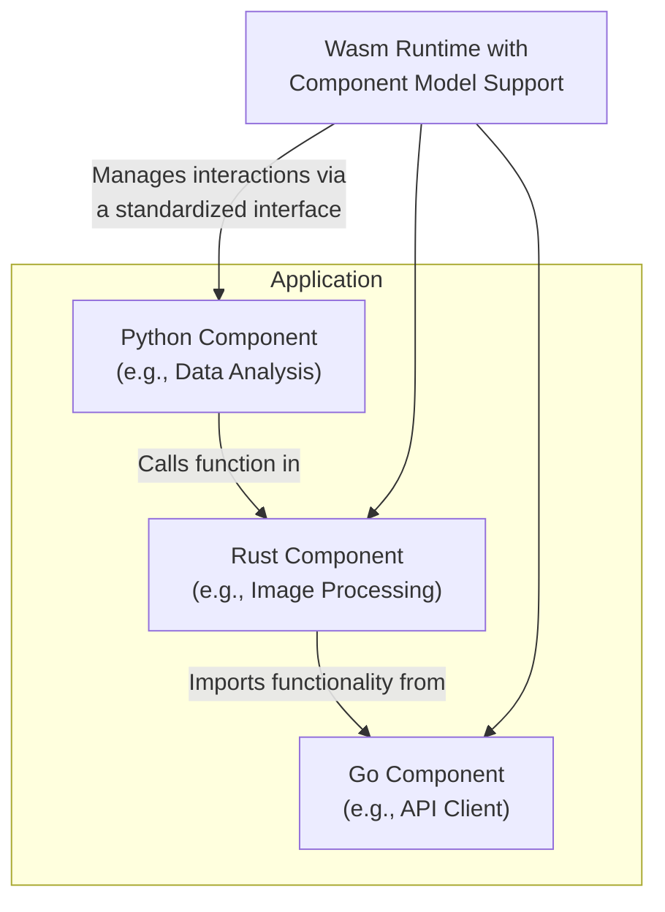

# WebAssembly vs Containers: 2026 View

The cloud-native landscape is in constant motion. For years, containers—championed by Docker and orchestrated by Kubernetes—have been the undisputed standard for deploying applications. But a powerful, lightweight alternative has emerged from the browser and is rapidly maturing on the server: WebAssembly (Wasm).

The debate is no longer about whether Wasm *can* run on the server, but *where* it fits. By 2026, the "Wasm vs. Containers" conversation will shift from replacement to specialization. This article breaks down the projected landscape, helping you decide which tool to reach for in the near future.

### What You'll Get

*   **Core Concepts:** A quick refresher on what containers and WebAssembly are.
*   **Key Differentiators:** A direct comparison of performance, security, and portability.
*   **The 2026 Use Cases:** Clear guidance on when to choose Wasm (Edge, Serverless) versus Containers (Complex, long-running apps).
*   **Synergy Explained:** How these two technologies can work together.
*   **Future Outlook:** A look at the maturing Wasm ecosystem, including the Component Model.

---

## A Quick Refresher

Before we look forward, let's ground ourselves in the present.

### What are Containers? (e.g., Docker)

Containers package an application's code with all its dependencies—libraries, system tools, and runtime—into a single, runnable unit. They leverage OS-level virtualization (like Linux namespaces and cgroups) to isolate processes without the overhead of a full virtual machine.

*   **Isolation:** At the OS process level. Containers share the host's kernel.
*   **Unit of Scale:** A container image, which bundles the application and a slice of a guest operating system.
*   **Ecosystem:** Mature and dominant, with Docker for building images and Kubernetes for orchestration.

A simple `Dockerfile` illustrates the concept of bundling an app with its OS environment:

```dockerfile
# Use an official Node.js runtime as a parent image
FROM node:18-alpine

# Set the working directory in the container
WORKDIR /usr/src/app

# Copy package.json and install dependencies
COPY package*.json ./
RUN npm install

# Bundle app source
COPY . .

# Your app binds to port 8080
EXPOSE 8080

# Define the command to run your app
CMD [ "node", "server.js" ]
```

### What is WebAssembly? (Wasm)

WebAssembly is a binary instruction format for a stack-based virtual machine. Originally designed for the web, its security, performance, and portability make it ideal for server-side computing. Wasm modules are compiled from languages like Rust, C++, and Go into a compact `.wasm` file.

*   **Isolation:** At the application level, within a secure sandbox. Wasm has no access to system resources by default.
*   **Unit of Scale:** A `.wasm` module, which contains only the compiled application code.
*   **Ecosystem:** Rapidly growing with runtimes like `Wasmtime` and `WasmEdge`, and frameworks like [Spin](https://developer.fermyon.com/spin/v2/index) and [Slight](https://slight.dev/).

Here is a simplified architectural view of how Wasm provides its sandbox:



> **Key Takeaway:** Containers virtualize the operating system. WebAssembly virtualizes the application, running it in a secure, language-agnostic sandbox.

---

## Comparative Analysis: Wasm vs. Containers in 2026

By 2026, developers won't see these as competing for the same jobs. Instead, they will be distinct tools with clear trade-offs.

### Key Differentiators at a Glance

| Feature | Containers (e.g., Docker) | WebAssembly (Wasm) |
| :--- | :--- | :--- |
| **Startup Time** | Seconds to sub-seconds | Milliseconds to microseconds |
| **Isolation Model**| OS-level (shared kernel) | Sandboxed (deny-by-default) |
| **Size** | Tens of MBs to GBs | Kilobytes to a few MBs |
| **Portability** | OS/Architecture dependent (e.g., linux/amd64) | OS/Architecture independent |
| **Ecosystem** | Mature (Kubernetes, Docker Hub, OCI) | Maturing (WASI, Component Model) |
| **Best For** | Complex, stateful, long-running applications | Short-lived, stateless, performance-critical tasks |

### Performance and Startup Time

This is Wasm's killer feature.

*   **Containers:** A container needs to start a slice of an operating system, initialize the application runtime, and then launch the app. This "cold start" can take seconds.
*   **Wasm:** A Wasm runtime loads a pre-compiled binary into an already-running process and executes it. Cold starts are measured in *milliseconds* or even *microseconds*, making it a perfect fit for event-driven, "scale-to-zero" workloads like serverless functions.

### Security and Isolation

Wasm's security model is a fundamental advantage.

*   **Containers:** Use OS-level security primitives. While battle-tested, a vulnerability in the shared host kernel can be a vector for container-escape attacks.
*   **Wasm:** Implements a capability-based security model. A Wasm module has **zero** access to the host system by default. The host must explicitly grant permissions (e.g., "this module can open this specific file" or "this module can make an outbound HTTP request to this domain"). This follows the Principle of Least Privilege and drastically shrinks the attack surface.

### The Rise of the Component Model

The [WebAssembly Component Model](https://www.f5.com/company/blog/what-is-the-webassembly-component-model) is the crucial next step for Wasm's server-side adoption, and it will be well-established by 2026. It defines a standard way for Wasm modules to interact with each other, regardless of the source language they were written in.

Think of it as a universal, language-agnostic ABI (Application Binary Interface). You can have a component written in Rust seamlessly use a component written in Go, which in turn uses one written in Python, without any FFI glue code or serialization overhead.


This enables building applications from loosely coupled, polyglot components, offering a more granular alternative to traditional microservices.

---

## Use Case Deep Dive: Where Each Technology Shines in 2026

The decision tree becomes much clearer when you focus on the job to be done.

### When to Choose Containers (Docker, Kubernetes)

Containers will remain the backbone for a huge swath of the cloud-native world. Their maturity and ecosystem are unmatched for complex, general-purpose workloads.

*   **Long-Running & Stateful Applications:** Databases, message queues, and complex monolithic applications are a perfect fit. The container model handles state and long-lived processes well.
*   **Lift-and-Shift / Legacy Modernization:** Moving existing applications to the cloud is far easier with containers. You can package a whole legacy environment without rewriting the application from scratch.
*   **Complex Microservices Architectures:** For services that have heavy OS dependencies (like specific system libraries, filesystem layouts, or networking tools), containers provide the necessary environmental control.
*   **The Kubernetes Ecosystem:** If your organization is already heavily invested in Kubernetes for orchestration, service mesh (Istio, Linkerd), and observability, sticking with containers is the path of least resistance.

### When to Choose WebAssembly (Wasm)

Wasm will dominate niches where its unique strengths provide a 10x advantage.

*   **Serverless Functions & FaaS:** Wasm's near-instant cold start makes it the ideal technology for event-driven functions on platforms like AWS Lambda, Cloudflare Workers, or self-hosted solutions.
*   **Edge Computing:** On resource-constrained edge devices (IoT gateways, 5G base stations, point-of-sale systems), Wasm's small footprint and low overhead are critical. Its architecture independence means you can deploy the same `.wasm` binary on x86 servers and ARM-based edge devices.
*   **High-Performance Microservices:** For services where latency is critical (e.g., ad-tech bidding, financial transactions), a lightweight Wasm module can outperform a containerized service due to lower overhead.
*   **Pluggable & Extensible Systems:** Wasm is becoming the universal plugin format. Imagine a data proxy (like Envoy) or a SaaS platform that allows users to upload safe, high-performance Wasm modules to customize its logic.

## Synergy: Better Together

The future isn't a zero-sum game. Wasm and containers can be used together to create powerful solutions.

1.  **Wasm inside a Container:** You can package a Wasm runtime and a `.wasm` module inside a Docker container. This gives you the familiar deployment and orchestration tooling of Kubernetes while benefiting from Wasm's sandbox for running untrusted code.
2.  **Kubernetes Orchestrating Wasm:** Projects like [Krustlet](https://krustlet.dev/) allow Kubernetes to run Wasm workloads directly on nodes alongside traditional containers, using a `containerd` shim. This lets you manage both types of workloads with a single control plane.

This hybrid approach will be common, allowing teams to mix and match the best technology for each component of their system.

## Conclusion: The Right Tool for the Job

By 2026, the "WebAssembly vs. Containers" debate will be settled. It's not a war of replacement but a story of specialization.

*   **Containers** will continue to be the workhorse for general-purpose, complex, and stateful applications, buoyed by the immense gravity of the Kubernetes ecosystem.
*   **WebAssembly** will become the undisputed champion for performance-critical, ephemeral, and portable workloads, dominating the serverless, edge, and plugin ecosystems.

As an experienced practitioner, your goal is not to pick a winner, but to understand the strengths of each tool. The most effective teams will be those who can look at a problem and confidently say, "This is a job for Kubernetes and containers," or "This calls for the speed and security of WebAssembly."


## Further Reading

- [https://www.f5.com/company/blog/what-is-the-webassembly-component-model](https://www.f5.com/company/blog/what-is-the-webassembly-component-model)
- [https://medium.com/@amin-softtech/how-webassembly-is-shaping-the-future-of-javascript-applications-2025-2026-0078f15ced06](https://medium.com/@amin-softtech/how-webassembly-is-shaping-the-future-of-javascript-applications-2025-2026-0078f15ced06)
