# Refactoring with AI: The 'Rack Drop'

Legacy systems, with their tangled dependencies and mountains of technical debt, are a persistent drag on innovation. Traditional refactoring is often a slow, expensive, and risk-prone endeavor. But what if you could execute a massive modernization effort with the speed and precision of a planned hardware swap? This is the essence of the 'Rack Drop'—a concept inspired by large-scale, AI-driven transformations demonstrated by AWS, where an entire legacy stack is rapidly modernized into a cloud-native architecture.

This article provides a practitioner's guide to the strategies and tools that make the 'Rack Drop' possible. We'll move beyond the hype to detail a phased approach for using AI agents to dismantle technical debt, automate code conversion, and accelerate your journey to a modern, agile infrastructure.

### What You'll Get

*   **A Clear Definition:** Understand the 'Rack Drop' concept and why it's more than just a marketing buzzword.
*   **A Phased Strategy:** A step-by-step playbook for AI-assisted refactoring, from analysis to deployment.
*   **Practical Examples:** See concrete code examples of AI transforming legacy COBOL into modern Java.
*   **Tooling Overview:** A comparison of key AI agents and platforms in the refactoring space.
*   **Balanced Perspective:** A clear-eyed look at the significant benefits and critical caveats of this approach.

---

## Deconstructing the 'Rack Drop'

The 'Rack Drop' is a metaphor for a rapid, highly automated, and comprehensive modernization of a legacy system. Imagine physically unplugging a rack of mainframe servers and dropping in a new rack of cloud-connected hardware that runs a modernized version of your old applications. The goal is to achieve a similar outcome in the software world: a dramatic, step-function improvement rather than a slow, incremental crawl.

Traditional refactoring often involves years of manual effort, where teams painstakingly rewrite and test small pieces of a monolith. The 'Rack Drop' approach leverages AI agents to perform the heavy lifting of code analysis, translation, and test generation at a scale and speed humans cannot match.

> **At its core, the 'Rack Drop' is about collapsing the timeline of modernization.** It uses AI to front-load the most tedious and error-prone tasks, allowing human engineers to focus on high-value validation, architectural improvements, and feature development.

This strategy is particularly relevant for systems built on languages like COBOL, PL/I, or old versions of Java, which are prime candidates for AI-powered transformation services like [AWS Mainframe Modernization](https://aws.amazon.com/mainframe/).

## The AI-Powered Refactoring Playbook

A successful AI-driven refactoring project is not a "fire and forget" operation. It requires a structured, human-in-the-loop process. Here is a proven, three-phase playbook.

### Phase 1: Discovery and Analysis

Before you can refactor, you must understand. Legacy codebases are notoriously under-documented. AI agents excel at reverse-engineering these systems.

*   **Code Inventory:** AI tools scan the entire codebase to identify all programs, copybooks, data access patterns, and screen definitions.
*   **Dependency Mapping:** They automatically trace and visualize complex call chains and data dependencies, revealing the true structure of the application.
*   **Business Logic Extraction:** Modern Large Language Models (LLMs) can "read" legacy code and summarize the business rules embedded within it in plain English. This is invaluable for validation and stakeholder communication.

Amazon Q, for instance, can analyze application source code to propose a modernization plan, identifying dependencies and outlining the steps required for transformation.

### Phase 2: Automated Transformation

This is the core of the 'Rack Drop'. Here, specialized AI models convert the legacy code into a modern, object-oriented language and a microservices-based architecture. AWS accomplishes this with tools like **AWS Blu Age**, which is part of its Mainframe Modernization service.

The transformation is not a simple line-by-line translation. The AI understands idiomatic patterns in both the source and target languages to produce clean, maintainable code.

**Example: From COBOL to Java**

Consider a simple COBOL paragraph that processes a table of customer records.

```cobol
IDENTIFICATION DIVISION.
PROGRAM-ID. PROCESS-CUSTOMERS.
DATA DIVISION.
WORKING-STORAGE SECTION.
01 CUSTOMER-TABLE.
   05 CUSTOMER-RECORD OCCURS 100 TIMES
      INDEXED BY I.
      10 CUSTOMER-ID   PIC 9(5).
      10 CUSTOMER-SAL   PIC 9(7)V99.
...
PROCEDURE DIVISION.
   PERFORM VARYING I FROM 1 BY 1 UNTIL I > 100
      IF CUSTOMER-SAL(I) > 50000
         CALL 'PROCESS-HIGH-VALUE' USING CUSTOMER-RECORD(I)
      END-IF
   END-PERFORM.
   STOP RUN.
```

An AI transformation tool would refactor this into modern, readable Java.

```java
public class CustomerProcessor {

    public void processAllCustomers(List<CustomerRecord> customerTable) {
        for (CustomerRecord record : customerTable) {
            if (record.getCustomerSalary().compareTo(new BigDecimal("50000.00")) > 0) {
                // The AI maps 'CALL' to a modern service or method invocation
                highValueProcessor.process(record);
            }
        }
    }

    // CustomerRecord class and other dependencies would also be generated.
}
```

The AI correctly interprets the `PERFORM VARYING` loop, handles the numeric data types (`PIC`), and refactors the `CALL` statement into a modern dependency-injected service call.

### Phase 3: Validation and Integration

The output of an AI transformation is a robust starting point, not a finished product. This phase is where human expertise becomes critical.

*   **Automated Test Generation:** AI agents can analyze the original codebase's logic paths and generate a corresponding suite of unit and integration tests for the new code, ensuring functional equivalence.
*   **Code Review and Refinement:** Developers review the generated code, applying domain-specific knowledge, refining architectural patterns, and ensuring it meets organizational standards.
*   **CI/CD Integration:** The newly modernized services are integrated into modern DevOps pipelines for automated builds, testing, and deployment.

This entire workflow can be visualized as a structured process.

```mermaid
graph TD
    subgraph "Phase 1: Discovery"
        A["Legacy Codebase <br/>(e.g., COBOL, JCL)"] --> B["AI Analysis Agent <br/>(e.g., Amazon Q)"];
        B --> C["Dependency Graph & <br/>Business Logic Summary"];
    end
    subgraph "Phase 2: Transformation"
        C --> D["Automated Refactoring Engine <br/>(e.g., AWS Blu Age)"];
        D --> E["Modern Codebase <br/>(e.g., Java, Spring Boot)"];
        D --> F["Generated Unit Tests"];
    end
    subgraph "Phase 3: Validation"
        E & F --> G["Human-in-the-Loop Review <br/>(Developers & QA)"];
        G --> H["Refined & Validated <br/>Microservices"];
    end
    H --> I["CI/CD Pipeline"];
    I --> J["🚀 Deployed to Cloud"];
```



## Key AI Agents and Tools

The market for AI-powered refactoring is growing. Here are some of the key players and their primary roles.

| Tool / Service                      | Primary Use Case                                | Key Feature                                                               |
| ----------------------------------- | ----------------------------------------------- | ------------------------------------------------------------------------- |
| **AWS Mainframe Modernization**     | End-to-end mainframe to cloud migration         | Offers a complete toolchain, including analysis, transformation, and testing. |
| **Amazon Q (for Code Transformation)** | Upgrading application versions and frameworks | Specialized in Java version upgrades (e.g., 8 to 17) and framework migrations. |
| **GitHub Copilot Enterprise**       | Developer-in-the-loop assistance              | Provides context-aware code suggestions and explanations within the IDE.      |
| **OpenRewrite**                     | Large-scale automated code refactoring        | Open-source tool with recipes for common framework migrations and CVE patches. |

## The Human Element: Pros, Cons, and Strategy

Adopting an AI-driven refactoring strategy is a significant decision with profound implications.

### The Benefits

*   **Speed:** Reduces modernization timelines from years to months.
*   **Consistency:** AI applies refactoring patterns uniformly across millions of lines of code, eliminating human error and style drift.
*   **Cost Reduction:** Dramatically lowers the manual effort required, freeing up expensive engineering resources for innovation.
*   **Risk Mitigation:** Automated testing and functional equivalence checks reduce the risk of introducing bugs during the rewrite.

### The Caveats

*   **Not a Silver Bullet:** AI-generated code requires rigorous review and testing by skilled engineers who understand both the legacy system and the target architecture.
*   **Initial Cost & Complexity:** The tooling and expertise required can be a significant upfront investment.
*   **Vendor Lock-in:** Relying heavily on a single provider's transformation engine can create dependency.
*   **"Garbage In, Garbage Out":** The AI can only work with the logic present. Deeply flawed business logic in the original code will be faithfully reproduced in the new code if not addressed.

## Conclusion

The 'Rack Drop' is more than a compelling demo; it's a strategic framework for tackling the industry's most persistent problem: technical debt. By leveraging AI agents for discovery, transformation, and validation, organizations can fundamentally change the economics and timeline of modernization.

This approach doesn't remove engineers from the equation—it elevates them. It automates the tedious and repetitive work, allowing developers to focus on architecture, performance, and building the features that drive business value. The era of the five-year manual rewrite is over. The future of refactoring is fast, automated, and intelligent.


## Further Reading

- [https://reinvent.awsevents.com/](https://reinvent.awsevents.com/)
- [https://aws.amazon.com/blogs/aws/top-announcements-of-aws-reinvent-2025/](https://aws.amazon.com/blogs/aws/top-announcements-of-aws-reinvent-2025/)
