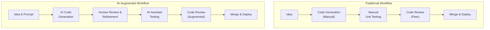

# Developer Metrics in the Agent Era

The nature of software development is undergoing a seismic shift. With AI code assistants contributing to over 50% of new code for developers who use them, traditional productivity metrics are becoming obsolete. Gartner predicts that by 2026, AI agents will perform 50% of the work for the top 20% of engineering teams. This isn't about replacing developers; it's about augmenting them. But how do you measure the performance of a team where the human's primary role shifts from *writing* to *reviewing, prompting, and integrating*?

This is where the trusted DORA (DevOps Research and Assessment) metrics face their first existential challenge. They are not irrelevant, but their interpretation must evolve. This article explores how to adapt our measurement frameworks for the new reality of AI-augmented software engineering.

### What You'll Get

*   An analysis of how AI agents impact each of the four key DORA metrics.
*   A look at new, supplementary metrics designed for the human-AI partnership.
*   A practical framework for implementing these measurements in your team.
*   A high-level view of how the development workflow is changing.

---

## The Foundation: A Quick DORA Refresher

Before we redefine them, let's briefly revisit the four key DORA metrics. They measure the effectiveness of a software delivery pipeline, providing a balanced view of both throughput and stability.

| Metric | Category | What It Measures |
| :--- | :--- | :--- |
| **Deployment Frequency** | Throughput | How often an organization successfully releases to production. |
| **Lead Time for Changes** | Throughput | The time it takes a commit to get into production. |
| **Change Failure Rate** | Stability | The percentage of deployments causing a failure in production. |
| **Mean Time to Recovery (MTTR)** | Stability | How long it takes to restore service after an incident. |

These metrics, born from years of research documented in the book *Accelerate*, remain the gold standard for measuring elite engineering performance. But their context is changing.

## The Agent Impact: How AI Is Changing the Game

AI agents and copilots fundamentally alter the development inner loop. The cognitive load shifts from syntax and boilerplate to system design and critical review.

The traditional workflow involves significant manual effort in coding and debugging. The AI-augmented workflow transforms the developer into a curator and a director of AI-generated output.



This shift has profound implications for how we interpret DORA metrics.

## Rethinking DORA in the Agent Era

Simply tracking the same four metrics without adjusting your interpretation can lead to misleading conclusions. Here’s how to look at each metric through an AI-centric lens.

### Deployment Frequency & Lead Time for Changes: The Velocity Metrics

At first glance, AI should be a massive boon for these metrics.

*   **Expected Impact:** *Positive*. AI writes code faster, automates tests, and speeds up the entire commit-to-deploy cycle. Both Deployment Frequency and Lead Time for Changes should improve dramatically.
*   **The Hidden Risk:** Velocity without quality is just a faster way to create technical debt. A surge in throughput might hide an underlying decrease in code quality, maintainability, or security. A team could be deploying more often, but each deployment is a fragile, AI-generated black box.
*   **New Questions to Ask:**
    *   Are we deploying *more value*, or just *more code*?
    *   Is our review process keeping pace with the increased rate of change?
    *   What is the complexity and maintainability score of the AI-generated code being merged?

### Change Failure Rate: The Quality Guardrail

This is arguably the most important metric to watch in the agent era. It’s the primary indicator of whether your newfound velocity is sustainable.

*   **Expected Impact:** *Mixed*. AI can introduce subtle bugs, security flaws, or "hallucinated" code that passes basic tests but fails under specific production loads. This can drive the Change Failure Rate *up*.
*   **The Human Factor:** The developer's role as a critical reviewer becomes paramount. A low Change Failure Rate in an AI-augmented team is a strong signal of a highly effective human-AI review process. It shows the team is adept at catching AI errors before they hit production.
*   **New Questions to Ask:**
    *   Do failures correlate with a higher percentage of AI-generated code in a given deployment?
    *   Is our static analysis and security scanning (SAST) robust enough to catch common AI-generated vulnerabilities?
    *   How much time are developers spending *reworking* AI suggestions before merging?

### Mean Time to Recovery (MTTR): The Resilience Metric

When failures inevitably occur, AI can be a powerful ally in remediation.

*   **Expected Impact:** *Positive*. AI agents excel at pattern matching and data analysis. They can analyze logs, trace errors, and suggest fixes far faster than a human, significantly reducing MTTR.
*   **The Opportunity:** Teams can leverage AI to build smarter observability and incident response systems. For example, an AI agent could automatically triage alerts, identify the root cause from distributed traces, and even draft a pull request with a potential fix.
*   **New Questions to Ask:**
    *   Are we using AI tools in our incident response workflow?
    *   How quickly can AI help us diagnose novel or "zero-day" issues?
    *   Does the team trust the AI's diagnostic suggestions?

> **A Note on Measurement**
> The goal is not to measure the developer but to measure the health of the *system*. In the agent era, the "system" is the human-AI pair. Treat metrics as diagnostic tools, not performance ratings.

## Beyond DORA: New Metrics for a New Paradigm

DORA metrics provide a great high-level view, but to truly understand the dynamics of an AI-augmented team, you need to look deeper. Consider adding these supplementary metrics.

### Human-AI Interaction Metrics

These metrics measure the efficiency and quality of the collaboration between the developer and the AI agent.

*   **AI Suggestion Acceptance Rate:** What percentage of AI suggestions are accepted without modification? A very high rate might indicate over-reliance, while a very low rate suggests the tool isn't helpful.
*   **Rework on AI Code:** How often does code generated by an AI need to be significantly refactored or fixed by a human within the first few sprints? This is a direct measure of the quality of the AI's output.
*   **Code Curation Time:** How much time does a developer spend reviewing, testing, and modifying an AI-generated block of code versus writing it from scratch? This helps quantify the actual time savings.

### Outcome-Oriented Metrics

As AI handles more of the "how," it frees up developers to focus on the "what" and "why." Your metrics should reflect this shift toward business value.

*   **Problem Resolution Cycle Time:** Measure the time from when a business problem or user story is defined to when the solution is delivering value in production. This captures the entire value stream, not just the coding part.
*   **Feature Adoption Rate:** Are the features being built (faster than ever) actually being used? This connects engineering velocity directly to business impact.
*   **Cognitive Load Score:** Use qualitative surveys to ask developers if AI tools are reducing the cognitive load of complex tasks or simply shifting it to a more difficult review process.

## A Practical Framework for Measurement

1.  **Establish a Baseline:** Before broadly rolling out AI tools, measure your existing DORA metrics for at least one quarter. This baseline is crucial for understanding the true impact.
2.  **Instrument Your Toolchain:** Track key AI interaction events. Many tools like GitHub Copilot are providing APIs for this. You need to know *how much* code is AI-generated to correlate it with DORA outcomes.
    ```shell
    # Example: Hypothetical CLI to get team-level Copilot stats
    copilot-cli stats --team backend-devs --since 2024-01-01

    # Output might include:
    # {
    #   "acceptance_rate": "48%",
    #   "lines_generated": 150230,
    #   "pull_requests_with_ai": 312
    # }
    ```
3.  **Correlate and Analyze:** Overlay your DORA metrics with your AI usage data. Look for patterns. Did a spike in Deployment Frequency also lead to a temporary rise in Change Failure Rate? Did MTTR drop after introducing an AI-powered log analyzer?
4.  **Focus on Trends, Not Absolutes:** The absolute numbers are less important than their trends over time. Aim for continuous improvement across a balanced set of metrics. A healthy system sees throughput metrics improve while stability metrics remain strong or also improve.

## The Future is Augmented

Measuring developer productivity in the agent era requires a shift in perspective. We must move from measuring a human's output to measuring the effectiveness of a human-AI system.

The DORA metrics remain an essential framework, providing a balanced, high-level view of software delivery performance. However, they must be interpreted through a new lens—one that accounts for the radical change in how code is created. By supplementing DORA with targeted metrics on human-AI interaction and business outcomes, engineering leaders can navigate this new landscape, building faster, more resilient, and more innovative teams.

---
**Further Reading:**
*   [Google Cloud's DORA Page](https://cloud.google.com/devops/dora)
*   [The SPACE framework for developer productivity](https://queue.acm.org/detail.cfm?id=3454124) - A complementary view focusing on Satisfaction, Performance, Activity, Communication, and Efficiency.


## Further Reading

- [https://www.gartner.com/en/articles/strategic-predictions-for-2026](https://www.gartner.com/en/articles/strategic-predictions-for-2026)
