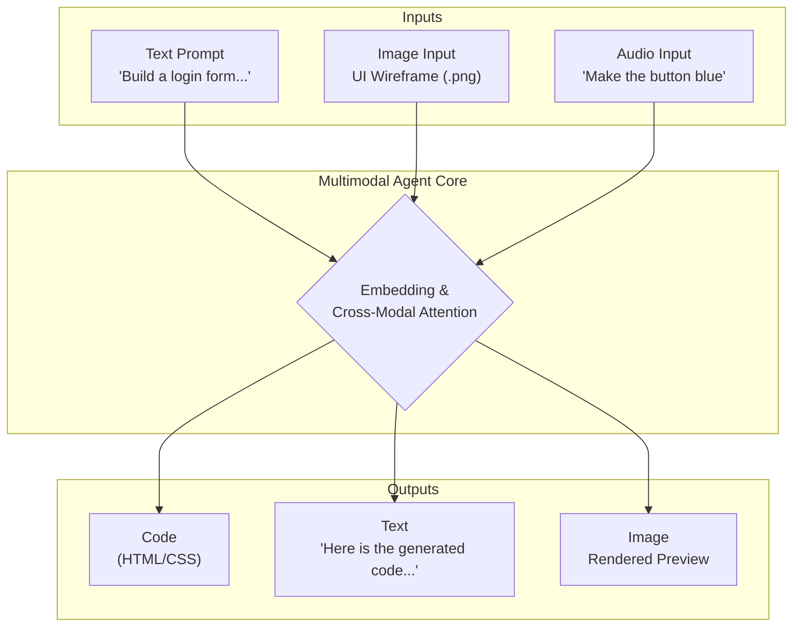

# The Rise of Multimodal AI Agents in 2026

The conversation around AI is shifting. For years, we've interacted with large language models primarily through text. By 2026, that paradigm will feel distinctly outdated. We are now in the era of multimodal AI agents—sophisticated systems that understand and generate content across text, images, audio, and video simultaneously. These agents aren't just novelties; they are becoming foundational tools that redefine productivity for developers, content creators, and entire industries.

This isn't about a chatbot that can "see" a picture. It's about an integrated partner that can watch a screen recording of a bug, listen to your verbal description of the problem, and write the patch. This article explores the practical landscape of multimodal AI agents in 2026, focusing on how they are revolutionizing professional workflows and what we can expect next.

### What You'll Get

*   **A Clear Definition:** Understand what sets multimodal agents apart from traditional LLMs.
*   **Practical Workflows:** See real-world examples for developers and content creators using agents like Gemini, Copilot, and Claude.
*   **Technical Insights:** A high-level look at the architecture powering these systems.
*   **Ethical Considerations:** A necessary discussion on the challenges and guardrails for autonomous agents.
*   **Future Outlook:** A glimpse into what lies beyond 2026.

***

## From Text-Only to Sensory Fusion

A multimodal AI agent processes and synthesizes information from various data types, or *modalities*. While a traditional LLM like early GPT-3 was a master of one domain—text—today's leading models operate more like humans, connecting concepts across different sensory inputs.

*   **Text:** The foundational layer for logic, reasoning, and instruction.
*   **Images:** For understanding visual context, UIs, charts, and real-world objects.
*   **Audio:** For interpreting verbal commands, transcribing meetings, and analyzing sound.
*   **Video:** For comprehending processes, user actions, and dynamic events over time.

This fusion allows an agent to build a much richer, more contextual understanding of a task. It can look at a whiteboard sketch, listen to the brainstorming session that produced it, and generate a formal project plan—a task that previously required multiple tools and significant human effort.

## How Multimodal Agents are Reshaping Workflows

The true impact of these agents is felt in their ability to streamline complex, multi-step processes. They act less like a tool you command and more like a junior partner you collaborate with.

### For Developers

The days of toggling between a design file, a terminal, and a code editor are fading. Multimodal agents create a unified development environment where context flows seamlessly.

*   **UI to Code:** Generate front-end code (React, Swift, etc.) directly from a Figma design, a wireframe image, or even a hand-drawn sketch.
*   **Visual Debugging:** Feed the agent a screen recording of a software bug. The agent can analyze the user's actions, read the console errors, and suggest a code fix.
*   **Automated Documentation:** An agent can analyze a codebase, generate UML diagrams, and write explanatory text, creating comprehensive documentation automatically.

Here’s a conceptual example of what an SDK for a 2026-era agent might look like:

```python
import google_ai_sdk as ai

# Define input sources for the agent
ui_mockup = "path/to/dashboard_design.png"
voice_instructions = "path/to/dev_notes.mp3"

# The agent processes multiple inputs to generate a functional component
response = ai.gemini.generate_component(
    prompt="""
    Create a responsive React dashboard component from the attached mockup.
    Use the audio notes for component logic requirements, especially the
    data filtering behavior. Output should be a single .jsx file.
    """,
    inputs=[
        {"type": "image", "data": ui_mockup},
        {"type": "audio", "data": voice_instructions}
    ],
    output_format="react_jsx"
)

# Save the agent's generated code
with open("DashboardComponent.jsx", "w") as f:
    f.write(response.code)

print("Component generated. Agent's summary:")
print(response.summary)
```

### For Content Creators

Content creation is being supercharged by agents that can handle ideation, production, and distribution tasks across formats.

*   **Idea to Storyboard:** Provide a text prompt like "a 30-second ad for a new coffee brand, with a cozy vibe." The agent can generate a script, a shot list, and a visual storyboard with AI-generated images.
*   **Asset Repurposing:** Upload a long-form video podcast. The agent can identify the most engaging segments, create short video clips for social media (with captions), write a blog post summary, and even generate a promotional email.
*   **Brand Consistency:** Feed the agent your brand's style guide (PDF) and a product photo. It can then generate a suite of social media graphics, ad copy, and product descriptions that all adhere to your brand's visual and tonal identity.

***

## Under the Hood: A Glimpse at the Architecture

At their core, these agents are powered by an evolution of the **Transformer architecture**. The key innovation is **cross-modal attention**, a mechanism that allows the model to weigh the importance of information from different modalities. For instance, when analyzing a video, it learns to correlate the spoken words (audio) with the objects appearing on screen (video frames).

All inputs—whether a pixel from an image, a word from a prompt, or a waveform from an audio file—are converted into a shared mathematical representation called an *embedding*. In this "embedding space," the model can find relationships and patterns between seemingly disparate concepts, like the image of a cat and the word "cat."

Here is a simplified flow:



***

## The Big Three in Action: 2026 Edition

The major AI labs are all competing in the multimodal space, but each has a distinct focus reflecting its company's DNA.

| Feature | Google Gemini | Microsoft Copilot | Anthropic's Claude |
| :--- | :--- | :--- | :--- |
| **Core Strength** | Native multimodality, real-world data integration | Deep OS and developer ecosystem integration | Safety-first, complex document analysis |
| **Ideal Use Case** | Creative content generation, mobile app prototyping | Enterprise workflow automation, coding assistance | Legal/medical document review, risk analysis |
| **Input Modalities** | Text, Image, Audio, Video, Code | Text, Image, Code, Screen context | Text, Image, PDF, Code |
| **Autonomous Level** | Supervised Autonomy (emerging) | Human-in-the-loop, workflow-centric | Constrained & task-specific |

*   **Google's Gemini** family of models were built from the ground up to be multimodal. Their key advantage lies in seamless integration with Google's vast ecosystem—from generating code for Android apps to summarizing a meeting in Google Meet that you couldn't attend.
*   **Microsoft's Copilot** is deeply embedded where work happens. Its strength is its contextual awareness within Windows, Office 365, and especially GitHub. It excels at tasks that require understanding your immediate digital environment, like summarizing an email thread while referencing a related spreadsheet.
*   **Anthropic's Claude** continues to prioritize safety and reliability. While other models push the boundaries of creativity, Claude excels at high-stakes, analytical tasks. It can analyze a 500-page financial report with embedded charts and provide a trustworthy risk assessment, guided by its "Constitutional AI" principles.

> **A Note on Autonomy**
>
> While these agents can automate complex tasks, we are still in an era of *supervised autonomy*. They can propose and execute multi-step plans, but they require human oversight and confirmation for critical decisions. True, unsupervised autonomy remains a long-term research goal.

## The Elephant in the Room: Ethical Guardrails

The power of multimodal agents brings significant ethical responsibilities. The ability to generate convincing video and audio from a simple prompt makes the threat of sophisticated misinformation (deepfakes) more potent than ever.

Key challenges include:
*   **Bias Amplification:** Biases present in training data can be amplified across modalities, leading to unfair or inaccurate outcomes in images, text, and code.
*   **Data Privacy:** Agents that can see your screen or listen to your voice require robust privacy controls to prevent misuse of personal and proprietary information.
*   **Authenticity and Provenance:** As AI-generated content becomes indistinguishable from human-created content, standards for digital watermarking and content provenance (like the [C2PA standard](https://c2pa.org/)) are becoming critical infrastructure.

## Looking Beyond 2026

The trajectory is clear. Multimodal agents will continue to gain more senses and capabilities. The next frontier involves giving agents more direct *agency* to interact with digital systems and, eventually, the physical world through robotics. Imagine an agent that can not only design a product but also order the prototype from a 3D printing service, or a home assistant that can watch you struggle to assemble furniture and provide real-time, visual instructions.

We are at a pivotal moment. The tools we build and integrate today are laying the groundwork for a future where AI is a full-fledged collaborative partner in nearly every professional and creative endeavor.

---

***How are you preparing to integrate multimodal agents into your workflow? Share your thoughts and use cases below!***


## Further Reading

- [https://research.google/ai/multimodal-agents-2026](https://research.google/ai/multimodal-agents-2026)
- [https://openai.com/blog/advanced-multimodal-research](https://openai.com/blog/advanced-multimodal-research)
- [https://anthropic.com/insights/claude-multimodal-future](https://anthropic.com/insights/claude-multimodal-future)
- [https://techcrunch.com/2026/01/ai-agents-revolutionize-workflows](https://techcrunch.com/2026/01/ai-agents-revolutionize-workflows)
- [https://developer.nvidia.com/multimodal-ai-frameworks](https://developer.nvidia.com/multimodal-ai-frameworks)
