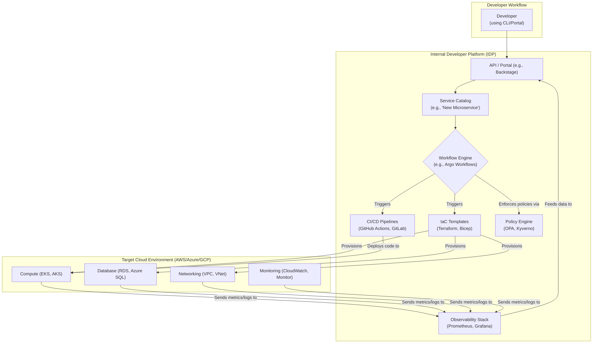

# Platform Engineering: Architecting for Developer Velocity

In modern software development, speed is a competitive advantage. Yet, developers often find themselves mired in the cognitive overhead of cloud infrastructure, security policies, and CI/CD tooling. This complexity creates friction, slows down delivery, and leads to burnout. Platform engineering emerges as a strategic discipline to solve this, treating infrastructure as a product and developers as its customers.

By 2026, the organizations that thrive will be those that have mastered the art of abstracting complexity away from their engineering teams. This isn't about hiding details; it's about providing paved roads that empower developers to build, ship, and run their applications with speed, autonomy, and confidence. This article explores how to build an effective Internal Developer Platform (IDP) that delivers on this promise.

### What You'll Get

This article will provide you with a practitioner's guide to platform engineering, including:

*   **Core Principles:** A clear breakdown of self-service, golden paths, and inner source.
*   **Architectural Blueprints:** A high-level diagram of an Internal Developer Platform (IDP).
*   **Practical Tooling:** Example technology stacks for building an IDP on AWS and Azure.
*   **Measuring Success:** How to calculate ROI and foster the necessary cultural shift.

## What is Platform Engineering, Really?

Platform engineering is the discipline of designing and building toolchains and workflows that enable self-service capabilities for software engineering organizations. The goal is to create an integrated product—an Internal Developer Platform—that covers the operational necessities of the entire lifecycle of an application.

It's a natural evolution of DevOps, not a replacement. While DevOps focuses on breaking down silos between development and operations, platform engineering provides the *tools* and *foundations* to make DevOps principles scalable and repeatable.

> "Platform engineering teams provide a coherent, curated, and abstracted set of tools and processes to make it easier for developers to build, deploy, and run their applications." – [Martin Fowler](https://martinfowler.com/articles/platform-engineering-guide.html)

### The Core Pillars of Modern Platform Engineering

An effective platform is built on three key pillars that balance developer autonomy with organizational governance.

#### ### Self-Service Infrastructure
Developers should be able to provision the resources they need on-demand without filing a ticket and waiting for an operations team. This is achieved through a curated service catalog and automated workflows.

*   **Action:** A developer selects "New Postgres Database" from a web portal.
*   **Result:** An automated workflow provisions a production-ready, secure, and monitored database instance within minutes.

#### ### Golden Paths
"Golden Paths" (or paved roads) are the well-supported, recommended ways to accomplish a specific task, like creating a new microservice or setting up a deployment pipeline. They aren't meant to be restrictive but to make the *right* way the *easy* way.

*   They codify best practices for security, reliability, and observability.
*   Teams can deviate if necessary, but the golden path covers 80% of common use cases, drastically reducing cognitive load.
*   This ensures consistency and simplifies maintenance across the organization.

#### ### Inner Source
Inner Source is the practice of applying open-source principles to internal software development. The platform itself should be developed this way.

*   **Contributions Welcome:** Feature teams can contribute improvements or new components back to the platform.
*   **Transparency:** The platform's roadmap and code are open for all internal teams to see and discuss.
*   **Collaboration:** Fosters a sense of shared ownership and ensures the platform evolves to meet the genuine needs of its users.

## Building Your Internal Developer Platform (IDP)

The IDP is the tangible product that your platform engineering team delivers. It's the user interface—be it a portal, a CLI, or a set of APIs—that developers interact with to access the platform's capabilities. A great IDP feels less like a collection of tools and more like a cohesive, integrated product.

### Key Components of an Effective IDP

An IDP integrates various tools into a seamless developer experience. Below are some of the essential components.

| Component | Purpose | Example Tools |
| :--- | :--- | :--- |
| **Developer Portal** | The primary UI for service discovery, docs, and self-service actions. | Backstage, Port |
| **Service Catalog** | A curated list of approved service templates and resources. | AWS Proton, Azure Deployment Environments |
| **CI/CD Automation** | Pipelined templates for building, testing, and deploying applications. | GitLab CI, GitHub Actions, Jenkins |
| **Infrastructure as Code (IaC)** | Version-controlled, reusable modules for provisioning infrastructure. | Terraform, Bicep, Pulumi |
| **Policy & Governance** | Automated guardrails for security, cost, and compliance. | Open Policy Agent (OPA), Kyverno |
| **Observability** | Centralized logging, metrics, and tracing for all services. | Prometheus, Grafana, OpenTelemetry |
| **Secrets Management** | Secure storage and access control for credentials and keys. | HashiCorp Vault, AWS Secrets Manager |

### A High-Level IDP Architecture

The following diagram illustrates how a developer interacts with an IDP to provision infrastructure and deploy an application, abstracting away the underlying cloud complexity.



## Practical Implementation on AWS and Azure

Both major cloud providers offer a rich set of services that can be composed to build a powerful IDP. For more information, check out the official [AWS](https://aws.amazon.com/solutions/platform-engineering) and [Azure](https://azure.microsoft.com/en-us/solutions/platform-engineering) platform engineering solution pages.

### Example Stack on AWS

*   **Compute:** Amazon EKS for container orchestration.
*   **Service Catalog & Templates:** AWS Proton to define and manage application stacks.
*   **CI/CD:** AWS CodePipeline and AWS CodeBuild for automated builds and deployments.
*   **IaC:** AWS CloudFormation or Terraform managed through a CI/CD pipeline.
*   **Governance:** AWS Control Tower and Service Catalog for establishing guardrails.
*   **Observability:** Amazon CloudWatch and AWS X-Ray, often supplemented with Grafana.

```bash
# Example: Using AWS Proton to create a new service instance
aws proton create-service-instance \
    --name my-new-app-prod \
    --service-name my-app \
    --spec file://spec.yaml \
    --template-major-version "1"
```

### Example Stack on Azure

*   **Compute:** Azure Kubernetes Service (AKS) for a managed Kubernetes experience.
*   **Service Catalog & Templates:** Azure Deployment Environments for providing developers with pre-configured environments.
*   **CI/CD:** Azure Pipelines (part of Azure DevOps) or GitHub Actions.
*   **IaC:** Bicep or Terraform for defining Azure resources.
*   **Governance:** Azure Policy to enforce organizational standards at scale.
*   **Observability:** Azure Monitor, including Application Insights and Log Analytics.

## Measuring Success and Fostering Culture

Building a platform is a significant investment. Success depends not only on technology but also on measuring its impact and nurturing the right culture.

### Calculating the ROI

The return on investment for platform engineering can be measured through key developer productivity metrics, often aligned with the DORA metrics:

*   **Lead Time for Changes:** How long does it take from code commit to production deployment? A good IDP drastically reduces this.
*   **Deployment Frequency:** How often can you successfully release to production? Self-service pipelines increase this.
*   **Mean Time to Recovery (MTTR):** How quickly can you restore service after an incident? Standardized observability and rollback procedures help here.
*   **Developer Onboarding Time:** How long does it take a new engineer to get their local environment set up and ship their first change? This should be hours, not weeks.

### The Cultural Shift

Finally, the most critical element is treating your platform **as a product**.

*   **Your Developers are Customers:** Actively seek their feedback through surveys, interviews, and internal RFCs.
*   **Product Management:** Have a dedicated product manager for the platform who prioritizes the roadmap based on user needs and business impact.
*   **Start Small and Iterate:** Don't try to build a monolithic platform for everyone at once. Start with one golden path for one team and expand from there.

## Looking Ahead to 2026

As we move toward 2026, the complexity of cloud-native ecosystems will only increase. AI-assisted development, multi-cloud deployments, and edge computing will add new layers of abstraction and challenge. Organizations that invest in a solid platform engineering foundation today will be best positioned to adopt these technologies without overwhelming their developers. The future belongs to those who can provide a seamless, high-velocity path from idea to production.

## Join the Conversation

Platform engineering is an evolving field, and every organization's journey is unique. What are the biggest platform engineering challenges you're facing today? Share your thoughts and experiences in the comments below


## Further Reading

- [https://platformengineering.org/blog/developer-velocity-2026](https://platformengineering.org/blog/developer-velocity-2026)
- [https://aws.amazon.com/solutions/platform-engineering](https://aws.amazon.com/solutions/platform-engineering)
- [https://azure.microsoft.com/en-us/solutions/platform-engineering](https://azure.microsoft.com/en-us/solutions/platform-engineering)
- [https://infoq.com/articles/platform-engineering-trends](https://infoq.com/articles/platform-engineering-trends)
- [https://martinfowler.com/articles/platform-engineering-guide.html](https://martinfowler.com/articles/platform-engineering-guide.html)
