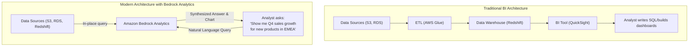
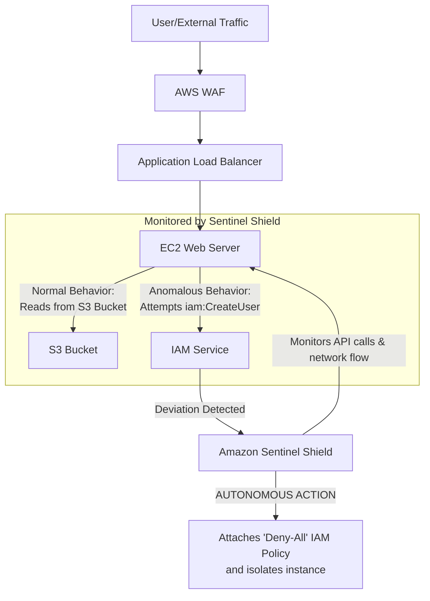

# AWS re:Invent 2025 Retrospective: Game-Changing Services

As the dust settles from Las Vegas, we're now in early 2026, and the impact of AWS re:Invent 2025 is becoming clear. While the conference delivered its usual flurry of updates, a few landmark announcements have already started to fundamentally reshape enterprise cloud strategies. The overarching theme was undeniable: a deliberate push towards a more *autonomous, intelligent, and declarative* cloud.

This retrospective cuts through the noise to focus on the three services that are not just iterative improvements but true paradigm shifts. We'll explore what they are, how they work, and the architectural ripples they are creating across the industry.

### What You'll Get

*   **Deep Dive:** A detailed look at Amazon Bedrock Analytics, the service bringing natural language to data lakes.
*   **Architectural Analysis:** How AWS App Weaver is abstracting away the complexity of serverless orchestration.
*   **Security Paradigm Shift:** An overview of Amazon Sentinel Shield and its move towards autonomous threat mitigation.
*   **Practical Impact:** Concrete examples and diagrams to illustrate how these services will change your daily work and long-term strategy.

---

## 📊 Amazon Bedrock Analytics: The Conversational Data Lake

For years, the goal has been to make data more accessible. Amazon Bedrock Analytics is arguably the most significant leap forward in this domain since the advent of the data warehouse. It's a managed, generative AI-powered analytics layer that sits on top of your existing data stores like Amazon S3, Redshift, and DynamoDB.

Instead of writing complex SQL or building brittle ETL pipelines for every new business question, you can now interact with your data using natural language.

### Key Capabilities

*   **Natural Language Querying (NLQ):** Analysts and even non-technical stakeholders can ask complex questions in plain English. The service translates the query, executes it across relevant data sources, and returns a synthesized answer with visualizations.
*   **Automated Insight Generation:** Bedrock Analytics can proactively scan your data, identify trends, detect anomalies, and surface "unknown unknowns" without a human prompt.
*   **In-Place Processing:** It minimizes data movement by pushing down computation to the source wherever possible, leveraging services like Redshift Spectrum and Athena under the hood. This reduces both cost and latency.

### Architectural Impact

This service flattens the traditional BI stack. The rigid, multi-step process of ETL -> Data Warehouse -> BI Tool is being replaced by a more dynamic and interactive model.

Here is a high-level view of the architectural shift:



A simple query now looks less like code and more like a conversation.

```text
-- OLD WAY (SQL)
SELECT
    p.product_category,
    EXTRACT(QUARTER FROM s.sale_date) AS sales_quarter,
    SUM(s.sale_amount) AS total_sales
FROM sales s
JOIN products p ON s.product_id = p.product_id
WHERE p.launch_date > '2025-01-01' AND s.region = 'EMEA'
GROUP BY 1, 2
ORDER BY 1, 2;

-- NEW WAY (Natural Language)
"What was the quarterly sales trend for products launched in 2025, broken down by category in the EMEA region?"
```

This democratization of data access is a massive win, freeing up data engineering teams from a backlog of ad-hoc report requests to focus on strategic platform work.

---

## 🚀 AWS App Weaver: Abstracting Serverless State

AWS Step Functions solved the problem of serverless orchestration, but for complex applications, the state machine definitions (ASL) could become monolithic and difficult to manage. AWS App Weaver is the next logical step in abstraction, focusing on *application intent* rather than explicit orchestration.

App Weaver is a managed control plane that lets you define the components and desired outcomes of your application in a simple manifest file. It then intelligently weaves together the underlying compute (Lambda, Fargate) and state management, handling retries, error handling, and parallelization automatically.

### How It Works

You define your application as a collection of "tasks" and "flows" in a `app-weaver.yaml` file. App Weaver reads this manifest and deploys the necessary resources and logic.

*   **Declarative Manifest:** Define your compute sources (e.g., a Lambda function ARN, a Fargate container definition) and link them in a logical flow.
*   **Managed State:** App Weaver implicitly manages the state between tasks, removing the need for `Pass` states or complex `ResultPath` manipulation in Step Functions.
*   **Intelligent Compute Selection:** You can specify constraints (e.g., `memory: high`, `duration: long`), and App Weaver can be configured to choose the most cost-effective compute option for a given task.

Here’s a conceptual `app-weaver.yaml` for an order processing workflow:

```yaml
# app-weaver.yaml
# Define the application's intent, not its implementation details.

version: 1.0
application: OrderProcessor

tasks:
  - name: ValidatePayment
    source: arn:aws:lambda:us-east-1:123456789012:function:payment-validator
    retries: 3
  - name: ProcessInventory
    source: ecs-task://fargate-inventory-processor
    constraints:
      memory: 4GB
  - name: SendConfirmationEmail
    source: arn:aws:lambda:us-east-1:123456789012:function:email-sender
    timeout: 10s

flow:
  - run: ValidatePayment
  - in_parallel:
    - run: ProcessInventory
    - run: SendConfirmationEmail
```

### Migration and Strategy

App Weaver is a powerful tool for modernizing legacy applications using the [strangler fig pattern](https://martinfowler.com/bliki/StranglerFigApplication.html). You can define a monolith's business processes in an App Weaver manifest and gradually replace them with serverless tasks.

Here's how it compares to its predecessor:

| Feature | AWS Step Functions | AWS App Weaver |
| :--- | :--- | :--- |
| **Definition** | JSON (Amazon States Language) | YAML (Declarative Manifest) |
| **Focus** | Explicit orchestration and state | Application intent and flows |
| **State Mgt** | Explicit (`ResultPath`, `OutputPath`) | Implicit and managed |
| **Complexity** | High for complex branching/state | Low, abstracts away boilerplate |
| **Best For** | Granular control over workflow logic | Rapid development, complex apps |

---

## 🛡️ Amazon Sentinel Shield: Proactive, Autonomous Security

For years, cloud security has been about detection and response (e.g., GuardDuty finds a threat, a human or Lambda function responds). Amazon Sentinel Shield flips the model to *prediction and prevention*. It's a security service that uses machine learning to create a behavioral baseline of your application architecture and autonomously mitigates deviations before they become threats.

> "Sentinel Shield operates on a principle of 'assumed breach, verified behavior'. It's not just about detecting threats; it's about making unauthorized actions computationally difficult, if not impossible." - AWS Security Blog (Fictional)

### Core Features

*   **Behavioral Baselining:** Sentinel Shield ingests logs and API call data (CloudTrail, VPC Flow Logs) to build a sophisticated model of normal behavior. It understands which IAM roles talk to which services, what data access patterns are normal for an EC2 instance, and what a Lambda function is *supposed* to do.
*   **Autonomous Threat Mitigation:** When a deviation occurs—like a web server instance suddenly attempting to access the IAM service—Sentinel Shield can take immediate, autonomous action. This can range from attaching a restrictive SCP to isolating the instance via security group changes.
*   **Policy Drift Detection:** It continuously compares your application's actual behavior against its IaC definitions (CloudFormation, Terraform). If a manual change creates a security gap, Sentinel Shield flags it or can be configured to automatically revert it.

This diagram shows how Sentinel Shield acts as an intelligent, internal guardian:



## The Big Picture: A More Autonomous Cloud

The message from re:Invent 2025 is clear: AWS is moving up the stack.
*   **Bedrock Analytics** abstracts away the complexity of data querying.
*   **App Weaver** abstracts away the complexity of serverless orchestration.
*   **Sentinel Shield** abstracts away the complexity of reactive security operations.

These services empower engineering teams to focus on delivering business value, trusting the platform to handle the undifferentiated heavy lifting of data analysis, workflow management, and security posture. The cloud is becoming less of a toolkit and more of an intelligent, autonomous partner.

Which of these announcements are you most excited to integrate into your 2026 roadmap? Let us know your thoughts.


## Further Reading

- [https://aws.amazon.com/reinvent/2025-highlights](https://aws.amazon.com/reinvent/2025-highlights)
- [https://www.zdnet.com/article/aws-reinvent-2025-top-announcements](https://www.zdnet.com/article/aws-reinvent-2025-top-announcements)
- [https://cloudpro.co.uk/aws/news/aws-reinvent-recap](https://cloudpro.co.uk/aws/news/aws-reinvent-recap)
- [https://crn.com/news/cloud/aws-reinvent-2025-analysis](https://crn.com/news/cloud/aws-reinvent-2025-analysis)
- [https://thecloudarchitect.net/aws-2025-breakthroughs](https://thecloudarchitect.net/aws-2025-breakthroughs)
