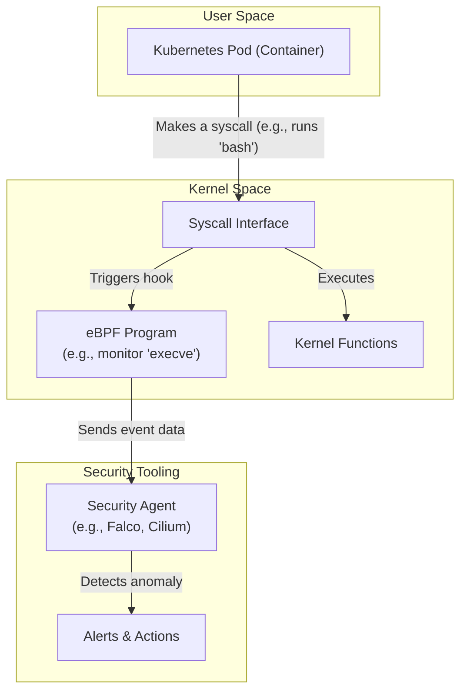

# Kubernetes Security: Beyond the Basics with eBPF and OPA

Kubernetes has become the de facto standard for container orchestration, but its dynamic and distributed nature introduces complex security challenges. While native tools like Network Policies and Role-Based Access Control (RBAC) provide a solid foundation, they often fall short in addressing sophisticated runtime threats and enforcing granular, context-aware policies.

To truly secure modern cloud-native environments, we need to go deeper. This is where eBPF and Open Policy Agent (OPA) come in, offering unparalleled visibility into the kernel and a unified framework for policy enforcement. Together, they form a powerful combination for building a proactive, defense-in-depth security posture for your clusters.

### What You'll Get

This article will guide you through advanced Kubernetes security concepts. You will learn:

*   Why traditional Kubernetes security measures are not enough.
*   What eBPF is and how it provides deep runtime security and observability.
*   How OPA enables flexible, policy-as-code governance for your cluster.
*   How eBPF and OPA work together to create a robust, multi-layered security strategy.
*   Practical examples, including OPA policies and conceptual diagrams.

## The Modern Kubernetes Threat Landscape

Securing a Kubernetes cluster isn't just about controlling who can access the API server. The real battleground is at runtime, inside the running containers and on the nodes themselves. Standard security primitives often lack the necessary context and granularity to stop advanced attacks.

Key challenges include:
*   **Runtime Threats:** Malicious processes, container escapes, and kernel exploits that occur *after* a container is running are difficult to detect with static analysis or simple network rules.
*   **East-West Traffic:** A significant portion of traffic within a cluster is between services (east-west). Traditional firewalls are often blind to this internal communication, making it hard to spot lateral movement by an attacker.
*   **Ephemeral Workloads:** The short-lived nature of pods and containers makes traditional IP-based security rules impractical and difficult to manage.
*   **Policy Gaps:** Different components of your stack (ingress, service mesh, CI/CD) may have their own policy mechanisms, leading to inconsistent enforcement and security gaps.

> Traditional security tools often operate at the edge (L3/L4 firewalls) or with limited application context. They can't see what's happening *inside* a container or track behavior at the system call level.

## eBPF: The Kernel's Superpower for Security

Extended Berkeley Packet Filter (eBPF) is a revolutionary kernel technology that allows you to run sandboxed programs directly within the Linux kernel without changing kernel source code or loading kernel modules. Think of it as creating safe, event-driven plugins for the operating system itself.

For security, this is a game-changer. By attaching eBPF programs to various kernel hooks (system calls, network events, function entries), we can gain incredibly deep visibility and control with minimal performance overhead.

### How eBPF Enhances Kubernetes Security

*   **Runtime Security & Threat Detection:** eBPF can monitor critical system calls (`execve`, `connect`, `open`) made by any process inside a container. This allows security tools to detect anomalous behavior in real-time, such as spawning a shell, modifying critical files, or making unexpected network connections.
*   **Granular Network Observability:** By operating at the kernel level, eBPF can see every network packet flowing in and out of a pod without the need for a sidecar proxy. This provides identity-aware network visibility and enables highly efficient network policy enforcement.
*   **Performance Tracing:** It can trace application and system performance with negligible overhead, helping identify performance bottlenecks that could be symptoms of a security issue, like a crypto-mining process consuming excessive CPU.

Several powerful open-source projects leverage eBPF for cloud-native security, including [Cilium](https://cilium.io/) for networking and observability, and [Falco](https://falco.org/) for runtime threat detection.



This diagram illustrates how an eBPF program intercepts a system call from a container, allowing a user-space agent to analyze it for threats before it's even fully executed by the kernel.

## Open Policy Agent (OPA): Policy-as-Code for Kubernetes

Open Policy Agent (OPA) is an open-source, general-purpose policy engine that unifies policy enforcement across your entire stack. It decouples policy decision-making from policy enforcement. Your service asks OPA a question—like "Is this user allowed to perform this action?"—and OPA provides a decision based on policies you've written.

In Kubernetes, OPA is most famously used as an **admission controller**. It intercepts every API request sent to the Kubernetes API server and can enforce custom policies before any object is created or modified in the cluster.

### OPA in Action: Admission Control

Policies in OPA are written in a high-level declarative language called **Rego**. Rego is purpose-built for querying complex, hierarchical data structures like JSON—making it a perfect fit for Kubernetes objects.

Let's see a practical example. Here is a Rego policy that denies any new `Pod` that uses an image from a non-approved registry (i.e., not `our-trusted-registry.io`).

```rego
package kubernetes.admission

deny[msg] {
    input.request.kind.kind == "Pod"
    image := input.request.object.spec.containers[_].image
    not startswith(image, "our-trusted-registry.io/")
    msg := sprintf("Image '%v' comes from an unapproved registry. Only use 'our-trusted-registry.io'.", [image])
}
```

This policy is clear, concise, and easy to manage as code in a version control system like Git.

The admission control flow with OPA looks like this:

```mermaid
sequenceDiagram
    participant User
    participant KubeAPIServer as "Kubernetes API Server"
    participant OPA as "OPA Gatekeeper"
    User->>+KubeAPIServer: kubectl apply -f pod.yaml
    KubeAPIServer->>+OPA: AdmissionReview Request
    Note over OPA: Evaluates Rego policies
    OPA-->>-KubeAPIServer: AdmissionReview Response (Allow/Deny)
    alt Request is Allowed
        KubeAPIServer->>KubeAPIServer: Persist object to etcd
        KubeAPIServer-->>-User: Success
    else Request is Denied
        KubeAPIServer-->>-User: Error: "Image comes from..."
    end
```

### Beyond Admission Control

While admission control is a primary use case, OPA's power extends far beyond it. It can be used to enforce policies in your CI/CD pipeline, at your API gateway, or even within your application logic. This provides a single, consistent way to manage policy across the entire cloud-native lifecycle. For more, check out the official [OPA documentation](https://www.openpolicyagent.org/docs/latest/).

## The Power Couple: Integrating eBPF and OPA

eBPF and OPA are powerful on their own, but they become even more effective when used together. They address different, yet complementary, layers of the security problem:

*   **eBPF provides runtime visibility:** It tells you *what is actually happening* at the lowest levels of your system (syscalls, network packets).
*   **OPA provides declarative control:** It tells you *what should be allowed to happen* based on high-level, human-readable policies.

| Technology | Domain | Primary Function | Example Question Answered |
| :--- | :--- | :--- | :--- |
| **eBPF** | Runtime (Kernel) | **Observability & Detection** | "Did this container just try to write to `/etc/shadow`?" |
| **OPA** | Control Plane (API) | **Governance & Enforcement** | "Is this container configured to use an image from a trusted registry?" |

### A Practical Use Case: From Detection to Prevention

Imagine an eBPF-based runtime security tool like [Falco](https://falco.org/docs/) detects suspicious activity.

1.  **Detection (eBPF):** A pod, which normally only serves web traffic, unexpectedly spawns a `ncat` process to establish a reverse shell. An eBPF probe detects the `execve` system call for `ncat` and sends an alert.
2.  **Response:** This alert can trigger an automated workflow. For example, a controller could immediately add a "quarantined=true" label to the compromised pod.
3.  **Enforcement (OPA):** You can have an OPA policy that works with a service mesh or network policy controller. This policy could state: "Any pod with the label 'quarantined=true' is denied all egress network traffic."
4.  **Prevention (OPA):** The security team analyzes the incident. They realize the vulnerability came from a container running with `allowPrivilegeEscalation: true`. They write a new OPA admission control policy to deny any future deployments with that setting, hardening the cluster against similar attacks.

In this flow, eBPF provides the critical real-time detection, while OPA provides both the immediate, automated response enforcement and the long-term preventative hardening of the control plane.

## Challenges and Considerations

While incredibly powerful, adopting these technologies requires careful consideration:
*   **eBPF Complexity:** Writing safe and efficient eBPF programs requires deep kernel knowledge. For most teams, it's more practical to adopt well-supported open-source tools like Cilium, Falco, or Pixie that build on eBPF.
*   **Kernel Dependencies:** eBPF features are tied to Linux kernel versions. Ensure your node OS has a sufficiently modern kernel (5.8+ is recommended for advanced features).
*   **OPA Learning Curve:** The Rego language is powerful but requires learning. Start with simple policies and build from there. Projects like [Gatekeeper](https://github.com/open-policy-agent/gatekeeper) simplify OPA's integration with Kubernetes.

## Conclusion

Kubernetes security is not a one-time setup; it's a continuous process of hardening, monitoring, and responding. By moving beyond the basics and embracing technologies like eBPF and OPA, you can shift from a reactive to a proactive security posture.

eBPF provides the ground truth of what your workloads are doing at the kernel level, while OPA gives you a unified, declarative framework to enforce what they *should* be doing. Together, they offer a layered, defense-in-depth strategy that is essential for securing today's complex, dynamic, and mission-critical Kubernetes environments.


## Further Reading

- [https://kubernetes.io/docs/concepts/security](https://kubernetes.io/docs/concepts/security)
- [https://www.openpolicyagent.org/docs](https://www.openpolicyagent.org/docs)
- [https://ebpf.io/applications](https://ebpf.io/applications)
- [https://sysdig.com/blog/kubernetes-security-ebpf-opa](https://sysdig.com/blog/kubernetes-security-ebpf-opa)
- [https://cncf.io/blog/kubernetes-runtime-security](https://cncf.io/blog/kubernetes-runtime-security)
