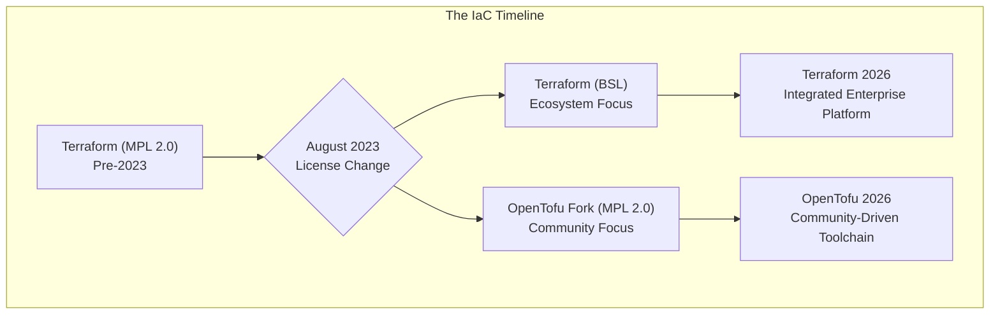

# Terraform vs. OpenTofu: Navigating the Open Source Fork in 2026

It's February 2026, and the dust from HashiCorp's 2023 license change has long since settled. The infrastructure as code (IaC) landscape is no longer dominated by a single tool but is a vibrant ecosystem with two major players: HashiCorp's Terraform and the Linux Foundation's OpenTofu. The fork, once a point of contention, has resulted in two distinct, mature tools, each with its own philosophy, feature set, and community.

For practitioners, the choice is no longer just about syntax; it's about aligning with a development model, an ecosystem, and a long-term vision. This article breaks down the state of Terraform and OpenTofu today, helping you make an informed decision for your projects.

## What You'll Get

*   A 2026 snapshot of the Terraform and OpenTofu ecosystems.
*   An analysis of key feature differences and community health.
*   A look at the state of provider and module compatibility.
*   An actionable framework for choosing the right IaC tool for your team.

## The Fork in Retrospect: Two Paths Diverged

To understand today's landscape, we must remember the split. In August 2023, HashiCorp moved Terraform from an MPL 2.0 license to a Business Source License (BSL). This prompted a community-led initiative to create a truly open-source fork, which was quickly adopted by the Linux Foundation and named OpenTofu.

In the years since, the two projects have evolved along predictable but significant paths:

*   **HashiCorp Terraform** has deepened its integration with its commercial offerings, Terraform Cloud and Terraform Enterprise. Its development prioritizes features that enhance its managed platform, focusing on security, governance, and enterprise-grade workflows.
*   **OpenTofu** has remained fully open-source, with a governance model steered by the community. Its development has focused on long-requested features from practitioners, such as enhanced security primitives and a more flexible, open core.

This divergence has created a meaningful choice for developers and DevOps engineers.



## Feature Landscape: Parity and Divergence

While both tools share a common HCL foundation, their feature sets have diverged significantly. OpenTofu maintained compatibility with Terraform 1.5.x, but new features are not back-ported in either direction.

| Feature                 | Terraform (as of Feb 2026)                                | OpenTofu (as of Feb 2026)                                    | Notes                                                                                                  |
| ----------------------- | --------------------------------------------------------- | ------------------------------------------------------------ | ------------------------------------------------------------------------------------------------------ |
| **Core Language (HCL)** | Largely stable, with functions geared towards TFC.        | Backwards-compatible, with new open-source functions added.  | 98% of your core HCL is portable, but tool-specific functions can lock you in.                         |
| **State Management**    | Robust backend support; advanced features tied to TFC.    | Robust backend support, with built-in client-side encryption. | OpenTofu's client-side state encryption is a major win for teams managing their own state backends.    |
| **Policy as Code**      | Sentinel (proprietary, deeply integrated with TFC).       | Native OPA integration and a pluggable policy engine framework.  | Your choice here depends heavily on your existing policy and governance toolchain.                     |
| **Testing Framework**   | `terraform test` is mature and integrates with TFC runs.  | A built-in, extensible testing framework with mocking support.   | OpenTofu's framework is often favored for pure CI/CD-based testing without reliance on a managed platform. |
| **Registry**            | The official Terraform Registry, managed by HashiCorp.    | An independent, community-managed public registry.           | Most major providers publish to both registries, but some niche modules may be exclusive.              |
| **Extensibility**       | Standard provider model.                                  | Provider model plus experimental support for custom hooks.   | OpenTofu's hooks allow for custom actions during the plan/apply lifecycle, a powerful extension.       |

> **What is Client-Side State Encryption?**
> A key feature introduced in OpenTofu allows you to encrypt the state file on your machine *before* it is sent to the remote backend (like an S3 bucket). This ensures that the cloud provider hosting the state file cannot access its contents, providing an extra layer of security.

## Ecosystem and Community Health

The health of an IaC tool is measured by its ecosystem of providers, modules, and the community that supports them.

### Provider and Module Compatibility

Thankfully, the provider ecosystem has not been fractured. Major cloud providers like AWS, Google Cloud, and Azure maintain official providers that are compatible with both Terraform and OpenTofu. They recognize that supporting both is essential to reach the entire market.

However, a subtle divergence is happening in the module ecosystem:

*   **Universal Modules:** Most popular modules on the respective registries are designed to be "universal," avoiding tool-specific features.
*   **Native Modules:** We are now seeing the emergence of modules optimized for one tool. A "Terraform Native" module might leverage Sentinel policies, while an "OpenTofu Native" module could use advanced testing features or client-side encryption hooks.

Always check a module's documentation for its compatibility statement.

### Community Dynamics

The two communities have distinct feels, reflecting their governance models.

*   **Terraform:** The community is massive, with support primarily channeled through HashiCorp's official forums and enterprise support channels. The roadmap is set by HashiCorp, providing a clear, predictable (if corporate-driven) direction.
*   **OpenTofu:** The community lives on GitHub, Slack, and public forums. It embodies a classic open-source spirit, with a transparent, community-driven roadmap managed under the Linux Foundation's neutral governance. This leads to rapid innovation on practitioner-requested features.

## Migration and Decision Framework

Choosing your tool in 2026 requires a clear-eyed assessment of your organization's priorities.

### When to Stick with Terraform

Terraform remains an excellent choice, particularly for organizations that:

*   Are heavily invested in **Terraform Cloud or Enterprise** for state management, governance, and CI/CD.
*   Rely on proprietary HashiCorp integrations like **Sentinel** for policy as code.
*   Prioritize a single vendor for support and accountability across their IaC and secrets management stack (e.g., Vault, Consul).
*   Prefer a product roadmap driven by a single corporate entity.

### When to Choose (or Migrate to) OpenTofu

OpenTofu has become the default for a significant portion of the market, especially for teams that:

*   Have a strict **FOSS-first or FOSS-only** mandate.
*   Require specific open-source features like **client-side state encryption** or a more flexible testing framework.
*   Are building products that embed IaC and cannot be encumbered by the BSL.
*   Value **community-led governance** and a transparent, public roadmap.

### The Migration Path in 2026

Migrating from Terraform to OpenTofu (or vice-versa) is no longer a simple find-and-replace of the binary name. If you've started using post-fork features, the process requires careful planning.

1.  **Analyze your code:** Use static analysis tools to check for usage of tool-specific functions or features.
2.  **State file compatibility:** State files remain largely compatible, but it's crucial to back up your state before switching.
3.  **CI/CD pipeline:** Update your pipelines to use the `tofu` CLI instead of `terraform`.
4.  **Test thoroughly:** Run extensive `plan` and `apply` cycles in a non-production environment to ensure no unexpected changes.

```bash
# Example: Basic steps to switch in a CI environment
# 1. Back up your state file first!
aws s3 cp s3://my-tf-state-bucket/prod/terraform.tfstate ./terraform.tfstate.backup

# 2. Initialize with OpenTofu
tofu init

# 3. Run a plan to check for differences
tofu plan -out=tf.plan

# 4. Review the plan carefully before applying
```

## Final Verdict: A Tool for Every Philosophy

The Terraform vs. OpenTofu debate has matured from a licensing dispute into a discussion of philosophy. There is no universal "winner." The fork has successfully created two best-in-class tools catering to different segments of the market.

*   **Terraform** is the integrated, commercially-backed platform for enterprises that want a managed solution with deep ecosystem ties.
*   **OpenTofu** is the flexible, community-governed powerhouse for those who prioritize open-source principles and practitioner-driven features.

The best choice is the one that aligns with your team's culture, your company's policies, and your project's technical needs.

What's your IaC tool of choice in 2026, and what factors drove your decision? Share your experience in the comments below.


## Further Reading

- [https://opentofu.org/blog/2026-roadmap](https://opentofu.org/blog/2026-roadmap)
- [https://hashicorp.com/terraform/roadmap-2026](https://hashicorp.com/terraform/roadmap-2026)
- [https://cloudarchitect.io/terraform-opentofu-comparison](https://cloudarchitect.io/terraform-opentofu-comparison)
- [https://infoq.com/articles/opentofu-vs-terraform-enterprise](https://infoq.com/articles/opentofu-vs-terraform-enterprise)
- [https://medium.com/devops-journey/terraform-opentofu-choice](https://medium.com/devops-journey/terraform-opentofu-choice)
