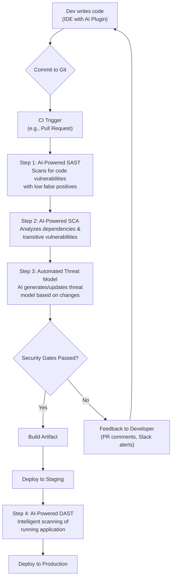

# Shift Left with AI: The Future of DevSecOps Automation

In DevSecOps, the mantra has always been "shift left"—addressing security as early as possible in the development lifecycle. For years, this meant manual code reviews and traditional static analysis tools. While valuable, these methods often struggle to keep pace with modern, rapid-release cycles. Enter Artificial Intelligence. AI and Machine Learning (ML) are not just buzzwords; they are fundamentally reshaping how we automate and integrate security, making the promise of shifting left a practical reality.

This article explores how AI is revolutionizing DevSecOps, moving security from a late-stage gatekeeper to an intelligent, automated partner throughout the CI/CD pipeline.

### What You'll Get

*   **Core Concepts:** A clear explanation of how AI enhances the "shift left" security model.
*   **Practical Applications:** Real-world examples of AI-driven security tools in the CI/CD pipeline.
*   **Visualized Workflow:** A Mermaid diagram illustrating an AI-augmented DevSecOps pipeline.
*   **Key Benefits:** A breakdown of how AI reduces false positives, improves threat detection, and boosts developer productivity.
*   **Code in Action:** A sample CI/CD configuration snippet showing how to integrate an AI security scanner.

## The AI Advantage: Beyond Traditional Scanning

Traditional security scanners, like classic Static Application Security Testing (SAST) tools, are good at pattern matching. They check code against a known database of rules and vulnerabilities. However, they often lack context, leading to a high volume of false positives that developers learn to ignore. This "alert fatigue" is a significant barrier to effective DevSecOps.

AI changes the game by introducing context and learning. Instead of just matching patterns, AI/ML models are trained on millions of code repositories, vulnerability reports, and fix-commits. This allows them to:

*   **Understand Developer Intent:** Differentiate between a genuine vulnerability and benign code that happens to match a rule.
*   **Prioritize Real Risks:** Analyze the full context of a potential flaw—including data flow and accessibility—to determine its actual exploitability.
*   **Provide Actionable Fixes:** Suggest specific, context-aware code changes, often right inside the developer's IDE.

> According to a study by the [Ponemon Institute, sponsored by IBM](https://www.ibm.com/reports/data-breach/), the average cost of a data breach is over $4.35 million. Finding and fixing vulnerabilities in production is orders of magnitude more expensive than fixing them during development.

### Traditional vs. AI-Augmented DevSecOps

| Feature | Traditional DevSecOps | AI-Augmented DevSecOps |
| :--- | :--- | :--- |
| **Analysis Method** | Rule-based pattern matching | Context-aware, predictive analysis |
| **False Positive Rate** | High | Significantly Lower |
| **Developer Feedback** | General warnings (e.g., "SQLi found") | Specific, actionable code suggestions |
| **Threat Modeling** | Manual, periodic process | Continuous, automated generation |
| **Scalability** | Struggles with complex codebases | Learns and adapts to new patterns |

## AI in Action: Key Applications in the CI/CD Pipeline

Integrating AI into DevSecOps isn't a single action but a series of enhancements across the entire CI/CD pipeline. The goal is to provide developers with fast, accurate security feedback at every stage.


*A high-level view of an AI-augmented DevSecOps CI/CD pipeline.*

### AI-Powered Static Analysis (SAST)

This is the most impactful application of AI in shifting left. Instead of just flagging a potentially unsafe function, AI-powered SAST tools analyze the entire data flow. They can determine if user-controllable input can actually reach the vulnerable function, drastically reducing false alarms.

**Example:** A traditional tool might flag every use of `strcpy()`. An AI tool understands when the source string is a hardcoded constant and not user input, correctly identifying it as a non-issue.

### AI-Enhanced Software Composition Analysis (SCA)

Modern applications are built on open-source dependencies. AI-enhanced SCA tools go beyond simply checking a dependency version against a CVE database. They can:

*   **Analyze Transitive Dependencies:** Identify vulnerabilities deep within your dependency tree.
*   **Prioritize Reachability:** Determine if the vulnerable function within a library is actually called by your code. This is crucial for prioritization.
*   **Detect License Risks:** Proactively flag incompatible open-source licenses.

### Automated and Continuous Threat Modeling

Threat modeling has traditionally been a manual, time-consuming process performed by security experts. AI is making it continuous and accessible.

AI tools can analyze code changes in a pull request, understand the new functionality (e.g., a new API endpoint, user authentication flow), and automatically generate or update a threat model based on frameworks like [OWASP's STRIDE](https://owasp.org/www-community/Threat_Modeling). This turns a static, periodic review into a dynamic, automated part of the CI/CD process.

## Integrating AI Security into a CI/CD Pipeline

Here is a simplified example of what a step in a GitHub Actions workflow might look like to run an AI-powered security scanner. The focus is on the concept, not a specific tool's syntax.

```yaml
name: AI Security Scan

on:
  pull_request:
    branches: [ main ]

jobs:
  security-scan:
    runs-on: ubuntu-latest
    steps:
    - name: Checkout code
      uses: actions/checkout@v3

    - name: Run AI-Powered SAST Scanner
      uses: Your-AI-Security-Tool/scan-action@v1
      with:
        # AI tools often use API keys for authentication and project context
        api_key: ${{ secrets.AI_TOOL_API_KEY }}
        
        # Configuration to fail the build only on critical, high-confidence findings
        fail_on_severity: critical
        
        # Enable smart feedback to post actionable comments directly on the PR
        post_pr_comments: true
```

The key here is automation. The scan runs on every pull request, providing immediate feedback to the developer *before* the code is merged. The ability to fail the build based on high-confidence, critical findings ensures that severe issues are never introduced into the main branch.

## The Payoff: Benefits and Challenges

Adopting AI in your DevSecOps practice offers substantial benefits, but it's important to be aware of the challenges.

### Benefits ✅

*   **Reduced False Positives:** The single biggest benefit. This rebuilds trust between security tooling and developers.
*   **Improved Developer Productivity:** Developers spend less time chasing phantom issues and receive clear, actionable guidance on fixing real ones.
*   **Early and Cheaper Remediation:** Finding vulnerabilities in the IDE or at commit time is exponentially cheaper than finding them in production.
*   **Proactive Security Posture:** AI can identify novel or "zero-day" vulnerabilities by learning patterns of insecure code, rather than relying solely on known CVEs.

### Challenges 🚧

*   **Tool Selection:** The market is growing. Choosing the right tool that integrates well with your stack is crucial.
*   **Model Transparency:** Some AI/ML models can be a "black box," making it hard to understand *why* something was flagged. Look for tools that provide clear explanations.
*   **Initial Training/Tuning:** While many tools work out of the box, some may require an initial period of tuning to understand your organization's specific coding patterns and risk appetite.

## The Future is Now

Shifting security left is no longer about just adding more scanners to the pipeline. It's about adding *smarter* scanners. AI and ML are providing the intelligence needed to make automated security a seamless, effective, and developer-friendly part of the software development lifecycle. By embedding context-aware analysis directly into their workflows, teams can build more secure software, faster.

What AI-driven security tools have you found most effective in your DevSecOps pipeline? Share your favorites in the comments below


## Further Reading

- [https://owasp.org/www-project-devsecops](https://owasp.org/www-project-devsecops)
- [https://snyk.io/blog/ai-devsecops-trends-2026](https://snyk.io/blog/ai-devsecops-trends-2026)
- [https://ibm.com/security/devsecops-ai](https://ibm.com/security/devsecops-ai)
- [https://veracode.com/blog/ai-powered-application-security](https://veracode.com/blog/ai-powered-application-security)
- [https://cloudsecurityalliance.org/research/ai-devsecops](https://cloudsecurityalliance.org/research/ai-devsecops)
