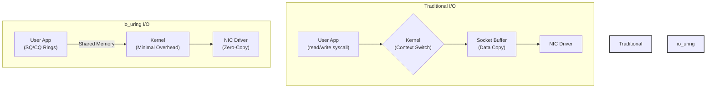
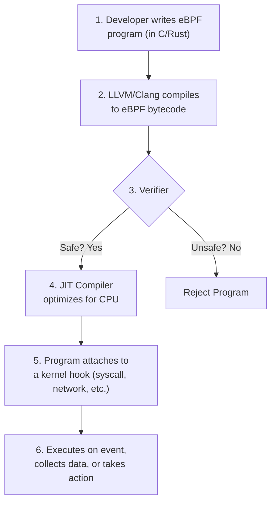

# Linux Kernel 6.X: Pushing Boundaries for Cloud and Edge

The Linux Kernel 6.X series represents a monumental leap forward, moving beyond incremental updates to deliver foundational changes for modern infrastructure. Since its debut, this series has aggressively targeted the demanding worlds of cloud-native computing and the resource-constrained edge. As of early 2026, the 6.X kernels have matured, solidifying features that redefine performance, security, and efficiency.

This article dives into the most impactful enhancements in the Linux 6.X series, focusing on what matters most to practitioners building and managing services in the cloud and on the edge.

### What You'll Get

*   **Cloud Infrastructure Deep Dive:** An analysis of key networking and virtualization upgrades boosting performance and density.
*   **Edge Computing Focus:** A look at crucial power management, scheduling, and real-time improvements for smaller devices.
*   **Subsystem Evolution:** Insight into the expanded capabilities of eBPF and the growing, production-ready role of Rust.
*   **Practical Examples:** Code snippets and diagrams to illustrate core concepts.

---

## Cloud Infrastructure Supercharged

The relentless demand for faster, more scalable cloud services has driven significant innovation in the kernel's core subsystems. The 6.X series delivers on this with major enhancements to I/O, networking, and virtualization.

### Networking Ascends with `io_uring` and MPTCP

High-performance networking is non-negotiable in the cloud. The `io_uring` asynchronous I/O interface has become a game-changer, and its capabilities have been massively expanded in the 6.X cycle. It now offers a true zero-copy networking pathway for TCP and UDP, drastically reducing CPU overhead and latency for data-intensive applications like databases and message queues.

This diagram illustrates the streamlined `io_uring` data path compared to the traditional syscall-heavy approach:



Alongside `io_uring`, Multi-Path TCP (MPTCP) is now a mature, first-class citizen. It allows a single connection to utilize multiple network paths simultaneously, providing seamless failover and connection aggregation. For cloud services, this translates to:

*   **Enhanced Resilience:** Automatically survive link failures without dropping connections.
*   **Increased Throughput:** Bond multiple interfaces (e.g., Wi-Fi and Ethernet) for higher bandwidth.

### Virtualization and Container Density

The 6.X series brings substantial improvements to KVM (Kernel-based Virtual Machine), the hypervisor powering most public clouds. We've seen optimizations in nested virtualization performance and more granular resource control, allowing for more efficient "cloud-in-a-cloud" scenarios.

For containers, the focus has been on security and fine-grained isolation:

*   **cgroupv2 Maturity:** The `cgroupv2` controller is now the standard, offering a unified hierarchy and more predictable resource allocation.
*   **Pressure Stall Information (PSI):** Provides more accurate insights into resource contention, enabling better autoscaling decisions.
*   **New Namespaces:** The introduction of features like the `seccomp` user-space notifier has hardened the boundary between containers and the host kernel.

> **Note:** These container-focused improvements directly benefit orchestration platforms like Kubernetes, allowing them to manage pod resources with greater precision and security.

---

## The Edge Gets Sharper and More Efficient

Edge computing requires a delicate balance of performance, real-time responsiveness, and extreme power efficiency. The 6.X kernels have introduced features specifically to meet these needs.

### Power-Aware and Latency-Sensitive Scheduling

A major highlight is the maturation of the **EEVDF (Earliest Eligible Virtual Deadline First)** scheduler, which replaced the long-standing CFS scheduler. EEVDF provides better fairness and significantly lower latency jitter. This is critical for industrial IoT, robotics, and other edge use cases where predictable response times are mandatory.

Key benefits of EEVDF at the edge include:

*   **Reduced Latency:** Minimizes task scheduling delays, crucial for real-time applications.
*   **Improved Interactivity:** Ensures that interactive tasks are not starved by background processes.
*   **Fairness:** Prevents any single process from monopolizing CPU time.

### Expanded Hardware and Real-Time Support

The kernel's strength has always been its vast hardware support, and the 6.X series has accelerated this for edge devices.

| Hardware Category          | Key 6.X Advancements                                     |
| -------------------------- | -------------------------------------------------------- |
| **SoCs and Accelerators**  | Native drivers for new ARM cores and AI/ML accelerators. |
| **Sensors & Peripherals**  | Broader support for I2C, SPI, and GPIO-based devices.    |
| **Networking**             | Drivers for low-power Wi-Fi and 5G modems.               |
| **Real-Time (PREEMPT_RT)** | The real-time patchset is closer to being fully mainlined. |

This continuous integration ensures that modern, power-efficient hardware works out-of-the-box, shortening development cycles for new edge products.

---

## Game-Changing Subsystems: eBPF and Rust

Two of the most transformative technologies in the kernel—eBPF and Rust—have come into their own in the 6.X era, moving from promising experiments to production-ready tools.

### eBPF: From Observability to Control

eBPF (extended Berkeley Packet Filter) has evolved far beyond its origins in packet filtering. It is now a powerful, secure, and performant framework for running sandboxed programs within the kernel. By early 2026, its use cases are ubiquitous.

The eBPF workflow remains elegantly simple but incredibly powerful:



In the 6.X series, eBPF has gained:
*   **More Hook Points:** Allowing programs to attach to almost any part of the kernel.
*   **Type Information (BTF):** Making programs more portable across kernel versions.
*   **Direct Memory Access:** Enabling higher-performance data processing.

This has cemented eBPF's role as the foundation for modern observability (e.g., Cilium's Tetragon), networking (Cilium, Calico), and runtime security tools.

### Rust in the Kernel: A Safer Future

The integration of the Rust programming language is arguably one of the most significant strategic shifts in kernel development. Initially introduced in kernel 6.1, the infrastructure to support Rust for writing drivers and subsystems is now stable and expanding.

Why Rust? It offers compile-time guarantees against entire classes of memory safety bugs, such as buffer overflows and use-after-free errors, which have historically been a major source of security vulnerabilities.

A conceptual Rust driver might define its state like this:

```rust
// A simplified example of a Rust character device driver structure
// Note the use of safe abstractions like `Mutex` for locking.

use kernel::prelude::*;
use kernel::sync::Mutex;
use kernel::chrdev::{self, CharDeviceDriver};

struct MyDevice {
    // ... device-specific state
    control_register: u32,
}

struct MyDriver {
    cdev: CharDeviceDriver,
    // The Mutex ensures safe concurrent access from multiple threads
    device_state: Mutex<MyDevice>,
}

// Implementation of file_operations would follow...
```

While C remains the heart of the kernel, Rust provides a production-ready path for building new, security-critical components with a higher degree of safety.

## Final Thoughts

The Linux Kernel 6.X series is more than an update; it's an adaptation to the new realities of computing. For cloud architects, it offers unprecedented performance and density. For edge developers, it provides the efficiency and real-time capabilities needed to power the next generation of smart devices. Subsystems like eBPF and the integration of Rust are not just features—they are platforms for future innovation.

What are your favorite features in the 6.X kernel series? Are you using `io_uring` for high-throughput services or leveraging new eBPF hooks for security? Share your experiences


## Further Reading

- [https://kernel.org/category/releases.html](https://kernel.org/category/releases.html)
- [https://www.phoronix.com/news/Linux-6.X-Features](https://www.phoronix.com/news/Linux-6.X-Features)
- [https://lwn.net/Kernel/Index](https://lwn.net/Kernel/Index)
- [https://redhat.com/blog/linux-kernel-edge-computing](https://redhat.com/blog/linux-kernel-edge-computing)
- [https://linuxfoundation.org/blog/linux-kernel-performance-2026](https://linuxfoundation.org/blog/linux-kernel-performance-2026)
