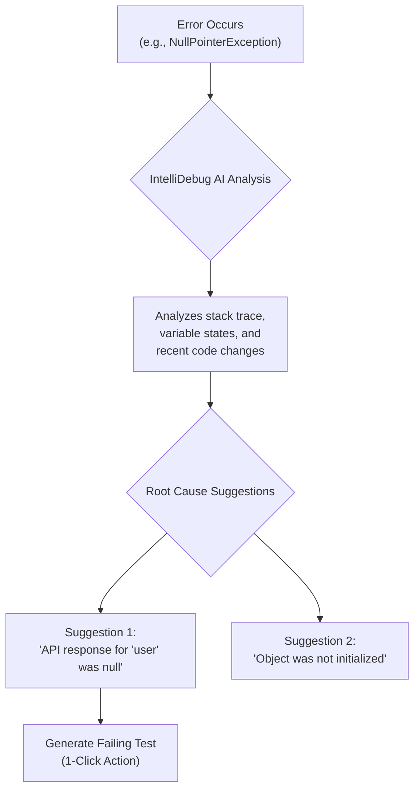

# VS Code's AI Extensions: Supercharging Developer Productivity

The year is 2026, and the line between a developer and their IDE has blurred into a seamless, collaborative partnership. The AI extensions integrated into Visual Studio Code are no longer mere autocompleters; they are sophisticated partners that understand context, anticipate needs, and actively participate in the entire software development lifecycle. For modern developers, mastering these tools is as fundamental as understanding Git.

This article explores the essential AI extensions that define developer productivity today. We'll move beyond the basics and dive into the advanced capabilities that separate a good workflow from a great one.

### What You'll Get

*   An overview of the top-tier AI extensions for VS Code in 2026.
*   A deep dive into advanced, context-aware code generation.
*   Insights into AI-powered debugging and proactive error detection.
*   Strategies for architectural refactoring with AI assistance.
*   Actionable tips to maximize your efficiency with these tools.

---

## The Evolution from Autocomplete to AI Partner

Just a few years ago, AI in the IDE meant generating a function or completing a line of code. While useful, it was a reactive process. The paradigm has shifted dramatically. Today's AI tools are *proactive* and *context-aware*. They have a deep understanding of your entire codebase, your team's coding standards, and even the intent behind your open Jira tickets.

This evolution has transformed the developer's role from a pure "coder" to an "AI director"—guiding, reviewing, and orchestrating the output of multiple intelligent agents to build robust, high-quality software at an unprecedented pace.

## The Indispensable AI Toolkit for 2026

To stay competitive, developers now rely on a suite of specialized AI extensions. While many exist, three have become the cornerstone of the modern development workflow.

### GitHub Copilot Enterprise: The Context-Aware Coder

GitHub Copilot has matured from a single-file suggestion engine into a full-fledged development partner. The Enterprise version operates with "workspace awareness," meaning its suggestions are informed by your entire project repository, not just the file you have open.

**Key Capabilities:**
*   **Full Repository Context:** Generates code that is consistent with existing patterns, data models, and utility functions across your entire project.
*   **Issue Tracker Integration:** Can read an assigned ticket from Jira or GitHub Issues and draft a scaffold for the required changes, including new files, functions, and tests.
*   **CI/CD Awareness:** Proactively suggests modifications to your `Dockerfile` or `github-actions.yml` files when you add new dependencies or services.

Consider this prompt to generate a new React component that hooks into an existing Redux Toolkit store:

```javascript
// Prompt for Copilot Enterprise Chat:
// @workspace /src/state/store.ts
// Create a new React component named 'UserProfile.tsx'.
// It should connect to the Redux store and display the 'user.name'
// and 'user.email' from the 'userSlice'.
// It should also have a button that dispatches the 'logoutUser' action
// from 'userSlice'. Ensure it follows our project's styling conventions
// found in /src/styles/components.
```

The AI doesn't just generate a generic component; it generates one that is perfectly integrated into your existing state management and styling architecture.

| Pros | Cons |
| :--- | :--- |
| Dramatically reduces boilerplate | Can be resource-intensive on very large projects |
| Enforces code consistency | May require careful prompt engineering for complex tasks |
| Accelerates onboarding for new devs | Subscription cost can be a factor for individuals |

### IntelliDebug AI: The Proactive Bug Hunter

Debugging has shifted from a reactive hunt for errors to a proactive process of prevention. IntelliDebug AI, and tools like it, integrate deeply with the VS Code debugger to provide insights that were previously impossible to get.

Instead of just pausing on a breakpoint, this extension analyzes runtime behavior, memory allocation, and async operations to predict potential issues *before* they cause a crash.

**How it works:**
*   **Stack Trace Analysis:** When an error occurs, it doesn't just show the call stack. It provides a natural language explanation of the likely root cause.
*   **Predictive Analysis:** It can detect potential race conditions in concurrent code or memory leaks in long-running applications by observing patterns during a debug session.
*   **Automated Test Generation:** Given a bug, it can automatically generate a failing unit test that reproduces the error, which you can then use for Test-Driven Development (TDD) of the fix.

Here is a simplified flow of how IntelliDebug AI assists a developer:



### RefactorGPT: The AI-Powered Architect

Technical debt is the silent killer of project velocity. RefactorGPT acts as an automated architect, continuously scanning your codebase for "code smells," anti-patterns, and opportunities for improvement.

This goes far beyond simple "extract method" refactoring. It understands high-level software design principles and can suggest significant architectural changes to improve maintainability and performance.

> **Info**
> The goal of an AI refactoring tool isn't to replace architectural decisions, but to handle the 80% of tedious, pattern-based cleanup, freeing up senior engineers to focus on the 20% of truly complex design challenges.

**Common Refactoring Suggestions:**
*   Identifying God objects or monolithic functions and suggesting decomposition into smaller, single-responsibility modules.
*   Recommending the application of design patterns (e.g., "This chain of `if/else` statements could be replaced with a Strategy pattern").
*   Detecting tightly coupled modules and suggesting the use of interfaces or dependency injection to decouple them.
*   Upgrading deprecated API usage across the entire codebase in a single, intelligent operation.

---

## Maximizing Your AI-Assisted Workflow

Simply installing these extensions is not enough. To get the most out of them, you must adapt your workflow.

### ### Crafting Effective Prompts

Treat your AI chat as a junior developer. The more context you provide, the better the result.
*   **Be Specific:** Don't just say "write a function." Say "write a Python function using FastAPI that accepts a POST request with a 'username' and 'password', validates them against a mock database, and returns a JWT token."
*   **Provide Context:** Use `@workspace` or paste snippets of relevant existing code to guide the AI's output.
*   **Iterate:** Your first prompt might not be perfect. Refine your request based on the AI's output.

### ### Trust but Verify

AI-generated code is a powerful first draft, not a finished product.
*   **Always Review:** Scrutinize every line of code for logic errors, security vulnerabilities, and performance issues.
*   **Understand, Don't Copy-Paste:** Ensure you fully understand the code you are committing. If you don't, ask the AI to explain it.
*   **Own Your Code:** Ultimately, you are responsible for the code that gets shipped, regardless of its origin.

### ### Customize AI Behavior

Most modern AI tools allow for project-specific customization. Spend time creating a `.ai-config.json` (or equivalent) file in your project root to fine-tune the AI's behavior. You can specify your preferred language version, linting rules, and architectural patterns, ensuring its suggestions are always aligned with your team's standards.

## Final Thoughts

The integration of advanced, context-aware AI into VS Code has fundamentally reshaped the development landscape. These tools reduce cognitive load by automating tedious tasks, improve code quality by identifying issues proactively, and accelerate development cycles by providing intelligent, project-aware assistance.

The most effective developers in 2026 are not those who can write code the fastest, but those who can most effectively leverage these AI partners to architect, build, and maintain high-quality software.

Now, I want to hear from you. What are your must-have AI extensions in VS Code? Share your thoughts and favorite tools in the comments below


## Further Reading

- [https://code.visualstudio.com/docs/editor/ai-code-generation](https://code.visualstudio.com/docs/editor/ai-code-generation)
- [https://github.com/features/copilot](https://github.com/features/copilot)
- [https://marketplace.visualstudio.com/search?target=VSCode&category=AI](https://marketplace.visualstudio.com/search?target=VSCode&category=AI)
- [https://devblogs.microsoft.com/vscode/ai-powered-workflow-2026](https://devblogs.microsoft.com/vscode/ai-powered-workflow-2026)
- [https://developer.com/vscode-ai-extensions-guide](https://developer.com/vscode-ai-extensions-guide)
