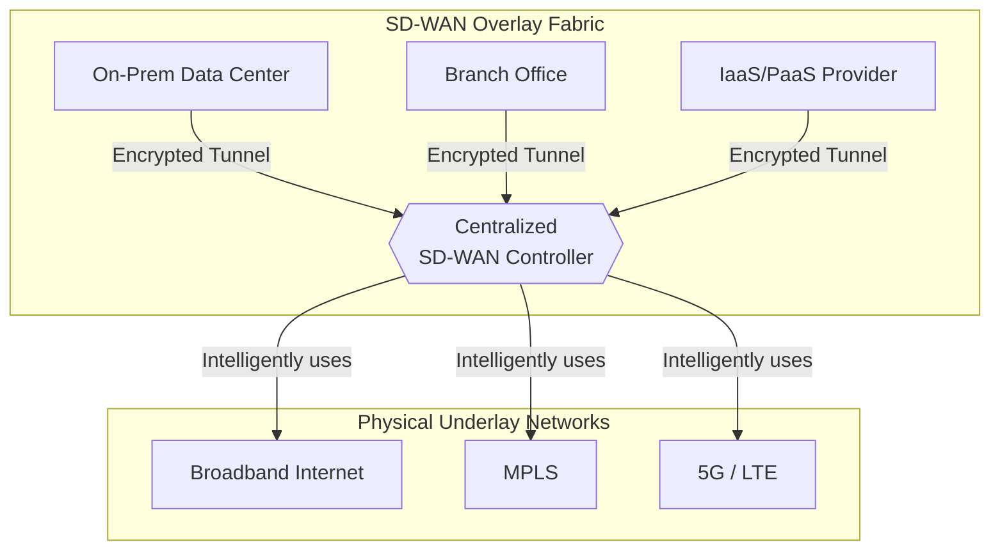
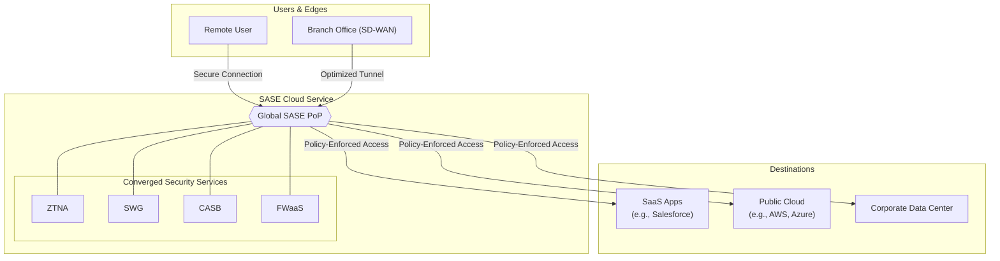

# Mastering Hybrid Cloud Networking with SD-WAN & SASE

The year is 2026. Hybrid cloud is no longer a strategy; it's the default operational model for most enterprises. Your applications and data are distributed across private data centers, multiple public clouds, and countless SaaS platforms. But as your infrastructure has become more agile, has your network kept pace? For many, the answer is a resounding *no*. Traditional networking models create bottlenecks, security gaps, and operational complexity in this new world.

This is where the powerful combination of Software-Defined Wide Area Networking (SD-WAN) and Secure Access Service Edge (SASE) comes in. These aren't just buzzwords; they represent a fundamental shift in how we build and secure networks for the cloud era.

What are your biggest hybrid cloud networking challenges today? Let's explore how to solve them.

### What You'll Get

In this article, you'll gain a practitioner's understanding of modern hybrid networking. We will cover:

*   **The Core Challenges:** Why traditional networks fail in hybrid and multi-cloud environments.
*   **SD-WAN as the Foundation:** How SD-WAN provides an agile and resilient connectivity fabric.
*   **SASE for Unified Security:** How SASE converges networking and security into a single cloud-native service.
*   **Architectural Best Practices:** Actionable strategies for designing a future-proof network.
*   **Common Pitfalls:** Critical mistakes to avoid during your implementation journey.

***

## The Hybrid Cloud Conundrum

The traditional "castle-and-moat" network architecture, where all traffic is backhauled to a central data center for security inspection, is broken. In a hybrid world, this model introduces significant problems:

*   **Performance Bottlenecks:** Routing cloud-destined traffic from a branch office back to a central data center only to send it out to the internet (a practice known as "hairpinning") introduces crippling latency.
*   **Increased Attack Surface:** Direct-to-internet access from branch offices and remote users creates new entry points for threats that bypass centralized security stacks.
*   **Operational Complexity:** Managing disparate network and security policies across on-premises hardware, virtual appliances in IaaS, and various cloud provider consoles is a nightmare. It's slow, error-prone, and expensive.
*   **Poor User Experience:** Remote and mobile users suffer from slow application performance when forced to connect through a corporate VPN, which was never designed for a cloud-first world.

## SD-WAN: The Foundation for Hybrid Connectivity

SD-WAN is the first step in modernizing your network. It decouples the network control plane from the data plane, creating a virtual overlay that abstracts the underlying physical transport links (like MPLS, broadband internet, and 5G).

### How SD-WAN Solves Connectivity Challenges

Instead of relying on rigid, expensive MPLS circuits, SD-WAN intelligently uses any and all available connections.

*   **Transport Agnostic:** It bonds multiple link types (e.g., MPLS + Broadband) into a single, logical, high-performance pipe.
*   **Dynamic Path Selection:** SD-WAN controllers continuously monitor the health of all paths. If a link experiences high latency or packet loss, traffic is automatically and seamlessly steered to a better-performing path, ensuring application uptime.
*   **Centralized Management:** You can configure and deploy network policies across hundreds or thousands of sites from a single dashboard, dramatically reducing manual effort and misconfigurations.
*   **Direct Cloud On-Ramp:** It enables optimized, direct connectivity from branches to cloud applications, eliminating the latency-inducing backhaul.

This architecture provides the agile and resilient transport layer needed for any modern hybrid enterprise.



> **Pro Tip:** When choosing an SD-WAN solution, look for robust integrations with major cloud providers (like AWS Cloud WAN or Azure Virtual WAN) for seamless middle-mile optimization.

***

## Enter SASE: Unifying Networking and Security

While SD-WAN solves the connectivity problem, SASE addresses the security challenge. Defined by [Gartner](https://www.gartner.com/sase), SASE is the architectural convergence of network services (SD-WAN) and network security services into a single, cloud-delivered service model.

### SASE Architecture in a Hybrid World

Think of SASE not as a single box, but as a global fabric of Points of Presence (PoPs). Traffic from any user, device, or location is directed to the nearest SASE PoP, where a full stack of security services is applied *before* the traffic is sent to its final destination.

Key security functions converged in a SASE model include:

*   **Zero Trust Network Access (ZTNA):** Replaces traditional VPNs with a modern identity-aware access model. "Never trust, always verify."
*   **Secure Web Gateway (SWG):** Protects users from web-based threats.
*   **Cloud Access Security Broker (CASB):** Provides visibility and control over SaaS applications.
*   **Firewall as a Service (FWaaS):** Delivers next-generation firewall capabilities from the cloud.



This model ensures that consistent, robust security policies are applied to all traffic, regardless of its origin or destination.

## Architectural Best Practices for 2026

Deploying SD-WAN and SASE effectively requires a strategic approach. Here are the best practices for building a network that will serve you well into the future.

### Embrace a Zero Trust Mindset

ZTNA is a core tenant of SASE. Ditch the outdated VPN model that grants broad network access. Instead, implement policies that grant access to specific applications based on user identity, device posture, and context. This drastically reduces your attack surface.

### Optimize Cloud On-Ramps

Don't just connect to the cloud; connect *intelligently*. Use an SD-WAN/SASE vendor with a strong global network of PoPs that are peered directly with major IaaS and SaaS providers. This minimizes reliance on the unpredictable public internet for the critical "middle mile."

### Automate and Orchestrate Everything

Your network and security policies should be managed as code. Use a platform with robust APIs to integrate with your CI/CD pipelines and IaC tools like Terraform or Ansible. This enables you to deploy consistent policies across your entire hybrid environment with speed and accuracy.

```terraform
# Conceptual Terraform for a SASE security rule
resource "sase_security_rule" "block_risky_apps" {
  name        = "Block-High-Risk-SaaS"
  source      = "any"
  destination = "any"
  application = ["bittorrent", "tor", "proxy-avoidance"]
  action      = "deny"
  description = "Block access to unauthorized and high-risk applications for all users."
  enabled     = true
}
```

### Comparing the Old vs. the New

| Feature | Traditional WAN | SD-WAN + SASE |
| :--- | :--- | :--- |
| **Agility** | Low (Months for changes) | High (Minutes for changes) |
| **Security** | Siloed, appliance-based | Converged, cloud-delivered, ZTNA |
| **Cost** | High (Expensive MPLS) | Optimized (Uses commodity internet) |
| **Performance** | Poor for cloud apps | Optimized for all traffic |
| **Visibility** | Fragmented | Centralized and unified |

## Common Pitfalls to Avoid

The path to a modern network has its challenges. Watch out for these common missteps:

1.  **Ignoring the Underlay:** SD-WAN is an *overlay*. It cannot fix a fundamentally unreliable underlay network. Invest in quality, diverse internet circuits at your key locations.
2.  **The "Single Vendor" Trap:** SASE is a framework, not a single product. While integrated platforms from a single vendor like [Palo Alto Networks](https://www.paloaltonetworks.com/sase) or [Fortinet](https://www.fortinet.com/products/sd-wan) offer simplicity, be wary of solutions that are just a bundle of loosely-coupled legacy products. Look for a truly converged, cloud-native architecture.
3.  **Underestimating the Cultural Shift:** SASE breaks down the traditional silos between networking and security teams. Plan for this organizational change. Success requires collaboration, shared goals, and unified operational processes.

## Conclusion: Building the Network for Tomorrow

The complexities of hybrid and multi-cloud environments demand a new approach to networking and security. The legacy model of backhauling traffic to a centralized data center is no longer viable.

By leveraging **SD-WAN** as the agile and resilient connectivity foundation and layering on a **SASE** architecture for unified, cloud-delivered security, you can build a network that is performant, secure, and ready for the future. This converged approach provides the visibility and control needed to connect and protect any user, on any device, to any application, anywhere.


## Further Reading

- [https://gartner.com/en/articles/sase-primer](https://gartner.com/en/articles/sase-primer)
- [https://cisco.com/go/sdwan](https://cisco.com/go/sdwan)
- [https://paloaltonetworks.com/sase](https://paloaltonetworks.com/sase)
- [https://techtarget.com/searchnetworking/hybrid-cloud-networking-best-practices](https://techtarget.com/searchnetworking/hybrid-cloud-networking-best-practices)
- [https://www.fortinet.com/products/sd-wan](https://www.fortinet.com/products/sd-wan)
