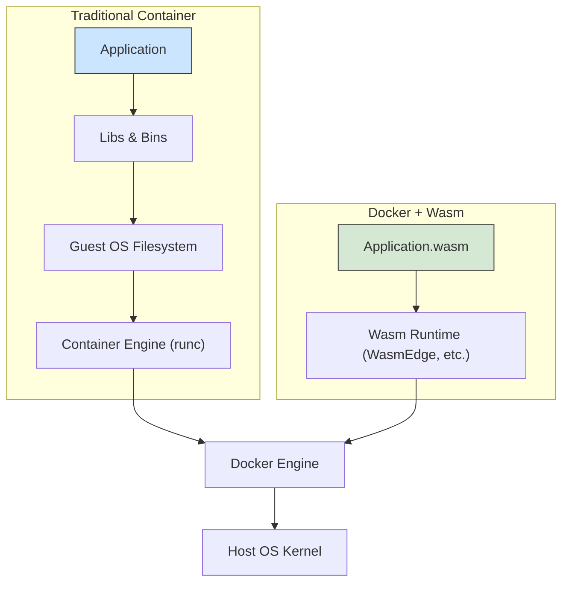

# Docker in 2026: Beyond Containers with WebAssembly Integration

For over a decade, Docker has been the undisputed standard for containerization, revolutionizing how we build, ship, and run applications. But the technology landscape never stands still. As we look towards 2026, a powerful new paradigm is emerging from within Docker itself: the deep integration of WebAssembly (Wasm).

This isn't about replacing containers. It's about augmenting them. Docker is evolving to become a universal application runtime, capable of managing both traditional OS-level containers and a new breed of lighter, faster, and more secure Wasm modules. This shift unlocks new possibilities for edge computing, serverless architectures, and beyond.

### What You'll Get

In this article, we'll dive deep into this evolution. You'll get:

*   **A Clear Picture:** Understand why Wasm is the next logical step for Docker.
*   **Architectural Insight:** See how the Docker+Wasm model differs from traditional containers with a clear diagram.
*   **Code Examples:** Look at what a Wasm-based `Dockerfile` and `run` command will look like.
*   **Key Benefits:** Explore the advantages in speed, size, security, and portability.
*   **Future Use Cases:** Discover how this integration is poised to transform edge, serverless, and plugin architectures.

---

## The "Why": Moving Beyond OS-Level Virtualization

Traditional Docker containers are fantastic. They package an application with all its dependencies, libraries, and configuration files, virtualizing the operating system. This provides consistency across environments.

However, this model has inherent overhead:
*   **Size:** Container images often bundle a complete guest OS filesystem, leading to images that can be hundreds of megabytes or even gigabytes.
*   **Cold Starts:** Launching a container involves initializing an OS-level process namespace, which can introduce latency—a critical factor in auto-scaling and serverless scenarios.
*   **Security Surface:** Every file and library in the container's OS is a potential security vulnerability. Securing a minimal Linux distribution is still a significant task.

WebAssembly offers a compelling solution to these challenges by abstracting the application away from the operating system itself.

## Enter WebAssembly: A Quick Primer

If you're new to it, think of WebAssembly as a portable compilation target for programming languages. It's a binary instruction format for a stack-based virtual machine.

Key characteristics include:
*   **Sandboxed by Default:** Wasm modules run in a completely isolated memory sandbox. They can't access files, networks, or system resources unless explicitly granted permission.
*   **Near-Native Performance:** Wasm is designed to be decoded and executed at high speed, often approaching the performance of native-compiled code.
*   **Polyglot:** You can compile languages like Rust, Go, C++, C#, and Python to a single `.wasm` binary.
*   **Portable:** The same `.wasm` file can run on any compliant Wasm runtime, regardless of the underlying CPU architecture (e.g., x86, ARM) or operating system.

> **Info Block:** The [WebAssembly System Interface (WASI)](https://wasi.dev/) is a crucial standard that defines how Wasm modules interact with the outside world (like filesystems and sockets) in a secure, capability-based manner. This is what makes Wasm viable on the server side.

## The Docker + Wasm Integration

By 2026, Docker's integration with Wasm is expected to be mature. The core idea is to use Wasm runtimes (like `WasmEdge` or `wasmtime`) as an alternative execution engine alongside the standard OCI runtime (`runc`). This allows the Docker Engine to run Wasm modules as seamlessly as it runs containers today.

### Architectural Shift

The difference in the execution stack is profound. A traditional container introduces an OS virtualization layer, whereas a Wasm module runs directly within the sandboxed runtime.



This streamlined architecture is the source of Wasm's efficiency within the Docker ecosystem.

### What the Code Looks Like

Imagine you have a simple web service written in Rust. Compiling it to a Wasm target is the first step.

```rust
// A simple Rust function compiled to wasm32-wasi
#[no_mangle]
pub extern "C" fn handle_request() {
    println!("Hello from a Wasm module managed by Docker!");
    // Business logic here...
}
```

Building a Docker image for this Wasm module would be incredibly simple. The `Dockerfile` would no longer need a `FROM ubuntu` or `FROM alpine` base image.

```dockerfile
# Dockerfile for a Wasm module
FROM scratch
COPY app.wasm /app.wasm
ENTRYPOINT ["app.wasm"]
```

Running it would feel familiar, potentially using a new flag or relying on image metadata to select the Wasm runtime.

```bash
# The 'wasm' runtime is selected automatically or via a flag
docker run --rm my-wasm-app:latest
```

This command would instruct Docker to use a Wasm runtime to execute `app.wasm` directly, bypassing the need to spin up a Linux container.

## Key Advantages of the Wasm Paradigm

This integration delivers powerful, tangible benefits for developers and operators.

### 1. Unprecedented Speed and Size

Wasm modules are incredibly lightweight. A compiled binary can be a few hundred kilobytes instead of hundreds of megabytes for a container image. This translates to:
*   **Near-Instantaneous Startups:** Cold starts measured in milliseconds, not seconds.
*   **Reduced Storage Costs:** Smaller image sizes mean less registry storage and faster pulls.
*   **Higher Density:** More workloads can run on a single host due to the minimal resource footprint.

### 2. A Fortress of Security

The Wasm security model is a game-changer.
*   **Default Deny:** Modules have zero capabilities by default. Access to files, network sockets, or even environment variables must be explicitly granted by the host runtime.
*   **Reduced Attack Surface:** No guest OS means no shell, no package manager, and no user accounts to exploit. The attack surface is dramatically smaller.

### 3. True "Build Once, Run Anywhere" Portability

While container images are portable across Linux hosts, they are still tied to a specific CPU architecture (like `amd64` or `arm64`). Wasm modules take portability a step further.

A single `app.wasm` artifact can be executed by Docker on:
*   An x86-64 server in the cloud.
*   An ARM-based Raspberry Pi at the edge.
*   A developer's M-series Mac laptop.

...all without rebuilding the image.

## Emerging Use Cases in 2026

The combination of Docker's orchestration capabilities and Wasm's efficiency unlocks powerful new patterns.

| Use Case | Why Docker + Wasm is a Perfect Fit |
| :--- | :--- |
| **Edge Computing** | Tiny footprint and fast startups are ideal for resource-constrained IoT devices and edge gateways. |
| **Serverless/FaaS** | Eliminates the cold start problem, enabling cheaper, faster, and more secure functions. |
| **SaaS Plugins** | Safely execute untrusted third-party code (e.g., a user-submitted data transformation script) in a multi-tenant environment. |
| **Microservices** | For services that don't need a full OS, Wasm provides a hyper-efficient alternative to traditional micro-containers. |

---

## Challenges and the Road Ahead

The path to 2026 is one of rapid development, but challenges remain. The Wasm/WASI ecosystem is still maturing in areas like:
*   **Debugging and Tooling:** Tooling for debugging and observing Wasm modules is not yet as mature as for traditional applications.
*   **Complex System Access:** While WASI provides a solid foundation, direct and complex interactions with host OS features are still evolving.
*   **Developer Experience:** Compiling to Wasm can introduce new complexities into the build process for developers new to the ecosystem.

Despite these hurdles, the momentum is undeniable. Projects like the [Bytecode Alliance](https://bytecodealliance.org/) and the growing support within the [CNCF](https://www.cncf.io/) are rapidly closing these gaps.

## Final Thoughts

The integration of WebAssembly doesn't signal the end of containers. Instead, it represents a powerful expansion of Docker's mission: to simplify application delivery. By 2026, Docker will be a versatile platform where you can seamlessly run the right workload in the right runtime.

You'll choose a traditional container when you need a full Linux environment and broad compatibility. You'll choose a Wasm module when you need unparalleled speed, security, and portability. This flexibility will empower developers to build the next generation of distributed applications more efficiently than ever before.

What are your thoughts? Have you started experimenting with Wasm on the server side? Share your experiences and predictions in the comments below


## Further Reading

- [https://www.docker.com/blog/docker-wasm-integration-2026](https://www.docker.com/blog/docker-wasm-integration-2026)
- [https://wasmcloud.com/blog/docker-and-wasm-future](https://wasmcloud.com/blog/docker-and-wasm-future)
- [https://infoq.com/articles/docker-webassembly-beyond](https://infoq.com/articles/docker-webassembly-beyond)
- [https://docs.docker.com/get-started/overview](https://docs.docker.com/get-started/overview)
- [https://www.cncf.io/webassembly-edge-computing](https://www.cncf.io/webassembly-edge-computing)
