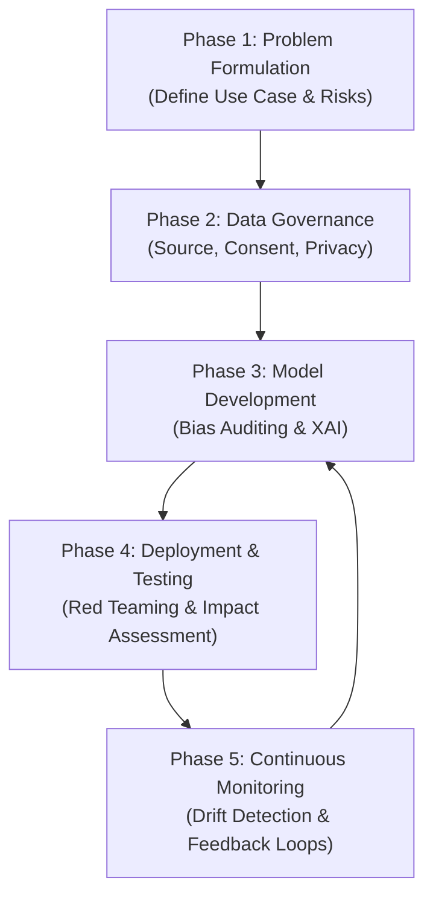

# Ethical AI in Practice: Building Trustworthy Systems in 2026

By 2026, Artificial Intelligence is no longer a futuristic concept; it's a foundational technology integrated into our daily operations, from automated financial auditing to personalized healthcare. The conversation has decisively shifted from "Can we build it?" to "How do we build it *right*?". Public trust is now the most valuable currency in the AI economy, and earning it requires a demonstrable commitment to ethical principles.

This article is a practical guide for developers, data scientists, and product leaders navigating the complex but essential landscape of ethical AI. We'll move beyond abstract principles and dive into the tools, frameworks, and processes required to build systems that are fair, transparent, and accountable.

### What You'll Get

*   A clear breakdown of the four essential pillars of trustworthy AI.
*   A practical, phased lifecycle for integrating ethics into your development process.
*   An overview of key tools and techniques like XAI and differential privacy.
*   Actionable insights on navigating the 2026 regulatory environment, including the EU AI Act.

## The Four Pillars of Trustworthy AI

Ethical AI isn't a single feature but an emergent property of a system built on a foundation of core principles. Neglecting any one of these pillars undermines the entire structure.

### Fairness: Mitigating Bias

Fairness ensures that an AI system's outcomes do not create or reinforce unjust, prejudiced, or discriminatory impacts on individuals or groups, particularly those in protected categories.

*   **The Problem:** Biased training data is the primary culprit. If historical data reflects societal biases (e.g., loan application data showing gender or racial disparities), the model will learn and amplify them.
*   **In Practice:** A model designed for hiring that was trained predominantly on resumes from one demographic might unfairly penalize qualified candidates from another.
*   **The Goal:** Achieve *group fairness* (e.g., similar loan approval rates across demographics) and *individual fairness* (similar individuals receive similar outcomes).

### Transparency: The "Why" Behind the "What"

Transparency is the ability to understand and interpret a model's decision-making process. If you can't explain how your AI reached a conclusion, you can't trust it, audit it, or fix it when it's wrong.

*   **The Problem:** Complex models like deep neural networks often operate as "black boxes," making their internal logic opaque.
*   **In Practice:** A doctor needs to know *why* an AI model flagged a medical scan as potentially cancerous, not just the final prediction. This context is critical for an accurate diagnosis.
*   **The Goal:** Provide stakeholders—from developers to end-users—with clear, understandable explanations of AI-driven outcomes.

### Accountability: Who is Responsible?

Accountability establishes clear lines of responsibility for the outcomes of an AI system. When things go wrong—and they will—there must be a framework for remedy, recourse, and governance.

*   **The Problem:** The distributed nature of AI development (data providers, model developers, operators) can diffuse responsibility.
*   **In Practice:** If an autonomous vehicle causes an accident, who is accountable? The owner, the manufacturer, the software developer, or the fleet operator?
*   **The Goal:** Implement robust governance, logging, and audit trails to trace decisions and assign responsibility, ensuring humans remain in control.

### Privacy: Data with Dignity

Privacy in AI means respecting user data rights throughout the system's lifecycle, from data collection and training to inference and data deletion.

*   **The Problem:** AI models, especially large language models (LLMs), can inadvertently memorize and expose sensitive personally identifiable information (PII) from their training data.
*   **In Practice:** A customer service chatbot trained on real support chats could leak a user's address or credit card details in a response.
*   **The Goal:** Employ privacy-preserving techniques and data minimization to protect individuals and comply with regulations like GDPR.

## From Theory to Practice: The Ethical AI Development Lifecycle

Integrating ethics isn't a final "check-box" step. It must be woven into every phase of the development lifecycle.



### Phase 1: Problem Formulation & Data Governance

Before writing a single line of code, assess the potential societal impact.
*   **Action Items:**
    *   Conduct an *Ethical Risk Assessment*. Is the intended use case prone to discriminatory outcomes? (e.g., sentencing, hiring, credit scoring).
    *   Define fairness metrics *before* development begins.
    *   Ensure data collection practices are transparent, consensual, and compliant with privacy laws.

### Phase 2: Model Development & Bias Detection

This is where you actively measure and mitigate bias using specialized tools.
*   **Action Items:**
    *   Use toolkits like [Microsoft's Fairlearn](https://fairlearn.org/) or [IBM's AI Fairness 360](https://aif360.mybluemix.net/) to quantify bias in your dataset and model predictions.
    *   Apply mitigation algorithms, which can pre-process data, modify the training algorithm, or post-process model outputs.
    *   Integrate explainability libraries from the start.

### Phase 3: Deployment & Monitoring

The real world is the ultimate test. A model that's fair in the lab can drift and become unfair in production.
*   **Action Items:**
    *   Implement robust logging of model inputs and outputs.
    *   Establish a feedback mechanism for users to challenge or question AI-driven decisions.
    *   Continuously monitor for performance degradation and fairness metric drift.

## Essential Tools and Techniques in 2026

Building ethical AI requires a modern toolkit. Here are some of the most critical techniques practitioners are using today.

| Technique | Primary Goal | Example Tools / Libraries |
| :--- | :--- | :--- |
| **Explainable AI (XAI)** | Transparency | SHAP, LIME, Captum |
| **Bias & Fairness Auditing** | Fairness | Fairlearn, AI Fairness 360, What-If Tool |
| **Privacy-Preserving ML** | Privacy | TensorFlow Privacy, Opacus (PyTorch) |
| **Model Cards & Datasheets** | Accountability | [Model Card Toolkit](https://modelcards.withgoogle.com/about) |

### Explainable AI (XAI)

XAI methods help you understand which features most influenced a model's prediction. **SHAP (SHapley Additive exPlanations)** is a leading technique that uses game theory to explain the output of any machine learning model.

```python
import shap
import sklearn

# Train a simple model (e.g., a classifier)
model = sklearn.ensemble.RandomForestClassifier()
model.fit(X_train, y_train)

# Create an explainer object
explainer = shap.TreeExplainer(model)

# Calculate SHAP values for a single prediction
# This shows how each feature contributed to the final decision
shap_values = explainer.shap_values(X_test.iloc[0,:])

# Visualize the explanation
shap.initjs()
shap.force_plot(explainer.expected_value[1], shap_values[1], X_test.iloc[0,:])
```

### Privacy-Preserving Techniques

*   **Differential Privacy:** A formal mathematical framework for adding statistical noise to data or queries. This allows you to learn aggregate patterns from a dataset without revealing information about any single individual.
*   **Federated Learning:** A decentralized training approach where the model is trained on end-user devices (e.g., mobile phones) without the raw data ever leaving the device. Only aggregated model updates are sent to a central server.

## The Regulatory Landscape: Navigating Compliance

By 2026, ad-hoc ethical guidelines are being replaced by binding regulations. The most significant of these is the **EU AI Act**.

> **Note:** The EU AI Act is not just a European concern. Its risk-based framework is becoming a global benchmark for AI governance, impacting any organization that deploys AI systems affecting EU citizens.

The Act categorizes AI systems based on risk:
1.  **Unacceptable Risk:** Banned systems (e.g., social scoring by governments).
2.  **High-Risk:** Systems requiring strict compliance, including risk management, data governance, and human oversight (e.g., AI in critical infrastructure, employment, or law enforcement).
3.  **Limited Risk:** Systems requiring transparency (e.g., chatbots must disclose they are AI).
4.  **Minimal Risk:** Most AI systems (e.g., spam filters, video games).

Compliance is no longer optional; it's a prerequisite for market access and public trust.

## Conclusion: Building the Future, Responsibly

Building trustworthy AI in 2026 is a continuous, iterative process, not a one-time audit. It demands a cultural shift within organizations, prioritizing ethical considerations alongside performance metrics. It requires equipping teams with the right tools, establishing robust governance, and embracing transparency as a core design principle.

By embedding fairness, transparency, accountability, and privacy into our development lifecycle, we move from simply creating powerful technology to building systems that deserve our trust.

What's the biggest ethical AI challenge your team is facing today? Share your thoughts in the comments below.


## Further Reading

- [https://ai.google/responsibility/our-principles](https://ai.google/responsibility/our-principles)
- [https://www.microsoft.com/en-us/ai/responsible-ai](https://www.microsoft.com/en-us/ai/responsible-ai)
- [https://research.ibm.com/artificial-intelligence/ethical-ai](https://research.ibm.com/artificial-intelligence/ethical-ai)
- [https://european-union.europa.eu/priorities-and-initiatives/artificial-intelligence-eu-approach_en](https://european-union.europa.eu/priorities-and-initiatives/artificial-intelligence-eu-approach_en)
- [https://medium.com/towards-data-science/ethical-ai-frameworks](https://medium.com/towards-data-science/ethical-ai-frameworks)
