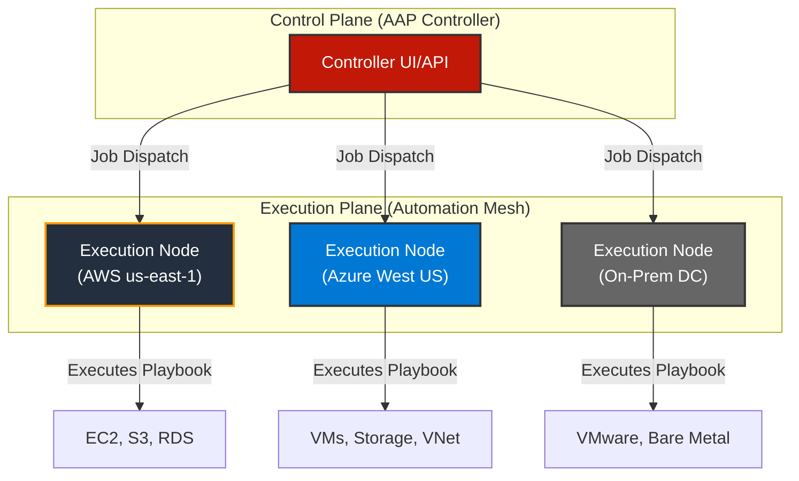

# Ansible Automation Platform 2.X: Scaling Operations Across Clouds

The modern IT landscape is no longer confined to a single data center. It's a sprawling, hybrid ecosystem spanning on-premises infrastructure, multiple public clouds, and edge locations. Managing this complexity with disparate scripts and manual processes is not just inefficient—it's unsustainable. This is where Ansible Automation Platform (AAP) 2.X steps in, evolving from a simple command-line tool into a strategic platform for enterprise-grade automation at scale.

This article dives into the core components of AAP 2.X that empower organizations to standardize and scale their IT operations, especially across complex multi-cloud environments like AWS and Azure.

### What You'll Get

*   **Core Concepts:** A clear breakdown of Execution Environments, Automation Mesh, and Content Collections.
*   **Architectural Insight:** A high-level view of how AAP orchestrates distributed automation.
*   **Practical Examples:** Concrete code snippets for automating AWS and Azure resources.
*   **Team Empowerment:** How AAP transforms workflows for DevOps and Platform Engineering teams.

---

## The Shift from Tool to Platform

Many of us started with Ansible Core, the powerful open-source CLI tool. It's fantastic for individual use cases and small teams. However, as automation needs grow, so do the challenges:

*   **Dependency Hell:** "It works on my machine" becomes a common refrain as different users have conflicting Python libraries or module versions.
*   **Credential Sprawl:** Securely managing keys and secrets across dozens of projects is a significant security risk.
*   **Lack of Governance:** Without a central point of control, it's difficult to enforce standards, track changes, or provide role-based access control (RBAC).

Ansible Automation Platform 2.X was architected specifically to solve these enterprise-level problems. It provides the control, security, and scalability required to make automation a reliable, centrally managed service.

## Core Pillars of Modern Automation

AAP 2.X is built on three foundational pillars that work in concert to deliver portable, scalable, and manageable automation.

### Execution Environments: Portable Automation Runtimes

Execution Environments (EEs) are the answer to dependency conflicts. An EE is a container image, built with `ansible-builder`, that packages everything needed for an automation job to run:

*   A specific version of Ansible Core.
*   Python libraries and other system dependencies.
*   Ansible Content Collections (modules, plugins, roles).

This means automation is no longer dependent on the underlying control node's configuration. It's self-contained and portable.

> **Info Block:** Think of Execution Environments as "automation-as-code." You define your runtime environment in a text file, build it, and push it to a container registry. Every job then pulls and uses this exact, immutable environment, guaranteeing consistency from development to production.

Here’s a simple `execution-environment.yml` file for `ansible-builder`:

```yaml
---
version: 1

build_arg_defaults:
  EE_BASE_IMAGE: 'quay.io/ansible/ansible-runner:latest'

ansible_config: 'ansible.cfg'

dependencies:
  galaxy: requirements.yml
  python: requirements.txt
```

In this file, you simply point to your standard `requirements.yml` for collections and `requirements.txt` for Python packages. `ansible-builder` handles the rest.

### Automation Mesh: Distributed, Scalable Execution

How do you run automation efficiently against resources in different cloud regions, firewalled data centers, or remote edge locations? The traditional approach of a single, monolithic Ansible Tower instance creates latency and security headaches.

Automation Mesh solves this with an elegant, overlay network of execution nodes.



**Key benefits of Automation Mesh:**

*   **Reduced Latency:** Jobs run on execution nodes geographically close to the target infrastructure.
*   **Improved Security:** Eliminates the need for extensive firewall rules pointing back to a central controller. Nodes initiate the connection outwards.
*   **High Availability:** The mesh can be designed with redundant nodes, ensuring automation continues even if one node goes offline.
*   **Scalability:** Easily add more execution capacity where you need it most.

### Content Collections: Curated, Reusable Automation

Ansible Content Collections are the standard for packaging and distributing automation content. Instead of a loose collection of roles and plugins in a Git repo, a Collection is a structured format that includes modules, roles, plugins, and documentation.

They are primarily distributed via [Ansible Galaxy](https://galaxy.ansible.com/) and the private, certified [Red Hat Automation Hub](https://www.redhat.com/en/technologies/management/ansible/automation-hub). This encourages reuse and sharing of high-quality, certified automation.

To use collections in your project, you define them in a `requirements.yml` file:

```yaml
---
collections:
  - name: amazon.aws
    version: "5.2.0"
  - name: azure.azcollection
    version: "1.11.0"
  - name: community.general
```

This simple declaration allows AAP to automatically pull the certified content needed for your multi-cloud playbooks.

## Bridging the Multi-Cloud Gap: AWS and Azure

With these building blocks, managing multi-cloud infrastructure becomes dramatically simpler. You use the *same Ansible workflow* and syntax, simply swapping out the relevant collections.

### Automating AWS Infrastructure

The `amazon.aws` collection provides hundreds of modules for managing nearly every AWS service.

**Example: Provisioning an EC2 Instance**

This playbook creates a new EC2 instance, demonstrating Ansible's declarative and *idempotent* nature. If the instance already exists with these specs, Ansible will make no changes.

```yaml
---
- name: Provision an EC2 Instance on AWS
  hosts: localhost
  connection: local
  gather_facts: false

  collections:
    - amazon.aws

  tasks:
    - name: Launch new EC2 instance
      amazon.aws.ec2_instance:
        name: "aap-demo-webserver"
        key_name: "my-aws-key"
        instance_type: "t3.micro"
        image_id: "ami-0c55b159cbfafe1f0" # Amazon Linux 2 AMI
        region: "us-east-1"
        security_group: "web-sg"
        tags:
          Environment: "Dev"
          Project: "AAP_Demo"
```

### Managing Azure Resources

Similarly, the `azure.azcollection` collection is your gateway to automating Microsoft Azure.

**Example: Creating an Azure Resource Group and VM**

This playbook first ensures a resource group exists and then deploys a virtual machine into it.

```yaml
---
- name: Provision a Virtual Machine on Azure
  hosts: localhost
  connection: local
  gather_facts: false

  collections:
    - azure.azcollection

  tasks:
    - name: Create a resource group
      azure.azcollection.azure_rm_resourcegroup:
        name: "AAP-Demo-RG"
        location: "westus2"

    - name: Create virtual machine
      azure.azcollection.azure_rm_virtualmachine:
        resource_group: "AAP-Demo-RG"
        name: "aap-demo-vm"
        vm_size: "Standard_B1s"
        admin_username: "ansibleadmin"
        ssh_password_enabled: false
        ssh_public_keys:
          - path: "/home/ansibleadmin/.ssh/authorized_keys"
            key_data: "ssh-rsa AAAA..."
        image:
          offer: "UbuntuServer"
          publisher: "Canonical"
          sku: "18.04-LTS"
          version: "latest"
```

The beauty is the consistency. An engineer doesn't need to be a deep expert in both cloud CLIs; they only need to understand the Ansible module parameters.

## Empowering DevOps and Platform Engineering

Ansible Automation Platform transforms automation from a siloed task into a collaborative, self-service capability. Platform Engineering teams can build a library of trusted, pre-approved automation (Job Templates) that DevOps and application teams can consume via an API or a simple UI.

| Challenge | Traditional Approach (Ansible Core) | Modern Approach (With AAP) |
| :--- | :--- | :--- |
| **Onboarding a New App** | Dev team files ticket; Ops engineer manually writes/runs a playbook. | Dev team uses a "New App" survey in AAP, which triggers a standard provisioning workflow. |
| **OS Patching** | Sysadmin runs a patching playbook from their laptop, hoping their environment is correct. | A scheduled Job Template runs from an EE, guaranteeing a consistent run and logging all output. |
| **Credential Management** | Secrets stored in encrypted files (`ansible-vault`), with keys shared among team members. | Credentials stored securely in AAP's vault, injected at runtime based on RBAC permissions. |
| **Auditing & Reporting**| Grepping through shell logs on a bastion host to see who ran what. | Centralized, detailed job logs for every automation run, searchable and filterable in the UI. |

This model fosters a true "automation as a service" culture, reducing toil for operations teams and accelerating delivery for developers.

## Final Thoughts

Ansible Automation Platform 2.X is a significant leap forward, providing the architecture needed to tame hybrid and multi-cloud complexity. By standardizing runtimes with **Execution Environments**, distributing workloads with **Automation Mesh**, and curating content with **Collections**, it provides a robust foundation for scaling automation safely and efficiently. It empowers teams to move faster, reduce errors, and focus on delivering value instead of fighting fires.

---

What are your go-to Ansible Collections or modules for cloud automation? Share your favorites in the comments below


## Further Reading

- [https://www.ansible.com/products/automation-platform](https://www.ansible.com/products/automation-platform)
- [https://docs.ansible.com/ansible-automation-platform/latest/html](https://docs.ansible.com/ansible-automation-platform/latest/html)
- [https://redhat.com/ansible-multi-cloud-automation](https://redhat.com/ansible-multi-cloud-automation)
- [https://awssolutions.com/ansible-aws-integration](https://awssolutions.com/ansible-aws-integration)
- [https://azuremarketplace.microsoft.com/en-us/marketplace/apps/redhat.ansible-platform](https://azuremarketplace.microsoft.com/en-us/marketplace/apps/redhat.ansible-platform)
