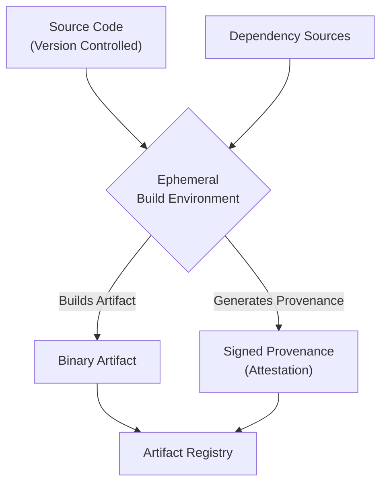

# Securing the Software Supply Chain: Lessons from 2025 Breaches

As we look back from the start of 2026, last year was a watershed moment for software supply chain security. The sophisticated, multi-stage breaches of 2025 were a stark reminder that our development pipelines are critical infrastructure and a prime target for attackers. These incidents moved beyond simple dependency confusion, exploiting trust in CI/CD systems, build tools, and even the code we generate.

The good news? The industry has learned. The defensive strategies that proved most effective are now becoming standard practice. This article distills the key lessons from 2025's attacks and provides an actionable blueprint for securing your software supply chain today.

### What You'll Get

*   **Post-Mortem Analysis:** A breakdown of the common attack vectors seen in 2025.
*   **Actionable Defenses:** Practical steps using SBOMs, SLSA, and code signing.
*   **Tooling & Frameworks:** Guidance on key standards like NIST SSDF and tools like Sigstore.
*   **Code & Diagrams:** Concrete examples and diagrams to illustrate core concepts.

---

## The 2025 Breach Landscape: A Post-Mortem

The attacks of 2025 weren't novel in concept, but in execution. Attackers demonstrated a deep understanding of the modern software development lifecycle (SDLC), targeting points of maximum leverage.

### The 'Trusted CI/CD' Compromise

Attackers shifted their focus from poisoning individual packages to compromising the build environment itself. By gaining access to CI/CD platforms—often through stolen credentials or vulnerable third-party plugins—they could inject malicious code *after* source control checks and *before* packaging.

*   **Mechanism:** Malicious scripts added to build pipelines.
*   **Impact:** Signed, seemingly legitimate artifacts containing backdoors were distributed to end-users.
*   **Lesson:** Source code integrity is not enough. You must also guarantee build process integrity.

### The 'Dependency Hijacking' Evolution

Typosquatting and dependency confusion attacks became more surgical. Instead of broad, noisy campaigns, attackers targeted specific, high-value private packages used by large enterprises. They would publish malicious packages with the same name to public repositories, tricking internal build systems into pulling the compromised version.

> **Key Takeaway:** If your build system can access both internal and public package repositories, you have an exploitable vulnerability. Explicitly scoping dependencies is no longer optional.

### The 'AI-Generated Malware' Infiltration

A concerning new vector emerged: the poisoning of AI-assisted coding tools. In one notable incident, a popular AI code completion model was subtly manipulated. Its suggestions began to include insecure code patterns and, in some cases, obfuscated malware. This was insidious because the malicious code was written by trusted developers, guided by a compromised tool.

---

## Actionable Defenses for 2026

Reacting to threats is not a strategy. Proactive, verifiable security is the only path forward. The most resilient organizations of 2025 had already adopted these core principles.

### Embrace Radical Transparency with SBOMs

A Software Bill of Materials (SBOM) is a complete, nested inventory of every component, library, and dependency in your software. It’s the ingredients list for your code. When a new vulnerability like Log4Shell appears, you don't have to guess where it is—you can just query your SBOMs.

*   **Standards:** Use industry-standard formats like [SPDX](https://spdx.dev/) or [CycloneDX](https://cyclonedx.org/).
*   **Generation:** Automate SBOM generation in your CI/CD pipeline.
*   **Tooling:** Tools like **Syft**, **Trivy**, and **CycloneDX CLI** can generate SBOMs from container images, file systems, and more.

Here's a small snippet of a CycloneDX JSON SBOM:

```json
{
  "bomFormat": "CycloneDX",
  "specVersion": "1.4",
  "serialNumber": "urn:uuid:3e671687-395b-41f5-a30f-a58921a69b79",
  "version": 1,
  "components": [
    {
      "type": "library",
      "name": "log4j-core",
      "version": "2.14.1",
      "purl": "pkg:maven/org.apache.logging.log4j/log4j-core@2.14.1"
    }
  ]
}
```

### Demand Verifiable Builds with SLSA

How can you prove your software artifact was built from the source code you intended, using a secure, tamper-proof process? That's the question [SLSA](https://slsa.dev/) (Supply-chain Levels for Software Artifacts) answers. SLSA is a security framework, a checklist of standards and controls to prevent tampering and improve integrity.

*   **SLSA 1:** Requires build process documentation and provenance.
*   **SLSA 2:** Requires version-controlled source and a hosted, tamper-resistant build service.
*   **SLSA 3:** Adds stronger guarantees against specific threats by using ephemeral build environments and cryptographic provenance.
*   **SLSA 4:** The highest level, requiring a two-person review of all changes and a hermetic, reproducible build.

A simplified SLSA Level 3 build flow ensures that the artifact's origin is non-falsifiable.



### Enforce Trust with Code Signing

Code signing has been around for decades, but modern tooling has made it frictionless. The goal is to create a verifiable, tamper-evident link between a software artifact and its source and build process.

The [Sigstore](https://www.sigstore.dev/) project is a game-changer here. It provides free, automated code signing and verification.

*   **Cosign:** A command-line tool to sign and verify container images and other artifacts.
*   **Fulcio:** A free code-signing Certificate Authority.
*   **Rekor:** A transparency log that records signing events, making them publicly auditable.

Signing an artifact is now a one-line command in your CI pipeline:

```bash
# Signs a container image and stores the signature in the OCI registry
cosign sign your-registry/your-image:tag
```

This simple step creates a cryptographic attestation that can be automatically verified by downstream systems, like a Kubernetes admission controller, before deployment.

---

## Frameworks and Standards to Guide You

You don't have to invent this from scratch. Lean on established frameworks to structure your security program.

| Framework / Standard     | Primary Focus                                             | Best For                                                               |
| ------------------------ | --------------------------------------------------------- | ---------------------------------------------------------------------- |
| **NIST SSDF**            | A comprehensive set of secure software development practices. | Organizations building a mature, holistic AppSec program.              |
| **SLSA**                 | Securing the build and release pipeline against tampering.    | Engineering teams focused on artifact integrity and provenance.        |
| **OpenSSF Scorecards**   | Automated security health checks for open-source projects.  | Evaluating the security posture of your third-party dependencies.      |
| **SBOM (SPDX/CycloneDX)** | Describing the components within a piece of software.       | Vulnerability management and license compliance at scale.              |

For a comprehensive guide, the [NIST Secure Software Development Framework (SSDF)](https://csrc.nist.gov/Projects/ssdf) provides a fantastic, high-level structure for integrating security into your entire SDLC.

## The Path Forward

The breaches of 2025 proved that the software supply chain is a primary battleground. Treating it as an afterthought is no longer an option. Security must be an inherent property of the development process, not a feature bolted on at the end.

By automating the generation of SBOMs, demanding verifiable build provenance with SLSA, and enforcing artifact integrity with modern code signing, you can build a resilient defense that addresses the threats of today and tomorrow.

What is your team's biggest software supply chain security concern for 2026? Share your thoughts in the comments below.


## Further Reading

- [https://www.cisa.gov/resources/securing-software-supply-chain](https://www.cisa.gov/resources/securing-software-supply-chain)
- [https://slsa.dev/spec/v0.1/what-is-slsa](https://slsa.dev/spec/v0.1/what-is-slsa)
- [https://www.linuxfoundation.org/supply-chain-security](https://www.linuxfoundation.org/supply-chain-security)
- [https://www.nist.gov/cyberframework/supply-chain](https://www.nist.gov/cyberframework/supply-chain)
- [https://snyk.io/learn/software-supply-chain-security/](https://snyk.io/learn/software-supply-chain-security/)
