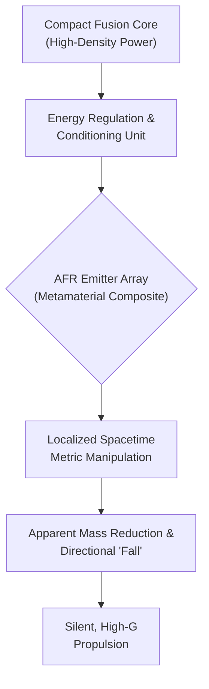

# The Quantum Leap: Antigravity Propulsion in Commercial Aviation?

For over a century, commercial aviation has been a story of refining a single principle: Newtonian action-reaction. We burn fuel, expel mass at high velocity, and push massive metal tubes through the sky. But what if the next leap forward isn't about better turbines, but about rewriting the rules of propulsion itself? This isn't science fiction; it's a speculative look into nascent, high-risk research that could, against all odds, redefine flight by the end of this decade.

Recent (and still largely theoretical) whispers from quantum physics labs suggest potential breakthroughs in manipulating the very fabric of spacetime. While "antigravity" is a loaded term, the concept of localized gravitational field manipulation is moving from chalkboards to computational models. We'll explore what this means, the monumental challenges involved, and the potential future it could unlock.

### What You'll Get

*   **A Grounded Explanation:** An overview of the hypothetical science behind quantum-level propulsion.
*   **System Architecture:** A high-level diagram of a potential propulsion system.
*   **Control Logic:** A pseudocode example of how such a system might be controlled.
*   **Hurdles vs. Impact:** A clear breakdown of the immense challenges and game-changing potential.
*   **A Realistic Timeline:** A look at what might be feasible by 2026-2030.

---

## The Theoretical Bedrock: Quantum Field Manipulation

The core idea isn't about creating a "negative gravity" force to push things up. Instead, emerging theories focus on manipulating the quantum foam or local spacetime geometry. The speculative breakthrough, which we'll call **Asymmetric Field Resonance (AFR)**, is hypothesized to work by creating a highly localized, transient gradient in the energy density of spacetime directly in front of and behind a craft.

This concept draws inspiration from established, albeit exotic, physics:

*   **The Casimir Effect:** Demonstrates that two parallel plates in a vacuum experience an attractive force due to quantum vacuum fluctuations. AFR speculates on a dynamic, asymmetric version of this effect.
*   **General Relativity:** Einstein's theory posits that mass-energy tells spacetime how to curve. AFR aims to "engineer" that curvature on a micro-scale without the need for immense mass.

A successful AFR drive wouldn't "push" against anything. It would create a situation where the craft is continuously "falling" into a transient depression in spacetime it generates ahead of itself. The result is acceleration without conventional propellants.

> **Note:** This remains highly theoretical. Current models are purely computational and face significant energy and stability challenges. However, they represent a departure from conventional propulsion thinking. [Read more on speculative research at NASA.gov](https://nasa.gov/speculative-propulsion-research).

## System Architecture: From Power to Propulsion

Translating theory into hardware is the ultimate engineering challenge. A hypothetical AFR system would require several groundbreaking components working in perfect concert. The core of the system is the **Field Emitter Array**, likely composed of exotic metamaterials capable of interacting with quantum-level fields when subjected to immense energy.

Here is a simplified high-level flow of how such a system might function:



### Key Components

*   **Compact Fusion Core:** The energy requirements for AFR would be astronomical, far beyond any battery or fission technology. A compact, stable fusion reactor is a prerequisite.
*   **Energy Regulation Unit:** This system must convert raw thermal energy from the core into precisely controlled, high-frequency electromagnetic fields.
*   **AFR Emitter Array:** The heart of the drive. This is a solid-state device, a precisely engineered metamaterial lattice that resonates at specific frequencies to create the desired field effect. Its development is the primary materials science hurdle.

## Controlling the Field: A Glimpse at the Logic

Controlling an AFR drive would be less like a throttle and more like tuning a complex, multi-variable resonance engine. The flight control system would need to constantly adjust field intensity, vector, and frequency to achieve stable flight. Below is a conceptual pseudocode block for a stability control loop.

```rust
// PSEUDOCODE: AFR Stability Control Loop
// This is a conceptual representation, not functional code.

const STABILITY_THRESHOLD: f64 = 0.998;
const MAX_FIELD_INTENSITY: f64 = 100.0; // Arbitrary units

struct AfrDrive {
    fore_emitter_intensity: f64,
    aft_emitter_intensity: f64,
    vector_angle: (f64, f64), // Pitch, Yaw
}

fn maintain_stable_flight(drive: &mut AfrDrive, sensor_data: &SensorSuite) {
    // Read quantum field stability from sensors
    let current_stability = sensor_data.get_spacetime_coherence();

    if current_stability < STABILITY_THRESHOLD {
        // Stability is degrading, reduce power to prevent decoherence cascade
        drive.fore_emitter_intensity *= 0.95;
        log_event("WARN: Field instability detected. Reducing power.");
    } else {
        // Adjust field based on pilot input and autopilot vector
        let target_vector = get_target_vector();
        drive.vector_angle = calculate_new_angle(target_vector);
        drive.fore_emitter_intensity = get_requested_thrust();
    }

    // Ensure intensity does not exceed material limits
    if drive.fore_emitter_intensity > MAX_FIELD_INTENSITY {
        drive.fore_emitter_intensity = MAX_FIELD_INTENSITY;
    }

    // Commit new values to the hardware controller
    commit_drive_state(drive);
}
```

This highlights the primary challenge: any instability in the field could result in catastrophic failure. The control system must be predictive, reactive, and have nanosecond-level response times, likely requiring dedicated AI/ML co-processors.

## Hurdles and Horizons: The Path to 2030

The gap between a computational model and a certified commercial aircraft is vast. By the 2026-2030 timeframe, we are not talking about fleets of silent airliners. We are talking about the possibility of a **lab-scale, verifiable demonstration** of the AFR effect.

The table below summarizes the immense challenges and the transformative potential.

| Technological Hurdle | Potential Aviation Impact |
| :--- | :--- |
| **Energy Density:** Creating a compact, safe fusion reactor. | **Unlimited Range:** Global travel without refueling. |
| **Materials Science:** Synthesizing stable metamaterials for emitters. | **Hypersonic Speeds:** Point-to-point travel in minutes, not hours. |
| **Field Stability:** Preventing catastrophic field decoherence. | **Silent Operation:** Eliminating noise pollution from airports. |
| **Heat Dissipation:** Managing waste heat from the power core. | **All-Weather Flight:** Unaffected by wind, turbulence, or storms. |
| **Gravimetric Sensing:** Developing sensors to measure field effects. | **Extreme Maneuverability:** Vertical takeoff/landing (VTOL) from anywhere. |

> "The hunt for a way to control gravity is a quest for one of the ultimate prizes in physics." - *Scientific American*, [The Hunt for Antigravity](https://scientificamerican.com/article/the-hunt-for-antigravity)

## The Societal Shockwave

If this technology ever matures, its impact would extend far beyond faster flights.

*   **Global Economy:** The concept of logistics and supply chains would be completely rewritten. Instantaneous global transport could decentralize manufacturing and create new economic hubs.
*   **Urban Design:** With silent, VTOL-capable transport, the distinction between urban, suburban, and rural areas could blur. Airports as we know them might become obsolete.
*   **Space Exploration:** A propulsion system that doesn't require propellant would revolutionize access to space, making interplanetary travel vastly more efficient. [SpaceX's vision](https://spacex.com/blog/future-of-flight-beyond-rockets) for rapid transport could be realized in a way rockets never could.

## Conclusion: A Glimmer of the Impossible

To be clear, antigravity propulsion is not just around the corner. The challenges—from fundamental physics to materials science and power generation—are arguably the most difficult engineering problems humanity has ever faced.

However, a confirmed, lab-scale demonstration of asymmetric field resonance between 2026 and 2030 would be a watershed moment. It would be the equivalent of the Wright brothers' first flight at Kitty Hawk; not a practical vehicle, but proof that the impossible is, in fact, merely very, very difficult. It would trigger a global race to mature the technology, fundamentally altering the 21st century.

What are your predictions? If we proved this was possible by 2030, what would be the first real-world application you'd expect to see? Share your thoughts in the comments.


## Further Reading

- [https://nasa.gov/speculative-propulsion-research](https://nasa.gov/speculative-propulsion-research)
- [https://phys.org/news/2026-quantum-field-breakthrough.html](https://phys.org/news/2026-quantum-field-breakthrough.html)
- [https://scientificamerican.com/article/the-hunt-for-antigravity](https://scientificamerican.com/article/the-hunt-for-antigravity)
- [https://defence.gov/futuristic-propulsion-reports](https://defence.gov/futuristic-propulsion-reports)
- [https://spacex.com/blog/future-of-flight-beyond-rockets](https://spacex.com/blog/future-of-flight-beyond-rockets)
