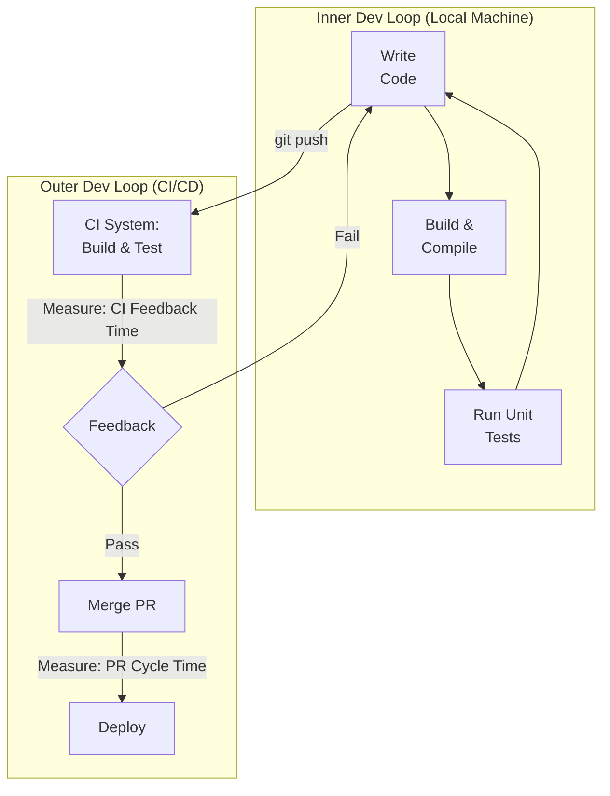
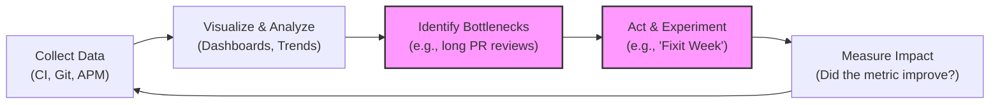

# DevOps Metrics That Matter: Driving Success in 2026

The conversation around DevOps has matured. For years, the focus has been on speed and stability—shipping faster without breaking things. While that foundation remains critical, high-performing teams in 2026 will be defined by a more holistic understanding of their performance. Raw deployment frequency is no longer enough.

To truly excel, we must measure what drives genuine success: the productivity and happiness of our developers, the resilience of our security posture, and the direct value our engineering efforts deliver to the business. This is about moving from measuring *outputs* (deployments) to measuring *outcomes* (impact).

## What You'll Get

In this article, you will learn about:

*   A quick refresher on the foundational DORA metrics as your starting point.
*   A deep dive into the next generation of metrics covering Developer Experience (DevEx), Security, and Business Value.
*   How to build a culture of continuous improvement by collecting, analyzing, and acting on these metrics.
*   A high-level view of a metric-driven feedback loop to guide your implementation.

## The Foundation: DORA Metrics Still Reign Supreme

Before we look ahead, we must acknowledge the bedrock of DevOps measurement: the DORA metrics. Researched and validated by the [DevOps Research and Assessment (DORA)](https://dora.dev/) team, these four metrics provide a powerful, high-level view of your software delivery engine's health. They measure the two core pillars of performance: **throughput** and **stability**.

By 2026, tracking these should be standard practice. If you aren't measuring them yet, start here.

| Metric | Category | What It Measures | Elite Performers (2023) |
| :--- | :--- | :--- | :--- |
| **Deployment Frequency** | Throughput | How often you successfully release to production. | On-demand (multiple times per day) |
| **Lead Time for Changes** | Throughput | Time from code commit to production release. | Less than one day |
| **Change Failure Rate** | Stability | The percentage of deployments causing a failure in production. | 0-15% |
| **Mean Time to Recovery (MTTR)** | Stability | How long it takes to restore service after a production failure. | Less than one hour |

These metrics are essential, but they only tell part of the story. They tell you *how fast and reliably* you are shipping, but not *what* you are shipping or *how effectively* your team is working.

## Beyond DORA: The Metrics for 2026

To build a truly elite team, we need to expand our view. The following metrics provide deeper insights into the health, efficiency, and impact of your engineering organization.

### 1. Developer Experience (DevEx) Metrics

A frustrated developer is an unproductive developer. A streamlined, low-friction workflow is a direct competitive advantage. DevEx metrics help you identify and eliminate the bottlenecks that kill productivity and morale.

*   **Time to "Hello, World"**: How long does it take a new engineer to set up their local environment, make a small change, and see it deployed to a dev environment? A long setup time (days instead of hours) signals high complexity and a steep learning curve.
*   **CI Feedback Time**: The time a developer waits for a build and its associated tests to complete after a push. If this is longer than 10-15 minutes, developers will context-switch, leading to massive productivity loss.
*   **PR Cycle Time**: The total time from when a pull request is opened to when it's merged. This can be broken down further:
    *   *Time to First Review*: How long does a PR wait for a teammate's eyes?
    *   *Rework Time*: How much time is spent addressing comments and making changes?
*   **Cognitive Load**: This is harder to quantify but critical. It represents the mental effort required to perform work. You can measure it indirectly through surveys asking questions like, "How easy is it for you to find the documentation you need?" or by tracking the number of tools a developer must interact with to complete a task.

The inner development loop is where developers spend most of their time. Optimizing it pays huge dividends.



### 2. Security Posture & DevSecOps Metrics

"Shift Left" is more than a buzzword; it's a fundamental change in how we integrate security. Instead of a final, blocking gate, security must be an automated, continuous part of the development lifecycle.

*   **Mean Time to Remediate (MTTR) for Vulnerabilities**: This is the security equivalent of the DORA MTTR. When a vulnerability is discovered by a scanner (e.g., in a dependency), how long does it take for a fix to be deployed to production?
*   **Vulnerability Escape Rate**: What percentage of vulnerabilities are discovered in production versus in pre-production environments? A high escape rate indicates your pre-deployment scanning and testing are insufficient.
*   **Security Scan Coverage**: What percentage of your code repositories and container images are regularly scanned by SAST (Static), DAST (Dynamic), and Software Composition Analysis (SCA) tools? Aim for 100%.

> **Info**
> Your goal isn't just to find vulnerabilities, but to empower developers to fix them quickly and easily. Provide clear context, remediation advice, and automated tooling directly within their workflow.

A simple check in your CI pipeline can enforce basic security standards:

```bash
# Example using Trivy to scan a container image
# Fail the build if any critical vulnerabilities are found
trivy image --exit-code 1 --severity CRITICAL my-app:latest
```

### 3. Business Value & Impact Metrics

This is where the rubber meets the road. DevOps efforts are ultimately in service of the business. These metrics connect your team's work directly to customer value and business objectives.

*   **Cycle Time to Business Impact**: Go beyond Lead Time for Changes. This measures the time from the initial *idea or hypothesis* to the point where you can measure its impact on a business KPI (e.g., increased user sign-ups or revenue).
*   **Feature Adoption Rate**: You shipped a new feature—great! But is anyone using it? Tracking the percentage of active users who engage with a new feature tells you if you're building what customers actually want.
*   **Error Budgets & Service Level Objectives (SLOs)**: An SLO is a target for system reliability (e.g., 99.9% uptime). The Error Budget is the amount of unreliability you can tolerate (100% - SLO). This framework transforms reliability from an abstract goal into a concrete metric that both product and engineering can use to make data-driven decisions about whether to build new features or focus on stability.
*   **Cost Per Deployment**: How much does it cost in cloud resources and tooling to run your CI/CD pipeline for a single deployment? This helps quantify the ROI of pipeline optimizations and provides visibility into operational spending.

## Implementing a Metric-Driven Culture

Collecting data is easy; using it to drive meaningful change is hard. The goal is to create a tight feedback loop where metrics inform decisions and lead to continuous improvement.



### Step 1: Collect Data Automatically

Your metrics should be a byproduct of your workflow, not manual toil. Integrate data sources from across your toolchain:
*   **Source Control**: Git history from GitHub, GitLab, or Bitbucket for lead time and deployment frequency.
*   **CI/CD Systems**: Jenkins, CircleCI, or GitHub Actions for build times and change failure rates.
*   **Observability/APM**: Datadog, New Relic, or Prometheus for MTTR and SLO tracking.
*   **Project Management**: Jira or Linear for cycle time from idea to delivery.

### Step 2: Visualize and Analyze

Use dashboards to see trends over time. **Crucially, these are tools for learning, not for judgment.** Never use these metrics to compare individual developers. Instead, use them to ask questions:
*   "Our CI feedback time has been trending up for a month. What changed?"
*   "The change failure rate spiked after we introduced the new microservice. Let's review its test coverage."

### Step 3: Act on Insights

Turn data into action. During retrospectives, bring up a trend you've noticed. Form a hypothesis ("We believe that dedicating one hour each Friday to reviewing stale PRs will reduce our PR cycle time.") and run an experiment. Then, check the metric in a few weeks to see if your change had the desired effect.

## Tying It All Together

The DevOps metrics landscape is evolving. While the DORA four remain the essential starting point for measuring your delivery engine, future-focused teams will adopt a more comprehensive view.

By integrating metrics for Developer Experience, Security Posture, and Business Value, you create a rich, multi-dimensional picture of your team's performance. This allows you to move beyond simply shipping fast and start delivering real, measurable impact—all while building a more effective, secure, and sustainable engineering culture.

What metrics have you found most impactful for your team? Which ones are you planning to adopt next?


## Further Reading

- [https://cloud.google.com/devops/metrics](https://cloud.google.com/devops/metrics)
- [https://dora.dev/metrics/](https://dora.dev/metrics/)
- [https://infoq.com/devops-metrics-beyond-dora](https://infoq.com/devops-metrics-beyond-dora)
- [https://newrelic.com/blog/devops-metrics-to-track](https://newrelic.com/blog/devops-metrics-to-track)
- [https://datadog.com/blog/devops-kpis](https://datadog.com/blog/devops-kpis)
