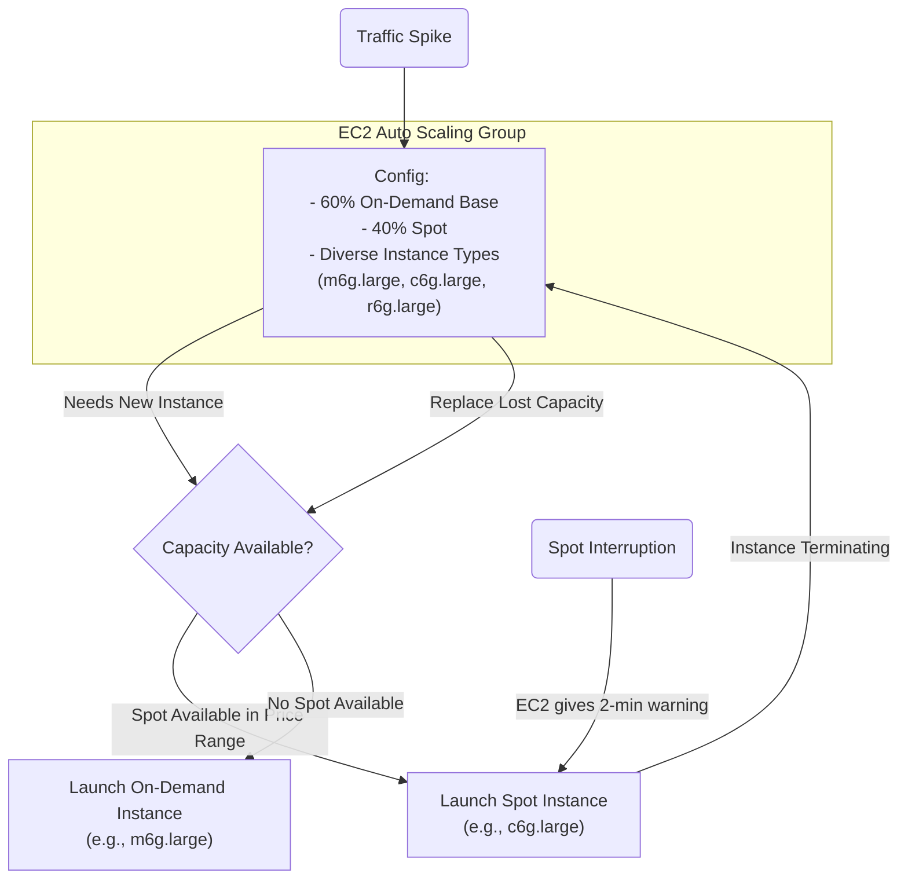
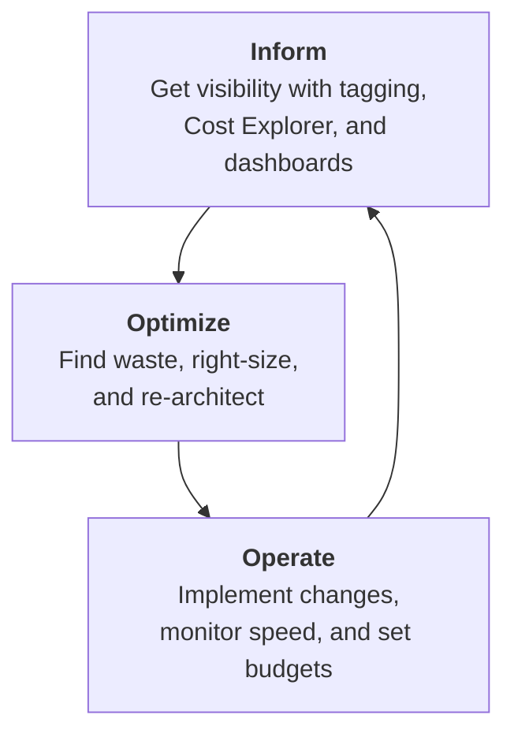

# AWS Cost Optimization Strategies for a Tightening Economy

In a world of tightening budgets and increased scrutiny on cloud spend, the old playbook of simply buying Reserved Instances isn't enough. As we look towards 2026, engineering and finance teams must collaborate on more sophisticated, architectural, and cultural strategies to control AWS costs. True optimization is no longer a one-time task; it's a continuous, data-driven practice.

This article moves beyond the basics and dives into advanced, actionable strategies that deliver significant savings by improving efficiency at the core. We'll focus on modernizing your stack, taming hidden costs, and embedding cost-consciousness into your team's DNA.

### What You'll Get

*   **Advanced Compute Strategies:** How to leverage Graviton processors and Spot Instances effectively and safely.
*   **Data Transfer Demystified:** Techniques to identify and reduce one of the most common "surprise" costs.
*   **FinOps in Practice:** How to build a culture of cost accountability and continuous optimization.
*   **Actionable Tooling:** A look at AWS-native tools that help you hunt down and eliminate waste.

## Modernize Your Compute Layer for Peak Efficiency

Your compute resources, primarily EC2 instances, are often the largest line item on your AWS bill. Optimizing here yields the biggest returns. The key is to shift from paying less for the *same* resources to using more efficient resources in the first place.

### Embrace ARM with AWS Graviton

AWS Graviton processors, based on the ARM architecture, offer significantly better price-performance compared to traditional x86 (Intel/AMD) instances. For many workloads—including microservices, containerized applications, data processing, and caching—a switch to Graviton can yield up to 40% better price-performance.

*   **Identify Candidates:** Managed services like RDS, ElastiCache, and OpenSearch have simple migration paths. For custom applications, start with stateless services.
*   **Update Your CI/CD:** Your build process must produce ARM64-compatible artifacts. For containers, this is often a simple change in your Dockerfile.

```dockerfile
# Before: Assumes x86/amd64
FROM public.ecr.aws/amazonlinux/amazonlinux:2

# After: Build for a specific platform
FROM --platform=linux/arm64 public.ecr.aws/amazonlinux/amazonlinux:2
```
*   **Test Thoroughly:** While most modern languages and libraries support ARM64, you must validate performance and compatibility before a full production rollout.

Learn more at the official [AWS Graviton page](https://aws.amazon.com/ec2/graviton/).

### Master Spot Instances with Auto Scaling

Spot Instances offer up to a 90% discount on On-Demand prices but can be terminated with a two-minute warning. The historical fear of interruption has made teams hesitant, but modern best practices make them safe for a huge range of workloads.

The secret is using **EC2 Auto Scaling Groups with a mixed instances policy**. This allows the Auto Scaling Group to provision a mix of On-Demand and Spot instances across various instance types. This diversification dramatically reduces the impact of any single Spot market interruption.

> **Key Principle:** Design for failure. If your application can handle an instance disappearing (which it should in a resilient cloud architecture), it can handle a Spot interruption.

Here's a conceptual flow for a resilient, cost-optimized Auto Scaling Group:



This strategy is ideal for stateless web applications, containerized workloads on EKS or ECS, and big data processing jobs.

## The Silent Killer: Data Transfer Costs

Data Transfer is one of the most misunderstood and difficult-to-predict AWS costs. Every gigabyte of data that exits an AWS region or crosses an Availability Zone (AZ) boundary can incur a charge.

### Architect for Locality

The most effective way to reduce these costs is at the architectural level. Keep high-bandwidth traffic within a single AZ whenever possible.

| Data Transfer Path                | Relative Cost (Example) | Recommendation                                             |
| --------------------------------- | ----------------------- | ---------------------------------------------------------- |
| **Within the same AZ**            | Free                    | Ideal for high-chatiness services (e.g., DB and App).      |
| **Across AZs in the same Region** | $0.01/GB                | Necessary for high availability, but minimize where possible. |
| **Out to the Internet**           | $0.09/GB (Tiered)       | The most expensive. Minimize and use a CDN.                |

*   **Review Your VPCs:** Are your database and the applications that heavily query it in the same AZ? If you're using a multi-AZ setup for high availability (which is good!), ensure that routine, high-volume traffic is routed to the local AZ instance.
*   **Use a CDN:** For serving static assets or APIs to the public, use Amazon CloudFront. Data transfer from S3 or EC2 to CloudFront is free, and you only pay for the (cheaper) CloudFront data transfer out to your users.

### Leverage VPC Endpoints

When your services inside a VPC need to communicate with AWS services like S3 or DynamoDB, that traffic can, by default, traverse the internet and incur NAT Gateway processing and data transfer charges.

**VPC Endpoints** create a private connection between your VPC and supported AWS services, keeping all traffic on the AWS private network.

*   **Gateway Endpoints:** For S3 and DynamoDB. They are free to use; you just create one in your VPC.
*   **Interface Endpoints:** For most other services. They have a small hourly charge but can still be cheaper than paying for NAT Gateway processing and inter-AZ data transfer at scale.

## Beyond Tech: Embedding a FinOps Culture

The most advanced optimization strategy isn't a piece of technology—it's a cultural shift. FinOps is a practice that brings financial accountability to the variable spend model of the cloud, uniting engineering, finance, and business teams.

The [FinOps Foundation](https://finops.org/framework/aws-optimization/) outlines a continuous cycle of **Inform, Optimize, and Operate**.



### Visibility: The Foundation

You can't optimize what you can't see.
*   **Implement a Strict Tagging Policy:** Tag every resource with its owner, project, and cost center. This is non-negotiable. Use AWS Service Control Policies (SCPs) to enforce tagging at account creation.
*   **Use AWS Cost Explorer:** Go beyond the default view. Group costs by your tags, filter by service, and use the Anomaly Detection feature to get alerts on unexpected spending spikes.

### Accountability: Shared Responsibility

Shift the mindset from "the cloud bill" to "our team's bill."
*   **Share Cost Reports:** Set up automated, tag-filtered reports that go directly to the relevant team leads.
*   **Empower Engineers:** When an engineer can see the cost impact of their code and infrastructure choices, they are empowered to make more cost-effective decisions.

## Practical Tools for Waste Hunting

Before you can optimize, you need to find the waste. AWS provides several powerful, free tools to help.

*   **AWS Trusted Advisor:** Scans your environment for common misconfigurations and provides recommendations for cost savings, such as identifying idle RDS instances, unassociated Elastic IPs, and underutilized EC2 instances.
*   **AWS Compute Optimizer:** Uses machine learning to analyze the utilization metrics of your resources (EC2, EBS, Lambda) and provides specific right-sizing recommendations. For example, it might suggest changing an `m5.2xlarge` to a Graviton-based `m6g.xlarge` for a specific workload, providing projected savings and performance risk.
*   **Cost Anomaly Detection:** A feature within AWS Cost Management that uses machine learning to automatically detect unusual spend. This helps you catch issues like a logging misconfiguration or a runaway process before they run up a huge bill.

## Conclusion

In today's economic climate, AWS cost optimization is a critical engineering discipline. By moving beyond basic commitments and embracing advanced strategies like Graviton adoption, intelligent use of Spot, data-aware architecture, and a strong FinOps culture, you can build systems that are not only resilient and scalable but also highly cost-effective.

Optimization is never "done." It is a continuous loop of measurement, analysis, and improvement that keeps your cloud spend aligned with your business value.

What are your favorite advanced cost-saving tips? Share them in the comments below


## Further Reading

- [https://aws.amazon.com/aws-cost-management](https://aws.amazon.com/aws-cost-management)
- [https://finops.org/framework/aws-optimization](https://finops.org/framework/aws-optimization)
- [https://cloudcheckr.com/aws-cost-optimization-guide](https://cloudcheckr.com/aws-cost-optimization-guide)
- [https://faun.pub/aws-cost-optimization-advanced](https://faun.pub/aws-cost-optimization-advanced)
- [https://aws.amazon.com/ec2/graviton/](https://aws.amazon.com/ec2/graviton/)
