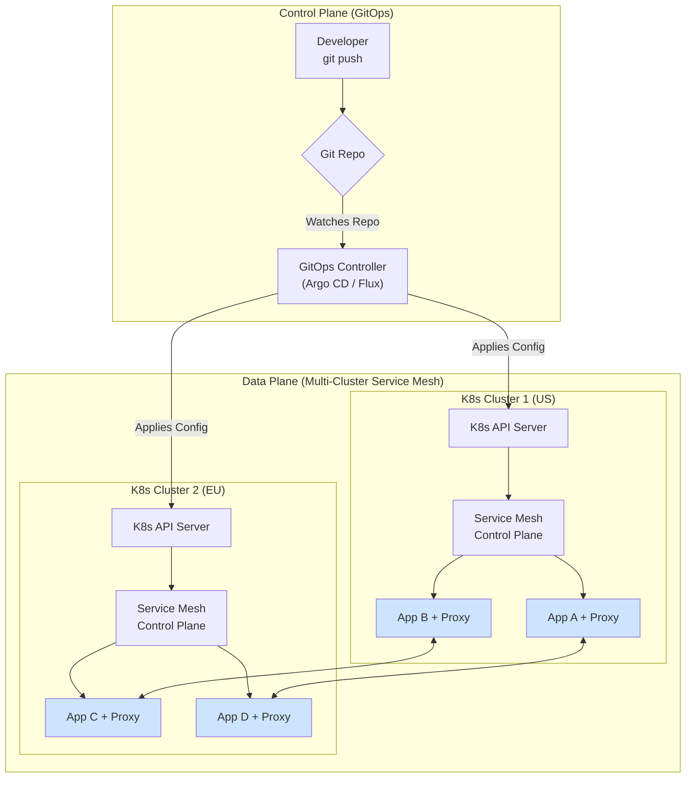

# Kubernetes Multi-Cluster Management with GitOps & Service Mesh

Welcome to 2026, where managing a single Kubernetes cluster is a relic of the past. The default operational model for any serious enterprise is now multi-cluster, spread across multiple regions, clouds, and even on-premises data centers. This distribution provides resilience, low latency, and data sovereignty, but it also introduces immense complexity.

How do we tame this beast? The answer has solidified around two powerful, complementary pillars: **GitOps** for declarative state management and the **Service Mesh** for intelligent runtime networking. This article breaks down the modern, battle-tested architecture for managing applications across a fleet of Kubernetes clusters.

### What You'll Get

*   **Clarity on Core Challenges:** Understand the primary obstacles in multi-cluster operations.
*   **The GitOps Control Plane:** See how GitOps unifies deployment and configuration management.
*   **The Service Mesh Data Plane:** Learn how a service mesh handles cross-cluster communication, security, and observability.
*   **A Unified Architecture:** Explore a reference model that combines both technologies for a robust, scalable solution.
*   **Actionable Starting Points:** Guidance on selecting tools and beginning your journey.

## The Multi-Cluster Imperative: Why We're All Here

Operating across multiple Kubernetes clusters isn't a choice anymore; it's a necessity driven by high availability, disaster recovery, and regulatory compliance. But this paradigm brings significant technical hurdles that ad-hoc scripts and manual `kubectl` commands simply can't solve.

### Key Challenges in a Multi-Cluster World

*   **Configuration Drift:** Each cluster slowly diverges, becoming a unique "snowflake" that is difficult to debug and impossible to replace consistently.
*   **Policy Inconsistency:** How do you ensure that network policies, security contexts, and RBAC rules are identical and enforced across your entire fleet? A single misconfiguration can be a major security breach.
*   **Complex Service Discovery:** How does a service in a GKE cluster in `europe-west1` securely and reliably find and communicate with a service in an EKS cluster in `us-east-1`?
*   **Observability Blind Spots:** When an application fails, was it the code, the configuration, the network, or a specific cluster's infrastructure? Without a unified view, you're flying blind.

## Pillar 1: GitOps as the Single Source of Truth

GitOps is the operational framework that uses a Git repository as the single source of truth for all infrastructure and application configuration. An automated agent, like Argo CD or Flux, ensures the live state of your clusters matches the desired state declared in Git.

This isn't just about CI/CD; it's a fundamental shift in how we manage distributed systems. Instead of pushing changes, we declare the desired state, and the system pulls itself into compliance.

> **The OpenGitOps Principles:**
> 1.  The entire system is described declaratively.
> 2.  The canonical desired system state is versioned in Git.
> 3.  Approved changes to the desired state are automatically applied to the system.
> 4.  Software agents ensure correctness and alert on divergence.
> — *Learn more at the [OpenGitOps official site](https://opengitops.dev/)*.

### How GitOps Tames Multi-Cluster Chaos

*   **Consistency by Default:** A single `git push` can update an application's configuration across dozens of clusters simultaneously, eliminating drift.
*   **Powerful Auditing:** The Git history provides an immutable, chronological log of every change made to your entire system—who made it, what it was, and when.
*   **Rapid Disaster Recovery:** Lost a cluster? Provision a new one, point it to your Git repository, and the GitOps agent will automatically bootstrap the entire stack from scratch.

### Architectural Pattern: The App-of-Apps

A common and powerful pattern is the "App-of-Apps," where a root application in your GitOps tool points to other applications, which in turn define what gets deployed to which clusters.

Here's a conceptual example using an Argo CD `ApplicationSet`, which can generate `Applications` for multiple clusters from a single template:

```yaml
# This is a conceptual example of an ApplicationSet
apiVersion: argoproj.io/v1alpha1
kind: ApplicationSet
metadata:
  name: guestbook-apps
spec:
  generators:
  - list:
    elements:
    - cluster: engineering-dev
      url: https://1.2.3.4
    - cluster: engineering-prod-us
      url: https://5.6.7.8
    - cluster: engineering-prod-eu
      url: https://9.10.11.12
  template:
    metadata:
      name: '{{cluster}}-guestbook'
    spec:
      project: default
      source:
        repoURL: https://github.com/my-org/guestbook.git
        targetRevision: HEAD
        path: deployments
      destination:
        server: '{{url}}'
        namespace: guestbook
```

This single manifest instructs Argo CD to deploy the `guestbook` application to three different clusters, ensuring each one has the exact same version and configuration.

```mermaid
graph TD
    A["Developer<br/>git push"] --> B{Git Repo<br/>"Source of Truth"};
    B --> C{GitOps Controller<br/>"Argo CD / Flux"};
    C --> D1["K8s Cluster 1 (us-east-1)"];
    C --> D2["K8s Cluster 2 (eu-west-1)"];
    C --> D3["K8s Cluster 3 (on-prem)"];
```

## Pillar 2: Service Mesh for a Unified Data Plane

While GitOps solves for the desired *state*, a service mesh like [Istio](https://istio.io/) or [Linkerd](https://linkerd.io/) solves for the runtime *behavior*. It inserts a lightweight network proxy (e.g., Envoy) next to each application container, intercepting all traffic. These proxies form a unified, programmable "mesh" across all your clusters.

### Key Service Mesh Capabilities for Multi-Cluster

*   **Global Service Discovery:** A service named `billing` can be reached at `billing.prod.global` from any pod in any connected cluster, without the application needing to know its specific IP or location.
*   **Transparent mTLS:** The mesh automatically encrypts all traffic between services and verifies their identities using strong cryptographic principles (like SPIFFE). This creates a zero-trust network by default, even across the public internet.
*   **Intelligent Traffic Management:** Seamlessly implement sophisticated routing strategies. For example, you can fail over traffic from a failing cluster in seconds or perform a canary release where 5% of global traffic is routed to a new version deployed in a single cluster.
*   **Unified Observability:** The mesh automatically generates uniform, detailed telemetry (metrics, logs, and traces) for every request. You get a "golden signal" dashboard for your entire distributed application out of the box.

## The Synergy: GitOps + Service Mesh Architecture

This is where the magic happens. These two pillars are not independent; they are deeply synergistic.

**GitOps manages the *what* and *where*. The Service Mesh manages the *how*.**

Your Git repository becomes the source of truth for not only your application deployments but also for your service mesh configuration. Need to change a traffic routing rule? You don't `kubectl apply` it—you update a YAML file in Git.

### A Typical Advanced Workflow

1.  **Goal:** Shift 10% of production traffic for the `checkout` service from the primary US cluster to the newly updated EU cluster.
2.  **Action:** A platform engineer opens a pull request to modify an Istio `VirtualService` resource in the infrastructure Git repo.
3.  **GitOps at Work:** After the PR is approved and merged, the GitOps controller (Argo CD) detects the change in the `main` branch. It applies the new `VirtualService` configuration to the Kubernetes API servers in *both* the US and EU clusters.
4.  **Service Mesh at Work:** The Istio control plane (Istiod) sees the updated resource and instantly sends new routing instructions to all Envoy proxies in the mesh. The proxies immediately begin routing 10% of traffic destined for `checkout.prod.global` to the pods in the EU cluster.

The entire operation is declarative, auditable, and requires zero manual intervention on the clusters themselves.



## Getting Started on Your Journey

Adopting this model is a marathon, not a sprint. The key is an iterative approach.

| Tool Category | Popular Options | Key Differentiator |
| :--- | :--- | :--- |
| **GitOps Controller** | Argo CD, Flux CD | Argo CD has a feature-rich UI; Flux is known for its composability and Kubernetes-native feel. Both are excellent choices. |
| **Service Mesh** | Istio, Linkerd | Istio is extremely powerful and feature-rich (e.g., WASM extensions). Linkerd prioritizes simplicity, performance, and operational ease. |

### A Recommended Path

1.  **Master GitOps on One Cluster:** Start by using Flux or Argo CD to manage a few applications on a single, non-critical cluster. Get comfortable with the declarative workflow.
2.  **Extend to a Second Cluster:** Use a tool like Argo CD ApplicationSets to deploy the *same* application to two clusters. The goal here is configuration consistency.
3.  **Introduce the Service Mesh:** Install a mesh like Linkerd or Istio on both clusters and configure multi-cluster communication. Start with a simple goal: have a service in cluster A call a service in cluster B.
4.  **Manage Mesh Config with GitOps:** Move your `VirtualService`, `DestinationRule`, or `ServiceProfile` configurations into your Git repository so the GitOps controller manages them.

## Conclusion: The Future is Declarative and Connected

The complexity of multi-cluster, multi-cloud Kubernetes is not going away. Relying on manual processes and disparate tools is a recipe for failure. The combination of GitOps as a universal control plane and a service mesh as a universal data plane provides the robust, scalable, and secure foundation needed to thrive in this new reality.

This architecture turns your distributed system from a fragile collection of independent parts into a resilient, self-healing organism where changes are safe, predictable, and auditable.

***What are the biggest hurdles you face in your multi-cluster journey today?***


## Further Reading

- [https://kubernetes.io/blog/multi-cluster-management-2026](https://kubernetes.io/blog/multi-cluster-management-2026)
- [https://opengitops.dev/principles](https://opengitops.dev/principles)
- [https://istio.io/latest/docs/concepts/what-is-istio](https://istio.io/latest/docs/concepts/what-is-istio)
- [https://linkerd.io/overview/what-is-linkerd](https://linkerd.io/overview/what-is-linkerd)
- [https://cncf.io/blog/multi-cloud-kubernetes](https://cncf.io/blog/multi-cloud-kubernetes)
