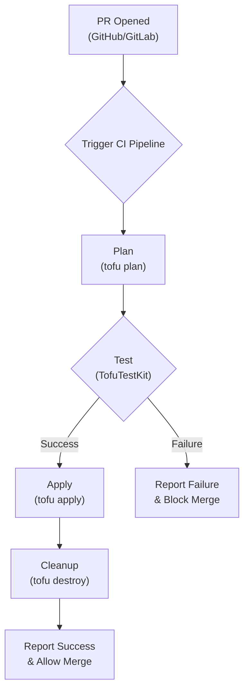
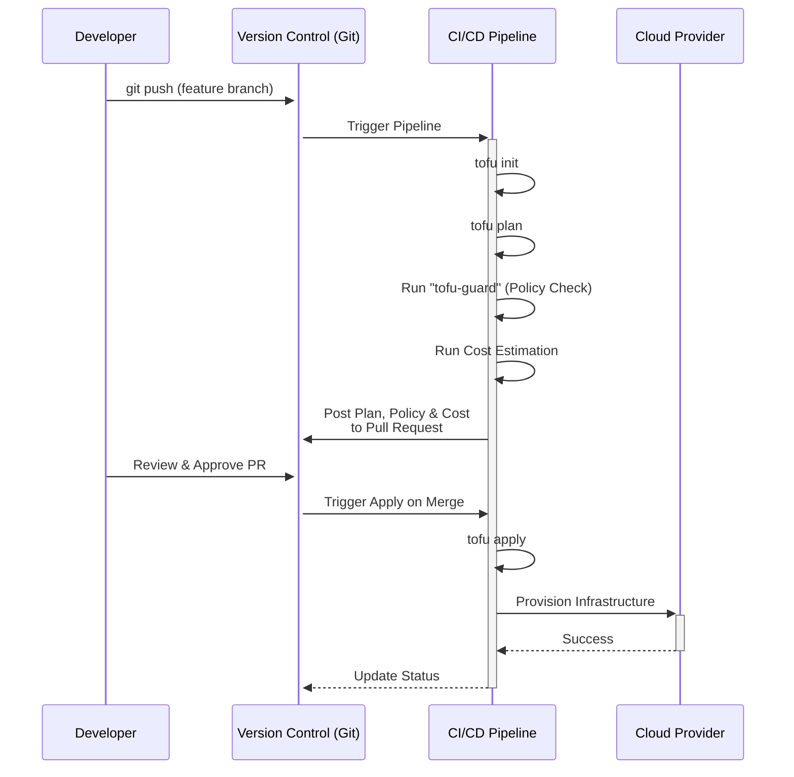

# OpenTofu's Ecosystem Grows: New Providers & Community Tools

Welcome to 2026. What started as a fork to preserve a truly open-source infrastructure as code (IaC) tool has blossomed into a mature, vibrant ecosystem. OpenTofu, under the stewardship of the [Linux Foundation](https://linuxfoundation.org/projects/opentofu), has moved far beyond its initial goal of maintaining Terraform 1.5.x compatibility. Today, its strength lies not just in its core capabilities, but in the sprawling ecosystem of community-driven providers, tools, and integrations built around it.

This article explores the remarkable growth of the OpenTofu ecosystem. We'll dive into the new wave of native providers, showcase essential community tooling that enhances security and testing, and look at how these developments are solidifying OpenTofu's role as a cornerstone of modern infrastructure management.

### What You'll Get

*   **Provider Spotlight:** An overview of new, community-built OpenTofu providers.
*   **Essential Tooling:** A look at new tools for security, testing, and CI/CD.
*   **Modern Workflow:** A high-level view of an enhanced OpenTofu workflow.
*   **Community Impact:** Insight into how open governance is fueling innovation.

## The Provider Renaissance: Beyond the Core

For a time, OpenTofu's provider story was one of compatibility, relying on the legacy Terraform registry. While that bridge remains crucial, 2026 is defined by the rise of a native provider ecosystem hosted on the official [OpenTofu Registry](https://github.com/opentofu/registry). These community-contributed providers are built specifically for OpenTofu, often taking advantage of its unique features.

This shift signifies a new level of maturity. Instead of only consuming from an upstream source, the community is now producing first-class solutions for cutting-edge and niche services.

### Notable New Providers

*   **`edgecraft`:** A provider for managing infrastructure on emerging edge computing platforms, allowing declarative control over distributed functions and container deployments.
*   **`quantumanalytics`:** Built for a popular AI/ML infrastructure service, this provider simplifies the provisioning of GPU clusters, data pipelines, and model training environments.
*   **`decentral`:** Manages resources on decentralized storage networks like IPFS and Filecoin, enabling IaC for Web3 infrastructure.

The advantages of these native providers are clear:

| Feature | Legacy Bridged Provider | Native OpenTofu Provider |
| :--- | :--- | :--- |
| **Development** | Reliant on upstream vendor | Community-driven, faster releases |
| **Features** | Limited to Terraform feature set | Can use OpenTofu-specific features |
| **License** | Subject to BSL or other licenses | Guaranteed open-source (MPL 2.0) |
| **Support** | Vendor-dependent | Community-supported via GitHub/Discord |

## Tooling That Supercharges Your Workflow

A powerful CLI is only part of the equation. An ecosystem's true strength is measured by its third-party tooling. The OpenTofu community has been busy building tools that address critical stages of the IaC lifecycle: security, testing, and automation.

### Security and Policy as Code

Tools that shift security left are essential. `tofu-guard` is a community-built, open-source policy-as-code tool that scans OpenTofu plans *before* they are applied. It's designed to be fast, flexible, and CI/CD-friendly.

Unlike its predecessors, `tofu-guard` offers native understanding of OpenTofu's state encryption and structured plan output, reducing false positives.

Here's a simple policy to deny the creation of public S3 buckets:
```hcl
# policies/s3.hcl
policy "deny-public-s3-buckets" {
  source = "opentofu"
  rule "aws_s3_bucket.acl must not be 'public-read' or 'public-read-write'" {
    condition = resource.aws_s3_bucket.acl not in ["public-read", "public-read-write"]
  }
}
```

> **Info Block:** Policy-as-code tools like `tofu-guard` are no longer just a "nice-to-have." They are a fundamental component of a secure and compliant IaC workflow, preventing misconfigurations from ever reaching production.

### Enhanced Testing and Validation

Ephemeral, per-pull-request test environments are the gold standard for IaC. `TofuTestKit`, a Python-based testing framework, has gained significant traction. It allows developers to write simple, expressive tests that:

1.  Run `tofu apply` on a test configuration.
2.  Perform assertions on the resulting infrastructure using cloud SDKs.
3.  Automatically run `tofu destroy` to clean up resources.

This creates a tight feedback loop, ensuring that modules and configurations behave as expected.

Here’s a conceptual flow of a `TofuTestKit` run in a CI pipeline:



### CI/CD and Automation Integrations

Deeper integration with CI/CD platforms has been a major focus. Community-maintained GitHub Actions and GitLab CI components now offer rich features beyond simple `plan` and `apply` steps.

A popular GitHub Action workflow now includes automated cost estimation using tools that hook into OpenTofu's plan output. This posts a comment directly in the pull request, giving teams immediate visibility into the financial impact of their changes.

A typical CI step might look like this:
```yaml
- name: OpenTofu Plan & Cost Estimate
  id: plan
  uses: community-actions/opentofu-plan@v2
  with:
    tofu_version: '1.7.0'
    cost_estimation: true # Enable cost analysis
    github_token: ${{ secrets.GITHUB_TOKEN }}
```

## A Look at the Modern OpenTofu Workflow

Putting it all together, the modern OpenTofu workflow incorporates these new tools to create a more robust, secure, and transparent process from development to deployment.



This diagram illustrates how community tools integrate at key stages, providing automated checks and balances that empower teams to move faster and more safely.

## Why Community Contribution Matters

The rapid expansion of the OpenTofu ecosystem is a direct result of its open and community-centric governance model. Free from the commercial interests of a single company, developers and organizations are empowered to build the tools they need.

This fosters:
*   **True Vendor Neutrality:** Tools and providers are created to solve problems, not to lock users into a specific platform.
*   **Faster Innovation:** Niche use cases and cutting-edge technologies get first-class support from passionate community members.
*   **Resilience:** The ecosystem's health isn't dependent on one company's roadmap. It's a shared effort, driven by the needs of its users.

## The Road Ahead

The future for the OpenTofu ecosystem looks bright. We can anticipate further growth in areas like AI-assisted IaC generation, sophisticated state management and visualization tools, and even more providers for the ever-expanding landscape of cloud-native and specialized services. The trajectory is clear: as long as the community remains the driving force, the ecosystem will continue to innovate and thrive.

## Final Thoughts & Your Turn

OpenTofu has successfully transitioned from a defensive fork to a proactive, community-powered force in the IaC space. The explosion of native providers and intelligent tooling in 2026 is a testament to the power of open-source collaboration. It has cultivated an environment where the best ideas, regardless of their origin, can take root and grow.

**What about you?** What are your favorite new OpenTofu tools and providers that are making a difference in your daily workflows? Share them in the comments below


## Further Reading

- [https://opentofu.org/blog/community-update-2026](https://opentofu.org/blog/community-update-2026)
- [https://github.com/opentofu/registry](https://github.com/opentofu/registry)
- [https://cloudarchitech.io/opentofu-provider-spotlight](https://cloudarchitech.io/opentofu-provider-spotlight)
- [https://dev.to/opentofu/new-tools-for-opentofu](https://dev.to/opentofu/new-tools-for-opentofu)
- [https://linuxfoundation.org/projects/opentofu](https://linuxfoundation.org/projects/opentofu)
