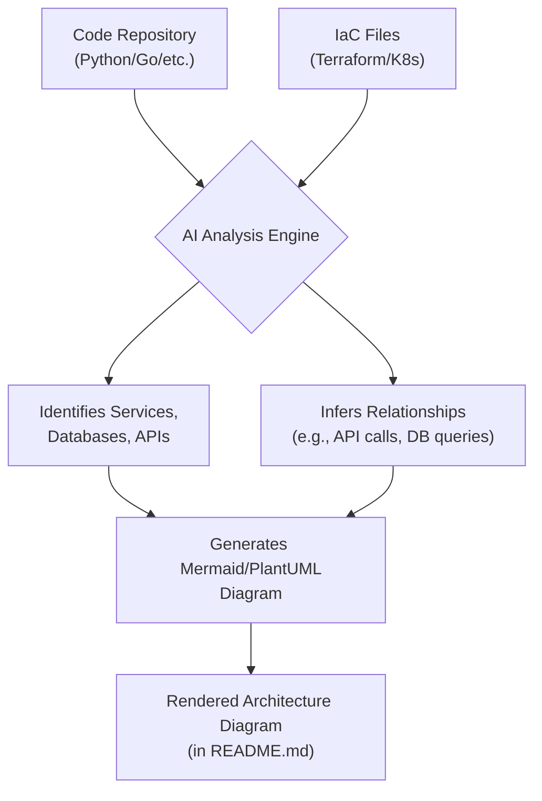
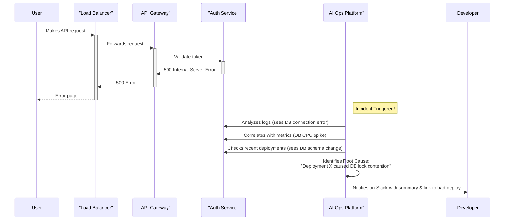

# AI for Developers: Practical Applications Beyond Code Generation

We've all seen the massive productivity gains from AI-powered code completion tools. Assistants like GitHub Copilot have fundamentally changed the inner dev loop. But focusing solely on code generation is like using a supercomputer as a calculator. By 2026, the most effective developers are leveraging AI across the entire software development lifecycle, far beyond just writing the next line of code.

This article dives into the practical, high-impact applications of AI that are streamlining workflows, improving quality, and freeing up developers to solve bigger problems.

### What You'll Get

*   **Smarter Testing:** How AI generates comprehensive test suites and eliminates flaky tests.
*   **Living Documentation:** A look at AI that auto-generates and maintains architectural diagrams and READMEs.
*   **Proactive Optimization:** Examples of AI assistants that find performance bottlenecks before they hit production.
*   **Intelligent Incident Response:** How AI accelerates root cause analysis during outages.

---

## ## AI-Powered Automated Testing: From Brittle to Brilliant

Manual test writing is tedious and often misses edge cases. While early AI tools could generate simple unit tests, modern systems have become true quality assurance partners. They understand application logic and user behavior to create more resilient and meaningful test suites.

### ### Smarter Test Case Generation

Instead of just covering lines of code, AI now analyzes requirements, user stories, and even application code to generate behavior-driven tests. It infers intent to cover critical user journeys and edge cases a human might overlook.

Consider an AI analyzing a simple e-commerce checkout function. It won't just test the "happy path." It will automatically generate tests for:

*   Invalid coupon codes
*   Expired credit cards
*   Items going out of stock mid-transaction
*   Network interruption scenarios

```python
# AI-generated test for an edge case in a checkout service
# Prompt: "Generate a pytest case for a race condition where
#           inventory is depleted after the user adds an item to the cart."

import pytest
from my_store.services import checkout, inventory
from my_store.models import User, Product

def test_checkout_handles_inventory_race_condition(db_session):
    """
    Tests that the checkout process fails gracefully if an item's
    stock is depleted between cart validation and final purchase.
    """
    user = User.create(email="test@example.com")
    product = Product.create(name="Flux Capacitor", stock=1)
    
    # Simulate user adding item to cart (stock is 1)
    cart = {"product_id": product.id, "quantity": 1}
    
    # Simulate a concurrent process depleting the stock
    inventory.update_stock(product.id, 0)
    
    # Assert that the checkout now fails with a specific error
    with pytest.raises(inventory.OutOfStockError):
        checkout.process_payment(user=user, cart=cart)

```

### ### Visual Regression and Flakiness Detection

AI-powered visual regression tools are now standard. They can differentiate between meaningful UI changes and insignificant pixel shifts from dynamic content or rendering artifacts. More importantly, AI agents continuously analyze test runs across the organization to identify and automatically quarantine flaky tests, preventing them from blocking CI/CD pipelines while flagging them for review.

> **Info Block:** According to a 2025 study by the [Software Engineering Institute](https://www.sei.cmu.edu/), teams using AI for test maintenance saw a **45% reduction** in time spent debugging CI/CD failures caused by flaky tests.

## ## Intelligent Documentation: Your Living Architecture Guide

Stale documentation is worse than no documentation. AI is solving this problem by creating "living documents" that evolve in lockstep with the codebase.

### ### Context-Aware READMEs and API Docs

Modern AI tools don't just extract function signatures. They read the code, associated tests, and even commit messages to generate rich, human-readable explanations. They can automatically update parameter descriptions, add usage examples, and flag breaking changes in API documentation during the pull request process.

### ### Automated Architecture Diagrams

This is a game-changer. By parsing your codebase and infrastructure-as-code files (like Terraform or Kubernetes manifests), AI assistants can generate and update high-level architecture diagrams. This provides an always-accurate view of your system's components and their interactions.

Here’s a conceptual flow of how an AI would process a repository to create a diagram:



This automated process ensures that as you add a new microservice or connect to a different database, your documentation reflects that change instantly, without any manual diagramming.

## ## Proactive Performance Optimization

Application Performance Monitoring (APM) has shifted from being reactive to proactive, thanks to AI. Instead of just telling you *what* is slow, AI assistants now tell you *why* it's slow and suggest specific code-level fixes.

### ### Code-Level Bottleneck Identification

By analyzing runtime traces and source code simultaneously, AI can pinpoint inefficient algorithms or suboptimal database queries. It moves beyond generic advice and provides concrete refactoring suggestions.

| Issue Detected | Standard APM Alert | AI-Powered Suggestion |
| :--- | :--- | :--- |
| High DB Latency | `GET /api/users` has a p99 latency of 800ms. | The `get_user_permissions` function on line 74 is causing an N+1 query. Refactor it to use a `JOIN` with the `roles` table to fetch all data in a single query. |
| Memory Bloat | `user-service` pod memory usage is at 95%. | A large dataset is being loaded into memory in `report_generator.py`. Consider using a generator or processing the data in streaming batches to reduce the memory footprint. |

### ### Predictive Resource Management

In cloud-native environments, AI can predict traffic spikes based on historical data and external signals (like a marketing campaign launch). It can then recommend scaling configurations *before* the traffic hits, preventing slowdowns and optimizing cloud spend by avoiding constant over-provisioning.

## ## Smart Incident Response: Your AI First Responder

During an outage, every second counts. AI is dramatically reducing Mean Time to Resolution (MTTR) by acting as an intelligent first responder, correlating signals and guiding engineers to the root cause.

### ### Root Cause Analysis at Speed

When an incident occurs, an engineer is faced with a flood of data: logs, metrics, traces, and alerts from dozens of systems. AI excels at cutting through this noise. It correlates events across the stack to identify the originating fault.

Imagine a user-facing error. The AI-assisted incident flow looks like this:



This process, which could take a human 30 minutes of frantic searching, is completed by the AI in seconds.

### ### Automated Remediation Suggestions

Beyond just finding the cause, AI can suggest or even automate remediation steps. Based on the type of error and historical incident data, it might propose:

*   **Rolling back** a specific recent deployment.
*   **Generating a command** to scale up a database replica.
*   **Providing a code snippet** to fix a newly introduced bug.

---

The era of AI in software development is about augmenting human intelligence, not just replacing keystrokes. By embracing AI for testing, documentation, optimization, and incident response, we can build more reliable, performant, and maintainable software, faster than ever before.

**How are you using AI in your day-to-day workflow beyond code generation? Share your experiences in the comments below!**


## Further Reading

- [https://techcrunch.com/2026/02/ai-developer-productivity-tools](https://techcrunch.com/2026/02/ai-developer-productivity-tools)
- [https://developer.ibm.com/blogs/ai-for-developers-beyond-copilot](https://developer.ibm.com/blogs/ai-for-developers-beyond-copilot)
- [https://jetbrains.com/ai/developer-assistants](https://jetbrains.com/ai/developer-assistants)
- [https://engineering.spotify.com/ai-assisted-debugging](https://engineering.spotify.com/ai-assisted-debugging)
- [https://medium.com/google-cloud/intelligent-documentation](https://medium.com/google-cloud/intelligent-documentation)
