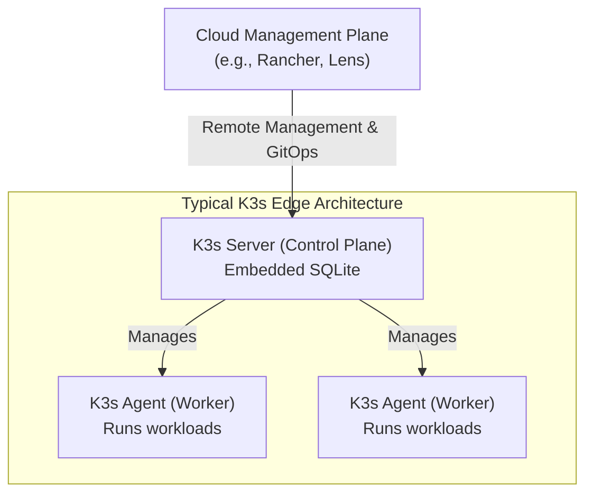

# Linux on the Edge: Optimizing for Performance and Security

By 2026, edge computing has moved from a buzzword to the bedrock of our connected infrastructure. From autonomous vehicles and smart factories to remote environmental sensors, Linux is the undisputed champion operating on billions of these devices. But deploying Linux on a fleet of resource-constrained, physically dispersed systems is a different beast than managing a data center server.

Success at the edge demands a deliberate, multi-layered approach to optimization. It's a careful balancing act between performance, power consumption, security, and remote manageability. This guide dives into the practitioner-focused strategies for building robust and efficient Linux-based edge systems today.

### What You'll Get

*   **Distribution Choices:** A look at Linux distributions purpose-built for the edge.
*   **Kernel-Level Tuning:** How to squeeze maximum performance from constrained hardware.
*   **Lightweight Containerization:** Running modern workloads with K3s, MicroK8s, and Podman.
*   **Security Hardening:** Practical techniques for locking down physically accessible devices.
*   **Fleet Management:** Strategies for reliable updates and offline operation.

***

## Choosing the Right Linux for the Job

Not all Linux distributions are created equal, especially when CPU cycles, RAM, and storage are at a premium. For edge deployments, you need a distribution that prioritizes a minimal footprint, transactional updates, and security.

*   **Ubuntu Core:** Employs a read-only, snap-based application model. This provides excellent security isolation and guarantees atomic, transactional updates that can be rolled back, preventing device "bricking."
*   **Red Hat Enterprise Linux for Edge:** Leverages `rpm-ostree` to create an immutable OS image, providing atomic updates and rollbacks. It focuses on stability and enterprise-grade support for large-scale deployments.
*   **Yocto Project:** Not a distribution, but a powerful framework for building a completely custom, minimal Linux image from source. This offers the ultimate control over the final footprint but comes with a steeper learning curve.

The common thread for 2026 is **immutability**. An edge device's root filesystem should be read-only, with updates applied as a single, atomic operation. This dramatically improves reliability and security.

## Kernel-Level Optimizations

The Linux kernel is a masterpiece of general-purpose engineering, but "general-purpose" is the enemy of "optimized." Tuning the kernel is a critical step for edge performance.

### Real-Time Patching (PREEMPT_RT)

For industrial control, robotics, or real-time data acquisition, low latency is non-negotiable. The `PREEMPT_RT` patch set, now largely mainlined, transforms Linux into a hard real-time operating system. It minimizes the amount of time the kernel runs with preemption disabled, ensuring high-priority tasks execute with predictable, microsecond-level precision.

You can verify if your kernel has real-time capabilities with a simple command:
```bash
$ uname -v
#1 SMP PREEMPT_RT ...
```

### Power and Performance Tuning

Edge devices often run on battery or have strict thermal envelopes. Linux provides tools to manage this trade-off.

*   **CPU Governors:** Control how the CPU frequency scales. For devices that need to respond instantly, forcing the performance governor can eliminate the latency of frequency scaling. For battery-powered devices, `schedutil` or `ondemand` are better choices.

    ```bash
    # Set the CPU governor to 'performance' for maximum responsiveness
    echo "performance" | sudo tee /sys/devices/system/cpu/cpu*/cpufreq/scaling_governor
    ```
*   **Kernel Footprint:** Every unnecessary driver and kernel module is a drain on memory and a potential security risk. When building a custom OS with Yocto or Buildroot, use tools like `menuconfig` to meticulously disable features you don't need—from legacy filesystem support to unused hardware drivers.

## Lightweight Containerization at the Edge

Containers are the standard for deploying applications, and the edge is no exception. However, a full-blown Kubernetes cluster is far too resource-intensive. This is where lightweight, CNCF-certified Kubernetes distributions shine.

### K3s and MicroK8s

**K3s** and **MicroK8s** are the leading choices for edge orchestration. They package Kubernetes into a single binary, drastically reducing memory and CPU overhead.

*   **K3s:** Famously marketed as "5 less than K8s," it replaces etcd with an embedded SQLite database by default, removes non-essential features, and compiles everything into a binary under 100MB.
*   **MicroK8s:** Developed by Canonical, it offers a zero-ops, self-healing Kubernetes experience. It bundles common add-ons like Istio or Kubeflow, which can be enabled with a single command.

This simplified architecture makes running a single-node or multi-node cluster feasible on devices like a Raspberry Pi or an NVIDIA Jetson.



### Podman for Simplicity

For single-device deployments that don't require orchestration, **Podman** is an excellent daemonless container engine. Its CLI is compatible with Docker, but it runs containers without a central, privileged daemon, enhancing security.

## Security Hardening in Constrained Environments

Edge devices are a prime target. They are often physically accessible and may have intermittent connectivity, making them difficult to monitor. A defense-in-depth strategy is crucial.

> **Assume a Zero-Trust Environment:** Never trust the network, and always assume the device can be physically compromised. Security must be built-in, not bolted-on.

### Key Hardening Techniques

| Technique | Goal | Common Tools / Methods |
| :--- | :--- | :--- |
| **Immutable Filesystem** | Prevent unauthorized changes to the OS at runtime. | `overlayfs`, `squashfs` on a read-only partition. |
| **Mandatory Access Control** | Confine processes to only the resources they need. | `SELinux` (in enforcing mode) or `AppArmor`. |
| **Secure Boot & TPM** | Ensure bootloader and kernel integrity from power-on. | UEFI Secure Boot, Trusted Platform Module (TPM 2.0). |
| **Minimalist Base Image** | Reduce the attack surface by removing all non-essential packages. | Custom builds via Yocto, or using minimal base images. |
| **Network Policies** | Strictly control ingress and egress traffic at the kernel level. | `iptables`, `nftables`, or Cilium for container networking. |

Enforcing these policies ensures that even if an attacker finds a vulnerability in one application, they cannot gain control of the entire system.

## Managing the Edge Fleet

Deploying one device is easy. Managing thousands is an operational challenge. Your strategy must account for updates and intermittent connectivity.

### Over-the-Air (OTA) Updates

Robust OTA update mechanisms are a requirement, not a feature. The best-in-class solutions use an A/B partition scheme:

1.  The system runs on the active partition (A).
2.  An update is downloaded and installed to the inactive partition (B) in the background.
3.  The system verifies the integrity of the B partition.
4.  The bootloader is configured to boot from B on the next restart.
5.  If the new version fails to boot or is unhealthy, the system automatically rolls back to the A partition.

This process guarantees that a failed update will never leave a device in an unrecoverable state.

### Handling Offline Operation

Many edge devices will experience network disruptions. The software stack must be resilient to this.

*   **Data Buffering:** Use local, persistent message queues (e.g., SQLite, a local MQTT broker) to store data generated during an outage.
*   **Local Decision-Making:** Run ML models and business logic directly on the device. Don't rely on a cloud endpoint for critical operations.
*   **Synchronization:** When connectivity is restored, the device should efficiently sync its buffered data back to the central platform.

## The Future is Now

Optimizing Linux for the edge is a discipline that blends embedded systems engineering, cloud-native practices, and a robust security posture. By choosing the right distribution, tuning the kernel, adopting lightweight containerization, and implementing a rigorous security and management strategy, you can build the reliable, high-performance edge infrastructure that modern applications demand.

What are your go-to strategies for Linux at the edge? Share your experiences and favorite tools in the comments below


## Further Reading

- [https://linuxfoundation.org/edge/articles/optimizing-linux-edge](https://linuxfoundation.org/edge/articles/optimizing-linux-edge)
- [https://canonical.com/blog/ubuntu-core-edge-2026](https://canonical.com/blog/ubuntu-core-edge-2026)
- [https://k3s.io/docs/overview/](https://k3s.io/docs/overview/)
- [https://www.arm.com/technologies/edge-computing](https://www.arm.com/technologies/edge-computing)
- [https://redhat.com/blog/linux-for-edge-security](https://redhat.com/blog/linux-for-edge-security)
