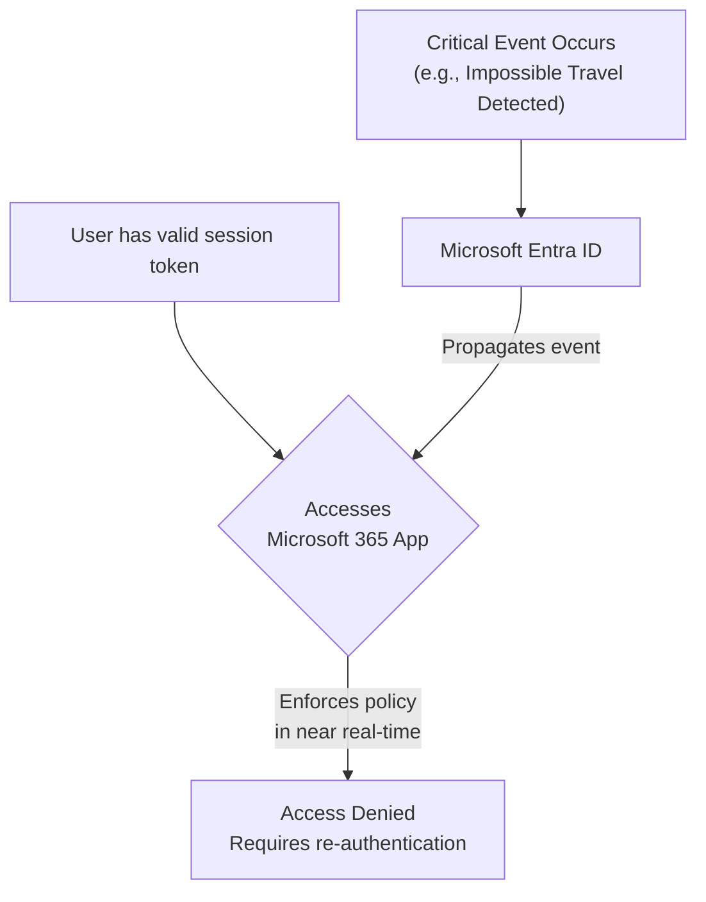

# Azure AD Evolution: Identity & Access Management in the AI Era

Welcome to 2026. The traditional corporate network perimeter has dissolved, our workforces are globally distributed, and AI agents are performing tasks alongside human employees. In this new reality, the old model of "trust but verify" is obsolete. Identity is the new control plane, and the way we manage it has undergone a radical transformation.

Microsoft's identity platform, once known as Azure Active Directory and now the core of the Microsoft Entra suite, has evolved from a directory service into a sophisticated, AI-driven identity and access management (IAM) engine. This article explores the critical advancements that define modern IAM and how you can leverage them.

Before we dive in, what's your single biggest IAM challenge today? Is it managing hybrid access, preventing sophisticated phishing attacks, or securing non-human identities? Let's see how the landscape has changed.

### What You'll Get

*   **Zero Trust in Action:** An overview of how Continuous Access Evaluation has replaced static authentication.
*   **AI-Powered Defense:** Insight into how AI and machine learning are proactively detecting identity threats.
*   **The Passwordless Standard:** A look at why passwordless methods are now the baseline for secure organizations.
*   **Unified Hybrid Access:** Understanding granular access controls for both cloud and on-premises resources without a traditional VPN.

---

## The New Paradigm: Continuous Verification

The era of authenticating once at the start of a session is over. The sheer dynamism of today's environments—where users can switch networks, devices, or locations in an instant—demands constant verification. This is the core principle of a true Zero Trust architecture.

**Continuous Access Evaluation (CAE)** is the mechanism that makes this possible. Instead of relying on a token's pre-defined lifetime (which could be an hour or more), CAE enables resource providers (like Exchange Online or SharePoint Online) to respond to security events in near real-time.

Key CAE triggers include:
*   User account is disabled or deleted.
*   Password for a user is changed or reset.
*   A user's session is explicitly revoked by an admin.
*   A user's risk level, as detected by Entra ID Protection, changes.

This flow ensures that a change in identity state or context is acted upon immediately, not at the next token expiration.



> **Note:** CAE is a standard-based initiative, built on the [Shared Signals and Events framework](https://openid.net/sse/) at the OpenID Foundation. This ensures interoperability between identity providers and resource providers.

## AI-Powered Identity Protection at Scale

The volume of signals—logins, device health, location data, resource access patterns—is far too vast for human analysis. By 2026, AI is no longer just an assistant; it's the cornerstone of a resilient identity defense strategy. Microsoft Entra's AI models analyze trillions of signals daily to identify and mitigate threats proactively.

### Proactive Threat Hunting

Instead of just reacting to known attack patterns, the system now uses predictive analytics to spot emerging threats. This includes:

*   **Anomalous Token Usage:** Identifying tokens used in unfamiliar locations or with unusual claims, which could indicate theft via techniques like pass-the-cookie.
*   **Impossible Travel:** The classic example, now enhanced with machine learning to better understand typical user behavior and reduce false positives.
*   **Service Principal & Workload Identity Risk:** AI models now profile the behavior of applications and managed identities, detecting when a service principal is compromised and being used for lateral movement.

### Adaptive Access Policies

Conditional Access policies are no longer static rule sets. They are dynamic, living policies that adapt based on a real-time, AI-calculated risk score for each sign-in and session.

A modern policy doesn't just check for group membership; it assesses the entire context of an access request. For example, you can create a policy that enforces phishing-resistant MFA only when a user's session risk moves from "low" to "medium," without interrupting their workflow otherwise.

Here's a conceptual example of what a Conditional Access policy targeting a risky AI-driven workload identity might look like in its JSON representation:

```json
{
  "displayName": "Block High-Risk Service Principals from Key Vaults",
  "state": "enabled",
  "conditions": {
    "servicePrincipalRiskLevels": [
      "high"
    ],
    "applications": {
      "includeApplications": [ "all" ]
    },
    "clientAppTypes": [
      "all"
    ]
  },
  "grantControls": {
    "operator": "OR",
    "builtInControls": [
      "block"
    ],
    "customAuthenticationFactors": [],
    "termsOfUse": []
  }
}
```
This policy blocks any service principal whose risk level is evaluated as "high" from accessing any application, effectively quarantining a potentially compromised workload identity.

## The End of the Password Era

By 2026, the industry has fully acknowledged that passwords, even when paired with traditional MFA, are a fundamental security liability. Phishing attacks have become so sophisticated that they can easily bypass push notifications or one-time passcodes.

The standard for secure organizations is now **phish-resistant, passwordless authentication.**

### Beyond Traditional MFA

The focus has shifted entirely to methods that are cryptographically bound to the device they were registered on. This eliminates the risk of a user being tricked into revealing a credential on a fake website.

| Authentication Method | Security Level | User Experience | Phishing Resistance |
| :--- | :--- | :--- | :--- |
| Password Only | Low | Poor | Very Low |
| Password + Push MFA | Medium | Fair | Low |
| **Passwordless (Passkeys/FIDO2)** | **High** | **Excellent** | **Very High** |

The primary methods are:
*   **Passkeys:** Based on the FIDO standard, passkeys (supported by Windows Hello, mobile devices, and security keys like YubiKey) provide a seamless and highly secure sign-in experience.
*   **Microsoft Authenticator:** The app's passwordless sign-in feature requires the user to match a number on the screen, ensuring they are present at the legitimate sign-in location.

For more information on the journey to this state, review Microsoft's foundational guidance on [passwordless authentication concepts](https://learn.microsoft.com/en-us/azure/active-directory/authentication/concept-passwordless-authentication).

## Unifying Access Across a Hybrid World

The final piece of the modern IAM puzzle is solving the hybrid access challenge. Organizations can't simply abandon decades of investment in on-premises applications. For years, the solution was a clunky, high-risk VPN.

Today, this is handled through Microsoft's Security Service Edge (SSE) solution, which extends the power of Entra to all resources, regardless of their location.

### Granular Controls for Cloud and On-Prem

**Microsoft Entra Private Access** and **Microsoft Entra Internet Access** have fundamentally changed the game. Instead of granting broad network-level access like a VPN, these services provide secure, identity-aware access to specific applications.

*   An engineer can be granted access to a specific on-premises Git repository over TCP port 22, and nothing else on that server.
*   A finance user can access a legacy on-prem ERP system through a web browser, with the session secured by the same Conditional Access policies that protect Microsoft 365.
*   All traffic is inspected, and access can be revoked in real-time based on CAE triggers.

> **Key Takeaway:** The identity plane is the control plane. Access is granted based on *who you are*, *what your context is*, and *what you're trying to access*—not where you or the resource are located.

## Preparing for the Future of IAM

The evolution of Azure AD into the comprehensive Microsoft Entra identity platform reflects a fundamental shift in cybersecurity. The future of IAM is continuous, predictive, passwordless, and unified. By embracing these principles, organizations can build a security posture that is resilient enough for the challenges of the AI era.

What steps is your organization taking to adapt to this new reality? The journey is ongoing, but the direction is clear: a more secure and seamless future is built on a foundation of strong, modern identity.


## Further Reading

- [https://docs.microsoft.com/azure/active-directory/overview](https://docs.microsoft.com/azure/active-directory/overview)
- [https://azure.microsoft.com/en-us/blog/iam-future-2026](https://azure.microsoft.com/en-us/blog/iam-future-2026)
- [https://techcommunity.microsoft.com/t5/azure-active-directory/ai-driven-iam-trends](https://techcommunity.microsoft.com/t5/azure-active-directory/ai-driven-iam-trends)
- [https://csoonline.com/article/azure-ad-security-best-practices](https://csoonline.com/article/azure-ad-security-best-practices)
- [https://learn.microsoft.com/azure/active-directory/authentication/concept-passwordless-authentication](https://learn.microsoft.com/azure/active-directory/authentication/concept-passwordless-authentication)
