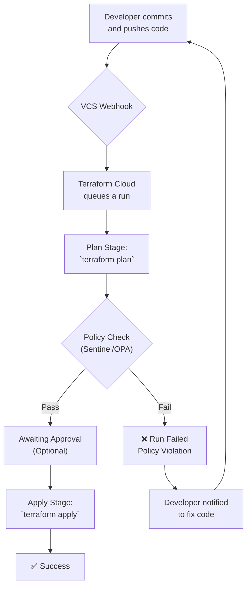

# Terraform Cloud & Enterprise: Embracing Policy as Code (PaC)

In the world of Infrastructure as Code (IaC), speed and agility are paramount. But as organizations scale, a critical challenge emerges: how do you move fast without breaking things? Unchecked infrastructure deployments can lead to security vulnerabilities, compliance drift, and runaway costs. By 2026, manual reviews and post-deployment audits are no longer sufficient. The answer is proactive, automated governance through **Policy as Code (PaC)**.

Policy as Code embeds your organization's rules, security standards, and best practices directly into your IaC workflow. Terraform Cloud and Terraform Enterprise are the premier platforms for this, providing powerful frameworks to ensure every `terraform apply` is safe, compliant, and cost-effective *before* it ever touches your production environment. This guide dives into the practical implementation of PaC with Terraform, focusing on its two main engines: Sentinel and Open Policy Agent (OPA).

### What You'll Get

*   **Core Principles:** A clear understanding of why PaC is a foundational practice for modern IaC.
*   **Tool Comparison:** A practical breakdown of HashiCorp Sentinel vs. Open Policy Agent (OPA).
*   **Real-World Policies:** Actionable code examples for enforcing security, cost, and tagging conventions.
*   **Workflow Integration:** A visual guide to embedding policy checks directly into your deployment pipeline.
*   **Implementation Strategy:** How to use enforcement levels to roll out PaC without disrupting development.

---

## Why Policy as Code is Non-Negotiable

As infrastructure complexity grows, relying on wiki pages, checklists, and manual pull request reviews becomes untenable. These methods are slow, error-prone, and inconsistent. PaC formalizes this tribal knowledge into executable code, providing a single source of truth for infrastructure governance.

The core benefit is a shift from *reactive remediation* to *proactive prevention*. Instead of fixing a misconfigured security group after it's deployed, you prevent it from ever being created.

Key advantages include:
*   **🛡️ Enhanced Security:** Automatically enforce rules like disallowing public S3 buckets, restricting SSH access from the open internet (`0.0.0.0/0`), or requiring encryption on all data stores.
*   **💰 Cost Management:** Prevent developers from provisioning oversized, expensive machine instances or deploying resources in unapproved, costly regions.
*   **✅ Compliance Automation:** Ensure your infrastructure adheres to regulatory frameworks like HIPAA, PCI-DSS, or GDPR by codifying their technical requirements.
*   **🚀 Developer Velocity:** Provide teams with immediate, automated feedback directly in their workflow. This is far more efficient than a bottlenecked manual review process.

> **Pro-Tip:** PaC empowers developers by making the "right way" the "easy way." Clear, automated guardrails give them the confidence to innovate safely.

## The PaC Engines: Sentinel vs. OPA

Terraform Cloud and Enterprise offer two first-class options for implementing PaC. Choosing the right one depends on your organization's technology stack and strategic goals.

### HashiCorp Sentinel: The Native Choice

Sentinel is HashiCorp's proprietary, purpose-built PaC framework. Its language is designed to feel familiar to anyone who writes HCL, making the learning curve gentle for Terraform users. Its greatest strength is its deep, native integration into the Terraform workflow.

*   **Tight Integration:** Sentinel has direct access to Terraform's plan, state, and configuration data through special imports like `tfplan/v2` and `tfconfig/v2`. This makes writing policies against resource attributes incredibly straightforward.
*   **Familiar Syntax:** The policy language is readable and intentionally simple.
*   **Ecosystem-Focused:** It's the ideal choice for teams heavily invested in the HashiCorp ecosystem (Terraform, Vault, Consul, Nomad).

```sentinel
# A simple Sentinel policy to enforce a "owner" tag on all AWS resources.
import "tfplan/v2" as tfplan

# Rule: all resources must have an "owner" tag
main = rule {
  all tfplan.resource_changes as _, rc {
    rc.change.after.tags.owner is not null
  }
}
```

### Open Policy Agent (OPA): The Universal Standard

[OPA](https://www.openpolicyagent.org/) is a powerful, open-source policy engine and a graduated project of the Cloud Native Computing Foundation (CNCF). It uses a declarative language called **Rego** to enforce policies across a massive range of technologies, including Kubernetes, APIs, and CI/CD pipelines.

Terraform Cloud (Business tier) supports OPA by converting the Terraform plan into a JSON object, which your Rego policies can then evaluate.

*   **Vendor-Agnostic:** If you need a single policy language to govern Terraform, Kubernetes, and your microservices, OPA is the strategic choice.
*   **Powerful Language:** Rego is more expressive and powerful than Sentinel, capable of complex logic and data manipulation, though it comes with a steeper learning curve.
*   **Strong Community:** As a CNCF project, it benefits from a large, active community and a rich ecosystem of tooling.

| Feature             | HashiCorp Sentinel                                 | Open Policy Agent (OPA)                                 |
| ------------------- | -------------------------------------------------- | ------------------------------------------------------- |
| **Language**        | Sentinel (HCL-like)                                | Rego                                                    |
| **Integration**     | Native, deep access to Terraform internals         | Via JSON representation of the Terraform plan           |
| **Learning Curve**  | Lower for Terraform users                          | Steeper, but more powerful                              |
| **Ecosystem**       | Best for HashiCorp-centric stacks                  | Universal, ideal for polyglot/cloud-native environments |
| **Availability**    | All paid tiers of Terraform Cloud & Enterprise     | Terraform Cloud Business tier & Enterprise              |

## Practical PaC Implementation

Theory is great, but code is better. Here are some real-world examples you can adapt for your organization.

### Example 1: Sentinel Policy for Cost Control

This policy restricts AWS EC2 instances to a pre-approved list of types, preventing accidental deployment of expensive, high-performance machines.

```sentinel
# policies/enforce-approved-instance-types.sentinel
import "tfplan/v2" as tfplan
import "strings"

# Allowed instance types for general purpose workloads
allowed_types = [
  "t3.micro",
  "t3.small",
  "t3.medium",
  "m5.large",
]

# Find all AWS instances in the plan
aws_instances = filter tfplan.resource_changes as _, rc {
  rc.type is "aws_instance" and rc.mode is "managed"
}

# Rule: validate that instance_type is in the allowed list
main = rule {
  all aws_instances as _, instance {
    strings.has_prefix(instance.change.after.instance_type, "t3.") or
    strings.has_prefix(instance.change.after.instance_type, "m5.")
  }
}
```

### Example 2: OPA Policy for Network Security

This OPA policy, written in Rego, denies any AWS security group ingress rule that allows traffic from the entire internet (`0.0.0.0/0`), except for standard web ports 80 and 443.

```rego
# policies/restrict-public-ingress.rego
package terraform.analysis

import input.resource_changes as rc

# Deny if a security group rule has an open CIDR block
deny[msg] {
    # Find all aws_security_group_rule resources
    rule := rc[_]
    rule.type == "aws_security_group_rule"
    rule.change.after.type == "ingress"

    # Check if any CIDR block is 0.0.0.0/0
    cidr_blocks := rule.change.after.cidr_blocks
    contains(cidr_blocks[_], "0.0.0.0/0")

    # Allow if it's for port 80 or 443
    not allowed_open_port(rule.change.after)

    # Set the failure message
    msg := sprintf("Security group rule '%s' allows unrestricted public access.", [rule.address])
}

# Helper function to check for allowed ports
allowed_open_port(rule) {
    rule.from_port == 80
    rule.to_port == 80
}

allowed_open_port(rule) {
    rule.from_port == 443
    rule.to_port == 443
}
```

## Integrating PaC into Your Workflow

PaC is not a separate, isolated step. It's a critical, automated gate within the core Terraform Cloud/Enterprise run workflow.

Here is a high-level view of the process:



This automated feedback loop ensures that no non-compliant infrastructure is ever provisioned, saving time, money, and reducing risk.

## Enforcement Levels: A Phased Rollout

Introducing strict policies overnight can be disruptive. Terraform Cloud provides three enforcement levels to help you roll out PaC gradually:

*   **Advisory:** Policies are checked and a warning is displayed if they fail, but the `apply` is not blocked. This is perfect for introducing new policies and gauging their impact without stopping work.
*   **Soft-Mandatory:** A policy failure will fail the run, but a user with appropriate permissions can override the failure and proceed with the `apply`. This is useful for handling legitimate exceptions.
*   **Hard-Mandatory:** A policy failure stops the run completely. No overrides are possible. This should be reserved for your most critical security, compliance, and cost-related rules.

## Your Turn

Policy as Code is a journey, not a destination. It transforms infrastructure governance from a manual chore into an automated, reliable, and scalable process. By leveraging the power of Sentinel or OPA within Terraform Cloud and Enterprise, you can build guardrails that empower your teams to build quickly and safely.

Start by identifying your top 3-5 most critical infrastructure rules, codify them with an `advisory` enforcement level, and iterate from there.

**What are the most critical policies your organization needs today?** Share your top PaC requirements in the comments below


## Further Reading

- [https://www.hashicorp.com/products/terraform/sentinel](https://www.hashicorp.com/products/terraform/sentinel)
- [https://www.openpolicyagent.org/docs/latest/terraform](https://www.openpolicyagent.org/docs/latest/terraform)
- [https://docs.hashicorp.com/terraform/cloud/run/policy-as-code](https://docs.hashicorp.com/terraform/cloud/run/policy-as-code)
- [https://spacelift.io/blog/policy-as-code-terraform](https://spacelift.io/blog/policy-as-code-terraform)
- [https://cncf.io/blog/opa-terraform-best-practices](https://cncf.io/blog/opa-terraform-best-practices)
