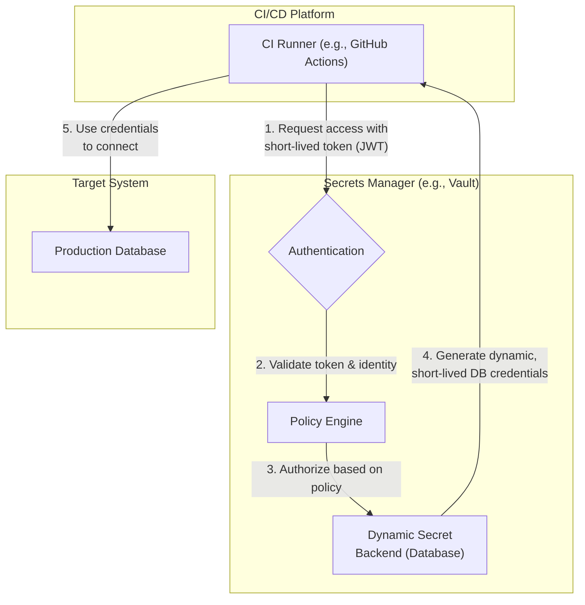

# Advanced Secrets Management for DevSecOps Pipelines

In modern software delivery, speed is paramount. But as we accelerate, the risk of exposing sensitive credentials—API keys, database passwords, TLS certificates—grows exponentially. How many of your CI/CD pipelines still rely on static environment variables or, worse, credentials checked into source control? By 2026, this won't just be bad practice; it will be a critical vulnerability.

Effective secrets management is the bedrock of a mature DevSecOps practice. It’s about moving beyond static, long-lived credentials to a dynamic, automated, and auditable system. This article dives into the advanced strategies and tools you need to secure your development lifecycle, from code commit to production deployment.

### What You'll Get

*   **The "Why":** Understand the critical risks of outdated secrets management practices.
*   **Core Principles:** Learn about dynamic secrets, rotation, and least privilege access.
*   **Tooling Deep Dive:** A comparison of industry leaders: HashiCorp Vault, AWS Secrets Manager, and Azure Key Vault.
*   **Practical Integration:** See how to integrate a secrets manager into your CI/CD pipeline with diagrams and code examples.
*   **Future-Forward Strategies:** A look at "Secrets Zero" and policy-as-code for ultimate security.

---

## The Problem: Static Secrets and Secret Sprawl

For years, the standard was simple: store secrets in configuration files or environment variables. This approach is fraught with peril in a cloud-native, automated world.

*   **Secret Sprawl:** Credentials are scattered across developer machines, CI/CD settings, config files, and deployment scripts. This creates a massive, undefendable attack surface.
*   **Hardcoded Credentials:** Committing secrets to Git is a cardinal sin, yet it happens. Once exposed, a secret should be considered compromised forever, even if the commit history is rewritten.
*   **Lack of Rotation:** Static secrets are rarely changed. A leaked database password from six months ago could still provide an attacker with access today.
*   **Excessive Permissions:** A single API key used for an entire application often has far more permissions than any single task requires, violating the principle of least privilege.

> **Info Block:** According to the [2023 Verizon Data Breach Investigations Report](https://www.verizon.com/business/resources/reports/dbir/), the use of stolen credentials remains a leading cause of data breaches. Securing them isn't optional; it's essential.

## Core Principles of Modern Secrets Management

To combat these risks, modern secrets management is built on a few key principles. Your chosen tool should enable and enforce them.

1.  **Centralization:** All secrets are stored, managed, and accessed through a single, secure, and auditable system—a "vault." This eliminates secret sprawl.
2.  **Dynamic Secrets:** Instead of static, long-lived credentials, the system generates secrets *on-demand* for a specific task. These secrets have a short Time-To-Live (TTL) and expire automatically. For example, a CI job gets a unique database password that's only valid for the 5 minutes the job runs.
3.  **Automated Rotation:** For secrets that must be longer-lived (like a root database user), the secrets manager automatically rotates them on a defined schedule without human intervention.
4.  **Principle of Least Privilege (PoLP):** Every application, user, or service should only have the minimum permissions necessary to perform its function. Your secrets manager should enforce this with granular access policies.

## Choosing Your Secrets Manager

Several powerful tools dominate the market. The right choice often depends on your existing ecosystem—whether you're cloud-native, multi-cloud, or on-premises.

| Feature                 | HashiCorp Vault                                    | AWS Secrets Manager                                  | Azure Key Vault                                        |
| ----------------------- | -------------------------------------------------- | ---------------------------------------------------- | ------------------------------------------------------ |
| **Best For**            | Multi-cloud, hybrid, platform-agnostic environments | Deeply integrated AWS workloads                     | Azure-centric environments                             |
| **Secret Types**        | Key/Value, Dynamic DB, Cloud IAM, PKI certs        | Key/Value, RDS, Redshift, DocumentDB credentials     | Secrets, Keys, Certificates                            |
| **Dynamic Secrets**     | Extensive support for many backends               | Primarily for AWS services (e.g., RDS)             | Limited; relies more on rotation                       |
| **Authentication**      | Tokens, AppRole, JWT/OIDC, Cloud IAM, LDAP         | IAM Roles/Users                                      | Azure AD Managed Identities, Service Principals        |
| **Extensibility**       | Highly extensible with a rich plugin ecosystem     | Limited, focused on AWS ecosystem integration      | Integrated with Azure services                         |
| **Official Docs**       | [vaultproject.io](https://www.vaultproject.io/docs)  | [aws.amazon.com](https://aws.amazon.com/secrets-manager/) | [docs.microsoft.com](https://docs.microsoft.com/azure/key-vault/) |

### HashiCorp Vault
Vault is the gold standard for platform-agnostic secrets management. Its strength lies in its incredible flexibility and its robust model for dynamic secrets across databases, cloud providers (AWS, Azure, GCP), messaging queues, and more.

### AWS Secrets Manager
For organizations committed to the AWS ecosystem, Secrets Manager is a natural fit. Its killer feature is its seamless, automated rotation of credentials for services like Amazon RDS, Redshift, and DocumentDB, managed entirely through familiar IAM policies.

### Azure Key Vault
Azure Key Vault is the cornerstone of security in the Azure cloud. It excels at managing not just application secrets but also cryptographic keys and TLS/SSL certificates, with tight integration into Azure Active Directory for authentication via Managed Identities.

## Integrating Secrets into Your CI/CD Pipeline

The goal is to eliminate static secrets from your CI/CD platform. Instead, the pipeline authenticates itself to the secrets manager using a trusted identity and fetches secrets dynamically for each run.

This flow diagram illustrates the modern approach:



### How It Works in Practice

Modern CI/CD platforms can present a verifiable identity to a secrets manager. For example, GitHub Actions can provide a short-lived OIDC token that Vault, AWS, or Azure can be configured to trust.

Here is a conceptual example of a GitHub Actions workflow retrieving a database password from HashiCorp Vault:

```yaml
# .github/workflows/deploy.yml
name: Deploy to Production

jobs:
  deploy:
    runs-on: ubuntu-latest
    # Configure permissions for the OIDC token
    permissions:
      id-token: write
      contents: read

    steps:
      - name: 'Import Secrets from Vault'
        uses: hashicorp/vault-action@v2
        with:
          url: https://vault.example.com
          role: 'github-actions-role' # The pre-configured role in Vault
          method: 'jwt' # Authenticate using the GitHub OIDC token

      - name: 'Run Database Migration'
        run: |
          # The secret is now available as an environment variable
          ./run-migrations.sh --username "${{ env.DB_USERNAME }}" --password "${{ env.DB_PASSWORD }}"
        env:
          # The vault-action exports secrets as masked environment variables
          DB_USERNAME: ${{ steps.import_secrets.outputs.db_username }}
          DB_PASSWORD: ${{ steps.import_secrets.outputs.db_password }}
```
In this flow:
1.  GitHub generates a unique JWT for the job run.
2.  The `vault-action` presents this JWT to Vault.
3.  Vault validates the JWT and confirms it came from the expected repository and workflow.
4.  If valid, Vault grants a token tied to a policy that allows reading the database secret.
5.  The action fetches the secret and injects it into the job's environment. The credential expires shortly after the job completes.

*Result: No long-lived secrets are ever stored in GitHub.*

## Advanced Strategies for 2026 and Beyond

The landscape continues to evolve. Staying ahead means adopting even more sophisticated patterns.

### ### Secrets Zero: Just-in-Time Access
The ultimate goal is "Secrets Zero," where applications and services *never* handle long-lived credentials. Instead, they are given ephemeral, just-in-time (JIT) credentials for every single operation. This is an evolution of dynamic secrets where the TTL is measured in seconds or minutes, not hours. Tools like HashiCorp Vault and emerging solutions are making this pattern more accessible.

### ### Policy as Code (PaC)
Don't manage access permissions through a UI. Codify them.
*   **HashiCorp Sentinel:** A powerful PaC framework for enforcing fine-grained, logic-based policies within Vault.
*   **AWS IAM / Azure Policies:** Use Terraform or CloudFormation to define and manage who and what can access your secrets manager.

This makes your security posture version-controlled, auditable, and repeatable.

### ### Automated Auditing and Anomaly Detection
Your secrets manager is a honeypot. Every access request—successful or not—must be logged to a central, tamper-proof location. Use this audit trail to set up alerts for suspicious behavior, such as:
*   Access from an unusual IP address.
*   A user or service accessing an unusually high number of secrets.
*   Repeated failed authentication attempts.

## Conclusion

Transitioning to a modern secrets management strategy is a fundamental step in maturing your DevSecOps practice. By centralizing secrets, embracing dynamic generation, and integrating securely with your CI/CD pipelines, you dramatically reduce your attack surface and build more resilient, secure applications. Stop treating secrets as static configuration and start managing them as dynamic, ephemeral resources. Your security posture in 2026 will depend on it.


## Further Reading

- [https://www.vaultproject.io/docs](https://www.vaultproject.io/docs)
- [https://aws.amazon.com/secrets-manager](https://aws.amazon.com/secrets-manager)
- [https://docs.microsoft.com/azure/key-vault/general/overview](https://docs.microsoft.com/azure/key-vault/general/overview)
- [https://devsecops.org/tools/secrets-management](https://devsecops.org/tools/secrets-management)
- [https://snyk.io/blog/secrets-management-best-practices](https://snyk.io/blog/secrets-management-best-practices)
