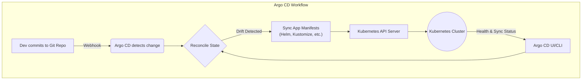

# GitOps with Argo CD & Flux CD: The Evolution of Cloud-Native Ops

GitOps has officially moved beyond the buzzword phase. In 2026, it's the bedrock of modern cloud-native operations. For any organization serious about velocity, reliability, and security in their Kubernetes deployments, GitOps isn't a choice—it's the standard. At the heart of this revolution are two CNCF-graduated titans: Argo CD and Flux CD. They've matured from simple sync tools into sophisticated control planes, shaping how we build and manage software.

This article dissects the state of GitOps in 2026, focusing on the evolution of its most powerful tools. We'll explore how they've mastered advanced deployment patterns, enterprise-grade multi-tenancy, and deep ecosystem integrations.

### What You'll Get

*   **State of the Union:** A clear look at the roles of Argo CD and Flux CD in today's cloud-native landscape.
*   **Advanced Features Deep Dive:** Analysis of mature capabilities like progressive delivery, multi-cluster management, and integrated security.
*   **Architectural Insight:** Mermaid diagrams and tables to visualize complex workflows and compare tool philosophies.
*   **Ecosystem Integration:** Understanding how GitOps tools act as the central hub for IaC, secrets, and observability.
*   **A Glimpse of the Future:** Where GitOps is headed next.

## The GitOps Principle: A Quick Refresher

Before diving deep, let's realign on the core concept. GitOps uses a Git repository as the single source of truth for declarative infrastructure and applications. An automated agent ensures that the live state of your production environment matches the state defined in the repository.

Why is this so powerful?
*   **Declarative:** You define the *desired state* in Git, not the imperative steps to get there.
*   **Versioned & Auditable:** Every change is a Git commit. You get a perfect audit log of who changed what, when, and why, with the ability to revert instantly.
*   **Automated:** Changes approved in Git are automatically rolled out to the cluster, eliminating manual `kubectl` errors.
*   **Secure:** Direct cluster access (e.g., `kubectl`) is minimized, strengthening your security posture.

## The Titans of GitOps: Argo CD vs. Flux CD in 2026

While both tools execute the core GitOps loop, they've matured with distinct philosophies, catering to different organizational needs. The "which is better" debate has been replaced by "which is the right fit for our workflow."

### Argo CD: The Application-Centric Control Plane

Argo CD has solidified its position as the go-to for teams that prioritize user experience and multi-tenant application management. Its web UI remains best-in-class, providing unparalleled visibility into application health and sync status.

*   **Key Strengths in 2026:**
    *   **Powerful UI:** The dashboard is no longer just for visibility; it's an interactive control plane for developers and operators.
    *   **ApplicationSets:** The `ApplicationSet` controller has become incredibly robust, enabling automated management of applications across hundreds of clusters from a single template.
    *   **Enterprise Multi-Tenancy:** Advanced RBAC, SSO integration, and project-level isolation are mature, making it ideal for large organizations where multiple teams share clusters.
    *   **AI-Assisted Drift Detection:** Newer versions have integrated machine learning models that not only detect drift but also predict potential configuration conflicts before a sync occurs.



> **From the Field:** "We chose Argo CD because it empowers our developers. They can visualize their deployments, check sync status, and use self-service features without ever needing `kubectl` access. The UI lowered the barrier to entry for GitOps across our entire engineering org."

### Flux CD: The Composable, Kubernetes-Native Toolkit

Flux CD has leaned into its strength as a composable set of tools built directly on Kubernetes APIs (CRDs). It's the preferred choice for platform engineers who want a highly customizable and automated GitOps engine that integrates seamlessly with other cloud-native tools.

*   **Key Strengths in 2026:**
    *   **Deep Integration:** Flux's controllers for sources, Kustomizations, and Helm releases work harmoniously with other ecosystem tools like Flagger for progressive delivery and Crossplane for infrastructure provisioning.
    *   **OCI Support as Standard:** Storing Kubernetes manifests and Helm charts as OCI artifacts in container registries (like Harbor) is now the default pattern, improving security and dependency management.
    *   **Extensibility:** Because it's just a collection of controllers, you can pick and choose the components you need, creating a lean, powerful GitOps agent tailored to your exact requirements.
    *   **Security First:** Seamless integration with tools like Kyverno and OPA allows for pre-sync policy checks, ensuring that non-compliant manifests are never applied to the cluster.

| Feature | Argo CD | Flux CD |
| :--- | :--- | :--- |
| **Primary Model** | Application-centric | Toolkit / Composable Controllers |
| **User Interface** | Rich, interactive Web UI | Primarily CLI and Grafana dashboards |
| **Multi-Tenancy** | Built-in via "Projects" | Achieved via Kubernetes RBAC & Namespaces |
| **Extensibility** | Plugin system | Composing controllers with other tools |
| **Best For** | Orgs needing a centralized UI, developer self-service | Platform teams building a custom, integrated CI/CD |

## Evolution of Key Features

The true story of GitOps in 2026 is how advanced patterns have become standard, built-in features.

### Progressive Delivery, Perfected

Gone are the days of risky "big bang" deployments. Progressive delivery is now a core tenet of GitOps, and both Argo and Flux have first-class support for it.

*   **Argo Rollouts:** This Argo sub-project is a mature, powerful workload controller that provides advanced Canary, Blue/Green, and experiment-based deployment strategies out of the box. It integrates with service meshes (like Istio, Linkerd) and ingress controllers to precisely manage traffic shifting.
*   **Flux + Flagger:** Flagger is the progressive delivery tool for the Flux ecosystem. It automates the release process by monitoring key metrics (latency, error rate) from Prometheus or Datadog. If KPIs degrade during a canary release, Flagger automatically rolls back the deployment and halts the pipeline.

This flow is now standard practice for any user-facing service:

```mermaid
sequenceDiagram
    participant Dev
    participant Git
    participant Flux
    participant Flagger
    participant Cluster

    Dev->>Git: Push new image tag for App v2
    Git->>Flux: Notify of change
    Flux->>Cluster: Update Deployment (app: v2)
    activate Flagger
    Flagger->>Cluster: Create Canary Pods (app: v2)
    Flagger->>Cluster: Shift 5% traffic to Canary
    loop Health Check (e.g., 5 mins)
        Flagger->>Prometheus: Query metrics for Canary
        alt KPIs OK
            Flagger->>Cluster: Increase traffic (e.g., to 25%)
        else KPIs Bad
            Flagger->>Cluster: Abort! Rollback traffic to v1
            Flagger->>Cluster: Scale down Canary Pods
            break
        end
    end
    Flagger->>Cluster: Promote v2, scale down v1
    deactivate Flagger
```

### The Security Posture: Shifting Everywhere

GitOps provides an inherent security win with its audit trail. By 2026, this has evolved into a comprehensive, multi-layered security strategy.

1.  **In-Git:** Static analysis of manifests and security scans of code happen via pre-commit hooks and CI pipeline steps.
2.  **Pre-Sync:** Both Argo and Flux can integrate with policy engines like [OPA Gatekeeper](https://github.com/open-policy-agent/gatekeeper) or [Kyverno](https://kyverno.io/). Before a sync is executed, manifests are validated against company policies (e.g., "no public LoadBalancers," "all images must come from our trusted registry").
3.  **Post-Sync:** The GitOps agent continuously monitors for configuration drift, immediately reverting any unauthorized manual changes made to the cluster. This creates a self-healing loop that enforces the Git state.

## The Broader Ecosystem Integration

GitOps tools no longer live in isolation. They are the central reconciliation loop for a vast cloud-native ecosystem.

*   **Infrastructure as Code (IaC):** Platform teams use tools like [Crossplane](https://www.crossplane.io/) to define cloud resources (databases, message queues, VPCs) as Kubernetes YAMLs. These manifests are stored in Git and reconciled by Flux or Argo, truly unifying application and infrastructure management.
*   **Secrets Management:** Solutions like [External Secrets Operator](https://external-secrets.io/) or HashiCorp Vault integration are standard. Secrets are not stored in Git. Instead, a reference to the secret in the vault is stored, and the operator fetches the actual secret and injects it into the cluster at runtime.
*   **Observability:** Metrics, logs, and events from the GitOps tools themselves are scraped by Prometheus and visualized in Grafana. This provides a complete picture of deployment velocity, sync failures, and reconciliation latency.

## Conclusion: GitOps is the Engine of Modern Ops

By 2026, GitOps, powered by mature tools like Argo CD and Flux CD, has become the definitive operational model for Kubernetes. It delivers on the original promise of cloud-native: speed with stability, automation with control.

The evolution from simple sync tools to comprehensive control planes with built-in progressive delivery, deep security integration, and ecosystem awareness is complete. Whether you prefer Argo's application-centric UI or Flux's composable toolkit, adopting a GitOps workflow is the single most impactful step you can take to streamline your operations.

**What are your GitOps success stories? Share your experiences and challenges in the comments below!**


## Further Reading

- [https://argo-cd.readthedocs.io/en/stable/](https://argo-cd.readthedocs.io/en/stable/)
- [https://fluxcd.io/docs/](https://fluxcd.io/docs/)
- [https://opengitops.dev/resources/](https://opengitops.dev/resources/)
- [https://cncf.io/blog/gitops-state-2026](https://cncf.io/blog/gitops-state-2026)
- [https://weave.works/blog/gitops-best-practices](https://weave.works/blog/gitops-best-practices)
