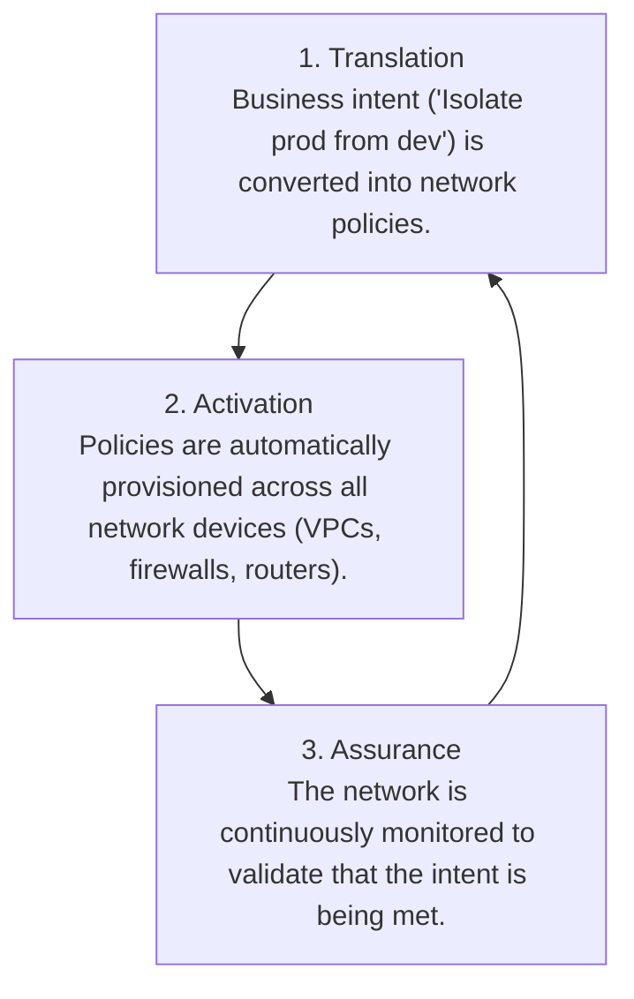
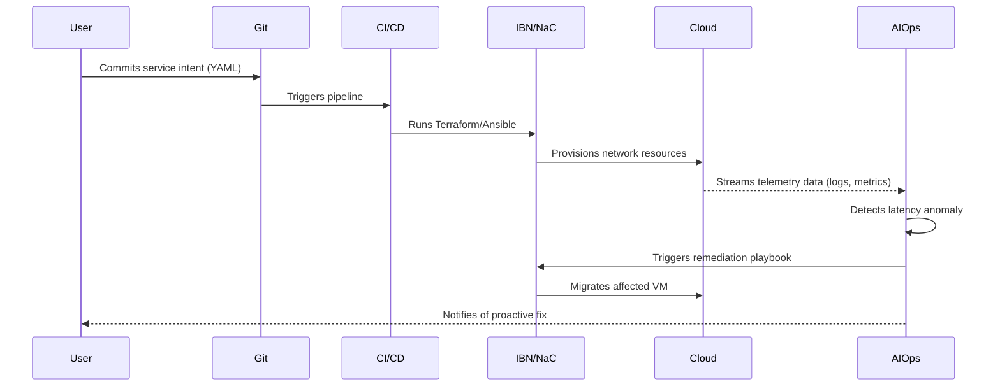

# Next-Gen Cloud Networking: Programmable Infrastructure & AI Ops

Cloud networking is no longer about manually configuring routers and firewalls through a command-line interface. The scale and complexity of modern, multi-cloud environments have rendered traditional approaches slow, error-prone, and unsustainable. The future, which is rapidly becoming the present, is built on programmable infrastructure, declarative intent, and AI-driven operations.

By 2026, the networks that power our applications will be managed less by humans and more by intelligent, automated systems. This article explores this shift, breaking down the core technologies that are making it possible.

### What You'll Get

*   A clear view of the future state of cloud networking.
*   An explanation of Network as Code (NaC) and Intent-Based Networking (IBN).
*   Insight into how AIOps is transforming network monitoring and security.
*   A practical, end-to-end example of these technologies in action.
*   A breakdown of the key benefits and challenges you'll face.

## The Shift to Programmable Infrastructure

The core problem with traditional networking is its imperative nature. An engineer must manually specify *how* to achieve a goal, step-by-step, across numerous devices. This leads to configuration drift, inconsistencies, and a high potential for human error.

Programmable infrastructure flips this model on its head. It treats network configuration as software, a practice known as Network as Code (NaC).

### What is Network as Code (NaC)?

Network as Code is the practice of managing and provisioning network infrastructure through machine-readable definition files, rather than physical hardware configuration or interactive configuration tools. Think of it as DevOps for your network.

*   **Declarative Definitions:** You define the *desired state* of your network using tools like Terraform, Pulumi, or Ansible.
*   **Version Control:** All network configurations are stored in a Git repository. This provides a full history of changes, enables peer reviews, and allows for easy rollbacks.
*   **Automation:** CI/CD pipelines can automatically test and apply network changes, drastically reducing deployment times.
*   **Repeatability:** Spin up identical development, staging, and production network environments with a single command.

Here's a simple example of defining an AWS VPC with Terraform. Instead of clicking through the AWS console, you define it in code:

```terraform
# main.tf

provider "aws" {
  region = "us-east-1"
}

resource "aws_vpc" "main" {
  cidr_block       = "10.0.0.0/16"
  instance_tenancy = "default"

  tags = {
    Name = "production-vpc"
  }
}

resource "aws_subnet" "public_a" {
  vpc_id     = aws_vpc.main.id
  cidr_block = "10.0.1.0/24"
  availability_zone = "us-east-1a"

  tags = {
    Name = "public-subnet-a"
  }
}
```

This code is testable, reusable, and provides a single source of truth for your network's architecture.

## Intent-Based Networking (IBN): Declaring Outcomes, Not Commands

While NaC provides the "how," Intent-Based Networking (IBN) focuses on the "what." An IBN system allows you to state a business outcome, and the system automatically translates that into the necessary network policies and configurations.

> **Gartner predicts** that by 2025, more than 40% of enterprises will use IBN solutions in their production networks, up from less than 5% in early 2022. This highlights a significant shift towards automation and business-level abstraction.

IBN operates in a continuous loop, ensuring the network's state always matches the original intent.

### The IBN Lifecycle

The process can be broken down into three key phases: Translation, Activation, and Assurance.



For example, your intent might be: "Users in the Finance group must have access to the billing application, and this traffic must be encrypted." The IBN system translates this into specific security group rules, network ACLs, and VPN configurations, then deploys and continuously verifies them.

## AIOps: The Brains Behind the Modern Network

With automated provisioning and policy enforcement in place, the next challenge is managing operations. The sheer volume of telemetry data (logs, metrics, traces) from a modern cloud network is impossible for humans to analyze effectively. This is where AIOps comes in.

AIOps (AI for IT Operations) uses machine learning and data science to automate and enhance network operations. It moves teams from being reactive to proactive, and even predictive.

### Key AIOps Capabilities in Networking

| Capability | Traditional Monitoring | AIOps Approach |
| :--- | :--- | :--- |
| **Alerting** | Static thresholds trigger noisy alerts. | Dynamic baselines and anomaly detection identify meaningful deviations. |
| **Troubleshooting** | Engineers manually correlate logs and metrics from disparate tools. | Automated root cause analysis pinpoints the source of an issue in minutes. |
| **Capacity Planning**| Based on periodic manual reviews and guesswork. | Predictive analytics forecast future needs based on historical trends. |
| **Remediation** | An engineer is paged to manually fix the issue. | Automated playbooks trigger self-healing actions for known problems. |

According to [Amazon Web Services (AWS)](https://aws.amazon.com/blogs/networking-and-content-delivery/ai-in-cloud-networking/), AI is crucial for managing the scale of their global network, enabling predictive maintenance and intelligent traffic routing to avoid congestion.

## Tying It All Together: A Practical Scenario

Let's see how these pieces work in concert. A platform engineering team needs to deploy a new microservice.

1.  **Define Intent:** An engineer defines the service's needs in a simple YAML file and commits it to Git. The intent is: "Deploy `payment-service`, allow ingress from `api-gateway`, allow egress to `postgres-db` on port 5432, and ensure average latency remains below 100ms."

2.  **Translate & Activate:** An IBN controller reads the YAML. A CI/CD pipeline triggers Terraform (NaC) to provision the necessary cloud resources—VPC subnets, security groups, and routing tables on [Microsoft Azure](https://azure.microsoft.com/en-us/solutions/network-automation/).

3.  **Assure & Remediate:** The AIOps platform continuously monitors the service. It detects a gradual increase in latency nearing the 100ms threshold. Using ML, it correlates this with an increase in packet loss on a specific virtual network interface. It identifies the root cause as a noisy neighbor in the underlying hardware. The AIOps system automatically triggers a pre-approved remediation script to migrate the VM to a healthier host, resolving the issue before it violates the SLO.

This entire workflow happens automatically, with the engineer only receiving a notification that a potential issue was proactively resolved.



## Conclusion: Your Network's Future is Code

The era of manual, device-by-device network management is over. The convergence of programmable infrastructure (NaC), business-aligned abstraction (IBN), and intelligent monitoring (AIOps) is the only sustainable path forward. This new paradigm delivers networks that are more resilient, secure, and agile than ever before.

Adopting these technologies requires a shift in both skills and culture—network engineers must embrace software development practices. But the payoff is immense: a network that truly enables, rather than hinders, business velocity.

What's your vision for network automation? Where are you and your team on this journey? Share your thoughts below.


## Further Reading

- [https://gartner.com/en/articles/programmable-networking-trends](https://gartner.com/en/articles/programmable-networking-trends)
- [https://sdxcentral.com/articles/aiops-for-networking-2026](https://sdxcentral.com/articles/aiops-for-networking-2026)
- [https://cisco.com/go/intent-based-networking](https://cisco.com/go/intent-based-networking)
- [https://aws.amazon.com/blogs/networking-and-content-delivery/ai-in-cloud-networking](https://aws.amazon.com/blogs/networking-and-content-delivery/ai-in-cloud-networking)
- [https://azure.microsoft.com/en-us/solutions/network-automation](https://azure.microsoft.com/en-us/solutions/network-automation)
