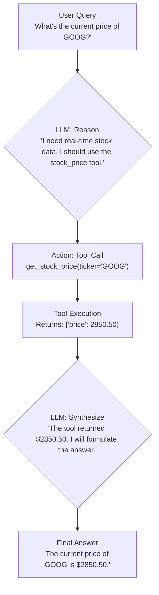

# Beyond 'Hello World': Advanced Prompt Engineering with LLMs

By 2026, interacting with Large Language Models (LLMs) like Gemini, Claude, and next-gen GPT variants has moved far beyond simple Q&A. The line between user and developer has blurred, and the key to unlocking an LLM's true potential lies not just in what you ask, but *how* you ask it. Basic, single-line prompts are the "Hello, World!" of AI. To build sophisticated, reliable, and creative applications, you need to master advanced prompt engineering.

This guide moves past the fundamentals and dives straight into the practitioner-level techniques that separate novice users from expert prompters. We'll explore structured methods that transform LLMs from clever chatbots into powerful reasoning engines.

### What You'll Get

*   **Chain-of-Thought (CoT) Prompting:** Learn to guide LLMs through complex problems step-by-step.
*   **Few-Shot Learning:** Understand how to teach models new tasks on the fly with in-prompt examples.
*   **Persona-Based Prompting:** Discover how assigning a role to an LLM dramatically improves output quality.
*   **Tool-Augmented Prompts:** Explore how to instruct models to use external tools for real-time, accurate data.

---

## The Core Shift: From Instruction to Structured Dialogue

The most significant evolution in prompt engineering is the shift from giving simple instructions to creating a structured "context window" for the model. An advanced prompt is less of a command and more of a micro-program, complete with examples, reasoning steps, and constraints. You are not just asking for an answer; you are architecting the *process* by which the model arrives at that answer.

> **Expert Tip:** Treat the context window as a temporary, high-speed RAM for the model. What you load into it directly influences the quality of the computation.

## Technique 1: Chain-of-Thought (CoT) Prompting

Chain-of-Thought (CoT) prompting encourages the LLM to "think out loud" by breaking down a problem into sequential steps. Instead of asking for a final answer directly, you instruct it to explain its reasoning first. This simple trick dramatically improves performance on tasks requiring logic, arithmetic, or multi-step inference.

Research from Google AI has shown that this method mimics a more natural human thought process, reducing the likelihood of premature (and often incorrect) conclusions.

### Basic Prompt vs. CoT Prompt

Consider this simple logic puzzle:

**Basic Prompt (Less Reliable):**
```
There are 15 trees in the park. A team plants 5 more trees. Later, a storm knocks down 3 trees. How many trees are left?
```

**CoT Prompt (More Reliable):**
```
There are 15 trees in the park. A team plants 5 more trees. Later, a storm knocks down 3 trees. How many trees are left?

Let's think step by step:
1. Start with the initial number of trees.
2. Account for the newly planted trees.
3. Account for the trees knocked down by the storm.
4. Calculate the final number.
```

By providing the phrase "Let's think step by step," you explicitly trigger the model's reasoning pathways, forcing it to detail its work before giving the final answer. This makes the output more reliable and easier to debug.

## Technique 2: Few-Shot Learning

Few-shot learning is the practice of providing examples of the desired input/output format directly within the prompt. This is one of the most powerful ways to guide a model's behavior without fine-tuning.

*   **Zero-Shot:** You ask the model to perform a task it has never seen, relying on its general knowledge.
*   **One-Shot:** You provide a single example.
*   **Few-Shot:** You provide multiple (typically 2-5) examples. This is the sweet spot for performance and context length.

### Example: Custom Sentiment Analysis

Imagine you're an engineering manager sorting through feedback. You need to classify comments into specific, actionable categories.

```text
Classify the user feedback into one of the following categories: "Bug Report", "Feature Request", or "UX Complaint".

Feedback: "The login button is broken on Safari."
Classification: Bug Report
###
Feedback: "I wish I could export my data to a CSV file."
Classification: Feature Request
###
Feedback: "The new menu is really confusing and hard to navigate."
Classification: UX Complaint
###
Feedback: "When I click 'save', the app just hangs and I have to restart it."
Classification:
```

The model will reliably return `Bug Report` because the examples have created a clear, unambiguous pattern for it to follow. The quality of your examples is paramount—they must be consistent and accurate.

## Technique 3: Persona-Based Prompting

Assigning a persona to an LLM is a powerful way to control its tone, style, and domain-specific knowledge. By telling the model *who* it is, you focus its attention on the relevant parts of its vast training data.

This technique is effective because it frames the task within a familiar context for the model. A "cybersecurity expert" will analyze code differently than a "junior web developer."

### Persona Prompt Example

```
Act as a Senior Principal Engineer with 15 years of experience in distributed systems. You are reviewing a technical design document for a new microservice. Your primary concerns are scalability, fault tolerance, and cost-efficiency.

Provide a critical review of the following design proposal, highlighting potential bottlenecks and single points of failure.
...[Design Document Text]...
```

The resulting output will be vastly more insightful and targeted than a generic "Review this document" prompt.

| Prompt Type | Sample Output Excerpt |
| :---------- | :-------------------- |
| **Generic** | "The design uses a database. You should consider if it can handle the load. Caching might be useful." |
| **Persona** | "The proposed single-node PostgreSQL instance presents a critical single point of failure (SPOF). Recommend deploying a managed solution like Cloud SQL with high-availability replicas. Furthermore, the lack of a caching layer (e.g., Redis) for session data will create a significant bottleneck under moderate load." |

## Technique 4: Integrating External Tools (ReAct)

By 2026, the most advanced LLM applications use a framework often referred to as **ReAct (Reason + Act)**. This involves prompting the model not just to answer, but to decide when to use an external tool (like an API call, a database query, or a web search) to get more information.

You provide the LLM with a description of the tools it can use and instruct it to generate a "thought" and an "action" to take.

### The ReAct Flow

This process allows the LLM to augment its internal knowledge with real-time, proprietary, or specific data it wasn't trained on.



### Example Prompt for Tool Use

```text
You have access to the following tools:
1. `search(query)`: Searches the web for up-to-date information.
2. `get_stock_price(ticker)`: Retrieves the latest price for a given stock ticker.

To answer the user's question, you must first output your "Thought" explaining your reasoning, then output the "Action" you will take.

User: What is the market cap of Apple Inc. today?
```

The model would then generate its thought process (`I need the current stock price and the number of outstanding shares`) and the corresponding actions (`Action: get_stock_price(ticker='AAPL')` and `Action: search(query='Apple Inc. outstanding shares')`) before synthesizing the final answer.

## Summary: From Prompter to Architect

Mastering these advanced techniques elevates your role from a simple user to a cognitive architect. You are no longer just asking questions; you are designing workflows, providing context, and guiding a reasoning process.

| Technique | Best For... | Key Benefit |
| :--- | :--- | :--- |
| **Chain-of-Thought** | Logic puzzles, math, multi-step reasoning | Improves accuracy and provides a transparent reasoning path. |
| **Few-Shot Learning** | Custom classification, formatting, style imitation | High degree of control over output format without fine-tuning. |
| **Persona-Based** | Expert analysis, creative writing, targeted tone | Focuses the model on relevant knowledge and style. |
| **ReAct / Tool Use** | Questions requiring real-time or proprietary data | Overcomes the LLM's static knowledge cutoff. |

The future of development and research with LLMs is collaborative. By structuring our prompts as intelligent dialogues, we can push these models from being clever toys to indispensable partners in complex problem-solving.

What's the most creative or complex prompt you've ever built? Share it with the community!

### Further Reading

*   [Google AI on Prompt Engineering](https://ai.google/models/gemini/prompt-engineering)
*   [OpenAI's Prompting Guide](https://openai.com/blog/advanced-prompting-guide)
*   [Anthropic's Introduction to Prompt Design](https://anthropic.com/docs/claude/prompt-design)
*   [Chain-of-Thought Prompting Elicits Reasoning in Large Language Models (arXiv)](https://arxiv.org/abs/2201.11903)


## Further Reading

- [https://openai.com/blog/advanced-prompting-guide](https://openai.com/blog/advanced-prompting-guide)
- [https://ai.google/models/gemini/prompt-engineering](https://ai.google/models/gemini/prompt-engineering)
- [https://anthropic.com/docs/claude/prompt-design](https://anthropic.com/docs/claude/prompt-design)
- [https://towardsdatascience.com/advanced-prompt-engineering-techniques](https://towardsdatascience.com/advanced-prompt-engineering-techniques)
- [https://arxiv.org/abs/2201.11903](https://arxiv.org/abs/2201.11903)
