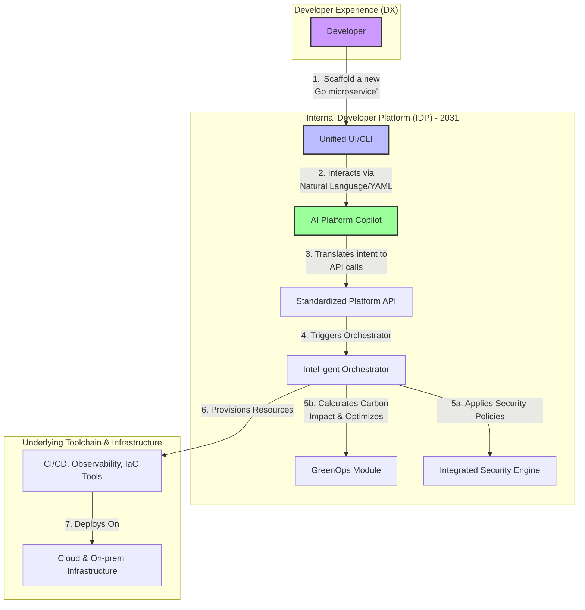

# Platform Engineering: Predicting the Next 5 Years of IDP Evolution

Platform engineering has moved from a niche concept to a mainstream strategy for enabling developer productivity and operational excellence. By providing paved roads for development teams, Internal Developer Platforms (IDPs) reduce cognitive load and accelerate the delivery lifecycle. But this field is evolving at a breakneck pace. What will an IDP look like in 2031?

This article looks beyond the current landscape, projecting the key trends that will shape the next five years of platform engineering. We'll explore how AI, sustainability, security, and standardization will converge to create platforms that are not just enabling, but truly intelligent and autonomous.

### What You'll Get

*   **AI-Powered Automation:** How generative AI will transform the developer-platform interaction.
*   **Green Software Engineering:** The rise of carbon-aware scheduling and resource management.
*   **Deep Security Integration:** The shift from post-facto scanning to real-time, automated security governance.
*   **Standardized Interfaces:** The move towards a common language for platform capabilities.
*   **A High-Level Vision:** A Mermaid diagram illustrating the architecture of a future-state IDP.

---

## The AI Co-pilot: From Generative to Predictive

The most significant evolution in IDPs will be the deep, pervasive integration of Artificial Intelligence. While today's platforms focus on templating and orchestration, tomorrow's will be intelligent partners in the development process.

### Generative Scaffolding and Remediation

Expect to move beyond filling out YAML files in a portal. Developers will interact with the IDP using natural language.

*   **Interaction Model:** A developer might prompt the platform: *"Scaffold a new Go microservice with a PostgreSQL database, configure a CI/CD pipeline for production, and grant the data science team read-only access."*
*   **Intelligent Remediation:** When an alert fires, the platform's AI won't just notify a human. It will analyze logs, correlate metrics, and suggest a specific fix, perhaps even generating a patch for review.

> "By 2026, 80% of large software engineering organizations will establish platform engineering teams as internal providers of reusable services, components and tools for application delivery." - [Gartner](https://www.gartner.com/en/articles/what-is-platform-engineering)

### Predictive Optimization

The next frontier is predictive analytics. The IDP will actively optimize the environment based on historical data and projected trends.

*   **Cost Management:** AI models will predict workload spikes and proactively scale resources, optimizing for cost *before* the monthly cloud bill arrives.
*   **Performance Tuning:** The platform will identify potential bottlenecks in application architecture or infrastructure configuration and recommend changes *before* they impact users.

## The Green Platform: Sustainability as a First-Class Citizen

As environmental impact becomes a critical business metric, IDPs will be instrumental in implementing Green Software Engineering principles. The platform's role will shift from simply provisioning resources to doing so in the most energy-efficient manner possible.

The platform will provide dashboards not just for CPU and memory, but for the carbon intensity of running services.

### Key Capabilities of a Green IDP

*   **Carbon-Aware Scheduling:** Automatically deploying workloads to data centers or cloud regions with lower carbon intensity based on the time of day and availability of renewable energy.
*   **Efficiency Recommendations:** The platform will analyze code and infrastructure patterns, suggesting more energy-efficient instance types or recommending architectural changes to reduce idle consumption.
*   **Sustainability Scorecards:** Services cataloged in the IDP will display a "sustainability score" alongside their operational health and ownership details.

Here is a hypothetical `platform.yaml` snippet illustrating this future:

```yaml
# platform.yaml
apiVersion: platform.acme.corp/v2
kind: Microservice
metadata:
  name: user-profile-service
spec:
  runtime: go
  resources:
    cpu: "1"
    memory: "2Gi"
  # New sustainability-focused configuration
  sustainability:
    maxCarbonIntensity: "150 gCO2eq/kWh"
    preferredRegions:
      - "us-west-1" # High renewables
      - "europe-north-1" # Low PUE
    offPeakScheduling: true
```

## The Security Control Plane: Real-Time, Automated Governance

Security is already "shifting left," but the future IDP will make it an intrinsic, non-negotiable part of the platform fabric. It will evolve from a gatekeeper running scans to a real-time, autonomous control plane for security policy.

This means moving beyond CI pipeline vulnerability scans to a state of continuous verification.

### From Scan-and-Alert to Enforce-and-Remediate

| Today's Approach | Future IDP Approach |
| :--- | :--- |
| Scan container images on commit. | **Block** deployments with critical CVEs in real-time. |
| Alert on insecure network policies. | **Automatically remediate** or isolate misconfigured services. |
| Separate security dashboards. | **Integrated security posture** in the service catalog. |
| Manual threat modeling. | AI-driven **threat surface analysis** based on dependencies. |

The IDP will become the single source of truth for `Policy-as-Code`, ensuring that every resource provisioned and every line of code deployed adheres to the organization's security posture without requiring manual intervention.

## The Standardized API: Unifying the Platform Interface

Today, interacting with a platform often means learning the specific APIs of dozens of underlying tools (Kubernetes, Terraform, ArgoCD, etc.). This creates friction and increases cognitive load. The next five years will see a strong push towards standardization.

Inspired by projects like the [Cloud Native Computing Foundation (CNCF)](https://www.cncf.io/)'s work on platform engineering, we can expect the emergence of open, declarative APIs for common platform actions.

### A Vision of the Future IDP Architecture

This diagram illustrates how these components might interact within a future IDP, abstracting the underlying complexity from the developer.



This standardized API layer means a developer could request a database with the same simple manifest, whether the platform provisions it on AWS RDS, Google Cloud SQL, or an on-premise cluster. This drastically simplifies the developer experience and makes the platform itself more portable and maintainable.

## Final Thoughts: The Platform as a Partner

The IDP of the next five years will be less of a static tool vending machine and more of an intelligent, active partner in the software lifecycle. It will automate, predict, secure, and optimize, freeing developers to focus entirely on delivering business value.

By embracing AI, embedding sustainability and security into its core, and standardizing its interfaces, the IDP will become the central nervous system of modern engineering organizations. The journey there will be iterative, but the destination is clear: a future where the path of least resistance is also the most secure, efficient, and innovative one.

What are your predictions for the future of platform engineering? Share your thoughts and let's continue the conversation.


## Further Reading

- [https://platformengineering.org/blog/future-of-idps](https://platformengineering.org/blog/future-of-idps)
- [https://infoq.com/articles/platform-engineering-predictions-2030](https://infoq.com/articles/platform-engineering-predictions-2030)
- [https://gartner.com/en/articles/top-platform-engineering-trends](https://gartner.com/en/articles/top-platform-engineering-trends)
- [https://cncf.io/blog/platform-engineering-roadmap](https://cncf.io/blog/platform-engineering-roadmap)
- [https://developer.com/platform-engineering-forecast](https://developer.com/platform-engineering-forecast)
