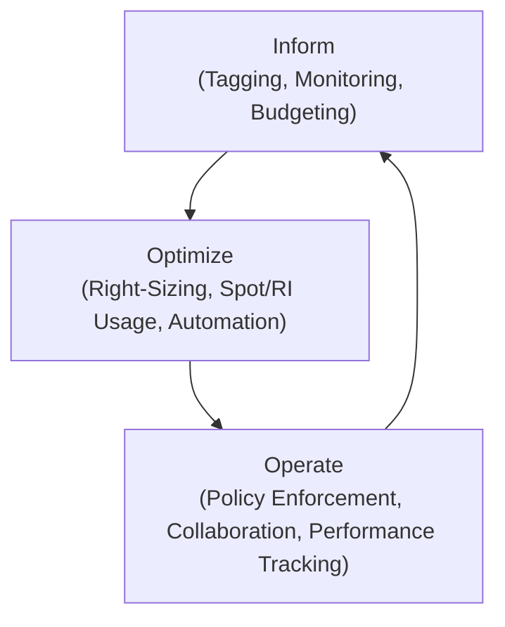

# Taming Cloud Sprawl: FinOps for AI/ML Workloads on AWS & Azure

Artificial Intelligence and Machine Learning models are no longer experimental novelties; they are core business drivers. But this power comes at a steep price, with GPU-intensive training and always-on inference endpoints creating a perfect storm for cloud budget overruns. Traditional IT cost management is simply not agile enough to handle the dynamic, resource-hungry nature of these workloads.

This is where FinOps comes in. FinOps is a cultural practice and operational model that brings financial accountability to the variable spend model of the cloud, enabling teams to make trade-offs between speed, cost, and quality. For AI/ML, it's not just about saving money—it's about maximizing the value of every dollar spent on compute.

### What You'll Get

In this article, you will get a practitioner's guide to implementing FinOps for your AI/ML workloads on AWS and Azure. We'll cover:

*   Actionable strategies for gaining visibility into complex AI/ML costs.
*   A blueprint for leveraging Spot, Reserved, and On-Demand instances effectively.
*   Best practices for intelligent auto-scaling and resource right-sizing.
*   A look at the essential monitoring tools and governance policies.
*   A framework for fostering crucial collaboration between finance and engineering teams.

---

## Establish a Foundation: Visibility Through Tagging

You can't optimize what you can't see. For AI/ML, where a single project can spawn thousands of transient resources for experiments, training runs, and data processing, a robust tagging strategy is the absolute bedrock of cost control.

### Why Tagging is Non-Negotiable for AI/ML

Without proper tags, your cloud bill becomes an indecipherable monolith. A consistent tagging strategy allows you to:

*   **Attribute Costs:** Pinpoint which model, project, or research team is driving spend.
*   **Differentiate Workloads:** Separate costs for *training* (spiky, short-lived) from *inference* (steady, long-running) and *data preparation*.
*   **Enable Showback/Chargeback:** Accurately allocate costs back to the appropriate business units.

### A Practical Tagging Blueprint

Start with a simple, enforceable policy. Mandate a core set of tags for all resources deployed.

*   **Mandatory Tags:**
    *   `project-id`: A unique identifier for the ML project (e.g., `fraud-detection-v2`).
    *   `environment`: The deployment stage (`dev`, `staging`, `prod`).
    *   `owner`: The user or service account responsible (`data-science-team-a`).
    *   `cost-center`: The financial department code (`R&D-751`).
    *   `workload-type`: The resource's purpose (`training`, `inference`, `data-prep`).

You can enforce these tags using cloud-native tools to prevent the launch of non-compliant resources.

*   **On AWS:** Use [AWS Tag Policies](https://docs.aws.amazon.com/organizations/latest/userguide/orgs_manage_policies_tag-policies.html) and Service Control Policies (SCPs).
*   **On Azure:** Use [Azure Policy](https://learn.microsoft.com/en-us/azure/governance/policy/overview) to audit or deny deployments that lack required tags.

Here is a simplified example of an Azure Policy rule to enforce a `cost-center` tag:

```json
{
  "if": {
    "field": "[concat('tags[', 'cost-center', ']')]",
    "exists": "false"
  },
  "then": {
    "effect": "deny"
  }
}
```
This policy simply denies the creation of any resource that is missing the `cost-center` tag.

---

## Master Your Compute Costs: From On-Demand to Spot

Compute is the single largest cost component in most AI/ML workloads. Your goal is to match the right pricing model to the right workload, moving away from the expensive default of On-Demand whenever possible.

### The Compute Pricing Spectrum

AWS and Azure offer a spectrum of pricing models. Understanding their trade-offs is key to optimization.

| Pricing Model | Best For | AWS Service(s) | Azure Service(s) | Cost Savings | Risk |
| :--- | :--- | :--- | :--- | :--- | :--- |
| **On-Demand** | Unpredictable, short-term workloads; initial development. | EC2 On-Demand | Pay-as-you-go VMs | None | Low |
| **Reserved/Savings** | Stable, predictable, always-on workloads like production inference. | Reserved Instances, Savings Plans | Reserved VM Instances | High (up to 72%) | Medium (Commitment) |
| **Spot** | Fault-tolerant, interruptible workloads like model training. | EC2 Spot Instances | Azure Spot Virtual Machines | Highest (up to 90%) | High (Interruption) |

### Leveraging Spot Instances for Training 🤖

Model training is often the perfect candidate for [Spot Instances](https://aws.amazon.com/ec2/spot/). These are spare compute capacity offered at a huge discount. The catch? The cloud provider can reclaim them with only a short notice (2 minutes for AWS, 30 seconds for Azure).

This makes them ideal for training jobs that are:

*   **Fault-tolerant:** The job can be paused and resumed.
*   **Checkpoint-enabled:** You regularly save the model's state to persistent storage (like S3 or Blob Storage) so you don't lose progress.

Use services like **AWS Spot Fleet** or **Azure VM Scale Sets with Spot** to manage a fleet of Spot Instances, automatically replacing any that are reclaimed.

```bash
# Example: AWS CLI to request a Spot Instance for a Docker-based training job
# This is a simplified example for illustration.

aws ec2 request-spot-instances \
    --instance-count 1 \
    --spot-price "0.50" \
    --type "one-time" \
    --launch-specification file://launch-spec.json
```
*Your `launch-spec.json` would define the instance type (e.g., `p3.2xlarge`), AMI, and user data to pull a Docker container and start the training script.*

### Reserved Instances & Savings Plans for Inference

Production inference endpoints need to be highly available and predictable. This makes them a perfect fit for a commitment-based pricing model.

> **Pro Tip:** Use **AWS Savings Plans** or **Azure Reserved VM Instances** to cover the baseline compute capacity for your production inference services. Savings Plans (AWS) offer more flexibility than traditional Reserved Instances, applying discounts across instance families and regions.

---

## Right-Sizing and Scaling Intelligently

Using the right pricing model is half the battle. The other half is ensuring you're using the right *amount* and *type* of resources.

### Beyond Basic Auto-Scaling

AI/ML traffic patterns are rarely as simple as a standard web app. A model serving a real-time feature might experience sudden, massive spikes. Standard CPU-based scaling often reacts too slowly.

*   **Use custom metrics:** Scale based on metrics that truly reflect load, such as GPU utilization or the number of requests in a queue (e.g., Amazon SQS, Azure Service Bus).
*   **Leverage predictive scaling:** [AWS Auto Scaling](https://aws.amazon.com/ec2/autoscaling/) offers predictive scaling, which uses machine learning to forecast future traffic and provision capacity in advance.
*   **Scale to zero:** For non-production or low-traffic endpoints, use serverless compute like **AWS Lambda containers** or **Azure Machine Learning managed endpoints** with auto-scaling configured to scale down to zero instances to eliminate costs when idle.

### Choosing the Right Hardware

More power isn't always better. The latest and greatest GPU might be overkill for your specific model.

*   **Profile your model:** Test your model on different instance types (e.g., AWS `g4dn` vs. `g5`, Azure `NCv3` vs. `NDv4`) to find the best price-to-performance ratio.
*   **Consider specialized silicon:** For inference, custom chips like [AWS Inferentia](https://aws.amazon.com/machine-learning/inferentia/) can offer significantly better performance per dollar than general-purpose GPUs.
*   **Separate compute:** Don't run a heavy data-processing task on the same expensive GPU instance you use for training. Use cheaper, CPU-optimized instances for data prep.

---

## Closing the Loop: Monitoring and Collaboration

FinOps isn't a "set it and forget it" task. It's a continuous, iterative cycle of monitoring, optimizing, and governing.

### The FinOps Feedback Loop

This process requires a tight feedback loop between technology and finance, powered by clear data.



### Essential Tooling & Collaboration

Your primary tools will be the cloud providers' native offerings:

*   **AWS:** [Cost Explorer](https://aws.amazon.com/aws-cost-management/aws-cost-explorer/), [AWS Budgets](https://aws.amazon.com/aws-cost-management/aws-budgets/), and Trusted Advisor.
*   **Azure:** [Cost Management + Billing](https://azure.microsoft.com/en-us/products/cost-management), Budgets, and Azure Advisor.

However, tools are only as effective as the culture that uses them.

> **Shared Responsibility is Key**
> "FinOps is a cultural practice. The goal is to get engineers to take ownership of their cloud usage and costs, empowering them with the visibility and tools they need to make cost-conscious decisions without slowing down innovation."

Foster collaboration between engineering and finance by:
*   **Democratizing data:** Give engineers direct, real-time access to cost dashboards filtered to their projects.
*   **Holding regular reviews:** Set up bi-weekly or monthly meetings to review spending against forecasts.
*   **Aligning incentives:** Tie engineering goals not just to performance and features, but also to budget adherence and efficiency.

### Summary

Taming the costs of AI/ML workloads is an ongoing discipline, not a one-time project. By embracing the FinOps principles of visibility, optimization, and collaboration, you can transform your cloud spend from an unpredictable liability into a strategic, value-driven investment. Start by establishing visibility with a strict tagging policy, then aggressively optimize your compute mix, and finally, close the loop with continuous monitoring and a culture of shared ownership.

***

**Now, over to you: What's your biggest challenge when managing AI/ML cloud costs? Share your experiences in the comments below!**


## Further Reading

- [https://finops.org/framework/domains/cost-optimization/](https://finops.org/framework/domains/cost-optimization/)
- [https://aws.amazon.com/blogs/mt/finops-best-practices/](https://aws.amazon.com/blogs/mt/finops-best-practices/)
- [https://azure.microsoft.com/en-us/solutions/cloud-cost-management/](https://azure.microsoft.com/en-us/solutions/cloud-cost-management/)
- [https://www.infoq.com/articles/finops-ai-ml-workloads/](https://www.infoq.com/articles/finops-ai-ml-workloads/)
- [https://cloud.google.com/blog/topics/cost-management/](https://cloud.google.com/blog/topics/cost-management/)
