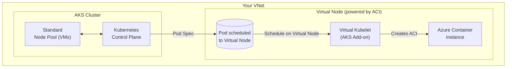
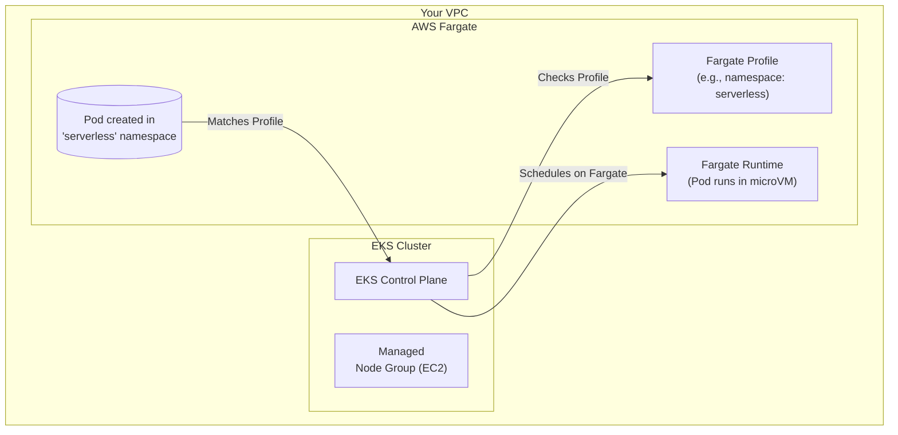

# Serverless Kubernetes in 2026: AKS Virtual Nodes & EKS Fargate Deep Dive

The promise of Kubernetes has always been powerful orchestration, but it often came with a hidden cost: managing the underlying nodes. The "serverless Kubernetes" paradigm emerged to solve this, abstracting away the infrastructure so you can focus purely on your workloads. By 2026, this approach has moved from a niche solution to a mainstream strategy for optimizing specific types of applications.

Two dominant players in this space are Azure Kubernetes Service (AKS) with Virtual Nodes and Amazon Elastic Kubernetes Service (EKS) with Fargate. While both aim to eliminate node management, they are built on fundamentally different philosophies and architectures. This deep dive explores their evolution, current capabilities, and how to choose the right fit for your needs.

### What You'll Get

*   **Core Concepts:** A clear explanation of what "serverless Kubernetes" truly means.
*   **Deep Dives:** A detailed look into the architecture and function of both AKS Virtual Nodes and EKS Fargate.
*   **Visual Architecture:** Mermaid diagrams illustrating how each solution works.
*   **Head-to-Head Comparison:** A comprehensive table comparing key features.
*   **Practical Guidance:** Actionable advice on when to use each service, and when to stick with traditional nodes.

---

## The Serverless Kubernetes Promise

At its core, serverless Kubernetes is not about eliminating servers; it's about eliminating *server management*. You no longer need to provision, patch, scale, or secure virtual machine nodes for your pods. Instead, you submit your pod specifications to the Kubernetes API, and the cloud provider's serverless compute engine runs them on demand.

The primary benefits are:

*   **Reduced Operational Overhead:** Your platform team is freed from the undifferentiated heavy lifting of managing the worker node lifecycle.
*   **Improved Efficiency:** Pay for the precise CPU and memory resources a pod consumes, not for idle capacity on an underutilized VM.
*   **Rapid Scaling:** Scale from zero to thousands of pods to handle bursty traffic without waiting for new nodes to join the cluster.

> **Key Takeaway:** Serverless Kubernetes complements traditional node groups. It's a tool for offloading specific workloads, not a complete replacement for all scenarios.

## Azure's Approach: AKS Virtual Nodes

AKS Virtual Nodes provide a clever and fast connection between your AKS cluster and Azure Container Instances (ACI), a serverless container runtime. The "Virtual Node" isn't a real node; it's a proxy, a virtual kubelet that registers with the Kubernetes API server and presents itself as a node with near-infinite capacity.

When you schedule a pod to run on the Virtual Node, the AKS control plane hands the request to the ACI scheduler, which provisions and runs the container in seconds.

### Architecture and Flow

Here’s a high-level view of how a pod gets scheduled on a Virtual Node:



To use it, you enable the Virtual Nodes add-on and use standard Kubernetes scheduling primitives like `nodeSelector` and `tolerations` to direct pods.

```yaml
# pod-aci.yaml
apiVersion: v1
kind: Pod
metadata:
  name: my-aci-pod
spec:
  containers:
  - name: my-container
    image: nginx
    resources:
      limits:
        cpu: "1"
        memory: "1.5Gi"
  nodeSelector:
    kubernetes.io/role: agent
    beta.kubernetes.io/os: linux
    type: virtual-kubelet
  tolerations:
  - key: virtual-kubelet.io/provider
    operator: Exists
```

### Key Benefits and Limitations

*   **Blazing Fast Pod Startup:** Since ACI is optimized for single-container instantiation, pods can start in seconds. This is ideal for short-lived jobs or event-driven functions.
*   **Simple Pricing:** Billing is per-second for the vCPU and memory allocated to your container group (pod).
*   **Seamless Bursting:** Easily handle sudden traffic spikes by "overflowing" pods from your standard node pool to the limitless capacity of ACI.

However, it has its trade-offs:

*   **Limited Customization:** You get less control over the underlying environment compared to a VM. Features requiring host access, like DaemonSets, are not supported.
*   **Networking Nuances:** While it integrates with Azure CNI for VNet networking, advanced networking policies can be more complex to implement.
*   **Best for Stateless:** It's primarily designed for stateless or short-lived workloads.

## Amazon's Approach: EKS Fargate

Amazon EKS on AWS Fargate is a purpose-built serverless compute engine for containers. Unlike the proxy model of AKS Virtual Nodes, Fargate is a more deeply integrated runtime plane. It provides a distinct, isolated compute environment for each pod.

You define which pods should run on Fargate using a **Fargate Profile**. This profile specifies namespaces and labels. Any pod matching the profile is automatically scheduled onto Fargate without any node selection annotations in the pod spec itself.

### Architecture and Flow

The Fargate Profile is the key component that directs traffic to the serverless plane.



Here's a simple `eksctl` configuration to create a Fargate profile:

```yaml
# cluster.yaml
apiVersion: eksctl.io/v1alpha5
kind: ClusterConfig
...
fargateProfiles:
  - name: my-serverless-profile
    selectors:
      # All pods in the 'default' and 'kube-system' namespaces will run on Fargate
      - namespace: default
      - namespace: kube-system
```

### Key Benefits and Limitations

*   **Strong Security Isolation:** Each EKS Fargate pod runs in its own lightweight microVM, providing strong kernel-level isolation from other pods. This is a significant security advantage.
*   **Simplified Experience:** The Fargate Profile model makes it transparent to developers. They just deploy to a specific namespace, and the platform handles the rest.
*   **Fine-Grained Resource Specs:** You can specify very precise CPU and memory combinations, ensuring you only pay for what you need.

The constraints to consider are:

*   **Slower Pod Startup:** Provisioning the microVM environment adds overhead, so pod startup times are typically slower than AKS Virtual Nodes (tens of seconds vs. single-digit seconds).
*   **No Host-Level Access:** Like AKS, it doesn't support DaemonSets, host networking, or privileged containers.
*   **EBS Volume Limitations:** Persistent storage using Amazon EBS volumes is not supported on Fargate. You must use Amazon EFS for stateful applications.

---

## Head-to-Head Comparison: AKS Virtual Nodes vs. EKS Fargate

This table summarizes the key differences for a quick evaluation.

| Feature                 | AKS Virtual Nodes                                    | EKS Fargate                                          | Key Takeaway                                                              |
| ----------------------- | ---------------------------------------------------- | ---------------------------------------------------- | ------------------------------------------------------------------------- |
| **Underlying Tech**     | A proxy to Azure Container Instances (ACI)           | A purpose-built serverless compute engine            | Fargate is more integrated; AKS offers a bridge to a separate service.    |
| **Scheduling Model**    | Pod-level via `nodeSelector` & `tolerations`         | Namespace/Label-level via `Fargate Profile`          | EKS is more ops-driven (set & forget); AKS is more dev-driven (per-pod). |
| **Startup Speed**       | Very Fast (seconds)                                  | Moderate (tens of seconds)                           | AKS is superior for time-sensitive, short-lived tasks.                    |
| **Security Isolation**  | Standard container isolation                         | Strong (per-pod microVM)                             | Fargate is the clear winner for security-sensitive or multi-tenant workloads. |
| **Persistent Storage**  | Azure Files                                          | Amazon EFS                                           | Both require file-based persistent storage, not block storage.            |
| **DaemonSets Support**  | No                                                   | No                                                   | A major limitation for both; use traditional nodes for monitoring/logging agents. |
| **Pricing Model**       | Per-second for vCPU/Memory requested                 | Per-second for vCPU/Memory (rounded up)              | Both are cost-effective for bursty workloads, but models differ slightly. |

## Choosing Your Serverless Path in 2026

The decision isn't about which is "better," but which is *right for the workload*.

### ### When to Choose AKS Virtual Nodes

Choose AKS Virtual Nodes when your primary driver is **speed and simplicity for bursting**.

*   **Use Cases:**
    *   **CI/CD jobs:** Spin up hundreds of short-lived build agents instantly.
    *   **Event-driven processing:** Handle unpredictable spikes from an event queue (e.g., using [KEDA](https://keda.sh/)).
    *   **Quick dev/test environments:** Launch an isolated test instance of an application without provisioning a full node.

### ### When to Choose EKS Fargate

Choose EKS Fargate when your priority is **security, isolation, and operational simplicity for mixed workloads**.

*   **Use Cases:**
    *   **Untrusted Workloads:** Run third-party applications or user-submitted code where strong isolation is paramount.
    *   **Offloading Web Apps:** Move stateless web frontends or APIs to Fargate to free up capacity on your managed node groups for stateful or specialized workloads.
    *   **Replacing "Pet" EC2 Instances:** Migrate small, long-running applications that don't need a full VM to a more managed, right-sized environment.

### ### When to Stick with Managed Nodes

Serverless Kubernetes is not a silver bullet. You should always maintain managed node groups for workloads that require:

*   **GPU acceleration** for ML/AI.
*   **High-performance block storage** (like EBS or Azure Disk).
*   **Kernel-level control** for running DaemonSets (e.g., logging, monitoring, and security agents).
*   **Stable, high-CPU/memory, long-running applications** where the cost of a reserved VM is lower than on-demand serverless pricing.

## Conclusion

By 2026, serverless Kubernetes has solidified its place as a critical component of a modern cloud-native platform. **AKS Virtual Nodes** shine as a high-speed-bursting mechanism, leveraging the raw speed of ACI. **EKS Fargate**, on the other hand, offers a more robust, secure, and integrated platform for offloading entire classes of applications with confidence.

The best strategy is often a hybrid one: use a base of managed nodes for your predictable, performance-sensitive workloads, and augment it with a serverless layer to handle the unpredictable, the untrusted, and the ephemeral.

What are your experiences with serverless Kubernetes? Have you found success with these hybrid models? Share your thoughts in the comments below.


## Further Reading

- [https://aws.amazon.com/eks/features/fargate/](https://aws.amazon.com/eks/features/fargate/)
- [https://azure.microsoft.com/en-us/services/kubernetes-service/virtual-nodes/](https://azure.microsoft.com/en-us/services/kubernetes-service/virtual-nodes/)
- [https://kubernetes.io/blog/serverless-kubernetes/](https://kubernetes.io/blog/serverless-kubernetes/)
- [https://www.cncf.io/blog/category/serverless/](https://www.cncf.io/blog/category/serverless/)
- [https://docs.microsoft.com/en-us/azure/aks/virtual-nodes](https://docs.microsoft.com/en-us/azure/aks/virtual-nodes)
