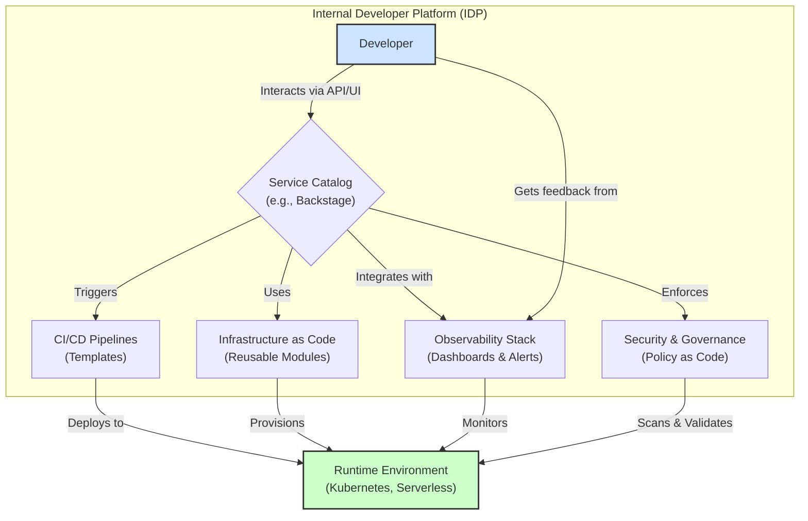

# Beyond DevOps: The Solidification of Platform Engineering

DevOps changed the way we build and ship software by breaking down the walls between development and operations. It's a culture, a mindset, and a set of practices. But as organizations scale, the "you build it, you run it" mantra can lead to significant cognitive load on development teams. This is where Platform Engineering emerges—not as a replacement for DevOps, but as its operational evolution for the enterprise.

This article dives into the what, why, and how of Platform Engineering. We'll explore its core concepts, differentiate it from traditional DevOps, and provide a practical roadmap for getting started.

### What You'll Get

*   **A Clear Definition:** Understand what Platform Engineering is and the problems it solves.
*   **DevOps vs. Platform Engineering:** A practical comparison to clarify their relationship.
*   **IDP Deep Dive:** Learn about the components of an Internal Developer Platform, the engine of platform engineering.
*   **Actionable First Steps:** Discover how to launch a successful platform team in your organization.

---

## What is Platform Engineering?

Platform Engineering is the discipline of designing and building toolchains and workflows that enable self-service capabilities for software engineering organizations. At its heart, it's about treating your internal platform as a product, with your developers as the customers.

The primary goal is to increase developer productivity and reduce cognitive load by providing a standardized, secure, and reliable path to production. This curated experience is often called the "golden path" or "paved road."

> According to the [Cloud Native Computing Foundation (CNCF)](https://www.cncf.io/blog/platform-engineering-definition/), "Platform engineering is an emerging trend that aims to improve the developer experience and productivity by providing self-service capabilities to developers."

Instead of every development team figuring out their own CI/CD, infrastructure, and monitoring, the platform team provides reusable tools and automated infrastructure that encapsulate the organization's best practices.

## DevOps vs. Platform Engineering: An Evolution, Not a Replacement

A common point of confusion is how Platform Engineering relates to DevOps. Think of it as an implementation of DevOps principles at scale. While DevOps culture encourages collaboration and shared responsibility, Platform Engineering provides the tools to make that collaboration efficient and scalable.

Here’s a breakdown of the key differences:

| Feature | Traditional DevOps | Platform Engineering |
| :--- | :--- | :--- |
| **Primary Goal** | Break down silos between Dev & Ops; a cultural shift. | Reduce developer cognitive load; enable self-service. |
| **Core Artifact** | CI/CD pipelines, automation scripts. | A cohesive Internal Developer Platform (IDP). |
| **Developer Burden** | High ("You build it, you run it"). Can lead to cognitive overload. | Low (A "paved road" with guardrails). Complexity is abstracted. |
| **Scope** | Often team- or project-specific. | Organization-wide, standardized foundation. |
| **Analogy** | A well-stocked workshop with individual tools. | A fully assembled, automated assembly line. |

Platform Engineering doesn't eliminate the "you build it, you run it" ethos. Instead, it makes the "run it" part drastically simpler and more standardized.

## The Core of the Platform: The Internal Developer Platform (IDP)

The tangible output of a platform engineering team is the **Internal Developer Platform (IDP)**. An IDP is a set of integrated tools, services, and automated workflows that cover the entire software development lifecycle. It's the "paved road" that developers use to build, ship, and operate their applications efficiently.

An effective IDP is not a restrictive monolith. It provides a default, easy-to-use path while still allowing for "off-roading" when necessary, though this comes with higher responsibility for the application team.

### Key Components of an IDP

An IDP is composed of various integrated tools that provide a seamless developer experience. The platform team curates, maintains, and connects these components.



*   **Service Catalog:** A central portal (like [Spotify's Backstage](https://backstage.io/)) where developers can discover and scaffold new services, access documentation, and view ownership.
*   **Infrastructure as Code (IaC) Modules:** Standardized, reusable modules (e.g., Terraform or Pulumi) for provisioning resources like databases, caches, or Kubernetes clusters. This ensures consistency and security.
*   **CI/CD Pipelines:** Templated, automated pipelines for building, testing, and deploying applications. Developers can configure their service without needing to become CI/CD experts.
*   **Observability Stack:** A unified solution for logging, metrics, and tracing (e.g., Prometheus, Grafana, OpenTelemetry) that is automatically configured for new services.
*   **Security & Governance:** Automated security scanning, policy enforcement (e.g., Open Policy Agent), and secrets management integrated directly into the workflow.

Here’s a simple example of what a reusable Terraform module for an S3 bucket might look like, abstracting away complex configurations:

```hcl
# main.tf in the application's repository
module "my_app_bucket" {
  source  = "git::https://github.com/my-org/terraform-modules.git//aws/s3-private-bucket"
  
  bucket_name = "my-secure-application-data"
  app_team    = "payment-services"
  
  # Module handles encryption, logging, versioning, and lifecycle policies automatically
}
```

## Why Platform Engineering Matters for Enterprises 🚀

For large organizations, the benefits of a well-executed platform strategy are immense:

*   **Reduced Cognitive Load:** Developers can focus on writing business logic instead of wrestling with infrastructure, Kubernetes YAML, or CI configurations.
*   **Faster Time-to-Market:** Standardized tooling and automated workflows drastically reduce the time it takes to get a new service from idea to production.
*   **Improved Reliability & Security:** Centralized management of infrastructure and security policies ensures that all services meet organizational standards by default.
*   **Enhanced Governance:** The platform provides clear guardrails, making it easier to enforce compliance and manage costs across hundreds or thousands of services.
*   **Streamlined Onboarding:** New engineers can become productive faster by leveraging the "paved road" instead of learning a complex, fragmented toolchain.

## Building Your Platform Team: A Practical Start

Transitioning to a platform model requires a deliberate, product-oriented approach. Simply rebranding your Ops team won't work.

### ### Step 1: Treat Your Platform as a Product

This is the most critical mindset shift.
*   **Your developers are your customers.** Understand their pain points through surveys, interviews, and embedding with teams.
*   **Create a roadmap.** Prioritize features that deliver the most value to your customers.
*   **Market your platform.** Communicate wins, provide excellent documentation, and offer support channels.

### ### Step 2: Start Small and Iterate

Don't try to build the entire platform at once. Start with a **Thin Viable Platform (TVP)**.
*   Identify the biggest bottleneck in your current development lifecycle. Is it provisioning databases? Setting up a new CI pipeline?
*   Build a solution for that *one* problem.
*   Onboard a friendly "beta tester" team and gather feedback.
*   Iterate and expand based on real-world usage and demand.

As [Martin Fowler notes](https://martinfowler.com/articles/platform-engineering-vs-devops.html), a successful platform is built incrementally, always focusing on the needs of its internal users.

### ### Step 3: Measure Success

Define metrics to track the platform's impact. This helps justify its existence and guide your roadmap.
*   **Developer Satisfaction:** Use surveys like NPS or simple feedback forms.
*   **Time-to-Production:** How long does it take for a new service to get its first commit to production?
*   **Deployment Frequency:** Are teams deploying more often?
*   **Adoption Rate:** How many teams are using the platform's components?

## Final Thoughts

Platform Engineering is the natural maturation of DevOps in a complex, cloud-native world. By creating a product-focused Internal Developer Platform, organizations can provide their developers with the leverage they need to build and innovate at speed, without sacrificing security or reliability. It's about enabling developers, not just automating operations.

The journey is challenging and requires a deep commitment to understanding internal customer needs. What challenges have you faced when trying to standardize development practices in your organization?


## Further Reading

- [https://platformengineering.org/blog/what-is-platform-engineering](https://platformengineering.org/blog/what-is-platform-engineering)
- [https://www.cncf.io/blog/platform-engineering-definition/](https://www.cncf.io/blog/platform-engineering-definition/)
- [https://martinfowler.com/articles/platform-engineering-vs-devops.html](https://martinfowler.com/articles/platform-engineering-vs-devops.html)
- [https://www.infoq.com/platform-engineering/](https://www.infoq.com/platform-engineering/)
- [https://docs.github.com/en/platform-engineering](https://docs.github.com/en/platform-engineering)
