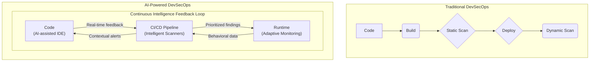

# AI-Powered DevSecOps: Shifting Security Further Left with Intelligence

DevSecOps represents a cultural and procedural shift to integrate security into every phase of the software development lifecycle (SDLC). The goal is clear: build more secure software, faster. However, as development velocity accelerates, security teams often struggle to keep pace, creating friction and bottlenecks. The solution isn't more manual checks; it's smarter automation. This is where Artificial Intelligence (AI) enters the picture, transforming DevSecOps from a process into an intelligent, adaptive system.

AI and Machine Learning (ML) are not just buzzwords; they are powerful enablers for "shifting security further left" in a way that is both meaningful and scalable. By embedding intelligence directly into developer workflows and CI/CD pipelines, we can catch vulnerabilities earlier, reduce false positives, and free up security experts to focus on complex, high-impact threats.

### What You'll Get

In this article, we'll cut through the hype and explore the practical applications of AI in modern DevSecOps. You will learn about:

*   **The Core Benefits:** Why AI is a force multiplier for security teams.
*   **Practical Applications:** How AI enhances SAST, DAST, dependency scanning, and more.
*   **Real-World Impact:** A look at how AI reduces noise and prioritizes real threats.
*   **Challenges & The Future:** The hurdles to adoption and what's next for autonomous security.

---

## Why AI is a Game-Changer for DevSecOps

Traditional security tools often rely on static signatures and predefined rules. While effective against known threats, they struggle with novel attacks, generate a high volume of false positives, and lack the context of the application's business logic. This "alert fatigue" can cause developers to ignore warnings, defeating the purpose of shifting left.

AI changes the paradigm by introducing three key advantages:

*   **Speed and Scale:** AI algorithms can analyze millions of lines of code, dependencies, and configurations in minutes—a task that would take a human team weeks.
*   **Enhanced Accuracy:** By learning from vast datasets of vulnerable and non-vulnerable code, ML models can distinguish between a genuine threat and a false positive with much higher precision.
*   **Contextual Awareness:** AI doesn't just find a potential flaw; it understands its context. It can determine if a vulnerability is actually exploitable in your specific application, considering data flows, user access, and deployment environment.

This transforms the DevSecOps pipeline from a linear set of gates into an intelligent, continuous feedback loop.



---

## Practical AI Applications in the DevSecOps Pipeline

AI isn't a single tool but a set of technologies that can be applied at various stages of the SDLC. Here’s how it’s making a tangible impact today.

### Intelligent SAST: Beyond Simple Pattern Matching

Static Application Security Testing (SAST) is a classic shift-left technique. However, traditional SAST tools are notorious for false positives because they rely heavily on pattern matching.

*   **Traditional SAST:** Flags code that *looks like* a vulnerability (e.g., finding `strcpy` without checking if the source is user-controlled).
*   **AI-Powered SAST:** Uses models like natural language processing (NLP) and graph neural networks to understand the code's *semantic meaning* and *data flow*. It traces user input through the application to confirm if a potential flaw is actually reachable and exploitable. This significantly reduces noise and helps developers focus on real bugs.

Consider this simplified Python example where a traditional linter might fail:

```python
import hashlib
import os

# A traditional linter might flag the use of MD5 as insecure.
# An AI-powered tool would see it's used for a non-cryptographic checksum
# and de-prioritize or ignore the finding.
def generate_file_checksum(file_path):
    """Generates an MD5 checksum for file integrity, not for security."""
    hash_md5 = hashlib.md5()
    with open(file_path, "rb") as f:
        for chunk in iter(lambda: f.read(4096), b""):
            hash_md5.update(chunk)
    return hash_md5.hexdigest()

# AI would prioritize a real vulnerability like this command injection:
def list_directory_contents(user_input):
    # DANGEROUS: User input is passed directly to a shell command.
    os.system("ls " + user_input)
```

### Smarter DAST and Fuzzing

Dynamic Application Security Testing (DAST) tests a running application for vulnerabilities. AI makes this process more efficient. Instead of sending random payloads, AI-driven DAST uses reinforcement learning to intelligently explore an application. It learns from the application's responses to craft more effective test cases, uncovering complex vulnerabilities that blind fuzzing might miss.

### Proactive Dependency Scanning

Modern applications are built on open-source dependencies, creating a massive attack surface.

*   **Traditional Scanning:** Matches your dependencies against databases of known vulnerabilities (CVEs). This is purely reactive.
*   **AI-Powered Scanning:** Goes deeper. It can analyze the *behavior* of a package to detect malicious code even if no CVE exists. It also provides crucial context by determining if your code actually calls the vulnerable function within a library, helping you prioritize patches that matter. As Snyk notes, this "helps developers fix the vulnerabilities that are most important first."

### Automated Threat Modeling

Threat modeling has traditionally been a manual, workshop-driven process that quickly becomes outdated. AI can automate this by:

*   Parsing Infrastructure-as-Code (IaC) templates (like Terraform or CloudFormation).
*   Analyzing application code and architecture diagrams.
*   Automatically generating data flow diagrams and identifying potential threat vectors based on established frameworks like [STRIDE](https://learn.microsoft.com/en-us/azure/security/develop/threat-modeling-tool-stride-categories).

This turns threat modeling into a continuous, living process that evolves with your application.

---

## Navigating the Challenges of AI Integration

Adopting AI in DevSecOps is not without its challenges. It's crucial to approach it with a clear-eyed strategy.

| Challenge                  | Mitigation Strategy                                                                                              |
| -------------------------- | ---------------------------------------------------------------------------------------------------------------- |
| **Model Transparency**     | Prioritize tools that offer explainable AI (XAI), showing *why* a vulnerability was flagged.                       |
| **Data Quality & Bias**    | Ensure the AI models are trained on diverse, high-quality, and relevant security data to avoid blind spots.      |
| **Integration Complexity** | Choose tools with strong API support that can integrate smoothly into your existing CI/CD and developer toolchain. |
| **Over-reliance on AI**    | Treat AI as a "security co-pilot," not a replacement for human expertise. Critical findings require human validation. |

> **Info:** The goal of AI is not to replace security engineers, but to augment their abilities, handling the repetitive, data-intensive tasks so humans can focus on strategic risk management and complex threat hunting.

---

## The Future: Towards Autonomous Security

The integration of AI in DevSecOps is still evolving. The next frontier is moving from detection to autonomous remediation.

*   **Generative AI for Code Remediation:** Imagine a tool that not only finds a SQL injection vulnerability but also suggests a secure, parameterized query as a fix, presenting it as a pull request for a developer to approve. Tools like GitHub Copilot are already paving the way.
*   **Predictive Threat Intelligence:** AI will shift security from being reactive to predictive. By analyzing global threat trends and correlating them with your specific technology stack and architecture, AI systems will be able to predict and defend against attacks *before* they happen.
*   **Self-Healing Infrastructure:** In the future, an AI-powered agent could detect an active threat in a running container, automatically apply a virtual patch, isolate the container, and trigger a pipeline to deploy a permanently fixed version—all with minimal human intervention.

---

## Conclusion: Intelligence is the New Speed

AI is fundamentally reshaping DevSecOps by embedding intelligence at every stage of the software lifecycle. It allows organizations to scale their security efforts to match the speed of modern development, transforming security from a bottleneck into a strategic enabler. By reducing noise, providing context, and automating detection, AI empowers developers to build secure code from the start and enables security teams to focus on what truly matters.

The journey towards AI-driven DevSecOps is an iterative one, but the benefits are clear: more secure software, faster delivery, and a more resilient organization.

What about you? **How has AI changed your DevSecOps practices or your approach to application security?**


## Further Reading

- [https://snyk.io/learn/devsecops/ai-in-devsecops/](https://snyk.io/learn/devsecops/ai-in-devsecops/)
- [https://www.darkreading.com/application-security/ai-driven-devsecops](https://www.darkreading.com/application-security/ai-driven-devsecops)
- [https://www.forbes.com/sites/forbestechcouncil/ai-devsecops/](https://www.forbes.com/sites/forbestechcouncil/ai-devsecops/)
- [https://www.gartner.com/en/articles/ai-devsecops-future](https://www.gartner.com/en/articles/ai-devsecops-future)
- [https://owasp.org/www-project-ai-security/](https://owasp.org/www-project-ai-security/)
