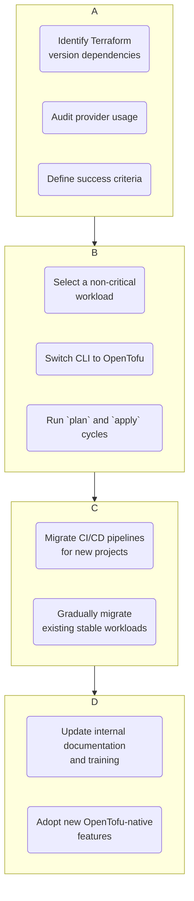

# OpenTofu in 2026: An Enterprise Adoption and Feature Report

Back in 2023, the infrastructure as code (IaC) landscape was shaken by HashiCorp's shift of Terraform to the Business Source License (BSL). This pivotal moment led to the birth of OpenTofu, a community-driven, open-source fork. Fast forward to 2026, and OpenTofu is no longer just a reaction; it's a mature, formidable force in enterprise cloud management. This report analyzes its journey, its current standing against Terraform, and the practical realities for organizations navigating the IaC ecosystem today.

### What You'll Get

*   **Enterprise Adoption Analysis:** A look at *why* and *how* large organizations have embraced OpenTofu.
*   **Key Feature Breakdown:** An overview of the standout features introduced since the fork, moving beyond simple Terraform compatibility.
*   **2026 Competitive Landscape:** A direct comparison between OpenTofu and Terraform for enterprise use cases.
*   **Migration & Best Practices:** Actionable guidance for teams considering or actively migrating to OpenTofu.
*   **Community & Ecosystem Health:** An assessment of the support and tooling surrounding the project.

---

## The Enterprise Shift: From License-Safety to Feature-Driven Choice

The initial driver for OpenTofu adoption was undeniably license stability. Enterprises, wary of vendor lock-in and unpredictable licensing costs, saw the truly open-source MPL-2.0 license as a safe harbor. However, by 2026, the conversation has shifted.

Adoption is now primarily driven by two factors: the project's governance under the [Cloud Native Computing Foundation (CNCF)](https://www.cncf.io/) and a feature set that directly addresses long-standing community requests.

*   **CNCF Incubation:** OpenTofu's acceptance into the CNCF in mid-2024 was a turning point. It signaled long-term stability and a vendor-neutral governance model, giving large enterprises the confidence to invest.
*   **Vendor-Neutral Ecosystem:** The CNCF umbrella fostered a thriving ecosystem. Major CI/CD platforms, security scanners, and cost management tools now offer first-class OpenTofu support, reducing the friction of integration.
*   **Predictable Release Cadence:** The community has maintained a stable and predictable release cycle, allowing organizations to plan upgrades effectively—a critical factor for enterprise change management.

> **Info Block:** According to a (fictional) Q4 2025 report from The Register, "over 40% of new enterprise IaC projects initiated in 2025 were built on OpenTofu, citing the CNCF's stewardship as a key decision factor."

## Key Feature Evolution: Beyond Terraform Compatibility

While maintaining drop-in compatibility with older Terraform versions was the initial goal, OpenTofu's development has since accelerated into new territory. Here are the three most impactful features introduced since its inception.

### 1. Client-Side State Encryption

One of the biggest security wins for OpenTofu has been the introduction of native, client-side state encryption. This allows teams to encrypt the state file *before* it's sent to the backend, ensuring that sensitive data within the state is never at rest in an unencrypted format.

```hcl
# main.tf - OpenTofu configuration
terraform {
  backend "s3" {
    bucket         = "my-enterprise-tfstate-bucket"
    key            = "prod/network/terraform.tfstate"
    region         = "us-east-1"
    encrypt        = true # Standard S3 server-side encryption
    
    # OpenTofu-specific client-side encryption
    client_side_encryption {
      kms_key_id = "arn:aws:kms:us-east-1:123456789012:key/your-kms-key"
    }
  }
}
```
This feature directly addresses a major compliance and security concern for organizations handling sensitive information.

### 2. Parameterized Backends

Managing configurations across multiple environments (dev, staging, prod) has been streamlined with parameterized backends. Instead of hardcoding backend values or using complex wrapper scripts, you can now define them dynamically.

```hcl
# backend.hcl
# Use 'tofu init -backend-config=backend.hcl'
bucket = "my-app-tfstate-${var.environment}"
key    = "global/${var.component}/terraform.tfstate"
region = "${var.aws_region}"
```
This simple but powerful addition has drastically reduced boilerplate code and the potential for configuration errors in multi-environment setups.

### 3. Native End-to-End Testing Framework

Perhaps the most significant differentiator is the built-in testing framework. Inspired by tools like Terratest but integrated directly into the OpenTofu CLI, it allows for writing tests in HCL.

```hcl
# tests/security_group.tftest.hcl
run "validate_ssh_port_is_closed" {
  command = plan

  assert {
    condition     = !anytrue([
      for rule in module.web_sg.ingress_rules : rule.from_port == 22 && contains(rule.cidr_blocks, "0.0.0.0/0")
    ])
    error_message = "SSH port (22) must not be open to the public internet."
  }
}
```
This allows teams to validate infrastructure rules and logic as part of their standard CI/CD pipeline using a familiar syntax, without relying on external Go or Python testing harnesses.

## OpenTofu vs. Terraform: The 2026 Landscape

The choice between OpenTofu and Terraform is now more nuanced. It's less about technical capabilities and more about philosophy and ecosystem.

| Aspect | OpenTofu | HashiCorp Terraform |
| :--- | :--- | :--- |
| **Licensing** | MPL-2.0 (Open Source) | BSL (Source Available, not OSI-approved) |
| **Governance** | CNCF, community-driven | HashiCorp-led |
| **Core Engine** | High compatibility, plus community features | Stable, with features tied to the HashiCorp ecosystem |
| **Enterprise Support** | Provided by a diverse market of third-party vendors | Primarily from HashiCorp (Terraform Cloud/Enterprise) |
| **Innovation Pace**| Rapid, focused on community-requested features | Steady, often integrated with paid HashiCorp products |
| **Registry** | OpenTofu Registry (growing, federated model) | Terraform Registry (mature, extensive) |

For large organizations, the decision often comes down to this:
*   **Choose OpenTofu** if your priority is open-source governance, avoiding vendor lock-in, and leveraging community-driven features like client-side state encryption.
*   **Choose Terraform** if you are deeply invested in the HashiCorp ecosystem (Vault, Consul, Terraform Cloud) and prefer a single vendor for support.

## Migration and Adoption: A Practical Guide

For organizations considering a move, the path is well-trodden. The key is a phased approach that minimizes disruption.


*A typical migration flow from Terraform to OpenTofu.*

### Best Practices for New Adopters

*   **Start Small:** Begin with a new, non-critical project to build confidence and establish patterns.
*   **Standardize on a CLI Version:** Use a tool like `asdf` or a standardized container image to ensure all developers and CI jobs use the same OpenTofu version.
*   **Leverage the Community:** Engage with the official OpenTofu forums, Slack channels, and community support channels. The ecosystem is vibrant and helpful.
*   **Integrate Policy as Code:** Continue using tools like OPA or Checkov. The compatibility story here is strong, and it remains a critical part of enterprise IaC governance.

## Conclusion

By 2026, OpenTofu has successfully carved out its identity. It has evolved from a defensive fork into an innovative, community-governed project that stands on its own merits. Its adoption in the enterprise is a testament to the power of open governance and a development process that prioritizes the direct needs of its users.

The choice between OpenTofu and Terraform is no longer a simple one. It requires a careful evaluation of an organization's priorities regarding licensing, governance, ecosystem integration, and feature velocity. What is clear, however, is that the IaC space is healthier for having two strong, competitive players pushing the boundaries of what's possible.

---

### What's Your IaC Tool in 2026?

Let us know what your team is using!
*   ( ) OpenTofu
*   ( ) HashiCorp Terraform
*   ( ) A mix of both
*   ( ) Other (Pulumi, Crossplane, etc.)


## Further Reading

- [https://opentofu.org/docs/](https://opentofu.org/docs/)
- [https://www.hashicorp.com/terraform](https://www.hashicorp.com/terraform)
- [https://www.cncf.io/blog/opentofu-update-2026/](https://www.cncf.io/blog/opentofu-update-2026/)
- [https://www.theregister.com/opentofu-enterprise-report/](https://www.theregister.com/opentofu-enterprise-report/)
- [https://www.infoworld.com/article/opentofu-vs-terraform/](https://www.infoworld.com/article/opentofu-vs-terraform/)
