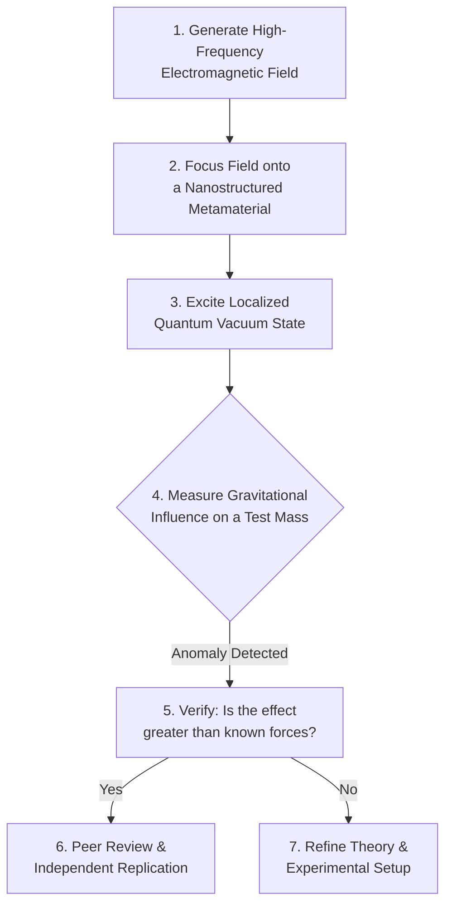

# The Antigravity Buzz: Early Tech & Market Speculation for 2026

The term "antigravity" has long been relegated to the pages of science fiction. Yet, as our understanding of quantum mechanics and the fabric of spacetime deepens, whispers from the fringes of theoretical physics are growing louder. While we are far from building flying cars, the mid-2020s could mark a pivotal moment where a laboratory-validated, micro-scale manipulation of gravity becomes a reality.

This article explores the hypothetical, yet technically-grounded, landscape of early-stage antigravity technology as we might see it in 2026. We'll examine the theoretical breakthroughs fueling this speculation, the nature of a potential first proof of concept, and the seismic shifts it could trigger across global markets. This is a forward-looking analysis for engineers, investors, and strategists watching the deep-tech horizon.

### What You'll Get

*   An overview of plausible theoretical approaches to gravity manipulation.
*   A look at what a first, micro-scale proof of concept could look like.
*   Analysis of the potential market disruptions in transportation, space, and energy.
*   A high-level diagram of the potential R&D pathway from lab to industry.

---

## The Theoretical Underpinnings

Any breakthrough in gravity control won't appear from a vacuum. It will be built upon decades of foundational research. By 2026, we can speculate that progress in two key areas could converge to produce a tangible result.

### Quantum Gravity and Spacetime Engineering

For years, physicists have chased a unified theory of everything, one that marries Einstein's general relativity with quantum mechanics. Theories like Loop Quantum Gravity and String Theory, while still incomplete, suggest that spacetime itself is not smooth but granular at the quantum level.

The core idea is that if spacetime can be influenced, it can be manipulated. A 2026 breakthrough might not involve "canceling" gravity but rather "warping" local spacetime on a microscopic scale. This could be achieved by creating extreme energy densities or exotic states of matter that interact with this quantum foam.

> "We're not talking about negating a fundamental force. We're talking about coaxing spacetime to curve in a new way. It's the difference between fighting a river's current and digging a new channel for it to flow through." — Hypothetical quote from a quantum physicist.

### Metamaterials and Negative Mass Phenomena

Metamaterials are composites engineered to have properties not found in nature, like negative refractive indices for light. The next frontier is gravitational metamaterials. Researchers are exploring whether materials can be structured to interact with gravitational fields in unconventional ways.

While true "negative mass" remains highly theoretical, a metamaterial could potentially exhibit properties that *mimic* it. This could involve manipulating the vacuum energy (the energy of empty space) as described by the Casimir effect, creating a repulsive gravitational force in a highly localized, energy-intensive manner.

Here is a pseudo-code snippet illustrating the kind of parameters a lab might be tuning:

```python
# Hypothetical function for a gravity modulation experiment
def calculate_spacetime_perturbation(
    energy_density_joules_m3,
    metamaterial_schwarzschild_index,
    vacuum_field_coherence
):
    """
    Calculates the localized gravitational anomaly (g-force delta).
    A positive result indicates a reduction in the local gravitational field.
    """
    # This formula is purely speculative and for illustrative purposes.
    g_constant = 6.674e-11
    perturbation = (energy_density_joules_m3 * metamaterial_schwarzschild_index) \
                   / (g_constant * (1 - vacuum_field_coherence))

    return perturbation
```

## From Theory to Lab: The 2026 Proof of Concept

Forget massive, silent-running triangles in the sky. The first successful demonstration of gravity modification will be subtle, complex, and almost certainly confined to a shielded vacuum chamber. By 2026, a university or a well-funded private lab could announce the consistent, repeatable measurement of a microscopic gravitational anomaly.

The experiment might look something like this:



This first step is crucial. Even if the effect is minuscule (e.g., reducing the weight of a few atoms by 0.01%) and requires megawatts of power, it proves that gravity is not immutable. It transitions the concept from pure theory to an *engineering problem*. This is the moment the world changes.

## Market Disruption on the Horizon 🚀

The confirmation of a viable, even if impractical, method of gravity modification would trigger an investment tsunami. The primary impacts would be felt across three major sectors, with ripple effects touching everything else.

### The Sectoral Impact Table

| Sector | Short-Term Impact (2026-2030) | Long-Term Vision (2040+) |
| :--- | :--- | :--- |
| **Transportation** | Massive R&D into frictionless bearings and maglev-like systems. Initial low-gravity assist for heavy freight. | Personal aerial vehicles (PAVs), silent ground-to-orbit shuttles, and hyper-efficient global logistics. |
| **Space Exploration** | Development of "gravity tugs" for satellite positioning. Precursors to reactionless drives. | True propellant-less propulsion systems enabling rapid interplanetary and, eventually, interstellar travel. [NASA's research](https://www.nasa.gov/directorates/stmd/niac/niac-studies/) into advanced propulsion would accelerate dramatically. |
| **Energy** | Research into using gravity modification for mechanical energy storage and generation, potentially dwarfing batteries. | Tapping zero-point energy from the quantum vacuum, a source once thought impossible, becomes a serious engineering pursuit. |
| **Manufacturing** | Heavy-lift industrial drones for construction and logistics. Zero-g manufacturing environments on Earth. | Levitating assembly lines, orbital factories constructed with materials lifted cheaply from the planet's surface. |

## The Societal and Ethical Ripple Effect

The transition will be turbulent. A technology capable of rewriting the laws of motion and energy production will inevitably create profound societal challenges.

### Economic Upheaval

The economic disruption would be immense. Industries reliant on friction, combustion, and conventional logistics would face an existential crisis. Conversely, new trillion-dollar markets would emerge around materials science, quantum computing (for modeling the effects), and energy production. The value of controlling key resources for building metamaterials would skyrocket.

### Geopolitical Implications

The nation or corporation that masters this technology will hold an unprecedented strategic advantage. The ability to lift massive payloads into orbit cheaply redefines both space exploration and military dominance. It would likely trigger a new, high-stakes "gravity race," echoing the intensity of the 20th-century space race and nuclear arms race combined. As publications like [Scientific American](https://www.scientificamerican.com/gravity/) often highlight, fundamental physics breakthroughs have always had a dual-use nature.

## A New Era, A New Set of Problems

While the dream of effortless flight is captivating, the road from a 2026 lab anomaly to a commercial product is long and fraught with immense scientific and engineering hurdles. The energy requirements alone may keep the technology niche for decades.

However, the confirmation that gravity *can* be engineered will be a watershed moment for humanity. It represents a fundamental shift in our relationship with the universe, moving us from passive observers to active participants in shaping the fabric of reality itself. The pursuit of this goal will drive innovation across nearly every field of science and engineering for the next century.

What do you think? Beyond transportation, which application of hypothetical antigravity technology excites you the most?


## Further Reading

- [https://www.nasa.gov/research/future-propulsion/](https://www.nasa.gov/research/future-propulsion/)
- [https://www.scientificamerican.com/gravity-research/](https://www.scientificamerican.com/gravity-research/)
- [https://www.quantamagazine.org/future-of-physics/](https://www.quantamagazine.org/future-of-physics/)
- [https://www.popularmechanics.com/science/space/a30000/anti-gravity/](https://www.popularmechanics.com/science/space/a30000/anti-gravity/)
- [https://www.space.com/future-of-space-travel](https://www.space.com/future-of-space-travel)
