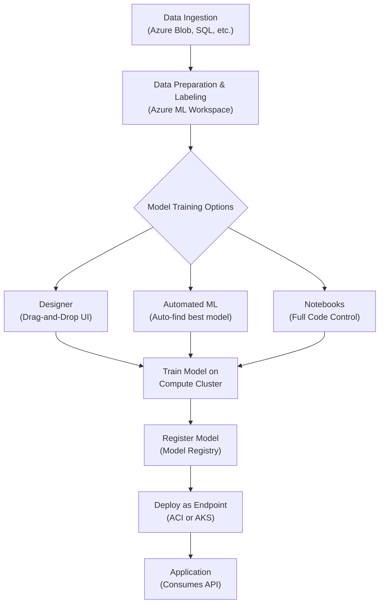

# Mastering Azure AI: Cognitive Services & Machine Learning Studio for Developers

In today's development landscape, AI is no longer a niche specialty; it's a powerful toolset that can elevate applications from functional to intelligent. Microsoft Azure provides a vast and accessible AI platform, but navigating its offerings can be daunting. This guide demystifies Azure's AI capabilities, focusing on two core pillars: the plug-and-play power of **Cognitive Services** and the custom model creation of **Azure Machine Learning Studio**.

Whether you're looking to add text analysis to your app with a simple API call or build a bespoke forecasting model from scratch, this article is your starting point. We'll cut through the marketing fluff and get straight to what you, the developer, need to know to build smarter, more capable applications.

### What You'll Get

*   **Clarity:** A clear distinction between pre-built AI (Cognitive Services) and custom AI (Azure ML).
*   **Practical Examples:** Code snippets and use cases for integrating vision, speech, and language AI.
*   **Architectural Insight:** A high-level diagram of the Azure Machine Learning workflow.
*   **Decision Framework:** A direct comparison table to help you choose the right tool for your project.
*   **Best Practices:** Key MLOps principles for managing your AI solutions effectively.

## Understanding the Azure AI Spectrum

Think of Azure AI as a spectrum of capabilities. On one end, you have ready-to-use, pre-trained models accessible via APIs. On the other, you have a complete workbench for building, training, and deploying custom models.

*   **Azure Cognitive Services:** These are the "off-the-shelf" solutions. Microsoft has done the heavy lifting of training complex models on massive datasets. Your job is simply to call an API to add sophisticated AI features like image recognition or sentiment analysis to your app.
*   **Azure Machine Learning (Azure ML):** This is your "custom workshop." When a pre-built model isn't specific enough for your unique data or business problem, Azure ML provides the tools, infrastructure, and lifecycle management to build your own.

> **Key Takeaway:** Start with Cognitive Services for speed and common use cases. Graduate to Azure ML when you need high degrees of customization and have unique data.

## Accelerate Development with Cognitive Services

Cognitive Services are designed for rapid integration. They are REST APIs backed by powerful AI models, allowing you to infuse AI into your applications with minimal machine learning expertise. They are broadly categorized into four areas.

### Vision 👁️

Services that understand the content of images and videos.

*   **Computer Vision:** Extracts rich information from images, including optical character recognition (OCR), object detection, and image categorization.
*   **Face:** Detects and recognizes human faces, verifies identities, and analyzes facial attributes.

Here’s how easy it is to perform OCR on an image using the Python SDK.

```python
# pip install azure-cognitiveservices-vision-computervision
from azure.cognitiveservices.vision.computervision import ComputerVisionClient
from msrest.authentication import CognitiveServicesCredentials

# --- Authenticate ---
SUBSCRIPTION_KEY = "your_cognitive_services_key"
ENDPOINT = "your_cognitive_services_endpoint"
computervision_client = ComputerVisionClient(ENDPOINT, CognitiveServicesCredentials(SUBSCRIPTION_KEY))

# --- Call the API ---
remote_image_url = "https://raw.githubusercontent.com/Azure-Samples/cognitive-services-sample-data-files/master/ComputerVision/Images/printed_text.jpg"
ocr_results = computervision_client.read(remote_image_url, raw=True)

# Process results (details omitted for brevity)
print("OCR initiated. Check operation status to get results.")
```

### Speech 🗣️

Services that process spoken language.

*   **Speech to Text:** Accurately transcribes audio streams into text in real-time or from files.
*   **Text to Speech:** Converts text into natural-sounding, human-like speech (neural voices).

### Language 📝

Services that comprehend unstructured text.

*   **Language Service:** A unified service for natural language processing (NLP). Key features include:
    *   **Sentiment Analysis:** Determines if text is positive, negative, or neutral.
    *   **Key Phrase Extraction:** Identifies the main talking points in a document.
    *   **Named Entity Recognition (NER):** Detects entities like people, places, and organizations.

### Decision 🧠

Services that provide recommendations for informed and efficient decision-making.

*   **Anomaly Detector:** Identifies potential problems or unusual patterns in your time-series data.
*   **Personalizer:** A reinforcement learning-based service that delivers personalized user experiences.

## Building Custom Models with Azure Machine Learning Studio

When pre-built APIs don't cut it, Azure ML Studio is your comprehensive solution for the entire machine learning lifecycle. It's a unified environment for data scientists and developers to collaborate.

The core workflow in Azure ML involves several key steps, from preparing data to deploying a model as a consumable API endpoint.



### Key Components of Azure ML

*   **Workspace:** The top-level resource and centralized place for all your ML artifacts.
*   **Datasets:** A reference to your data in storage, making it easy to access for training.
*   **Compute:** On-demand compute resources (like GPU clusters) for training models at scale.
*   **Models:** The trained and versioned models stored in the model registry.
*   **Endpoints:** Deployed models as web services (APIs) that your applications can call for real-time predictions.

### Three Ways to Build

Azure ML caters to all skill levels by providing multiple ways to build models:

1.  **Designer:** A drag-and-drop interface for visually connecting datasets and modules to create an ML pipeline. *Ideal for rapid prototyping and those new to ML.*
2.  **Automated ML:** Automatically iterates through different algorithms and hyperparameters to find the best-performing model for your data. *Great for establishing a strong performance baseline quickly.*
3.  **Notebooks:** A fully code-first experience using familiar tools like Jupyter notebooks and Python SDKs (or R). *Offers maximum flexibility and control for experienced practitioners.*

## Choosing Your Path: Cognitive Services vs. Azure ML

So, which tool should you use? The answer depends entirely on your project's requirements.

| Feature | Azure Cognitive Services | Azure Machine Learning |
| :--- | :--- | :--- |
| **Primary Use Case** | General-purpose AI (OCR, translation, sentiment) | Custom, domain-specific problems (sales forecasting, predictive maintenance) |
| **Required Skillset** | Developer (API integration) | Data Scientist / ML Engineer (Python, ML frameworks) |
| **Data Needs** | None (uses Microsoft's data) | You must provide your own labeled training data |
| **Development Speed** | Extremely fast (hours to days) | Slower (weeks to months) |
| **Customization** | Limited to API parameters | Fully customizable algorithms and pipelines |
| **Best For** | Adding intelligence to existing apps quickly | Building a core competitive advantage with unique AI |

## Best Practices for MLOps on Azure

Building a model is just the beginning. **MLOps (Machine Learning Operations)** is the practice of managing the end-to-end lifecycle of machine learning models in production. Azure provides robust tools to implement MLOps best practices.

*   **Source Control Everything:** Store your notebooks, training scripts, and infrastructure-as-code (IaC) definitions in a Git repository like Azure Repos or GitHub.
*   **Automate with Pipelines:** Use Azure Pipelines or GitHub Actions to create CI/CD (Continuous Integration/Continuous Deployment) pipelines that automatically train, test, and deploy your models upon code changes.
*   **Monitor Models in Production:** Track model performance and data drift. Use Azure Monitor to detect when a model's predictions are becoming less accurate over time, signaling a need for retraining.
*   **Embrace Responsible AI:** Use Azure ML's Responsible AI dashboard to understand your model's fairness, interpretability, and error analysis. Building trust in your AI systems is non-negotiable. For more, explore [Microsoft's Responsible AI resources](https://www.microsoft.com/en-us/ai/responsible-ai).

## Conclusion

The Azure AI platform offers a powerful, tiered approach to building intelligent applications. You can start small and fast with the incredible power of **Cognitive Services**, solving common problems with just a few API calls. When your needs become more specialized, **Azure Machine Learning Studio** provides a world-class environment to build, train, and manage custom models with full operational control.

By understanding the strengths of each service, you can choose the right tool for the job, accelerate your development, and deliver real business value through AI.

What's your favorite Azure AI service, or what exciting project are you building with it? Share your thoughts


## Further Reading

- [https://azure.microsoft.com/en-us/services/cognitive-services/](https://azure.microsoft.com/en-us/services/cognitive-services/)
- [https://azure.microsoft.com/en-us/services/machine-learning/](https://azure.microsoft.com/en-us/services/machine-learning/)
- [https://docs.microsoft.com/en-us/azure/architecture/ai-ml/](https://docs.microsoft.com/en-us/azure/architecture/ai-ml/)
- [https://www.microsoft.com/en-us/ai/developer-platform](https://www.microsoft.com/en-us/ai/developer-platform)
- [https://github.com/Azure/azure-ml-docs](https://github.com/Azure/azure-ml-docs)
