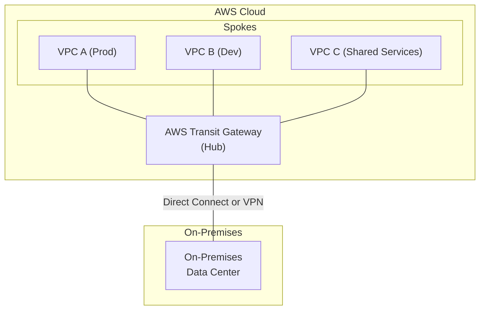

# AWS Networking Power-Up: Advanced VPC & Hybrid Cloud Connectivity

As cloud environments grow, the days of a single, simple Virtual Private Cloud (VPC) are fading. Today's reality is a complex web of multiple VPCs, on-premises data centers, and multi-account strategies. Mastering AWS networking is no longer a niche skill; it's a core competency for building scalable, secure, and resilient systems. This guide dives into the advanced concepts you need to architect and manage modern cloud and hybrid networks effectively.

### What You'll Get

*   **Scalable Architectures:** Learn to design multi-VPC networks that avoid common pitfalls.
*   **Simplified Routing:** Understand how AWS Transit Gateway acts as a cloud router to tame complexity.
*   **Hybrid Connectivity Deep Dive:** A clear comparison of AWS Direct Connect and Site-to-Site VPN.
*   **Actionable Security Practices:** Master the difference between Security Groups and Network ACLs.
*   **Performance & Troubleshooting Tips:** Key strategies for optimizing and debugging your network.

---

## Architecting for Scale: The Multi-VPC Reality

A single VPC quickly becomes a bottleneck. As you scale, you'll adopt a multi-VPC, multi-account strategy for clear separation of environments (dev, staging, prod), improved security boundaries, and autonomous team management.

The traditional approach, **VPC Peering**, connects two VPCs directly. It's effective for simple setups but creates a complex, unmanageable full mesh as you add more VPCs. If you have 5 VPCs, you need 10 peering connections. At 10 VPCs, that number jumps to 45. This "mesh mess" complicates routing and security management exponentially.

The modern solution is a **hub-and-spoke architecture**, which centralizes connectivity through a shared networking service. This is where AWS Transit Gateway shines.

## AWS Transit Gateway: The Cloud Router

[AWS Transit Gateway (TGW)](https://aws.amazon.com/transit-gateway/) is a managed service that acts as a regional network hub. It dramatically simplifies your network topology by connecting VPCs and on-premises networks through a central point, eliminating the need for complex peering connections.

### Simplifying Connectivity

With TGW, each VPC (or on-premises connection) becomes a "spoke" that attaches to the central "hub." The TGW handles all the routing between them. This means a new VPC only needs one connection—to the TGW—to communicate with all other attached spokes.

Here is a high-level view of a hub-and-spoke model with hybrid connectivity:



### Centralized Routing and Security

TGW isn't just about connectivity; it's a powerful control point.

*   **Route Tables:** You can create multiple route tables within the TGW. This allows you to segment your network. For example, you can create a route table that allows production VPCs to talk to each other and a shared services VPC, but completely isolates them from development VPCs.
*   **Centralized Inspection:** By routing traffic through a dedicated "inspection" or "security" VPC, you can centralize your security appliances. All inter-VPC or VPC-to-on-premises traffic can be forced through a fleet of firewalls or intrusion detection systems before reaching its destination.

> **Info Block:** Think of Transit Gateway as the airport hub of your cloud network. Instead of flying direct between small towns (VPC peering), every flight goes through the central hub, where security and routing are managed efficiently.

## Bridging Worlds: Hybrid Cloud Connectivity

Connecting your on-premises data center to AWS is a critical requirement for most enterprises. AWS provides two primary solutions for this: AWS Site-to-Site VPN and AWS Direct Connect.

### AWS Direct Connect vs. Site-to-Site VPN

Choosing the right option depends on your requirements for bandwidth, latency, and cost.

| Feature                 | AWS Site-to-Site VPN                               | AWS Direct Connect (DX)                               |
| ----------------------- | -------------------------------------------------- | ----------------------------------------------------- |
| **Connection Medium**   | Encrypted tunnel over the public internet.         | Private, dedicated physical fiber-optic connection.   |
| **Bandwidth**           | Variable, typically up to 1.25 Gbps per tunnel.    | Dedicated, consistent. 1 Gbps to 100 Gbps.            |
| **Latency**             | Variable and unpredictable (depends on internet).  | Low and consistent.                                   |
| **Cost**                | Lower upfront cost, pay-per-hour + data transfer.  | Higher upfront cost (port hours) + partner circuit.   |
| **Use Case**            | Development, non-critical workloads, quick setup.  | Production, high-throughput, latency-sensitive apps.  |
| **Setup Complexity**    | Relatively simple and fast to configure.           | More complex, involves coordinating with a DX partner. |

For maximum resilience, many organizations implement a **Direct Connect connection as the primary path and a Site-to-Site VPN as a cost-effective backup**.

### A Practical Example: VPN Creation

Setting up a Site-to-Site VPN is straightforward. You'll create a Customer Gateway (representing your on-prem router), a Virtual Private Gateway (on the AWS side), and finally the VPN Connection itself.

Here's a simplified AWS CLI command to create the final VPN connection:

```bash
# Example command to create a Site-to-Site VPN Connection
# Replace placeholders with your actual IDs

aws ec2 create-vpn-connection \
    --type ipsec.1 \
    --customer-gateway-id cgw-0123456789abcdef0 \
    --transit-gateway-id tgw-fedcba9876543210f \
    --options '{"TunnelOptions":[{"TunnelInsideCidr":"169.254.10.0/30"},{"TunnelInsideCidr":"169.254.20.0/30"}]}'
```

This command establishes the connection between your on-premises network and the Transit Gateway, enabling hybrid connectivity.

## Performance and Security Hardening

A well-architected network is both fast and secure. Pay attention to these fundamental concepts.

### Optimizing for Throughput

*   **Placement Groups:** For applications requiring low latency and high network throughput *within an Availability Zone*, use Cluster Placement Groups. This ensures your EC2 instances are physically close to each other.
*   **Jumbo Frames:** For traffic within your VPC, enabling jumbo frames (MTU of 9001) can increase throughput by allowing more data in a single packet, reducing overhead.
*   **AWS Global Accelerator:** For user-facing applications, [AWS Global Accelerator](https://aws.amazon.com/global-accelerator/) uses AWS's private global network to route user traffic to the nearest application endpoint, reducing latency and improving performance.

### Layered Security in Your VPC

Never rely on a single security mechanism. AWS provides two primary network firewalls:

1.  **Security Groups (SGs):**
    *   **Stateful:** If you allow inbound traffic on a port, the corresponding outbound return traffic is automatically allowed.
    *   **Instance-Level:** They act as a firewall for EC2 instances (at the Elastic Network Interface level).
    *   **Allow-Only:** You can only specify `allow` rules. Everything else is implicitly denied.

2.  **Network Access Control Lists (NACLs):**
    *   **Stateless:** You must explicitly define rules for both inbound *and* outbound traffic. Return traffic must be explicitly allowed.
    *   **Subnet-Level:** They act as a firewall for an entire subnet, affecting all instances within it.
    *   **Allow & Deny:** You can specify both `allow` and `deny` rules, processed in order.

> **Best Practice:** Use Security Groups as your primary defense for controlling traffic to instances. Use NACLs as a broader, secondary defense layer to block traffic at the subnet boundary, such as denying all traffic from a known malicious IP address range.

## Troubleshooting Common Nightmares

When things go wrong, network issues can be notoriously difficult to debug.

*   **Asymmetric Routing:** A common issue in hybrid setups where traffic goes to AWS over one path (e.g., Direct Connect) and tries to return over another (e.g., VPN), often getting dropped by stateful firewalls. Ensure your routing is consistent.
*   **Blocked Ephemeral Ports:** A classic NACL mistake. Because NACLs are stateless, you must allow outbound traffic on the ephemeral port range (1024-65535) for return traffic from servers you connect to.
*   **"Black Hole" Routes:** A route in a route table points to an inactive or deleted resource (like a NAT Gateway or ENI). Traffic destined for that route simply disappears.
*   **Helpful Tools:**
    *   **VPC Flow Logs:** Capture information about the IP traffic going to and from network interfaces in your VPC. Invaluable for seeing what's being allowed or denied.
    *   **VPC Reachability Analyzer:** A static analysis tool that lets you trace a virtual path between a source and a destination, showing you every SG, NACL, and route table along the way.

---

Modern AWS networking is a deep and rewarding discipline. By moving beyond basic VPCs to embrace hub-and-spoke models with Transit Gateway, selecting the right hybrid connectivity, and diligently applying layered security, you can build networks that are truly ready for the demands of tomorrow.

What is the most complex networking challenge you've faced in your environment? Share your story in the comments below


## Further Reading

- [https://aws.amazon.com/vpc/](https://aws.amazon.com/vpc/)
- [https://aws.amazon.com/transit-gateway/](https://aws.amazon.com/transit-gateway/)
- [https://aws.amazon.com/directconnect/](https://aws.amazon.com/directconnect/)
- [https://docs.aws.amazon.com/vpc/latest/userguide/](https://docs.aws.amazon.com/vpc/latest/userguide/)
- [https://aws.amazon.com/blogs/networking-and-content-delivery/](https://aws.amazon.com/blogs/networking-and-content-delivery/)
