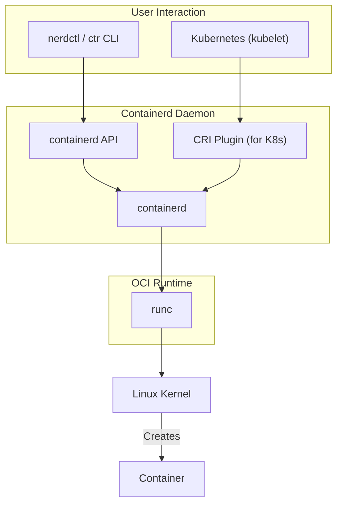

# Linux Containers Unleashed: Podman, Containerd, and cgroups v2 Deep Dive

While Docker revolutionized software development by making containers mainstream, the ecosystem has evolved significantly. Today, a new generation of tools offers more specialized, secure, and efficient ways to manage containers. This isn't about replacing Docker but understanding the powerful alternatives that drive modern cloud-native infrastructure.

We'll explore the daemonless architecture of Podman, the industry-standard core of containerd, and the foundational kernel improvements brought by control groups v2 (cgroups v2). Understanding these components is key to building robust, next-generation applications.

### What You'll Get

*   **Daemonless vs. Daemon:** A clear breakdown of Podman's and containerd's architectures.
*   **Practical Examples:** Hands-on commands for both Podman and containerd's user-friendly client, `nerdctl`.
*   **Kernel-Level Insights:** An explanation of how cgroups v2 improves container resource management and security.
*   **Clear Comparison:** A head-to-head table to help you choose the right tool for the job.

---

## Beyond the Daemon: Introducing Podman

Podman is a daemonless container engine for developing, managing, and running OCI Containers on your Linux System. The key word here is *daemonless*. Unlike Docker, Podman doesn't rely on a long-running, privileged background process. It operates on a fork-exec model, launching containers as child processes directly from the command line.

This architecture aligns perfectly with traditional Linux process management and brings substantial security benefits. Since there's no central daemon, there's no single point of failure or attack.

### Why Choose Podman?

*   **Enhanced Security:** Podman's standout feature is its first-class support for **rootless containers**. It allows non-privileged users to run containers securely without any special daemons or `setuid` binaries. This drastically reduces the potential attack surface.
*   **Systemd Integration:** The daemonless model makes integrating containers with `systemd` (the standard Linux init system) seamless. You can manage containers as system services, enabling them to start on boot and be managed with familiar `systemctl` commands.
*   **Pod Management:** Podman has built-in support for *pods*—groups of containers that share the same network namespace and other resources. This concept, borrowed from Kubernetes, is invaluable for developing and testing multi-container applications locally.
*   **Docker CLI Compatibility:** For those accustomed to Docker, the transition is smooth. Most Docker commands work with Podman. Many users simply run `alias docker=podman`.

### Podman in Action: Practical Examples

Getting started with Podman is straightforward.

**1. Run a Simple Container:**
The command is identical to Docker's.

```bash
# Run an NGINX container in the background
podman run -d --name my-nginx -p 8080:80 nginx:alpine
```

**2. Create a Pod:**
Here, we'll create a pod and then launch two containers inside it. They can communicate over `localhost`.

```bash
# Create a pod named "my-app-pod" that exposes port 8080
podman pod create --name my-app-pod -p 8080:80

# Run a simple web server container inside the pod
podman run -d --pod my-app-pod --name web-server nginx:alpine

# Run a "sidecar" container in the same pod to interact with the server
podman run --rm -it --pod my-app-pod alpine wget -qO- http://localhost
```

**3. Generate a systemd Unit File:**
Podman can automatically generate a `systemd` service file for a container or pod.

```bash
# Generate a service file for the pod we created
podman generate systemd --name my-app-pod > ~/.config/systemd/user/my-app-pod.service

# Now you can manage it with systemd (in user mode)
systemctl --user daemon-reload
systemctl --user start my-app-pod.service
systemctl --user status my-app-pod.service
```

> **Info:** For a deeper dive into Podman's capabilities, check out the official [Podman Documentation](https://podman.io/docs/).

## containerd: The Boring but Powerful Core

If Podman is the user-friendly toolkit, **containerd** is the industrial-grade engine block. Originally extracted from the Docker Engine, containerd was donated to the CNCF to become a stable, community-driven, and focused container runtime.

Its sole purpose is to manage the complete container lifecycle: pulling and pushing images, managing storage and networking, and supervising container execution. It's designed to be embedded into larger systems, which is why it has become the default runtime for most major Kubernetes distributions, including GKE, EKS, and AKS.

### The containerd Architecture

While it is a daemon, `containerd` is lean and focused. It exposes a gRPC API that higher-level tools use to manage containers. A user-friendly CLI like `nerdctl` can provide a Docker-like experience.



### When to Use containerd Directly

Most users interact with `containerd` indirectly through an orchestrator like Kubernetes. However, you might use it directly if you're:
*   Building a custom container-based platform.
*   Seeking a minimal, stable runtime for embedded systems.
*   Using a tool like [**nerdctl**](https://github.com/containerd/nerdctl), which provides a Docker-compatible CLI for `containerd`.

Here's how you'd run a container using `nerdctl`:

```bash
# nerdctl provides a familiar, Docker-like experience
sudo nerdctl run -d --name my-container -p 8081:80 httpd
```

## Podman vs. containerd: A Head-to-Head Look

Choosing between Podman and containerd depends entirely on your use case. They are different tools for different jobs.

| Feature             | Podman                                           | containerd                                            |
| ------------------- | ------------------------------------------------ | ----------------------------------------------------- |
| **Primary Use Case**  | Developer Workstation, Standalone Host           | Kubernetes & Orchestrator Runtimes                    |
| **Architecture**      | Daemonless (fork-exec model)                     | Daemon-based (gRPC API)                               |
| **Rootless Support**  | First-class, fundamental design                  | Supported, but less common for direct interaction     |
| **CLI Tool**          | `podman` (Docker-compatible)                     | `ctr` (low-level) or `nerdctl` (Docker-compatible)    |
| **Core Concepts**     | Containers, **Pods**, Images                     | Containers, Images, Namespaces                        |
| **Best For**        | Individual developers, sysadmins, `systemd` tasks | Cloud-native platforms, Kubernetes clusters, builders |

## The Engine Room Upgrade: Control Groups v2

Underpinning all modern container runtimes is a powerful Linux kernel feature: **Control Groups (cgroups)**. They are responsible for isolating and managing the resource usage (CPU, memory, I/O, network) of a collection of processes.

For years, the container world relied on cgroups v1, which was powerful but had inconsistencies and a complex, fragmented design. **cgroups v2** is a complete redesign that brings a unified, cleaner, and more powerful approach to resource control.

### Key Improvements in cgroups v2

*   **Unified Hierarchy:** The biggest change. In v2, all resource controllers (CPU, memory, etc.) are mounted in a single hierarchy. This eliminates the confusing and conflicting controller combinations of v1, making resource management predictable.
*   **Pressure Stall Information (PSI):** cgroups v2 introduces PSI, which provides accurate metrics on resource pressure. Applications and orchestrators can use this data to make smarter decisions about scaling or load shedding *before* performance degrades catastrophically.
*   **Superior Memory Management:** The memory controller is more robust. It can identify and terminate processes within a cgroup during an Out-of-Memory (OOM) event more reliably, preventing resource leaks from impacting the entire host.
*   **Secure Delegation:** The v2 model provides a safe way to delegate control of a sub-tree in the cgroup hierarchy to a less-privileged process. This is a critical enabler for true **rootless containers**, making Podman's security model even more effective.

> "The unified hierarchy of cgroups v2 is not just a cosmetic change; it's a fundamental shift that enables more granular, predictable, and secure resource control for containerized workloads."

These improvements mean containers running on a system with cgroups v2 are more performant, stable under pressure, and secure. Most modern Linux distributions now enable cgroups v2 by default, and Kubernetes has graduated its support to Stable.

## Choosing Your Container Stack

The container ecosystem is rich and diverse. Docker remains a fantastic all-in-one tool, but understanding the specialized components that now power the cloud-native world is crucial.

*   **For your developer machine or managing standalone services,** **Podman** offers a secure, daemonless experience with excellent `systemd` integration and first-class pod support.
*   **When you're building or running orchestrated systems,** **containerd** is the undisputed champion, providing a stable, performant, and minimal core that powers the vast majority of Kubernetes clusters.
*   **Underpinning everything,** **cgroups v2** is the kernel-level advancement that makes all of this possible, delivering the robust resource isolation required for today's demanding workloads.

What's your go-to container runtime for new projects, and why? Share your experiences and preferences


## Further Reading

- [https://podman.io/docs/](https://podman.io/docs/)
- [https://containerd.io/docs/](https://containerd.io/docs/)
- [https://lwn.net/Articles/804068/](https://lwn.net/Articles/804068/)
- [https://www.redhat.com/en/topics/containers/what-is-podman](https://www.redhat.com/en/topics/containers/what-is-podman)
- [https://docs.docker.com/engine/docker-and-linux/](https://docs.docker.com/engine/docker-and-linux/)
