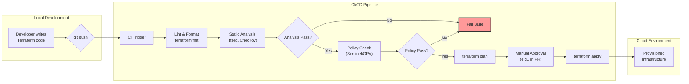

# Terraform Security Best Practices: Guardrails for Your IaC in 2026

Infrastructure as Code (IaC) has revolutionized how we build and manage systems. With tools like Terraform, we can define entire cloud environments in version-controlled, human-readable code. But this power comes with a critical responsibility: securing the code that defines our infrastructure. Misconfigurations in Terraform can lead to exposed data, compliance violations, and significant security breaches.

By 2026, the expectation is no longer just "shifting left," but making security an intrinsic, automated part of the IaC lifecycle. This article provides a practitioner's guide to the essential tools and strategies you need to build robust, secure, and compliant infrastructure with Terraform.

### What You'll Get

*   **Actionable Strategies:** Learn to implement static analysis and policy-as-code.
*   **Tooling Deep Dive:** Understand when to use tools like `tfsec`, `Checkov`, Sentinel, and OPA.
*   **Secrets Management:** Discover best practices for handling sensitive data with HashiCorp Vault.
*   **CI/CD Integration:** A clear architectural flow for embedding security checks into your pipeline.
*   **Least Privilege Principles:** Guidance on securing the Terraform execution environment itself.

---

## Static Analysis: Your First Line of Defense

Static analysis tools scan your Terraform code *before* it's ever applied, catching common misconfigurations and security vulnerabilities early in the development cycle. They are lightweight, fast, and easy to integrate into local development workflows and CI/CD pipelines.

### tfsec

[tfsec](https://aquasec.github.io/tfsec/) is a popular open-source static analysis tool designed specifically for Terraform. It uses static analysis of your templates to spot potential security risks.

*   **Key Benefit:** Laser-focused on Terraform with a comprehensive library of checks for AWS, Azure, and GCP.
*   **Ease of Use:** Can be run with a single command, providing clear, actionable output.

Here's how simple it is to run `tfsec` on your project:

```bash
# Install tfsec (e.g., via brew)
brew install tfsec

# Navigate to your Terraform project directory
cd ./my-infra-project/

# Run the scan
tfsec .
```

`tfsec` will flag issues like an S3 bucket without encryption or a security group exposing SSH to the entire internet.

### Checkov

[Checkov](https://www.checkov.io/) is another powerful open-source tool from Bridgecrew (Palo Alto Networks). Its scope is broader than `tfsec`, supporting not only Terraform but also CloudFormation, Kubernetes, Dockerfiles, and more.

*   **Key Benefit:** A single tool for scanning multiple IaC and container formats.
*   **Graph-Based Checks:** Checkov builds a dependency graph, allowing it to understand connections between resources for more sophisticated context-aware checks.

```bash
# Install Checkov
pip install checkov

# Run a scan on your directory
checkov -d .
```

> **Which one to choose?**
> If your organization is 100% Terraform, `tfsec` offers simplicity and focus. If you manage a diverse IaC landscape, `Checkov`'s versatility provides a unified scanning solution. Many teams use both to get the widest possible coverage.

## Policy-as-Code: Enforcing Organizational Guardrails

While static analysis tools check for known *vulnerabilities*, Policy-as-Code (PaC) tools enforce organizational *rules*. PaC allows you to codify your company's compliance, cost, and architectural standards and automatically validate Terraform plans against them.

### HashiCorp Sentinel

[Sentinel](https://www.hashicorp.com/products/sentinel) is HashiCorp's embedded PaC framework. It's tightly integrated into Terraform Cloud/Enterprise, Vault, and other HashiCorp products. Policies are written in the Sentinel language, which is purpose-built and relatively easy to learn for those familiar with HCL.

**Use Case:** Ensure all AWS S3 buckets have a specific `cost-center` tag.

Here's a simplified Sentinel policy to enforce this rule:

```sentinel
import "tfplan/v2" as tfplan

# Rule: Enforce a 'cost-center' tag on all S3 buckets
main = rule {
  all tfplan.resource_changes as _, rc {
    rc.type is "aws_s3_bucket" and
    rc.change.after.tags["cost-center"] is not null
  }
}
```

This policy will block any `terraform apply` in Terraform Cloud that attempts to create an S3 bucket without the required tag.

### Open Policy Agent (OPA)

[Open Policy Agent (OPA)](https://www.openpolicyagent.org/) is a graduated CNCF project that provides a general-purpose, open-source policy engine. It's vendor-agnostic and can be used to enforce policies across a massive ecosystem, including Kubernetes, microservices, and Terraform. Policies are written in a declarative language called **Rego**.

**Use Case:** Restrict EC2 instances to a pre-approved list of instance types.

A simple OPA policy in Rego might look like this:

```rego
package terraform.aws

# Deny if an EC2 instance type is not in the allowed list
deny[msg] {
    input.resource_changes[_].type == "aws_instance"
    instance_type := input.resource_changes[_].change.after.instance_type
    not allowed_instance_types[instance_type]
    msg = sprintf("Instance type '%v' is not allowed.", [instance_type])
}

# Set of allowed instance types
allowed_instance_types = {"t3.micro", "t3.small"}
```

### Sentinel vs. OPA: A Quick Comparison

| Feature | HashiCorp Sentinel | Open Policy Agent (OPA) |
| :--- | :--- | :--- |
| **Ecosystem** | Tightly integrated with the HashiCorp stack (Terraform Cloud, Vault, Consul). | Cloud-native, vendor-agnostic. Integrates with Kubernetes, microservices, etc. |
| **Language** | Purpose-built policy language, feels similar to HCL. | Rego, a declarative query language based on Datalog. |
| **Scope** | Best for controlling workflows *within* HashiCorp products. | General-purpose policy engine for a wide range of systems. |
| **Learning Curve** | Generally lower for those already in the HashiCorp ecosystem. | Steeper, but more powerful and flexible for diverse use cases. |

## Secrets Management: Never Hardcode Credentials

A cardinal sin of IaC is hardcoding secrets—API keys, database passwords, certificates—directly into your `.tf` files or committing them to version control. This is a massive security risk. The industry-standard solution is to use a dedicated secrets management tool like HashiCorp Vault.

Terraform integrates seamlessly with [HashiCorp Vault](https://www.hashicorp.com/products/vault) through its Vault provider. This allows your Terraform code to dynamically fetch secrets at runtime.

### Example: Fetching a Database Password from Vault

First, configure the Vault provider. Authentication can be handled via various methods, such as AppRole or cloud IAM roles.

```hcl
# main.tf - Configure the Vault provider
provider "vault" {
  # The address of your Vault server
  address = "https://vault.example.com:8200"
  # Authentication will be handled by environment variables
  # or another secure method in your CI/CD system.
}
```

Next, use the `vault_generic_secret` data source to read the secret.

```hcl
# database.tf - Dynamically retrieve the DB password

data "vault_generic_secret" "db_password" {
  path = "secret/data/database/credentials"
}

resource "aws_db_instance" "default" {
  # ... other configuration ...
  identifier     = "mydb"
  engine         = "mysql"
  instance_class = "db.t3.micro"
  username       = "admin"
  password       = data.vault_generic_secret.db_password.data["password"] # Use the secret here
}
```

With this pattern, the sensitive password value never touches your Git repository. It's pulled directly from Vault by the Terraform process during the `plan` and `apply` stages.

## Securing the Execution Environment

Securing your code is only half the battle. You must also secure the environment where Terraform runs. The identity (IAM role, service principal, etc.) that executes `terraform apply` needs permissions to create, modify, and destroy cloud resources. This identity is a high-value target.

### Enforce Least Privilege

The role or user executing Terraform should have **only the minimum permissions required** to manage the resources defined in that specific Terraform project.

*   **Avoid Admin Roles:** Never run Terraform with an `AdministratorAccess` or `owner` role in production.
*   **Scoped Policies:** Craft narrow IAM policies that are specific to the resources being managed. For example, if a project only manages S3 buckets and IAM roles, its execution policy should not include permissions for EC2 or RDS.
*   **State File Protection:** The Terraform state file can contain sensitive data in plain text. Always use a secure, encrypted, and access-controlled remote backend like an S3 bucket with encryption and versioning enabled, or Terraform Cloud.

## Integrating Security into Your CI/CD Pipeline

The ultimate goal is to automate these security checks within your CI/CD pipeline, creating a robust DevSecOps workflow. This ensures that no insecure code can be deployed.

Here is a high-level view of a secure Terraform CI/CD pipeline:



1.  **Commit/PR:** A developer pushes code, triggering the pipeline.
2.  **Lint & Validate:** The pipeline runs `terraform fmt` and `terraform validate` for basic sanity checks.
3.  **Static Analysis:** It then runs `tfsec` and/or `Checkov` to scan for known misconfigurations. A failure here breaks the build.
4.  **Policy Check:** The generated plan is evaluated against your Sentinel or OPA policies. A violation also breaks the build.
5.  **Plan & Review:** A `terraform plan` is generated and posted to the pull request for human review.
6.  **Apply:** After approval, the changes are applied to the target environment.

## Conclusion

Securing your Terraform code is not an afterthought; it's a fundamental requirement for modern cloud operations. By layering multiple defenses—static analysis for vulnerabilities, policy-as-code for governance, robust secrets management, and least-privilege execution—you can build a resilient and secure IaC workflow. Automating these checks in your CI/CD pipeline transforms security from a manual bottleneck into a competitive advantage.

What are your biggest IaC security concerns or challenges in your organization? Share your thoughts in the comments below


## Further Reading

- [https://www.hashicorp.com/products/sentinel](https://www.hashicorp.com/products/sentinel)
- [https://www.terraform.io/docs/cloud/run/policies.html](https://www.terraform.io/docs/cloud/run/policies.html)
- [https://aquasec.github.io/tfsec/](https://aquasec.github.io/tfsec/)
- [https://www.checkov.io/](https://www.checkov.io/)
- [https://www.hashicorp.com/blog/terraform-security](https://www.hashicorp.com/blog/terraform-security)
