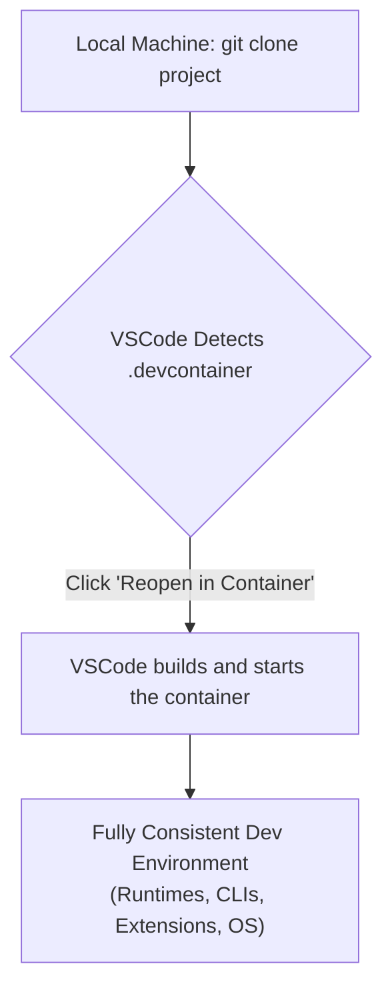

# VSCode for Cloud Dev: Remoting, Dev Containers & AI Assistants Mastery

Visual Studio Code isn't just an editor; it's the command center for modern cloud development. As we look at the landscape in 2026, its dominance is cemented not by its text-editing capabilities, but by its deep, seamless integration with the cloud ecosystem. The lines between local and remote environments have blurred, consistent project setups are the default, and AI has become an indispensable co-pilot.

This article dives into the three pillars that make VSCode the unparalleled choice for cloud practitioners: advanced remote development, declarative development containers, and intelligent AI assistance. We'll move beyond the basics to explore how mastering these features creates a more productive, consistent, and powerful development workflow.

### What You'll Get

*   **Remote Development Mastery:** A breakdown of when to use SSH, WSL, and Tunnels for any cloud scenario.
*   **Dev Container Blueprints:** How to define and use Dev Containers to eliminate environment drift for good.
*   **AI-Powered Cloud Ops:** Practical examples of using AI assistants for CLI commands, IaC, and debugging.
*   **Pro-Level Tips:** Curated extensions and workflows to optimize your cloud development loop.

***

## Mastering Remote Development: Your Local IDE, Anywhere

The core challenge of cloud development is bridging the gap between your local machine and the remote resources you're building for. VSCode's remote development extensions transform this challenge into a seamless experience, allowing your local VSCode UI to operate against source code and environments located anywhere.

### Remote - SSH: The Classic, Perfected

Connecting directly to a cloud virtual machine (like an EC2 instance or an Azure VM) is a foundational workflow. The [Remote - SSH](https://code.visualstudio.com/docs/remote/ssh) extension makes this trivial. You get a full-fidelity VSCode experience—including terminal, debugging, and extension support—running directly on the remote server.

**Best For:**
*   Developing on a powerful cloud VM to bypass local machine limitations.
*   Debugging applications in a production-like Linux environment.
*   Making quick, surgical changes to a running server.

To get started, you just need to configure your SSH host in the `.ssh/config` file:

```bash
# ~/.ssh/config
Host my-aws-ec2-dev
  HostName 18.224.111.123
  User ec2-user
  IdentityFile ~/.ssh/my-aws-key.pem
```
Once configured, use the VSCode command palette (`Ctrl+Shift+P`) to "Connect to Host..." and select `my-aws-ec2-dev`. VSCode handles the rest.

### Remote - WSL: The Best of Both Worlds

For developers on Windows, the [Windows Subsystem for Linux (WSL)](https://learn.microsoft.com/en-us/windows/wsl/about) provides a complete Linux environment. The [Remote - WSL](https://code.visualstudio.com/docs/remote/wsl) extension integrates VSCode so tightly that you can edit files and run commands in Linux directly from your Windows-based editor, with zero performance penalty.

**Best For:**
*   Windows users who need native access to Linux-based cloud CLIs (`aws`, `az`, `gcloud`, `kubectl`).
*   Running and debugging Linux-native applications without leaving Windows.
*   Maintaining a clean separation between your Windows OS and your Linux development toolchains.

### Remote - Tunnels: Secure Access from Anywhere

What if the machine you need to access is behind a restrictive firewall or you want to share your `localhost` with a colleague? [VSCode Tunnels](https://code.visualstudio.com/docs/remote/tunnels) create a secure connection between any instance of VSCode and your machine, without needing to configure SSH or open firewall ports.

**Best For:**
*   Accessing your development machine from a browser on another device.
*   Collaborating with a team member on your local development server.
*   Working on a corporate machine with strict inbound network policies.

> **Info Block:** Remote Tunnels act as a secure proxy, relaying traffic through Microsoft's global infrastructure. This is a game-changer for environments where direct SSH access is difficult to establish.

***

## Dev Containers: Eradicate "It Works on My Machine"

Consistent environments are the bedrock of effective cloud-native teams. Dev Containers formalize your development environment as code, ensuring every developer—and every CI/CD pipeline—operates with the exact same tools, dependencies, and configurations.

### What Are Dev Containers?

Powered by the [Dev Containers](https://code.visualstudio.com/docs/devcontainers/containers) extension, this feature uses Docker to launch your project's code inside a pre-configured container. The container holds everything: the correct runtime version (e.g., Python 3.11), specific OS packages, required CLIs, and even pre-installed VSCode extensions.

The workflow is simple and powerful, as shown in the diagram below.



### The `devcontainer.json` Magic

The heart of a dev container is the `devcontainer.json` file. This declarative file tells VSCode how to build and configure your environment.

Here is a simple example for a Python project that needs the Azure CLI:

```jsonc
// .devcontainer/devcontainer.json
{
  "name": "Python 3 & Azure CLI",
  // Start from a Microsoft-provided base image
  "image": "mcr.microsoft.com/devcontainers/python:3.11",

  "features": {
    // Add the Azure CLI "feature" to the base image
    "ghcr.io/devcontainers/features/azure-cli:1": {}
  },

  "customizations": {
    "vscode": {
      "extensions": [
        "ms-python.python",
        "ms-azuretools.azure-cli",
        "ms-python.vscode-pylance"
      ]
    }
  },

  // Run a command after the container is created
  "postCreateCommand": "pip install -r requirements.txt && az login"
}
```

### Benefits for Cloud Teams

*   **Consistency:** Every developer gets the exact same environment, from runtime versions to CLI tools.
*   **Rapid Onboarding:** New team members can clone a repo, reopen it in a container, and be productive in minutes.
*   **Dependency Isolation:** Project dependencies are completely isolated from the host machine, preventing conflicts.

***

## AI Assistants: Your Intelligent Cloud Co-pilot

AI assistants like GitHub Copilot have moved beyond simple code completion. In 2026, they are indispensable partners for cloud development, understanding the context of cloud services, Infrastructure as Code (IaC), and CLI operations.

### Beyond Code Completion

Modern AI assistants integrated into VSCode act as a conversational partner. They can interpret natural language prompts to generate complex configurations, CLI commands, or boilerplate code for cloud services. This dramatically reduces the time spent searching through dense documentation.

### Cloud-Specific AI Use Cases

Imagine you need to create an S3 bucket with specific permissions. Instead of looking up the AWS CLI syntax, you simply ask your AI assistant.

**Prompt:**
> "Write an AWS CLI command to create a private S3 bucket named `my-app-logs-2026` in the `us-east-1` region with versioning enabled."

**AI-Generated Command:**

```bash
aws s3api create-bucket \
    --bucket my-app-logs-2026 \
    --region us-east-1

aws s3api put-bucket-versioning \
    --bucket my-app-logs-2026 \
    --versioning-configuration Status=Enabled
```

This capability extends across the cloud development lifecycle:

| Task | AI Assistant Application |
| :--- | :--- |
| **Infrastructure** | Generate Terraform HCL or Azure Bicep for a new VPC or VNet. |
| **Permissions** | "Explain this IAM policy in simple terms" or "write a policy to allow read-only access to DynamoDB". |
| **Serverless** | Stub out a complete AWS Lambda or Azure Function, including triggers and basic logging. |
| **Debugging** | "Analyze these CloudWatch logs and suggest a possible cause for the 502 error." |

***

## Pro-Tip: Essential Extensions for the Cloud Developer

Your VSCode setup is only as good as your extensions. Here are a few must-haves for any serious cloud developer.

| Extension | Purpose | Why It's a Must-Have |
| :--- | :--- | :--- |
| **AWS Toolkit** | Interact with AWS services directly from VSCode. | Deploy serverless apps, browse S3, and execute ECS tasks without leaving the IDE. |
| **Azure Tools** | A pack of extensions for managing Azure resources. | A one-stop shop for App Service, Functions, Storage, and Databases. |
| **Docker** | Manage containers, images, and Docker Compose. | Essential for local testing and working with Dev Containers. |
| **HashiCorp Terraform** | Advanced language support for Terraform files. | Syntax highlighting, autocompletion, and validation for your IaC. |
| **GitHub Copilot** | The premier AI pair programmer. | Accelerates coding, generates boilerplate, and answers cloud-specific questions. |

***

## Conclusion: The Future-Proof IDE

VSCode's evolution has been deliberate and impactful. By focusing on solving the core challenges of modern software development—bridging environments, ensuring consistency, and augmenting developer intelligence—it has become the definitive tool for building on the cloud.

Mastering the synergy between Remote Development, Dev Containers, and AI Assistants is no longer just a "nice-to-have." It's the standard for productive, efficient, and collaborative cloud engineering in 2026 and beyond.

What are your go-to VSCode extensions for cloud development? Share them in the comments below


## Further Reading

- [https://code.visualstudio.com/docs/remote/remote-overview](https://code.visualstudio.com/docs/remote/remote-overview)
- [https://code.visualstudio.com/docs/devcontainers/containers](https://code.visualstudio.com/docs/devcontainers/containers)
- [https://marketplace.visualstudio.com/vscode](https://marketplace.visualstudio.com/vscode)
- [https://azure.microsoft.com/en-us/developer/tools/](https://azure.microsoft.com/en-us/developer/tools/)
- [https://aws.amazon.com/developer/tools/visual-studio-code/](https://aws.amazon.com/developer/tools/visual-studio-code/)
