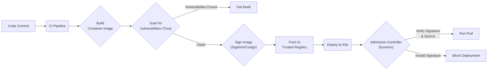

# Kubernetes Zero Trust: Hardening Your Clusters from Within

In the early days of IT, we built digital castles with strong perimeters. Once you were past the firewall, you were trusted. This model is obsolete in the world of distributed, ephemeral, and API-driven systems like Kubernetes. By 2026, assuming any internal traffic is "safe" is not just naive—it's a critical vulnerability.

Zero Trust is not a product you buy; it's a security model built on the principle of "never trust, always verify." Every request, whether from outside or inside the network, must be authenticated, authorized, and encrypted before gaining access to resources. In Kubernetes, this means treating your cluster not as a castle, but as a busy city with zero-trust checkpoints at every intersection.

This guide provides a practitioner-focused blueprint for implementing Zero Trust principles directly within your Kubernetes clusters.

### What You'll Get

*   **Actionable Strategies:** Learn how to apply Zero Trust principles using native Kubernetes features and popular open-source tools.
*   **Practical Examples:** See concrete YAML for `NetworkPolicy`, RBAC `Roles`, and admission controller policies.
*   **Architectural Clarity:** Understand the layered security approach through diagrams and clear explanations.
*   **Future-Proof Concepts:** Harden your clusters with practices designed for modern, production-grade environments.

---

## The Core Principles of Zero Trust in Kubernetes

The traditional security model creates a hard shell but a soft, chewy center. Once an attacker breaches the perimeter, they can often move laterally with ease. Zero Trust eliminates this implicit trust.

> **NIST Special Publication 800-207** defines Zero Trust Architecture as a collection of concepts that assumes no implicit trust is granted to assets or user accounts based solely on their physical or network location.

In Kubernetes, this translates to four key pillars:

1.  **Identity:** Every entity (user, service account, pod) must have a strong, verifiable identity.
2.  **Network:** All network traffic is untrusted. Access is segmented and strictly controlled by policy.
3.  **API Server:** The Kubernetes API server is the central control plane. Every request must be authenticated and authorized.
4.  **Supply Chain:** The integrity of container images and application code is verified before deployment.

These pillars work together to ensure that even if one component is compromised, the blast radius is contained.

## Granular Network Policies: Building Micro-Perimeters

By default, Kubernetes networking is a flat, "allow-all" free-for-all. Any pod can communicate with any other pod in the cluster, which is a significant security risk. `NetworkPolicy` is the native Kubernetes resource for controlling traffic flow at the IP address or port level (OSI layer 3 or 4).

### Start with a Default Deny

The most effective strategy is to implement a "deny-all" policy for each namespace. This policy blocks all ingress traffic to all pods in the namespace, forcing you to explicitly whitelist required communication paths.

```yaml
apiVersion: networking.k8s.io/v1
kind: NetworkPolicy
metadata:
  name: default-deny-ingress
  namespace: my-app
spec:
  podSelector: {}
  policyTypes:
  - Ingress
```

With this in place, no pods in the `my-app` namespace can receive traffic until you create more specific policies.

### Allow Specific Traffic

Next, create policies that allow only necessary communication. For example, let's allow traffic from the `frontend` pods to the `backend` pods on TCP port 8080.

```yaml
apiVersion: networking.k8s.io/v1
kind: NetworkPolicy
metadata:
  name: backend-allow-frontend
  namespace: my-app
spec:
  podSelector:
    matchLabels:
      app: backend
  policyTypes:
  - Ingress
  ingress:
  - from:
    - podSelector:
        matchLabels:
          app: frontend
    ports:
    - protocol: TCP
      port: 8080
```

*   **Best Practice:** Always use a CNI (Container Network Interface) plugin that supports `NetworkPolicy`, such as Calico, Cilium, or Weave Net. For advanced needs like Layer 7 policies (e.g., allowing `GET` but not `POST` to an HTTP endpoint), consider a service mesh like Linkerd or Istio.

## Fine-Grained RBAC: The Principle of Least Privilege

Role-Based Access Control (RBAC) determines who can do what within your cluster. Granting overly broad permissions is a common mistake that can lead to catastrophic failures. The principle of least privilege dictates that any user, application, or service should only have the bare minimum permissions required to perform its function.

### Best Practices for RBAC

*   **Favor `Roles` over `ClusterRoles`:** Use namespaced `Roles` and `RoleBindings` to restrict permissions to a single namespace. Only use cluster-wide `ClusterRoles` for resources that are truly global (e.g., nodes).
*   **Be Specific, Avoid Wildcards:** Avoid using `*` for `verbs` or `resources`. Explicitly list every required permission.
*   **Audit Regularly:** Use tools like `kubectl-who-can` or open-source solutions like Krane to periodically audit and prune unnecessary permissions.

### Example: A Read-Only Role

Imagine an application that only needs to read a `ConfigMap`. Instead of giving its `ServiceAccount` broad read access, create a highly specific `Role`.

```yaml
apiVersion: rbac.authorization.k8s.io/v1
kind: Role
metadata:
  namespace: my-app
  name: configmap-reader
rules:
- apiGroups: [""] # "" indicates the core API group
  resources: ["configmaps"]
  verbs: ["get", "watch", "list"]
---
apiVersion: rbac.authorization.k8s.io/v1
kind: RoleBinding
metadata:
  name: read-configs-for-my-app
  namespace: my-app
subjects:
- kind: ServiceAccount
  name: my-app-sa # The service account used by your pod
  namespace: my-app
roleRef:
  kind: Role
  name: configmap-reader
  apiGroup: rbac.authorization.k8s.io
```

This ensures that even if the application is compromised, the attacker cannot modify the `ConfigMap` or access other resources like `Secrets`.

## Admission Controllers: Your Cluster's Gatekeepers

Admission controllers are powerful plugins that intercept requests to the Kubernetes API server *after* authentication and authorization. They can validate or mutate requests before they are persisted to `etcd`, making them a critical enforcement point for security policies.

While Kubernetes has several built-in controllers, the real power comes from dynamic admission controllers like **OPA/Gatekeeper** and **Kyverno**. These tools allow you to define custom policies as code.

### Common Use Cases for Admission Controllers

*   **Enforce Pod Security Standards:** Block pods from running as root, using `hostPath` volumes, or having privileged containers.
*   **Require Resource Labels:** Ensure all deployments have a `team` or `cost-center` label for proper governance.
*   **Verify Image Sources:** Only allow images to be pulled from your organization's trusted container registry.
*   **Validate Image Signatures:** Enforce supply chain security by checking image signatures.

### Example: Kyverno Policy to Block Privileged Pods

Here is a simple Kyverno `ClusterPolicy` that blocks any pod from running in privileged mode.

```yaml
apiVersion: kyverno.io/v1
kind: ClusterPolicy
metadata:
  name: disallow-privileged-containers
spec:
  validationFailureAction: Enforce
  background: true
  rules:
  - name: privileged-containers
    match:
      any:
      - resources:
          kinds:
          - Pod
    validate:
      message: "Privileged containers are not allowed."
      pattern:
        spec:
          containers:
          - name: "*"
            securityContext:
              privileged: false
```

This policy acts as an automated guardrail, preventing a common security misconfiguration before it ever reaches a node.

## Securing the Supply Chain: Trusting Your Code

A Zero Trust posture is incomplete if you deploy untrusted code. Securing your software supply chain ensures that the images running in your cluster are exactly what your developers intended—free from tampering and known vulnerabilities.

This involves a verifiable chain of trust from code commit to running pod.



### Key Steps for Supply Chain Security

1.  **Image Scanning:** Integrate vulnerability scanners like [Trivy](https://github.com/aquasecurity/trivy) or [Grype](https://github.com/anchore/grype) into your CI/CD pipeline to detect known CVEs before deployment.
2.  **Use Trusted Registries:** Store your images in a private, secure registry and use an admission controller to block deployments from public registries like Docker Hub.
3.  **Image Signing:** Use tools from the [Sigstore](https://www.sigstore.dev/) project, like Cosign, to cryptographically sign your container images. This creates an immutable record proving the image's origin and integrity.
4.  **Enforce Verification:** Use an admission controller (like Kyverno) to verify these signatures at deploy time, ensuring only signed and trusted images can run in your cluster.

## Putting It All Together: A Layered Approach

Zero Trust in Kubernetes isn't about a single tool; it's about building layers of defense. Each pillar reinforces the others, creating a robust security posture that is resilient to failure.

| Zero Trust Principle | Kubernetes Implementation | Tools & Features |
| :--- | :--- | :--- |
| **Assume Breach** | Isolate workloads and limit blast radius. | `NetworkPolicy`, Minimal RBAC, Security Contexts |
| **Verify Explicitly** | Authenticate and authorize every request. | mTLS (Service Mesh), RBAC, Admission Controllers |
| **Least Privilege Access** | Grant minimal required permissions. | Namespaced `Roles`, `securityContext` |
| **Micro-segmentation** | Isolate network traffic between services. | `NetworkPolicy`, Service Mesh (Linkerd, Istio) |
| **Secure the Supply Chain**| Ensure workload integrity before deployment.| Image Scanning (Trivy), Image Signing (Sigstore) |

By systematically implementing controls across the network, API, identity, and supply chain, you move from a brittle perimeter model to a resilient, self-defending cluster. This is the future of cloud-native security.

---

What are your top Kubernetes security concerns heading into 2026? Share your thoughts in the comments below


## Further Reading

- [https://kubernetes.io/docs/concepts/security/](https://kubernetes.io/docs/concepts/security/)
- [https://kubernetes.io/docs/concepts/services-networking/network-policies/](https://kubernetes.io/docs/concepts/services-networking/network-policies/)
- [https://www.cncf.io/blog/zero-trust-kubernetes/](https://www.cncf.io/blog/zero-trust-kubernetes/)
- [https://www.nist.gov/publications/zero-trust-architecture](https://www.nist.gov/publications/zero-trust-architecture)
- [https://cloud.google.com/kubernetes-engine/docs/security/zero-trust](https://cloud.google.com/kubernetes-engine/docs/security/zero-trust)
