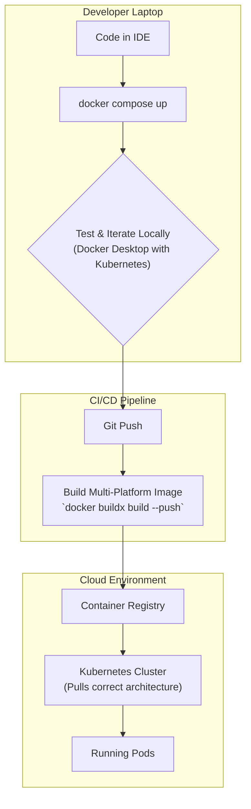

# Docker's Evolution: Beyond the Engine to Cloud-Native Ecosystem in 2026

When we think of Docker, the simple `docker run` command often comes to mind—a revolutionary tool that made containerization accessible. But freezing Docker in that 2015 mindset misses the plot entirely. Docker has evolved from a standalone container engine into a comprehensive, cloud-native development platform. Its focus has shifted from just running containers to streamlining the entire "inner loop" of development and providing a seamless on-ramp to production environments like Kubernetes.

This article explores Docker's strategic evolution beyond its core engine. We'll examine the tools and integrations that position Docker as a critical component of the cloud-native landscape for 2026 and beyond.

### What You'll Get

*   **Strategic Insight:** Understand why Docker Desktop is more than just a GUI.
*   **Practical Skills:** Learn how Buildx solves the multi-platform build challenge.
*   **Modern Workflows:** Discover the power of Docker Compose for cloud deployments.
*   **Architectural Clarity:** See how Docker seamlessly integrates with Kubernetes and serverless.
*   **Future Outlook:** A clear view of Docker's enduring relevance in a cloud-native world.

## Docker Desktop: The Developer's Control Plane

Initially seen as a simple way to run Docker on macOS and Windows, [Docker Desktop](https://docs.docker.com/desktop/) has matured into an indispensable developer control plane. It's no longer just about the Docker daemon; it's an integrated environment designed to manage the complexity of modern development.

Key strategic functions of Docker Desktop include:

*   **Integrated Kubernetes:** Spin up a local, single-node Kubernetes cluster with a single click. This allows developers to test applications against the Kubernetes API without leaving their local machine.
*   **Docker Extensions:** An integrated marketplace for third-party tools. Developers can add capabilities like vulnerability scanning (Snyk, Trivy), local object storage (Minio), or database management directly into their Docker environment.
*   **Software Supply Chain Security:** Features like Docker Scout provide visibility into image vulnerabilities and supply chain issues directly within the developer's workflow, shifting security left.
*   **Unified Environment:** Manages the Docker Engine, Kubernetes, and extensions under one roof, providing a consistent experience across different operating systems.

> **Quote:** "Docker Desktop is the linchpin of the modern developer workflow. It abstracts away the host OS differences and provides a stable, consistent platform for building and testing cloud-native applications."

## Buildx and the Multi-Platform Challenge

The rise of ARM-based architectures, particularly Apple Silicon (M1/M2/M3), created a significant challenge: developers were building on `arm64` but often deploying to `amd64` servers in the cloud. This mismatch can lead to subtle bugs and runtime failures.

Enter **Buildx**, a Docker CLI plugin that leverages the Moby BuildKit engine to deliver advanced build capabilities. It is now the default builder in Docker Desktop.

### Why Buildx Matters

*   **True Multi-Platform Builds:** Build and push images for multiple architectures (`linux/amd64`, `linux/arm64`) from a single command, creating a multi-platform manifest list.
*   **Advanced Caching:** Dramatically improves build speeds by leveraging more effective caching layers, including support for remote cache repositories.
*   **Parallel Build Execution:** BuildKit's architecture allows for parallel execution of build stages, further optimizing performance.

### A Practical Buildx Example

Building an image for both AMD and ARM platforms is remarkably straightforward. This single command builds for both architectures and pushes the resulting manifest to Docker Hub. The correct image variant is then pulled automatically by the client's architecture.

```bash
# Build for both amd64 and arm64 and push to the registry
docker buildx build \
  --platform linux/amd64,linux/arm64 \
  --tag yourusername/multi-arch-app:latest \
  --push .
```
This single feature makes [Docker Buildx](https://docs.docker.com/buildx/) essential for any team supporting multiple hardware environments.

## Docker Compose V3+: Orchestrating Modern Applications

Docker Compose has always been a favorite for defining and running multi-container applications locally. However, its modern iterations have expanded its scope far beyond the local machine. The Compose Specification is now an open standard, and its tooling is more powerful than ever.

Key enhancements in modern Docker Compose include:

*   **Cloud Integrations:** Directly deploy a Compose application to cloud services like Amazon ECS and Microsoft ACI using the `docker compose up` command with a different context.
*   **Profiles:** Define service subsets that can be enabled or disabled, allowing a single `compose.yml` file to manage different environments (e.g., `dev`, `testing`, `dev-with-monitoring`).
*   **`include` directive:** Break down large, complex Compose files into smaller, reusable modules for better organization and maintainability.

Here's an example using `profiles` to optionally bring up a monitoring service:

```yaml
# docker-compose.yml
services:
  webapp:
    image: yourusername/webapp:latest
    ports:
      - "8080:80"

  prometheus:
    image: prom/prometheus
    ports:
      - "9090:9090"
    profiles:
      - monitoring
```

To run without monitoring: `docker compose up`.
To run *with* monitoring: `docker compose --profile monitoring up`.

## Integration with the Cloud-Native Ecosystem

Docker's most significant evolution is its deep and symbiotic integration with the broader cloud-native landscape, especially Kubernetes.

### Kubernetes: A Symbiotic Relationship

The narrative of "Docker vs. Kubernetes" was always misleading. Docker (via its donated `containerd` project) provides the container runtime for the vast majority of Kubernetes clusters. The real story is one of specialization: Docker excels at the developer "inner loop," while Kubernetes excels at production orchestration.

This diagram illustrates the modern development-to-production workflow:



This flow shows Docker's role is not replaced by Kubernetes; it's the essential first step. It provides the standardized artifact (the container image) and the local testing environment that makes reliable Kubernetes deployments possible.

### Serverless and Beyond

The Docker container image has become the de-facto packaging standard, even for serverless platforms. Services like [AWS Lambda](https://aws.amazon.com/lambda/) (with container image support) and [Google Cloud Run](https://cloud.google.com/run) are built to run containers. A `Dockerfile` provides a portable and reproducible way to define a serverless function's runtime environment, freeing developers from provider-specific packaging tools.

## Docker in 2026: The Evolving Landscape

Docker's strategy has successfully shifted from owning the container runtime to owning the developer experience for building any cloud-native application.

| Feature                 | Classic Focus (c. 2016)                            | Modern Focus (c. 2026)                                                                 |
| ----------------------- | -------------------------------------------------- | -------------------------------------------------------------------------------------- |
| **Engine**              | The core product; `docker run` is everything.      | A stable, commoditized component managed by Docker Desktop.                            |
| **Builds**              | Simple, linear `Dockerfile` builds.                | High-performance, multi-platform builds with Buildx and BuildKit.                      |
| **Orchestration**       | Docker Swarm for production.                       | Docker Compose for local dev and as a seamless on-ramp to Kubernetes, ECS, ACI.      |
| **Developer Experience** | Command-line focused, platform-specific setups.    | Integrated GUI (Docker Desktop), extensions, and security scanning for a full workflow. |

## Conclusion: More Relevant Than Ever

Docker has successfully navigated the cloud-native shift by focusing on what it does best: **developer experience**. By abstracting away the complexities of multi-platform builds, local Kubernetes setups, and secure software supply chains, Docker solidifies its position as the indispensable starting point for cloud-native development.

It's not about the engine anymore. It's about the ecosystem. Docker provides the tools that build, share, and run modern applications, making it more relevant in 2026 than ever before.

How has your use of Docker evolved from simple `docker run` commands to embracing tools like Buildx and Docker Desktop in your daily workflow?


## Further Reading

- [https://docs.docker.com/engine/](https://docs.docker.com/engine/)
- [https://docs.docker.com/desktop/](https://docs.docker.com/desktop/)
- [https://docs.docker.com/buildx/](https://docs.docker.com/buildx/)
- [https://www.docker.com/blog/cloud-native-docker/](https://www.docker.com/blog/cloud-native-docker/)
- [https://www.cncf.io/blog/docker-and-cloud-native-2026/](https://www.cncf.io/blog/docker-and-cloud-native-2026/)
