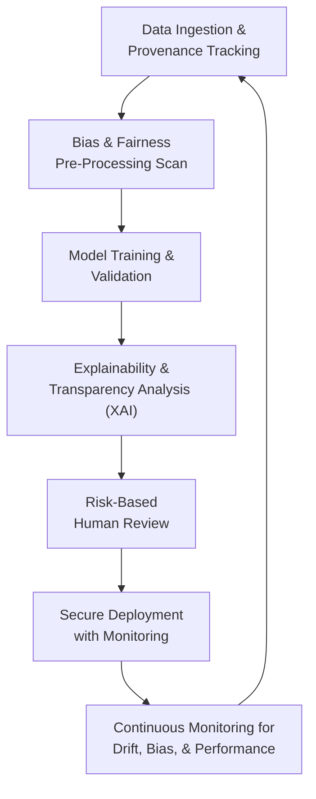

# AI Governance in 2026: Ethical Frameworks and Global Regulatory Shifts

By 2026, the era of AI as a Wild West of innovation will be firmly in the past. The conversation has shifted from theoretical ethics to mandated, auditable governance. For practitioners—developers, data scientists, and product leaders—navigating this landscape is no longer optional; it's a core competency. This new reality is defined by concrete regulations, enforceable frameworks, and a demand for provably responsible AI systems.

Failure to adapt means not just reputational damage, but significant legal and financial penalties. Understanding the key pillars of AI governance—from regulatory requirements to technical implementation—is critical for building sustainable and impactful AI.

### What You'll Get

*   **Regulatory Deep Dive:** A clear breakdown of the global regulatory environment in 2026, led by the EU AI Act.
*   **Ethical Frameworks:** An overview of the core principles shaping responsible AI development.
*   **Actionable Techniques:** Practical guidance on bias mitigation, explainability (XAI), and transparency.
*   **Operational Blueprint:** A high-level workflow for integrating governance into the AI lifecycle.

## The New Regulatory Reality

By 2026, AI regulation will have moved from abstract white papers to enforceable law. The EU AI Act, with its tiered risk-based approach, has set a global benchmark, creating a "Brussels effect" where multinational organizations adopt its standards as a baseline.

### The EU AI Act: The Global Pacesetter

The [EU AI Act](https://digital-strategy.ec.europa.eu/en/policies/ai-act) categorizes AI systems based on risk, with requirements scaling accordingly. Most organizations interacting with EU citizens will fall under its purview.

*   **Unacceptable Risk:** Systems deemed a clear threat to people, such as social scoring by governments, will be banned. This category will be in full effect by late 2024.
*   **High-Risk:** This is where most enterprise AI will land. Includes systems used in critical infrastructure, employment, education, and law enforcement. These systems face stringent requirements before and after they are deployed.
*   **Limited Risk:** Systems like chatbots must be transparent, ensuring users know they are interacting with an AI.
*   **Minimal Risk:** The vast majority of AI systems (e.g., spam filters, video games) fall here, with no specific obligations.

> For high-risk systems, the Act mandates robust data governance, detailed technical documentation, human oversight, and high levels of accuracy and cybersecurity. Compliance will be a non-negotiable part of the development lifecycle by 2026.

### A Global Patchwork of Regulation

While the EU is the most comprehensive, other nations are establishing their own rules, creating a complex compliance map for global companies.

| Region | Approach | Key Framework / Document |
| :--- | :--- | :--- |
| **European Union** | Horizontal, risk-based legislation | [EU AI Act](https://digital-strategy.ec.europa.eu/en/policies/ai-act) |
| **United States** | Sector-specific, voluntary frameworks | [NIST AI Risk Management Framework](https://www.nist.gov/itl/ai-risk-management-framework) |
| **United Kingdom** | Pro-innovation, context-based | [A pro-innovation approach to AI regulation](https://www.gov.uk/government/publications/ai-regulation-a-pro-innovation-approach) |
| **China** | Vertical, state-driven regulations | Regulations on algorithmic recommendations, generative AI |

## Core Pillars of a Modern AI Governance Framework

Complying with regulations and building trust requires translating high-level principles into engineering practice. The following pillars form the foundation of a modern, practical AI governance strategy.

### The Responsible AI Lifecycle

A governance framework isn't a final checklist; it's an integrated, continuous loop within the MLOps lifecycle.



### Bias Detection and Mitigation

Bias in AI is not just a reputational risk; it's a direct violation of fairness principles and, under laws like the AI Act, a compliance failure. Mitigation is not a one-time fix but an ongoing process.

*   **Pre-processing:** Techniques applied to the training data itself. This can include re-sampling under-represented groups or augmenting datasets.
*   **In-processing:** Algorithms modified during the training phase to reduce bias, such as adding fairness constraints to the model's objective function.
*   **Post-processing:** Adjusting a trained model's predictions to improve fairness across different demographic groups.

Tools like [Fairlearn (Microsoft)](https://fairlearn.org/) and [AI Fairness 360 (IBM)](https://aif360.mybluemix.net/) provide concrete metrics and mitigation algorithms.

```python
# Conceptual Example using Fairlearn to assess fairness

from fairlearn.metrics import MetricFrame, demographic_parity_difference
from sklearn.metrics import accuracy_score
from sklearn.linear_model import LogisticRegression

# Assume 'model' is trained, and we have:
# X_test: Test features
# y_test: True labels
# sensitive_features_test: Demographic data (e.g., age group, gender)

# 1. Get model predictions
y_pred = model.predict(X_test)

# 2. Define metrics
metrics = {
    'accuracy': accuracy_score,
    'demographic_parity_diff': demographic_parity_difference
}

# 3. Use MetricFrame to group metrics by sensitive feature
grouped_on_feature = MetricFrame(metrics=metrics,
                                 y_true=y_test,
                                 y_pred=y_pred,
                                 sensitive_features=sensitive_features_test)

# 4. Analyze results
print(grouped_on_feature.by_group)
print("\nOverall Demographic Parity Difference:", grouped_on_feature.overall['demographic_parity_diff'])
```

### Transparency and Explainability (XAI)

Stakeholders, from regulators to end-users, increasingly demand to know not just *what* a model decided, but *why*.

*   **Transparency:** Achieved through clear documentation. **Model Cards** describe a model's intended use, performance metrics, and fairness evaluations. **Datasheets for Datasets** detail the provenance, collection process, and known limitations of the training data.

*   **Explainability (XAI):** Involves techniques that reveal the inner workings of "black box" models.
    *   **SHAP (SHapley Additive exPlanations):** Assigns an importance value to each feature for a particular prediction, showing which factors contributed most to the outcome.
    *   **LIME (Local Interpretable Model-agnostic Explanations):** Explains individual predictions by creating a simpler, interpretable local model around the prediction point.

> "Explainability is the bedrock of trust. If you can't explain a decision to a regulator or a customer, you can't defend it."

### Data Privacy and Security

AI governance is inextricably linked to data privacy. Regulations like GDPR set a high bar for data handling, which extends to the massive datasets used for training AI.

*   **Privacy-Enhancing Technologies (PETs):**
    *   **Federated Learning:** Trains a global model on decentralized data (e.g., on mobile devices) without the raw data ever leaving the source.
    *   **Differential Privacy:** Adds statistical noise to data to protect individual identities while still allowing for aggregate analysis.
*   **Data Minimization:** A core principle of GDPR, it mandates using only the data essential for the task, reducing the attack surface and privacy risk.

## Building a Practical AI Governance Operating Model

Effective governance requires clear ownership and processes embedded throughout the organization.

### Roles and Responsibilities

*   **AI Ethics Board / Council:** A cross-functional group (legal, compliance, engineering, business) that sets high-level policy, reviews high-risk use cases, and serves as an escalation point.
*   **AI Product Manager:** Owns the responsible AI requirements for a system, including defining fairness metrics and transparency documentation (e.g., Model Cards).
*   **MLOps Engineer:** Implements and automates the governance controls within the CI/CD pipeline, including bias checks, security scans, and monitoring hooks.

## The Practitioner's Challenge

As we accelerate towards 2026, the challenge for practitioners is to move from principle to practice. AI governance cannot be an afterthought; it must be architected into our systems from day one. This requires a fusion of legal awareness, ethical consideration, and robust engineering. The tools are available, the frameworks are maturing, and the regulations are crystallizing. The time to build responsibly is now.

***

What are your primary concerns regarding AI ethics and regulation as we head into 2026? Are you focused on technical implementation, legal ambiguity, or organizational change?


## Further Reading

- [https://www.ibm.com/blogs/research/2023/ai-governance-framework/](https://www.ibm.com/blogs/research/2023/ai-governance-framework/)
- [https://www.weforum.org/agenda/ai-governance/](https://www.weforum.org/agenda/ai-governance/)
- [https://www.europeancommission.ai-act-2026/](https://www.europeancommission.ai-act-2026/)
- [https://ai.google/responsibility/principles/](https://ai.google/responsibility/principles/)
- [https://www.microsoft.com/en-us/ai/responsible-ai](https://www.microsoft.com/en-us/ai/responsible-ai)
