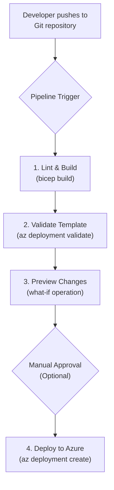

# Azure Bicep for Enterprise: Streamlining ARM Template Deployments

Since its general availability, Azure Bicep has rapidly matured from a promising alternative to a cornerstone of enterprise Infrastructure as Code (IaC) on Azure. By 2026, it's no longer a question of *if* you should adopt Bicep over raw ARM JSON, but *how* to leverage its full potential for complex, large-scale deployments. Bicep provides a transparent abstraction over ARM, offering a cleaner, more readable syntax without sacrificing any of the underlying power of the Azure Resource Manager platform.

This article explores why Bicep has become the default choice for Azure-native IaC in the enterprise. We'll examine its advantages, compare it to Terraform, and provide actionable best practices for structuring, modularizing, and deploying your Bicep code through robust CI/CD pipelines.

### What You'll Get

*   A clear comparison of Bicep vs. ARM JSON and Terraform.
*   An overview of enterprise-grade features like modules and private registries.
*   Best practices for structuring large Bicep projects.
*   A CI/CD workflow example using GitHub Actions.
*   A look at how Bicep's tooling enhances developer productivity.

## Bicep vs. ARM JSON: The Clear Winner

For years, ARM templates were the standard for Azure IaC. However, their verbose JSON syntax was a significant source of friction, making templates difficult to write, read, and maintain. Bicep solves this directly by providing a declarative, human-readable Domain-Specific Language (DSL).

Consider deploying a simple storage account.

### ARM JSON Template

```json
{
  "$schema": "https://schema.management.azure.com/schemas/2019-04-01/deploymentTemplate.json#",
  "contentVersion": "1.0.0.0",
  "parameters": {
    "storageAccountName": {
      "type": "string",
      "metadata": {
        "description": "Specifies the name of the Azure Storage account."
      }
    },
    "location": {
      "type": "string",
      "defaultValue": "[resourceGroup().location]",
      "metadata": {
        "description": "Specifies the location for all resources."
      }
    }
  },
  "resources": [
    {
      "type": "Microsoft.Storage/storageAccounts",
      "apiVersion": "2023-01-01",
      "name": "[parameters('storageAccountName')]",
      "location": "[parameters('location')]",
      "sku": {
        "name": "Standard_LRS"
      },
      "kind": "StorageV2"
    }
  ]
}
```

### Azure Bicep Equivalent

```bicep
@description('Specifies the name of the Azure Storage account.')
param storageAccountName string

@description('Specifies the location for all resources.')
param location string = resourceGroup().location

resource storageAccount 'Microsoft.Storage/storageAccounts@2023-01-01' = {
  name: storageAccountName
  location: location
  sku: {
    name: 'Standard_LRS'
  }
  kind: 'StorageV2'
}
```

The Bicep version is drastically shorter and easier to understand. This conciseness isn't just cosmetic; it directly translates to higher productivity, fewer errors, and improved maintainability across enterprise teams.

> **Key Takeaway:** Bicep is a transparent abstraction. It compiles (transpiles) into standard ARM JSON, meaning you get a superior authoring experience with no loss of functionality. You can even decompile existing ARM templates into Bicep using the Bicep CLI: `bicep decompile <file.json>`.

## Bicep vs. Terraform: The Strategic Choice for Azure

While Bicep is the undisputed successor to ARM JSON, the more strategic enterprise discussion often involves [Terraform](https://www.terraform.io/). Both are excellent IaC tools, but they serve different primary goals.

| Feature                 | Azure Bicep                                                                 | Terraform (Azure Provider)                                                  |
| ----------------------- | --------------------------------------------------------------------------- | --------------------------------------------------------------------------- |
| **Primary Goal**        | Best-in-class, day-one support for all Azure services.                      | Consistent workflow across multiple cloud providers.                        |
| **State Management**    | Stateless by design; state is derived directly from Azure.                  | Manages infrastructure state in a dedicated state file (`.tfstate`).        |
| **Azure Integration**   | Immediate support for new Azure resource types and API versions.            | Support depends on the Azure provider release cycle; can lag slightly.      |
| **Language**            | Declarative DSL tightly integrated with ARM.                                | HashiCorp Configuration Language (HCL), a provider-agnostic DSL.          |
| **Tooling**             | Excellent VS Code extension, Bicep CLI, native Azure portal integration.    | Mature ecosystem, strong CLI, and Terraform Cloud/Enterprise for governance. |

**Choose Bicep if:**
*   Your organization is committed to the Azure ecosystem.
*   You need immediate ("day 0") support for new Azure features and services.
*   You prefer a simpler, stateless approach that relies on Azure as the source of truth.

**Choose Terraform if:**
*   Your organization operates in a multi-cloud or hybrid-cloud environment.
*   You have existing investments and skills in the Terraform ecosystem.
*   You require robust state management and planning features for complex dependency graphs across providers.

For Azure-centric enterprises, Bicep's seamless integration and alignment with the Azure platform make it a compelling and powerful choice.

## Enterprise-Grade Bicep: Key Features in 2026

By 2026, Bicep's feature set is fully mature, providing the stability and scale enterprises require.

### Modularization and Code Reuse

Breaking down complex deployments into smaller, reusable components is critical for maintainability. Bicep modules are the primary tool for this. A module is simply a Bicep file that can be called from another Bicep file.

**Example: A dedicated module for a virtual network.**

*   `modules/vnet.bicep`:
    ```bicep
    param vnetName string
    param location string = resourceGroup().location
    param addressPrefix string = '10.0.0.0/16'

    resource virtualNetwork 'Microsoft.Network/virtualNetworks@2023-11-01' = {
      name: vnetName
      location: location
      properties: {
        addressSpace: {
          addressPrefixes: [
            addressPrefix
          ]
        }
      }
    }

    output vnetId string = virtualNetwork.id
    ```

*   `main.bicep`:
    ```bicep
    param coreVnetName string = 'vnet-core-prod'

    module vnet 'modules/vnet.bicep' = {
      name: 'coreVnetDeployment'
      params: {
        vnetName: coreVnetName
        location: resourceGroup().location
      }
    }
    ```

### Private Module Registries

For enterprise-wide code sharing, Bicep supports publishing modules to private [Azure Container Registries (ACR)](https://learn.microsoft.com/en-us/azure/azure-resource-manager/bicep/private-module-registry). This allows teams to share and version-control standardized, policy-compliant modules for common infrastructure patterns like secure storage accounts or standard virtual networks.

### Advanced Tooling and Validation

Bicep's tooling is a first-class citizen. The [Bicep Linter](https://learn.microsoft.com/en-us/azure/azure-resource-manager/bicep/linter) is integrated directly into the CLI and VS Code extension, providing real-time feedback and enforcing best practices. You can customize the linter rules in a `bicepconfig.json` file to enforce organization-specific standards.

Furthermore, the `what-if` operation is an essential safety feature. Before deploying, you can run a pre-flight check to see exactly what changes will be made to your Azure environment.

```bash
# Preview the changes without deploying
az deployment group what-if --resource-group my-rg --template-file main.bicep
```

## Structuring Large-Scale Bicep Projects

A consistent folder structure is key to managing complexity. A common pattern is to organize files by environment or application, with a central repository for reusable modules.

### Recommended Folder Structure

```
.
├── main.bicep                # Entry point for a specific deployment
├── dev.bicepparam            # Parameters for the dev environment
├── prod.bicepparam           # Parameters for the prod environment
├── bicepconfig.json          # Linter and module alias configuration
└── modules/                  # Reusable Bicep modules
    ├── networking/
    │   ├── vnet.bicep
    │   └── nsg.bicep
    └── storage/
        └── storageAccount.bicep
```

The introduction of `.bicepparam` files provides a dedicated syntax for parameter files, further simplifying environment-specific deployments.

## CI/CD Integration: Bicep in DevOps Pipelines

Integrating Bicep into CI/CD pipelines is straightforward and essential for automated, reliable deployments. Both Azure DevOps and GitHub Actions offer native support for Bicep deployments.

The typical workflow involves linting, validating, previewing (`what-if`), and finally deploying the Bicep template.

### CI/CD Deployment Flow



### GitHub Actions Workflow Example

This example demonstrates a complete workflow that triggers on a push to the `main` branch.

```yaml
name: Deploy Bicep

on:
  push:
    branches:
      - main

permissions:
  id-token: write
  contents: read

jobs:
  deploy:
    runs-on: ubuntu-latest
    steps:
    - name: Checkout
      uses: actions/checkout@v4

    - name: Azure Login
      uses: azure/login@v1
      with:
        client-id: ${{ secrets.AZURE_CLIENT_ID }}
        tenant-id: ${{ secrets.AZURE_TENANT_ID }}
        subscription-id: ${{ secrets.AZURE_SUBSCRIPTION_ID }}

    - name: Run Bicep Linter
      run: az bicep build --file ./main.bicep

    - name: Run pre-flight validation
      run: |
        az deployment group validate \
          --resource-group my-rg \
          --template-file ./main.bicep

    - name: Deploy Bicep file
      uses: azure/arm-deploy@v1
      with:
        subscriptionId: ${{ secrets.AZURE_SUBSCRIPTION_ID }}
        resourceGroupName: my-rg
        template: ./main.bicep
        failOnStdErr: false
```

## Final Thoughts

By 2026, Azure Bicep is the definitive IaC language for any organization primarily invested in Azure. Its clear syntax, powerful modularity, and seamless integration with the Azure platform and DevOps tooling have removed the friction associated with ARM templates. While Terraform remains a powerful multi-cloud tool, Bicep's "home-field advantage" makes it the most efficient and productive choice for enterprise-grade Azure deployments.

Have you successfully transitioned your enterprise workloads to Bicep? Share your experiences and challenges in the comments below


## Further Reading

- [https://docs.microsoft.com/en-us/azure/azure-resource-manager/bicep/overview](https://docs.microsoft.com/en-us/azure/azure-resource-manager/bicep/overview)
- [https://azure.microsoft.com/en-us/blog/tag/bicep/](https://azure.microsoft.com/en-us/blog/tag/bicep/)
- [https://github.com/Azure/bicep](https://github.com/Azure/bicep)
- [https://techcommunity.microsoft.com/bicep-enterprise-ready/](https://techcommunity.microsoft.com/bicep-enterprise-ready/)
- [https://www.infoq.com/news/azure-bicep-vs-terraform/](https://www.infoq.com/news/azure-bicep-vs-terraform/)
