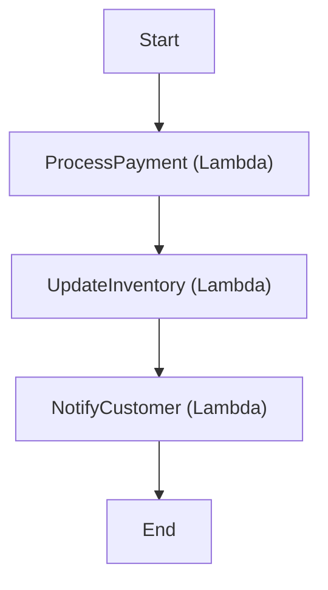
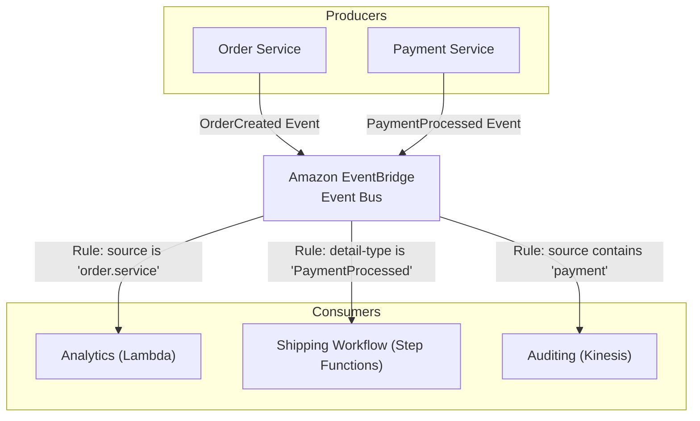
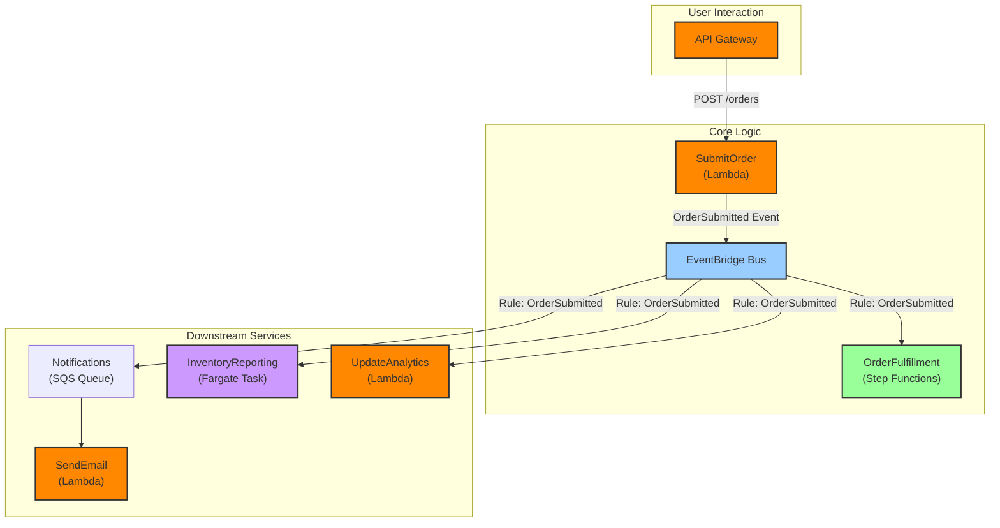

# AWS Serverless Evolution: Beyond Lambda to Event-Driven Architectures

The term "serverless" once felt synonymous with AWS Lambda. In the early days, it was all about executing small, stateless functions in response to triggers. Fast forward to 2026, and that view is incredibly limited. Serverless on AWS has matured into a comprehensive ecosystem for building robust, scalable, and resilient event-driven architectures (EDAs).

The paradigm has shifted from writing isolated functions to composing sophisticated systems where services communicate asynchronously through events. Lambda is still a crucial component, but it's now one of many powerful tools in the serverless toolbox. This article explores how to architect modern serverless applications by orchestrating and choreographing services like Step Functions, EventBridge, SQS, and Fargate.

### What You'll Get

*   **Architectural Shift:** Understand the move from function-centric to event-driven serverless design.
*   **Key Service Roles:** Learn how Step Functions, EventBridge, and SQS/SNS enable robust orchestration and choreography.
*   **Expanded Compute:** See where AWS Fargate fits into a modern serverless strategy for long-running tasks.
*   **Practical Patterns:** Visualize architectural flows with clear Mermaid diagrams and examples.
*   **Benefits & Challenges:** A balanced look at the advantages and remaining hurdles of building complex serverless systems.

---

## The Core Building Block: AWS Lambda

Let's be clear: AWS Lambda remains the heart of serverless compute on AWS. Its ability to run code without provisioning servers, scale automatically, and bill only for execution time is foundational.

However, relying solely on Lambda functions chained together (a "Lambda Pinball" architecture) leads to brittle, hard-to-debug systems. As applications grow, direct, synchronous invocations create tight coupling and cascading failure points. The modern approach uses Lambda as a powerful, event-driven *subscriber*—a component that does a specific job and then passes control back to the larger system.

*   **Best for:** Short-lived, stateless tasks.
*   **Common Use Cases:** Data transformation, API backends (via API Gateway), real-time file processing.
*   **The Anti-Pattern:** Using Lambda-to-Lambda calls to manage complex business logic. This is where orchestration and choreography come in.

## Orchestration vs. Choreography: Directing the Flow

In a distributed system, you need a way to manage the flow of work. Two primary patterns have emerged as best practices in the serverless world: orchestration and choreography.

### Orchestration with AWS Step Functions

Orchestration involves a central controller that explicitly directs services to perform tasks in a specific order. AWS Step Functions is the master orchestrator in the AWS serverless suite. It allows you to define a workflow (a state machine) that coordinates multiple AWS services, including Lambda, Fargate, and more.

A state machine is a visual workflow that manages state, error handling, retries, and parallel execution. This moves complex business logic out of your Lambda functions and into a manageable, observable service.

**Key Benefits of Step Functions:**
*   **Durability:** Workflows can run for up to a year, maintaining state throughout.
*   **Error Handling:** Provides built-in `Retry` and `Catch` mechanisms for robust fault tolerance.
*   **Observability:** Gives you a visual representation of your workflow's execution history, making debugging vastly simpler.

Here's a simple state machine for processing a customer order:

```json
{
  "Comment": "A simple order processing state machine",
  "StartAt": "ProcessPayment",
  "States": {
    "ProcessPayment": {
      "Type": "Task",
      "Resource": "arn:aws:lambda:us-east-1:123456789012:function:process-payment-function",
      "Next": "UpdateInventory"
    },
    "UpdateInventory": {
      "Type": "Task",
      "Resource": "arn:aws:lambda:us-east-1:123456789012:function:update-inventory-function",
      "Next": "NotifyCustomer"
    },
    "NotifyCustomer": {
      "Type": "Task",
      "Resource": "arn:aws:lambda:us-east-1:123456789012:function:notify-customer-function",
      "End": true
    }
  }
}
```

This workflow is clear, and the logic is not embedded within any single function.



### Choreography with Amazon EventBridge

Choreography takes a different approach. There is no central controller. Instead, services are loosely coupled and react to events published on a shared event bus. Amazon EventBridge is a serverless event bus that acts as the central nervous system for event-driven architectures.

Producers publish events to the bus without knowing or caring who will consume them. Consumers define rules to filter for events they are interested in and then trigger a target (like a Lambda function or a Step Functions workflow) in response.

**Key Benefits of EventBridge:**
*   **Decoupling:** Services can be developed, deployed, and scaled independently.
*   **Extensibility:** New services can easily subscribe to existing events without changing the producer.
*   **Integration:** Natively integrates with over 200 AWS services and third-party SaaS applications.



## Buffering and Fan-Out with Messaging Services

While EventBridge is excellent for routing, Amazon SQS (Simple Queue Service) and SNS (Simple Notification Service) remain critical for reliability and specific messaging patterns.

| Service | Pattern | Key Use Case |
| :--- | :--- | :--- |
| **Amazon SQS** | Queue | **Decoupling and Buffering.** Protects a downstream service from being overwhelmed by traffic spikes. Ensures messages are processed reliably, even if the consumer fails temporarily. |
| **Amazon SNS** | Pub/Sub (Fan-out) | **Broadcasting.** Publishes a single message to many different subscribers simultaneously (e.g., SQS queues, Lambda functions, email endpoints). |

> **Pro Tip:** A common and powerful pattern is the "SNS to SQS fan-out." An SNS topic receives a message and distributes it to multiple SQS queues, allowing different services to process the same event independently and at their own pace.

## Expanding Serverless Compute with AWS Fargate

Not every task fits within Lambda's execution limits (currently 15 minutes). For long-running processes, intensive computations, or applications requiring a persistent runtime environment, **AWS Fargate** extends the serverless model to containers.

With Fargate, you can run your Docker containers without managing the underlying EC2 instances. It's the perfect complement to Lambda.

*   **Lambda:** Ideal for event-driven, short-lived compute.
*   **Fargate:** Ideal for long-running applications, batch jobs, and services with specific OS-level dependencies.

In an event-driven architecture, an event might trigger a Fargate task via EventBridge to handle a multi-hour video processing job, while another event triggers a Lambda function to update a database record in milliseconds.

## A Modern Serverless Architecture in 2026

Let's put it all together. Here is a high-level diagram of an e-commerce platform's order processing system built with a modern, event-driven serverless architecture.



**Flow Breakdown:**
1.  A user submits an order via **API Gateway**, which triggers a Lambda function (`SubmitOrder`).
2.  The `SubmitOrder` function performs initial validation and publishes an `OrderSubmitted` event to **EventBridge**. It does *not* know what happens next.
3.  **EventBridge** routes this event based on rules:
    *   It starts the `OrderFulfillment` **Step Functions** workflow to handle payment, inventory, and shipping orchestration.
    *   It sends a message to an **SQS** queue to reliably handle customer notifications.
    *   It triggers a long-running **Fargate** task to update complex inventory reports.
    *   It invokes a **Lambda** function to push real-time data to an analytics service.

This architecture is highly decoupled, resilient, and scalable. Each component can be updated and deployed without impacting the others.

## Benefits and Lingering Challenges

### The Upside
*   **Extreme Scalability:** Components scale independently based on demand.
*   **Cost Optimization:** You truly pay only for what you use, from milliseconds of Lambda execution to container resources on Fargate.
*   **Increased Agility:** Small, independent teams can own services, leading to faster development cycles.
*   **Enhanced Resilience:** The use of queues and decoupled event flows isolates failures and prevents cascading outages.

### The Hurdles
*   **Observability:** Debugging across multiple distributed services remains a challenge. Tools like AWS X-Ray and third-party solutions are essential for tracing requests across the system.
*   **Testing Complexity:** End-to-end testing requires more sophisticated strategies than testing a monolith. Emulating the cloud environment locally can be difficult.
*   **Cognitive Overhead:** Architects and developers must understand event-driven patterns, eventual consistency, and the roles of many different services.

---

The evolution of AWS serverless is a story of maturation. We've moved from simple functions to a rich ecosystem that enables powerful, event-driven systems. By embracing services like EventBridge for choreography, Step Functions for orchestration, and Fargate for broader compute needs, you can build applications that are more scalable, resilient, and agile than ever before.

What are the most innovative or powerful serverless use cases you're building on AWS today? Share your patterns and experiences.


## Further Reading

- [https://aws.amazon.com/serverless/](https://aws.amazon.com/serverless/)
- [https://aws.amazon.com/lambda/](https://aws.amazon.com/lambda/)
- [https://aws.amazon.com/step-functions/](https://aws.amazon.com/step-functions/)
- [https://aws.amazon.com/eventbridge/](https://aws.amazon.com/eventbridge/)
- [https://docs.aws.amazon.com/whitepapers/latest/serverless-architecture/](https://docs.aws.amazon.com/whitepapers/latest/serverless-architecture/)
