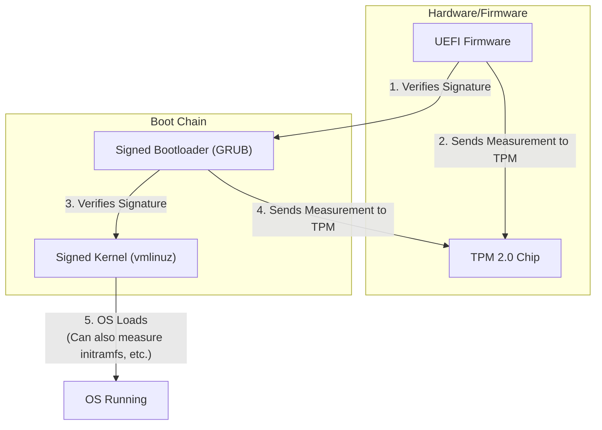
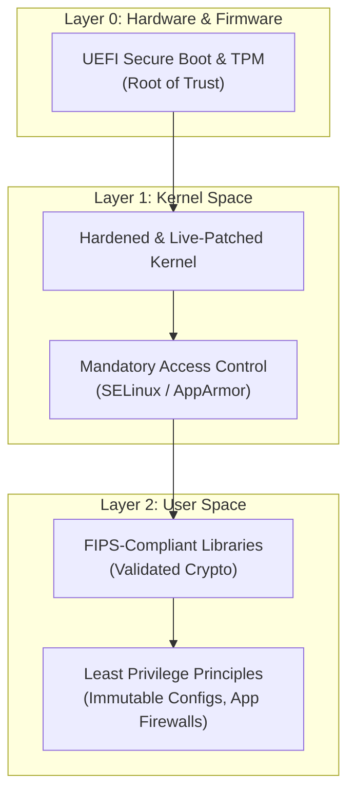

# Hardening Linux: Kernel Security & Advanced System Protections in 2026

The year is 2026. The attack surface for production systems has never been larger, and the sophistication of threats continues to accelerate. Standard security practices like `fail2ban` and basic firewall rules, while necessary, are no longer sufficient. True system resilience is now built from the ground up, starting with the Linux kernel itself.

This article dives into the advanced, kernel-level protections and system hardening techniques that have become the bedrock of modern Linux security. We'll move beyond the basics and explore the mandatory controls for safeguarding critical infrastructure.

### What You'll Get

*   A deep dive into **Mandatory Access Control (MAC)** with SELinux and AppArmor.
*   Strategies for a cryptographically secure boot process using **Secure Boot and TPMs**.
*   The critical role of **kernel live patching** for zero-downtime security.
*   Guidance on achieving cryptographic compliance with **FIPS 140-3**.
*   A practical **defense-in-depth** architectural overview.

## Mastering Mandatory Access Control (MAC)

Traditional Linux security relies on Discretionary Access Control (DAC), where users and owners control permissions for files and processes. This model is flexible but fragile; a single compromised user or service can lead to system-wide failure.

Mandatory Access Control (MAC) changes the game. It enforces a system-wide security policy that even the root user cannot override. The kernel mediates every interaction, from file access to network connections, based on a centrally managed policy.

### SELinux: The Power of Granularity

Security-Enhanced Linux (SELinux) is a powerful, label-based MAC framework originating from the NSA. Every process, file, port, and system object has a security label (a "context"). The SELinux policy contains explicit rules defining which process contexts can interact with which object contexts.

*   **Core Strength:** Extremely fine-grained control over the entire system.
*   **Operational Modes:**
    *   `enforcing`: Blocks operations that violate the policy.
    *   `permissive`: Logs violations but does not block them (useful for debugging).
    *   `disabled`: Completely turns SELinux off.

You can check the current status of SELinux on systems like RHEL, Fedora, or Rocky Linux with a simple command:

```bash
# Check SELinux status
sestatus
```

> **Pro Tip:** Running in `permissive` mode on a new deployment is a standard practice to generate logs and refine policies before switching to `enforcing`. Tools like `audit2allow` are essential for this workflow.

### AppArmor: Usability Meets Security

AppArmor takes a different, path-based approach. Instead of labeling everything, it confines specific applications by defining profiles that list which files they can access and with what permissions (`read`, `write`, `execute`, `link`, etc.).

*   **Core Strength:** Simpler to learn and manage, focused on application confinement.
*   **Profile Modes:**
    *   `enforce`: Enforces the profile rules.
    *   `complain`: Logs policy violations without blocking them.

AppArmor is the default MAC in distributions like Ubuntu, Debian, and SUSE. You can check its status using:

```bash
# Check AppArmor status
sudo aa-status
```

### SELinux vs. AppArmor: A 2026 Perspective

The debate is less about which is "better" and more about which fits your team's expertise and threat model. By 2026, both systems are mature and highly effective.

| Feature | SELinux | AppArmor |
| :--- | :--- | :--- |
| **Mechanism** | Label-based | Path-based |
| **Complexity** | High | Medium |
| **Granularity**| Extremely fine-grained (sockets, IPC, etc.) | Application-focused (files, capabilities) |
| **Scope** | System-wide by default | Per-application profiles |
| **Ecosystem** | RHEL, Fedora, CentOS Stream, Android | Ubuntu, Debian, SUSE |

Choose the tool that is native to your chosen distribution and invest in mastering it.

## Securing the Foundation: The Boot Process

A compromised boot process undermines every security layer above it. If an attacker can load a malicious kernel or bootloader, all your MAC policies and application firewalls become irrelevant. This is where a hardware-backed root of trust comes in.

### UEFI Secure Boot

Secure Boot is a UEFI firmware feature that prevents the loading of unsigned bootloaders and kernels. The firmware contains a database of trusted public keys. It verifies the cryptographic signature of each component in the boot chain before executing it.

*   **UEFI Firmware** validates the **Bootloader** (e.g., GRUB).
*   The **Bootloader** validates the **Linux Kernel**.
*   This creates an unbroken chain of trust from power-on to OS launch.

### Trusted Platform Module (TPM)

A TPM is a dedicated crypto-processor on the motherboard that provides secure key storage and platform integrity measurement. It works alongside Secure Boot in a process called **Measured Boot**.

During a Measured Boot, the hash (or "measurement") of each component (firmware, bootloader, kernel) is recorded in the TPM's Platform Configuration Registers (PCRs). This creates a unique, verifiable cryptographic fingerprint of the boot process. This fingerprint can be used for:

*   **Remote Attestation:** Prove to a remote server that the system booted in a known-good state.
*   **Sealed Secrets:** Encrypt secrets (like disk encryption keys) so they can only be unsealed if the TPM's PCRs match the state in which they were sealed.

This flow illustrates how Secure Boot (validation) and Measured Boot (recording) work together.



## Zero-Downtime Security: Kernel Live Patching

In 2026, monthly maintenance windows for reboots are a relic of the past for critical services. Yet, high-severity kernel vulnerabilities (like "Dirty COW" or "BleedingTooth") require immediate patching. The solution is kernel live patching.

Live patching allows you to apply critical security fixes to a running Linux kernel *without a reboot*. It works by redirecting function calls from the old, vulnerable code to the new, patched code in memory.

Services like [Canonical Livepatch](https://ubuntu.com/security/livepatch), [Red Hat's kpatch](https://www.redhat.com/en/topics/linux/kernel-live-patching), and TuxCare's KernelCare have become standard operational tools.

> For any tier-1 service in 2026, kernel live patching is no longer a luxury—it's a baseline operational requirement for maintaining both security and availability.

## Achieving Compliance: FIPS 140-3

For organizations in government, finance, and healthcare, compliance with the **Federal Information Processing Standard (FIPS)** is non-negotiable. FIPS 140-3 is the current benchmark for validating the effectiveness of cryptographic modules.

Enabling "FIPS mode" on a Linux system ensures that:
*   Only FIPS-validated cryptographic modules are used (e.g., OpenSSL FIPS provider, libgcrypt).
*   Outdated and weak cryptographic algorithms (like DES or MD5) are disabled at the kernel and library level.
*   Self-tests are run at startup to ensure the integrity of the crypto modules.

You can typically check if FIPS is enabled via the kernel's crypto interface:

```bash
# A '1' indicates FIPS mode is enabled
cat /proc/sys/crypto/fips_enabled
```

Enabling FIPS mode requires careful planning and is usually done during system installation. It's a critical step for building systems that meet stringent regulatory requirements.

## A Defense-in-Depth Strategy

None of these technologies exist in a vacuum. They are layers in a comprehensive defense-in-depth strategy where a failure in one layer is caught by another.

This architecture shows how security is built from the hardware up through the application stack.



To complete this strategy, always adhere to these best practices:
*   **Minimalism:** Install only the packages and services that are absolutely necessary.
*   **Network Hardening:** Use `nftables` or `firewalld` to enforce a strict "deny by default" policy.
*   **Immutability:** Treat your servers as cattle, not pets. Use tools like Ansible, Terraform, or containerization to build reproducible, immutable infrastructure.
*   **Continuous Auditing:** Regularly scan for vulnerabilities and use tools like `osquery` to monitor system integrity.

## Conclusion

Hardening Linux in 2026 is a discipline of proactive, layered defense. By mastering Mandatory Access Control, securing the boot chain, embracing live patching, and ensuring cryptographic compliance, you build systems that are not just patched, but are fundamentally resilient by design. The focus has shifted from reacting to threats to engineering systems that limit their potential impact from the very core.

## Your Turn: What's Your Go-To Secure Distro?

Every team has its favorite tools for building secure systems. For production workloads requiring top-tier security, what is your Linux distribution of choice? Are you a fan of **RHEL** for its SELinux integration and FIPS certification, **Ubuntu LTS** with its AppArmor profiles and Livepatch service, or something else entirely?

Share your preferences and reasoning in the comments below


## Further Reading

- [https://www.kernel.org/doc/html/latest/admin-guide/security.html](https://www.kernel.org/doc/html/latest/admin-guide/security.html)
- [https://selinuxproject.org/page/Main_Page](https://selinuxproject.org/page/Main_Page)
- [https://ubuntu.com/security/apparmor](https://ubuntu.com/security/apparmor)
- [https://www.redhat.com/en/topics/linux/kernel-live-patching](https://www.redhat.com/en/topics/linux/kernel-live-patching)
- [https://www.linuxfoundation.org/blog/linux-security-2026/](https://www.linuxfoundation.org/blog/linux-security-2026/)
