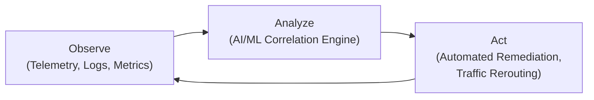

# The Future of Cloud Networking: Programmable, Secure, & Multi-Cloud

Cloud networking is no longer a static backdrop for applications; it's an active, intelligent, and programmable fabric that dictates performance, security, and agility. The days of manual configurations and ticket-based changes are fading. By 2026 and beyond, we're looking at a landscape dominated by automation, integrated security, and seamless multi-cloud connectivity, all powered by AI. Let's explore the key trends shaping this evolution.

### What You'll Get

*   **Programmable Networks:** How Network-as-Code (NaC) is moving beyond theory into practice.
*   **Multi-Cloud Realities:** The shift from complex, siloed connections to a unified networking fabric.
*   **Security by Default:** Why Zero Trust is becoming the non-negotiable foundation.
*   **AI-Driven Operations:** A look at how AIOps is creating self-healing, predictive networks.
*   **Future Challenges & Opportunities:** A realistic take on the road ahead.

---

## The Programmable Fabric: Network-as-Code is King

Software-Defined Networking (SDN) laid the groundwork by decoupling the control plane from the data plane. The next evolution is treating the network configuration itself as a version-controlled, testable, and automated software artifact. This is Network-as-Code (NaC).

Instead of clicking through a cloud console, engineers define network resources—VPCs, subnets, routing tables, and firewalls—in declarative code using tools like Terraform, Pulumi, or Ansible.

### Why NaC Matters

*   **Speed & Consistency:** Deploy entire network architectures across multiple regions or clouds in minutes, eliminating human error.
*   **Version Control:** Track every change to your network via Git. Rollbacks are as simple as reverting a commit.
*   **Collaboration:** Network and DevOps teams can collaborate on network architecture using familiar pull request workflows.

Here’s a simple example of defining an AWS VPC and a subnet using Terraform. This isn't just a script; it's a declarative goal for your network's state.

```terraform
# main.tf

# Define the Virtual Private Cloud (VPC)
resource "aws_vpc" "main" {
  cidr_block           = "10.0.0.0/16"
  enable_dns_support   = true
  enable_dns_hostnames = true

  tags = {
    Name = "production-vpc"
  }
}

# Define a public subnet within the VPC
resource "aws_subnet" "public_a" {
  vpc_id                  = aws_vpc.main.id
  cidr_block              = "10.0.1.0/24"
  availability_zone       = "us-east-1a"
  map_public_ip_on_launch = true

  tags = {
    Name = "production-public-subnet-a"
  }
}
```

This declarative approach is the cornerstone of agile, scalable cloud infrastructure. The future is one where network diagrams are generated *from* code, not the other way around.

## The Multi-Cloud Maze Becomes a Superhighway

Most enterprises are already multi-cloud, but their networking is often a complex patchwork of VPNs, direct connections, and transit gateways. Each cloud has its own networking constructs and security models, leading to operational silos and inconsistent policies.

The future is a unified multi-cloud networking fabric. This is a software-defined abstraction layer that provides a consistent operational model and policy framework across AWS, Azure, GCP, and on-premises environments. According to [Gartner](https://www.gartner.com/en/articles/future-of-networking-cloud), "by 2026, 40% of enterprises with multi-cloud networking needs will deploy a single, unified multi-cloud networking platform."

### From Complex to Cohesive

The diagram below illustrates this shift from a fragmented, hard-to-manage state to a clean, centrally managed fabric.

```mermaid
graph TD
    subgraph "Today's Reality: Fragmented Connectivity"
        direction LR
        AWS["AWS VPC"] -- "VPN / Direct Connect" -- OnPrem["On-Prem Data Center"]
        Azure["Azure VNet"] -- "VPN / ExpressRoute" -- OnPrem
        GCP["GCP VPC"] -- "VPN / Interconnect" -- OnPrem
        AWS -- "Complex Peering" -- Azure
    end

    subgraph "Future Vision: Unified Fabric"
        direction LR
        Fabric["Multi-Cloud Networking Fabric<br/>(Single Control Plane)"]
        AWS2["AWS VPC"] -- "Secure Overlay" -- Fabric
        Azure2["Azure VNet"] -- "Secure Overlay" -- Fabric
        GCP2["GCP VPC"] -- "Secure Overlay" -- Fabric
        OnPrem2["On-Prem Data Center"] -- "Secure Overlay" -- Fabric
    end
```

This unified fabric will provide:
*   **Simplified Connectivity:** Abstracting away cloud-specific complexities.
*   **Consistent Security:** A single place to define firewall rules, segmentation, and access policies.
*   **Enhanced Observability:** End-to-end visibility across your entire network estate.

## Zero Trust is the Default, Not an Add-On

The traditional "castle-and-moat" security model is obsolete in a cloud-native world. The future of network security is built on the principle of Zero Trust: *never trust, always verify*. This isn't a product but a strategic approach that assumes breaches are inevitable and treats every network connection as untrusted.

> **Zero Trust Principle:** Every request is authenticated, authorized, and encrypted before granting access, regardless of where it originates or what resource it requests.

This model is being realized through architectures like **Secure Access Service Edge (SASE)**, which converges networking and security services into a single, cloud-delivered platform. Instead of routing traffic back to a central data center for inspection, security is enforced at the edge, closer to users and devices.

### Key Tenets of Future Network Security

*   **Identity as the Perimeter:** Access is granted based on the identity of the user and device, not just their IP address.
*   **Dynamic Micro-segmentation:** Granularly isolating workloads from each other. If one workload is compromised, the blast radius is contained. Policies will be dynamic, adapting to application context rather than static IP rules.
*   **Universal ZTNA:** Zero Trust Network Access (ZTNA) will replace traditional VPNs, providing secure, context-aware access to specific applications rather than broad network access.

## AIOps: The Self-Driving Network

As networks become more complex and distributed, human-led operations can't keep up. Artificial Intelligence for IT Operations (AIOps) is the solution, transforming network management from reactive troubleshooting to proactive and predictive optimization.

The AIOps engine continuously ingests vast amounts of telemetry data—logs, metrics, and traffic flows—to learn the network's normal behavior. This enables it to predict problems, automate remediation, and optimize performance in real time.

### The AIOps Feedback Loop



In practice, this means the network can:
*   **Predict Failures:** Identify degraded links or misconfigurations *before* they cause an outage.
*   **Automate Troubleshooting:** Pinpoint root causes instantly, reducing Mean Time to Resolution (MTTR).
*   **Optimize Performance:** Intelligently reroute traffic to avoid congestion or optimize for cost and latency based on real-time conditions, as explored by major providers like [AWS](https://aws.amazon.com/networking/future/).

## Challenges and Opportunities on the Horizon

This future vision is compelling, but the path isn't without obstacles.

| Attribute | Current Challenges | Future Opportunities |
| :--- | :--- | :--- |
| **Skills** | Network engineers need to learn coding and automation skills. | A new role emerges: the "Network Reliability Engineer" (NRE). |
| **Complexity** | Adopting new toolchains and multi-cloud platforms can be complex. | Massive reduction in operational overhead and manual toil. |
| **Vendor Lock-in** | Proprietary multi-cloud fabrics risk creating new forms of lock-in. | Open standards and APIs will promote interoperability and choice. |
| **Security** | Misconfigured automation can create widespread vulnerabilities. | Security becomes proactive and deeply integrated, not a reactive bolt-on. |

## Conclusion

The future of cloud networking is a radical departure from its origins. It is dynamic, intelligent, and deeply integrated into the application lifecycle. By 2026, we will operate networks that are defined as code, span multiple clouds with a single control plane, enforce Zero Trust by default, and leverage AI to predict and heal themselves.

This shift demands new skills and new ways of thinking, but the payoff is a network that is no longer a bottleneck but a true enabler of business innovation.

What is your boldest prediction for cloud networking in 2030? Share your thoughts.


## Further Reading

- [https://www.gartner.com/en/articles/future-of-networking-cloud](https://www.gartner.com/en/articles/future-of-networking-cloud)
- [https://www.cisco.com/c/en/us/solutions/cloud/cloud-networking.html](https://www.cisco.com/c/en/us/solutions/cloud/cloud-networking.html)
- [https://aws.amazon.com/networking/future/](https://aws.amazon.com/networking/future/)
- [https://azure.microsoft.com/en-us/solutions/hybrid-cloud-networking/](https://azure.microsoft.com/en-us/solutions/hybrid-cloud-networking/)
- [https://www.sdxcentral.com/research/future-of-networking-report/](https://www.sdxcentral.com/research/future-of-networking-report/)
